

Adapting R2 to your needs
=========================

*Or how you can optimize R2 for your specific data analysis*

Scope
-----

-   This tutorial describes the adaptable settings within R2. These are
    basically all items under the User Options menu-item. Through these
    you can personalize the use of R2
-   First a couple of regular settings will be treated: changing colors,
    setting parameters
-   Next we'll delve into the practical adaptation of R2; uploading your
    dataset, adding your personal genesets (categories),
    creating/exporting /uploading your own tracks and maintaining a user
    community

Step 1: Adapt your settings
---------------

1.  Personalizing R2 starts with selecting the 'User Options' menu item
    (Figure 1). When you hover over this item, you see a submenu. In 'Account you can chose a different password or change your personal details.   
    In 'Preferences' you can set some generic R2 analysis and visualization options, click on this item.
    
	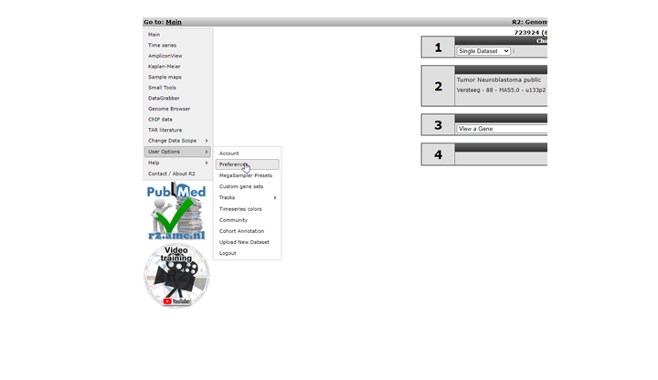
	
	[**Figure    1: Personalizing R2: the User Options menu-item**](_static/images/AdaptingR2/AdaptingR2_UserOptionsv1.png)
	
2.  In the Preferences window several parameters for analyses
    in R2 can be adapted to your preferences. For most analyses these
    are set to appropriate values, but of course you want to set your
    favorite dataset here!
    
	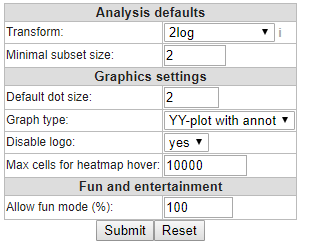
	
	[**Figure    2: The User Defined Settings window: change settings at your own convenience](_static/images/AdaptingR2/AdaptingR2_Userdefined.png)
	
3.  Next item in the User Options submenu (Figure 1) are the 'Megasampler Presets'
    . These are of relevance when you've built a specific
    Preset in an analysis Across Datasets ( see chapter: Multiple datasets
    overview with Megasampler).
4.  The 'Timeseries colors' allows you to set the colors
    for the graphs of specific experiments in a series (Figure 3). 
    
    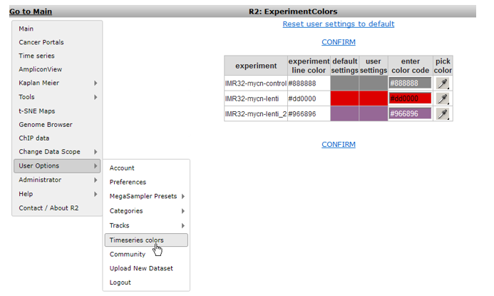
    	
    [**Figure 3: Setting timeseries colors**](_static/images/AdaptingR2/AdaptingR2_SettingsTime.png)

    The other menu-items 'Upload New Dataset', 'Categories', 'Tracks' and 'Communities' will be discussed in steps 2 - 6 of this tutorial.

Step 2: How to add data to R2.
---------------

1.  One of the most appreciated options of R2 is the possibility to add data to R2, be it your own dataset or/and publicly available data that matches your research interest. Due to several reasons,  technical as security,  it's almost impossible to automate the process of adding data for standard users. In order to  keep the database curated only R2 administrators can add data to R2.   
    In order to do so, the data first has to be processed and uploaded.  [Chapter 24](/R2_Dataset_Addition.html) describes in detail how to prepare your data such that we can process it and upload the data to R2.  
    If you have any specific annotations or wishes or samples
    other than Affymetrix you'd best contact r2 support directly
    (<r2-support@amc.nl>). If you would like to see a publicly
    accessible dataset in R2, then send an email to <r2-support@amc.nl>
    with a link to the data, or in the case of a Gene
    Expression Omnibus dataset, the GSE\*\*\*\* identifier, matrixes in supplemental data and we will
    take care of the rest.

Step 3: Create your custom genesets
---------------

1. Another powerful functionality to adapt R2 analyses to your specific needs, is by defining gene sets or referend to in r2 as genecategories. Many analyses in R2 can be performed on a subset of genes (see [chapter 14](Using_And_Creating_Genesets.html) for a tutorial on performing gene set analysis).
    There are 3 main sources for gene sets. Firstly R2 harbors hundreds of predefined sets of genes (such as KEGG pathways or sets defined by the Broad Institute). Secondly, some analyses will result in gene lists, which R2 allows you to save on the fly such that they can be used for further analyses (e.g. [Toplister analysis](Using_And_Creating_Genesets.html?highlight=hundreds#step-4-unsupervised-hierarchical-clusterin-with-a-geneset)).  
    Next to these two options, you can introduce your own gene sets of interest directly to R2 as well; Hover over the 'custom genesets' sub-item and select the button 'custoum geneset editor'
    (Figure 5).
    
    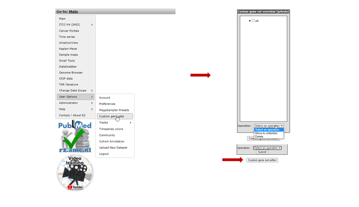
	
    [**Figure    5: Categories related menu-items; select Build Category to make    your own.**](_static/images/AdaptingR2/AdaptingR2_Categories.png)
	
2. The 'Custom Geneset editor' window pops up (Figure 6). By default in this window you must
    provide a unique name for the set. The input box allows you to paste a list of genes to upload as a geneset for use in analyses in R2. In the example a set of genes,
    specific for ALL tumors are pasted.  If you want this gene set to remain available for you, select in the community dropdown , "none" of select a community name for sharing the geneset. The concept "commmunity" is descibed later in this tutorial.
    If you just want to store the set temporarily for 24 hours, choose 'yes' in the temporary dropdown.  
    Click "save geneset" to upload the set (Figure 6),
    you'll receive a message when everything has succeeded. Your set of
    genes is now
    available as a geneset for all analyses within R2. Go back to the
    main page to see where you can use this set.
    
    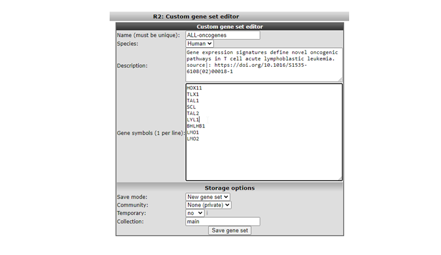
	
    [**Figure    6: Using the Input Box to upload your category    of genes.**](_static/images/AdaptingR2/AdaptingR2_Inputbox_v1.png)
    

4. We're going to lookup your geneset, an example is available in the
    Gene Set View. In the main menu in Field 3 select 'View a Geneset (Heatmap)'
    and click "next"( Figure 7)
    
    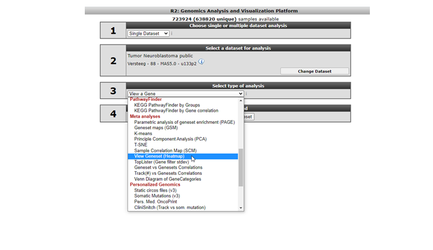
	
    [**Figure    7: Using a geneset; select View    Geneset**](_static/images/AdaptingR2_Viewset.png)
	
5. In the GeneSetView your custom geneset is privately available for yourself
    for similar analyses as with any other public gene set present in R2.
    Select 'My GeneCategories' to choose from your categories.
6. 
    If you saved your gene set temporarily, choose 'My 24h GeneCategories'. And click Next and click Next again in the following window  (Figure 9).
    
    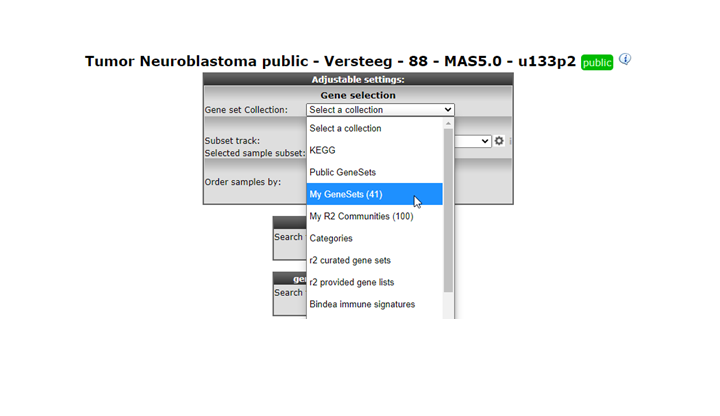
	
    [**Figure    8: Selecting your genecsets**](_static/images//AdaptingR2/AdaptingR2_Selectgenesetv1.png)
	
7. Now you can specify which gene set you want to view and how you want to the heatmap to be displayed.
    The geneset 'Changed Genes' we just made above is available
    (Figure 10 A), click on it. Also, in the Heatmap Options 'color-scheme(v2a)', select 'green-black-red', or any scheme that you prefer.  
    For now we end here, later on we'll see the category again in the context of Tracks.
    
    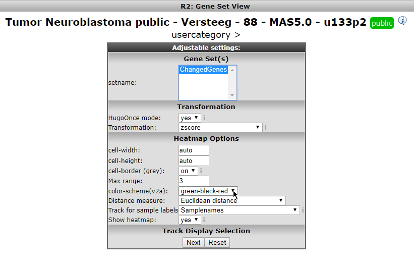
	
    [**Figure    9 A: Your geneset is available.**](_static/images//AdaptingR2/AdaptingR2_YourGeneset.png)
	
    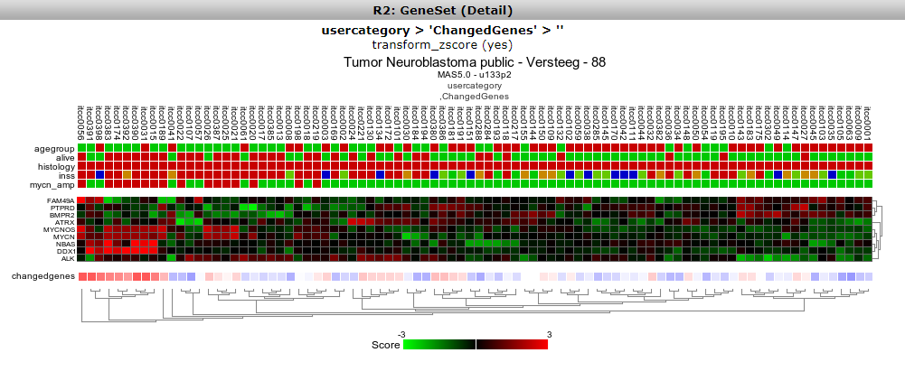
    	
    [**Figure 9 B: Your geneset is used to create a heatmap.**](_static/images/AdaptingR2_YourGeneset2.png)
    
8. We now return to the side menu of the R2 page to find out how we can manage
   the genesets we just built. From the 'User Options' item in the menu, click Custom geneset
   The custom geneset module allow you to organize you curtom genesets , assigning the sets to a collection or delete custom sets.
    
    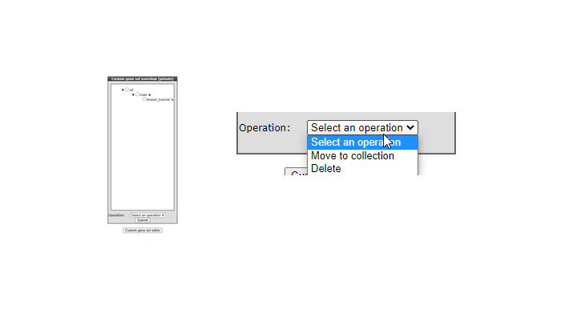
	 
    [**Figure    10: The adapting your genesets **](_static/images/AdaptingR2/AdaptingR2_CategoryManager.png)

       Existing genesets can be adapted, deleted or moved to another collection. New genesets can be based on
       existing ones. As an example we're going to update the genesets we
       just made. Click the 'pencil' icon next to the custom geneset in teh custom geneset editor. 
       In the next screen you can add or delete genes and provide  backg
       First, chose 'ChangedGenes' from the 'Select Category' dropdown menu. Then choose from the 'Select operation' dropdown the 'update' item 
       and click 'Execute'. 
    
       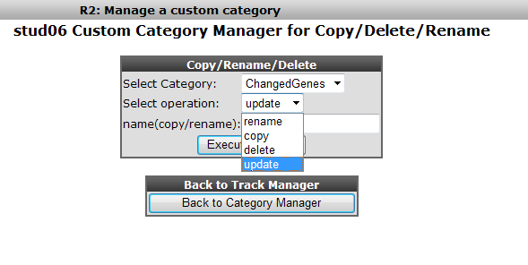
	
       [**Figure    12: Select the procedure for a Category; in this case    'update**](_static/images/AdaptingR2_Selectprocedure.png)
	
9. In our case we want to keep the Category and update it with a list of 78 genes. After you have typed your list of genes in the box,
    click the Update the category box.
        
    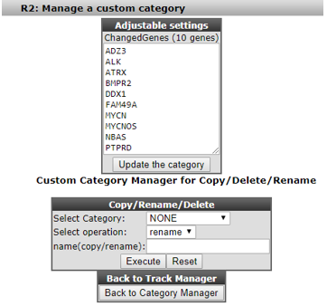
	
    [**Figure    13: The Category we just built can be adapted in    all details.**](_static/images/AdaptingR2_AdaptCategory.png)
	
    All details of the Category we built in the former steps are available for adaptation. In this way you can keep track and adapt the gene sets you use for your analyses.

Step 4: Tracks in R2: create your own data annotation
---------------

1.  Another important feature in R2 that can be adapted to your needs are the tracks. In R2, the samples can be annotated with sample characteristics, e.g clinical data.
    Each group of annotated data is called a “Track”. Tracks in R2 give you the opportunity to divide
    your samples in e.g. groups with different phenotypes for comparative or subgroup analysis.  
    For some datasets the annotation that you need may be available already. For others you might want to add extra sample annotation for analysis  such as combining already added tracks. Tracks can be adapted in multiple ways.
    
     - They can be uploaded with annotation files
    
     - They can be created as a result of analyses within R2 and stored within the platform on the go
    
     - Or you can create a so called Custom Track yourself within R2.  
    
      We'll first start with a K-means analysis that results in a division of the samples in two
      groups (for more about this analysis see [chapter 14](K_Means_Clustering.html)).
	  On the main page of R2 select the K-means analysis in Field 3 (Figure 14)
	
	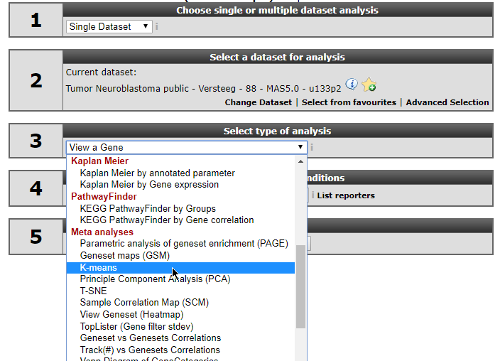
	
	[**Figure    14: Selecting a K-means    analysis**](_static/images/AdaptingR2_SelectKmeans.png)
	
2.  In the settings window for the K-means analysis (Figure 15) you can
    choose the Category created above to cluster the current set
    of samples. In our case this is called ChangedGenes. Make sure that the
    number of draws is set to 10x10, click 'next'
    
	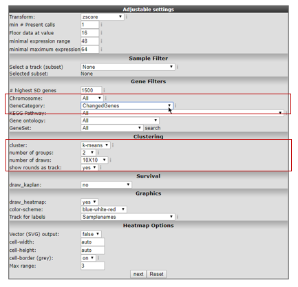
	
	[**Figure    15: Settings for K-means; the Category built above is available for    clustering**](_static/images/AdaptingR2_SelectOwnCat.png)
	
3.  The resulting clustering in two groups might not be ultimately
    convincing (Figure 16, your result might look slightly different), but for our testing purposes this
    is alright. What is important is that the resulting groups can be
    stored as a track; click the button 'store as a track'.
    
	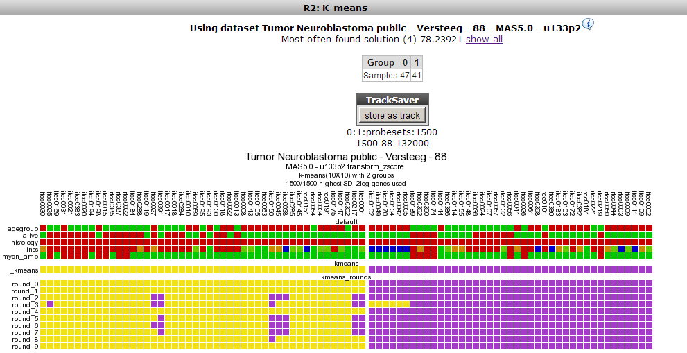
	
	[**Figure    16: Clustering result of the Neuroblastoma dataset with the Category    built in the former    steps**](_static/images/AdaptingR2_UsestoredTrack.png)
	
4.  R2 now shows all samples as a long table with radio buttons
    indicating which group each sample belongs to. These can be adapted
    if you want to. Scroll down the window to find the fields that have
    to be set in order to store this as a track (Figure 17). You may
    want to change the group names into something more informative, and
    potentially also change the name to something you could easily
    relate to.
    
	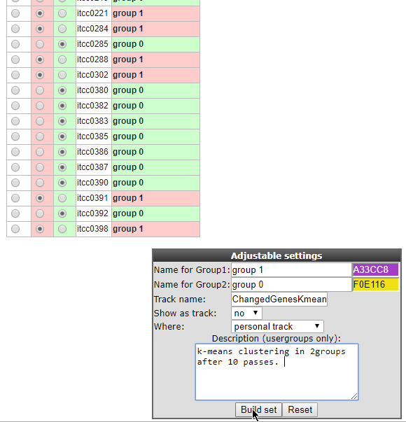
	
	[**Figure    17: Storing the current groups as a Track for use in later analysis. **](_static/images/AdaptingR2_DefineGroups.png)
	
5.  After optionally changing the parameters, you can click the Build set button to store the track. In the
    custom tracks manager we can adapt this track again. From the 'User Options' menu select 'Manage Custom Tracks' (Figure 18).
    
	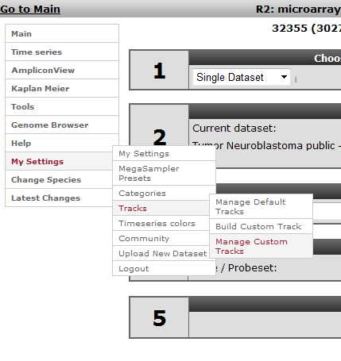
	
	[**Figure    18: Selecting the Manage Custom    Tracks**](_static/images/AdaptingR2_ManageCustomTracks.png)
	
6.  In the next screen keep the default selection, i.e. your current dataset.
    Tracks are, of course, defined based on a specific dataset; for each
    dataset you can store your own tracks. Click 'Continue'.
    
	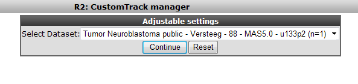
	
	[**Figure    19: Tracks are defined per dataset; keep the    current selection.**](_static/images/AdaptingR2_DatasetTracks.png)
	
7.  In the next screen you're able to adapt the Track we just generated.
    Of interest in here is the option "Drawtrack", which will result in
    the display of the information underneath the YY-plots.  
    The tracks can also be assigned to collections to make large sets of
    tracks manageable. We leave the deletion of the track to the
    imagination of the reader.  
    Now we'll pay attention to the default tracks for this dataset. The track we just generated can be adapted from here. For a
    start set the Drawtrack propery to 'yes'; we want to see this track in the graphs we create!
    
	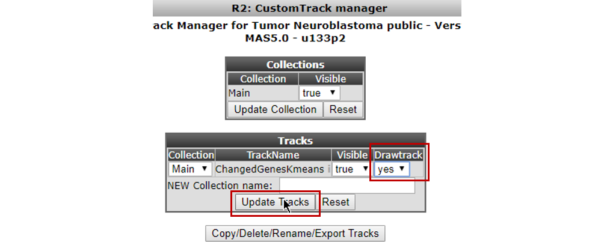 
    
    [**Figure    20: Adapting track paramteters.**](_static/images/AdaptingR2_AdaptTrack.png)
    
8. Select Manage Default Tracks from the 'User Options' > 'Tracks' sub-menu (Figure 21)

   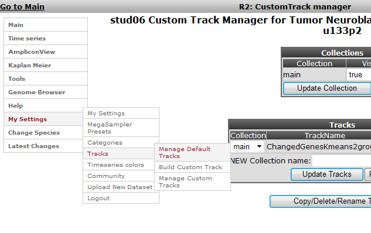

   [**Figure    21: Selecting the Default Tracks    Manager**](_static/images/AdaptingR2_ManageDefaultTracks.png)

9. In the next screen the dataset has to be defined; keep the defaults
   and click Continue. You'll end up in the Default Tracks Manager
   (Figure 22). Basically all annotation provided with this dataset is
   available as a track. Try out different things here.  
   We'll select additional annotations by changing their Drawtrack value to 'yes': age_year, gender and recurrence will be shown underneath graphs as well in further analyses.  
   Also, we'll set the Collection of age_year and agegroup 
   to NEW. Next to NEW Collection name, we add a befitting name that defines this group of tracks. Here we typed 'Age related'.    Be sure to click the 'Update Tracks' button for
   these changes to take effect.  
   
   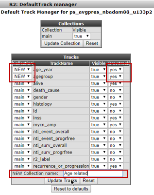

   [**Figure    22 A: Selecting the default tracks for this    dataset**](_static/images/AdaptingR2_SelectDefault.png)

   When collections of tracks are used, these will show up conveniently as separate groups of tracks under the graph.

   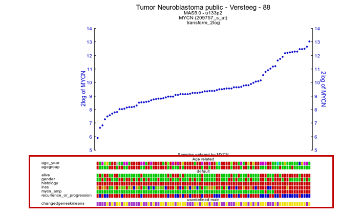
				
   [**Figure    22 B: 'Drawtracks' makes tracks visible under the graph; group Tracks with 'Collections'**](_static/images/AdaptingR2_SelectDefaultResult.png)
   
   Use the 'Reset' button for Tracks or Collections in the Default Tracks Manager to undo either of the changes, or use the 'Reset to defaults button' to go back to the original dataset settings of tracks.  

Step 5: Upload your own tracks
---------------

1.  R2 also allows you to build your own tracks from scratch. You'll be
    able to assign each sample to a group of your choice. To illustrate
    this select 'User Options' > 'Tracks' > 'Build Custom Track'. The
    Custom Track window appears. R2 also provides the possibility to
    upload a custom track from a prefab text file; we'll shortly show
    this; click 'Upload or Paste a Track (txt file)' (Figure 23).
    
	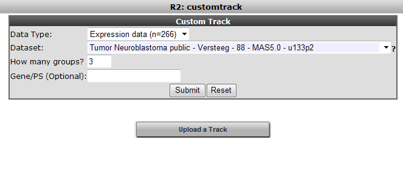
	
	[**Figure  23: Build a Custom Track: Upload or paste a track.**](_static/images/AdaptingR2_UploadTrack.png)
	
2.  In the Upload Custom Track window you can either select a tab
    delimited txt file built with a tool like Excel, or alternatively
    paste tab or semicolon delimited text in the input box. Either of these options
    provides R2 with the proper assignment of each sample to a
    specific value. Based on these values, R2 creates the groups for you. You can create tracks with as many groups as you like. When described in a text file; for each sample a  description has to be provided.  
    
    
	
	[**Figure 24: Uploading a track .**](_static/images/AdaptingR2_Trackdescribed.png)
	
3.	If you intend to create a track with a limited number of
    groups, an easier way is provided through the user interface.
    We will try that now: click the back button of your browser to return
    to Figure 23. By default the Custom Track Window (Figure 23) is set to build a track based on a defined number of groups.  Underneath you can adjust the number of groups, now change the number to 3 groups and click the Submit button.  
    
4.  In the next window a convenient overview of all annotation parameters and their values is available, 
    with check boxes to assign samples with specific annotation values to one of the three groups.  
    In this example we divide the samples by their INSS classification values in 3 groups: 
    the low grade(1,2,3) vs high grade(4) vs special (4s) tumor types. 
    Tick the appropriate boxes in the appropriate group columns. 
    It is also convenient to recapitulate the resulting groups in a separate column so tick that box also (Figure 25). 
    In the inss row the stage 1-2-3 tumors are selected to form group 1, 
    stage 4 forms group 2 and stage 4s group 3 in a new track.
    
    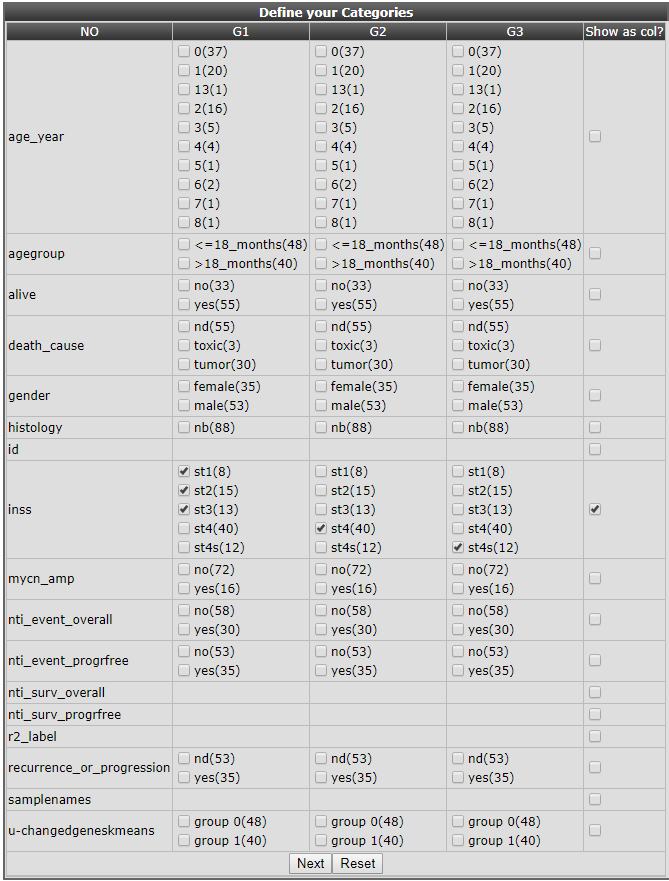
    
    [**Figure 25: Preselection to make new tracks from existing annotation.**](_static/images/AdaptingR2_DefineGroupsSpecs.png)
    
5.  Click "next", all samples appear in a table with check boxes to
    assign them individually to the appropriate group. Scroll down to adapt the visual characteristics of these groups. 
    Names have been adapted, 'show track' is set to yes, the track is set to be stored as a personal track and colors 
    per group have been adapted. Click 'Build set' to store the set, you'll receive a message accordingly in the next window. 
    Of course you now finally want to see all our track manipulation in an actual graph. 
    Go to the R2 main page again, fill in a gene of choice (e.g. MYCN) in box 3 and click next twice to see how the data of a 
    gene will be plotted using the new tracks.
    
    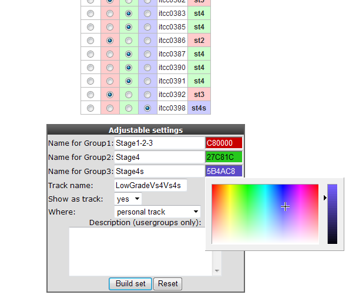
	
    [**Figure 26: Setting the custom    track properties.**](_static/images/AdaptingR2_Trackproperties.png)	

6.  Another frequently used approach is to make a track based on bins of gene expression values.  
    To avoid labour intensive excel usage you can also use the expression treshhold option from the pulldown menu.  
    Each time an expression level has been entered, a new box is generated for the next value.  
    Of course, it is possible to change the names of the bins. 
    Click next to tell R2 to draw the track, change the colors of the track bins and save the track.
    
    

    [**Figure    27: Grouping samples for a track based on gene expression**](_static/images/AdaptingR2_Trackdescribed_bin.png)

7.  Select View a gene in groups in Field 3 of the main page, type MYCN as gene name in Field 4 (Figure 28). Click 'next'.
    
	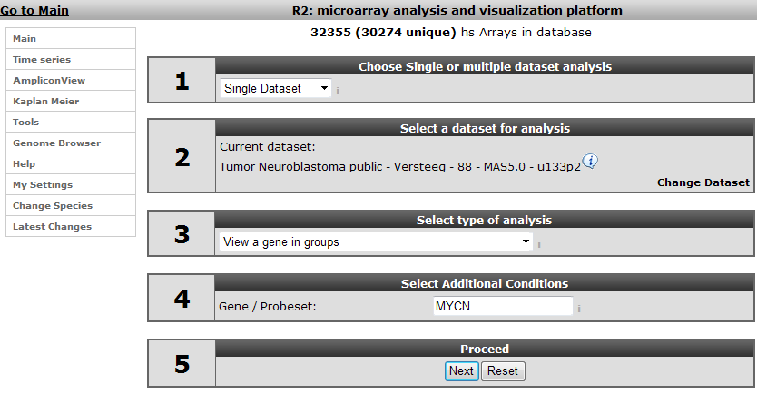
	
	[**Figure    28: Selecting a gene to view in the newly    created tracks.**](_static/images/AdaptingR2_ViewTrack.png)
	
8.  All the tracks created in the Custom Track manager are available for
    selection in the 'userdefined' group of tracks, choose u-lowgradvs4vs4s. Note that the track created in
    the K-means analysis, is also available here. Click 'Next'.
    
	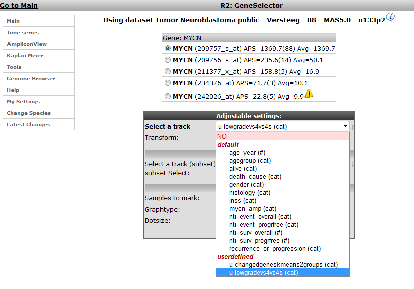
	
	[**Figure 29: Select the Track created in the Custom track manager;    u-lowgradvs4vs4s**](_static/images/AdaptingR2_Selectowntrack.png)
	
9.  The different groups we created as part of our track in the previous
    steps are available for selection. We want to see them all, keep the
    settings and click 'Next'.
    
	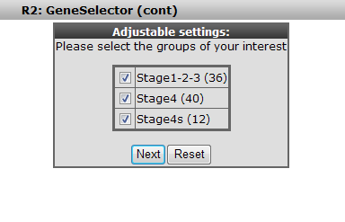
	
	[**Figure 30: The groups created in the track are available for    selection**](_static/images/AdaptingR2_Trackgroups.png)
	
10. The expression of MYCN is plotted in the different groups of the
    track that was created (Figure 30). Extra Graph Option has been set to Track and Gene Sort. 
    Note that the other track of mutated genes has a large overlap with the stage 4 group. There is
    also overlap with the "recurrence\_or\_progression" Default Track
    that we set to visible.
    
	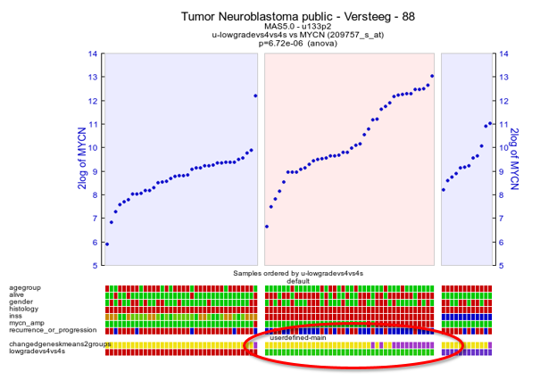
	
	[**Figure  31: Tracks created are visualized underneath the    graph**](_static/images/AdaptingR2_VisualizeTracks.png)
	
11. Another convenient option from the "custom track manager" is the
    export function which enables you to manipulate your tracks manually
    outside R2. This could be of use when your want to share tracks with
    other users or create new custom tracks. One reason you want to use
    the export function is to fix the ordering of your samples when
    generating a heatmap. Make
    sure you already have a personal custom track (not a temporary
    track, 24h). Select 'Manage default Tracks' from the User Options > Tracks menu
    (Figure 21) and click next. Here select the dataset of interest ,
    only datasets which have a corresponding personalized track are
    represented in the pulldown menu. Click the
    "Copy/delete/rename/export Tracks" button. Here select the personal
    track , "export" operation and r2\_track at "export as". Click
    execute" and download link with the track name can be loaded by
    clicking the right mouse button.

Step 6: Cooperate through R2: sharing tracks, creating communities
---------------

1.  Cooperation is of great importance in scientific research. You probably want to share the tracks created above
    with other people in your group. For this reason R2 features the Communities. Communities are different from user
    groups, which is important to remember. User groups are granting a user access to datasets and their associated
    annotation. On the other hand, communities are a way by which any user can share grouping variables (tracks), lists
    of genes (gene categories), megasampler presets or genome browser views with any (group of ) other R2 user(s). A
    user can generate multiple communities and invite other users to share such feature with.

    Creating a community is done by clicking 'Community' in the 'User Options' menu
    (Figure 31).
    
	
	
	[**Figure    32: Community in the User Options menu**](_static/images/AdaptingR2_Community.png)
	
2.  Since this will be the first time in the community section, there
    are no communities yet; click the 'Start a new Community' link
    (Figure 32).
    
	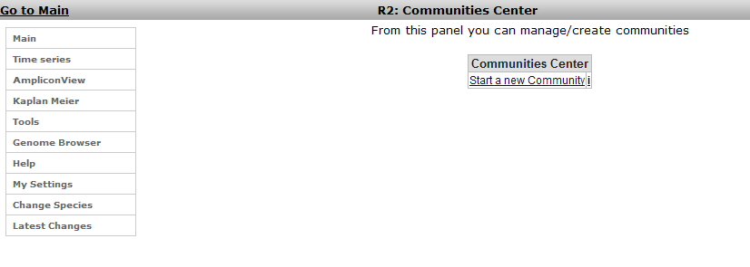
	
	[**Figure    33: Starting a    community**](_static/images/AdaptingR2_StartCommunity.png)
	
3.  In the Community window a name has to be set and a short description
    for people invited as members for this group (Figure 33). Through a
    community you can share GeneCategories, Tracks and Settings.
    
	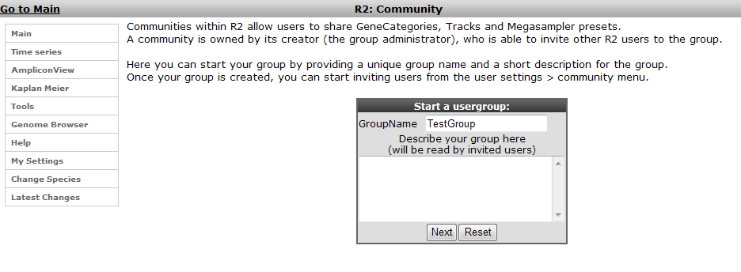
	
	[**Figure    34: Setting the Community group name    and description.**](_static/images/AdaptingR2_SettingCommunitygroup.png)
	
4.  Click 'Next'; you'll be notified that the group has been created;
    return to the Communities Center by clicking the Community link
    again in the User Options menu (Figure 32). The TestGroup has been
    created (next to the already existing MyTestGroup for this user).
    Click the link to start adding users (Figure 35).
    	

 	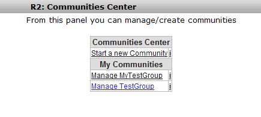

   	[**Figure 35: The available Communities for this user**](_static/images/AdaptingR2_Availablegroups.png)
    
5.  You have to add users by their R2 username; we'll add
    user "pietmolenaar". He'll receive a message in the R2 startup page
    as soon as he logs on the next time. Click "next" to add the user.
    
	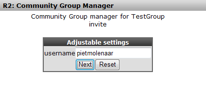
	
	[**Figure 36: Add a user by their R2 user    name**](_static/images/AdaptingR2_GroupManager.png)
	
6.  R2 returns with a message that the user has been invited, he or she
    has to accept your invitation first before he will see what you
    are sharing.
    
	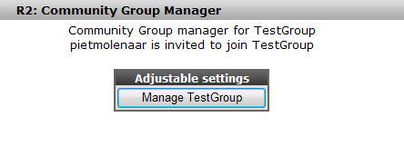
	
	[**Figure 37: R2 return message; user is invited; but not yet    visible**](_static/images/AdaptingR2_Managegroups.png)
	
7.  The perspective of the invited user after logon; he or she can
    accept the invitation (Figure 37).
    
	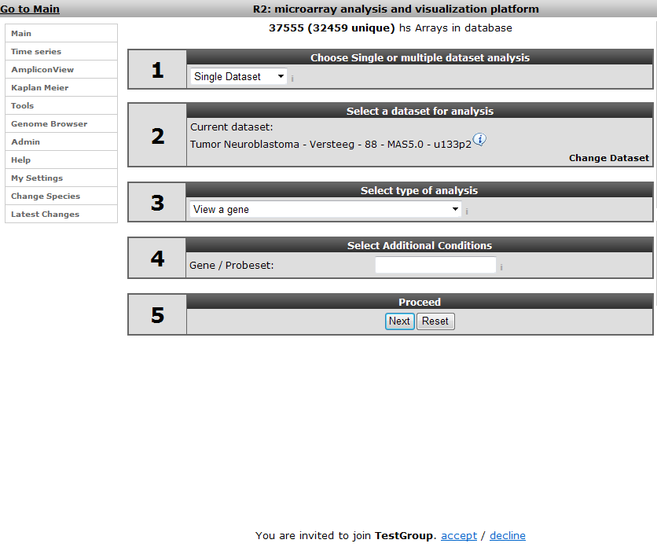
	
	[**Figure 38: The invited user receives a notification on the main page where    he or she can accept the membership of the    group**](_static/images/AdaptingR2_GroupInvitation.png)
	
8.  When the invitation has been accepted the user is available in
    this community. When we add a category, track or preset the next
    time, it is possible to make this available to this community.
    
	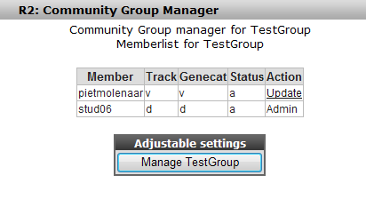
	
	[**Figure 39: The user is available in    the TestGroup.**](_static/images/AdaptingR2_CommunityUsers.png)
	
9.  When a Category is created there is now a possibility to make it
    available to a Community (Figure 39)
10. Managing the tracks, gene categories and megasampler presets is done
    in a similar way as has been shown in the user tracks and user
    categories at the beginning of this tutorial. pietmolenaar, as a
    member of this group, can manage the tracks that have been shared
    with him via his default track manager
    
	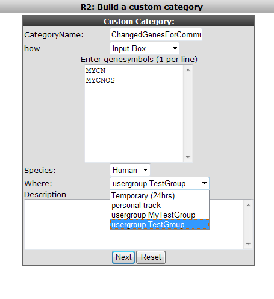
	
	[**Figure 40: As an example here the creation of a category and the assignment    to    a Community.**](_static/images/AdaptingR2_CommunityCategory.png)
	

Final remarks / future directions
---------------------------------

Some of these functionalities have been developed recently. If you run
into any quirks or annoyances don't hesitate to contact r2 support
(r2-support@amc.uva.nl).

We hope that this tutorial has been helpful, the R2 support team.

