

Analysing Time Series
=====================

*Search for up and-down regulated genes in a time series experiment*

Scope
-----

-   Time series experiments, where a cell line is manipulated and
    followed over time, are analyzed and visualized in a separate
    section in R2. The actual analysis of any time series in R2 has been
    pre-calculated by the Affymetrix GCOS program. Within GCOS, every
    timepoint in a series has been compared to time-point zero. GCOS,
    makes use of the fact that every probe-set of an Affymetrix array is
    actually a measurement performed 11-16 times. These measurements are
    used as "independent" inputs to calculate a p-value. Due to the use
    of GCOS, the time series functionality is only available for the
    U133 type Affymetrix platforms. Of course, our advice would be to
    use biological replicates of all experiments.
-   In most cases, time series experiments are performed by specific
    usergroups, whose data is often shielded from public assess. There
    are however also a few publicly available sets, to illustrate what
    this part of R2 can do. All the experiments performed on the same
    platform will most often be stored within a single set.
-   Single gene expression levels can be visualized and list of
    regulated genes can be generated via a range of filtering methods.
    Please be aware that GCOS uses the probe information (contained
    within a probe set) from a single array to calculate p-values on.
    This is a controversial approach, but for many of the performed
    experiments the only way to obtain statistical values. If a
    timeseries experiment has been performed 3 or more times, then
    perhaps a better alternative would be to make use of the
    functionalities that are available for regular datasets.

<!-- -->

-   Use the time series module to investigate the expression level of a
    single gene.
-   Use the time series module to generate a list of regulated genes.

<!-- -->

-   Use a list of regulated genes to analyze a dataset by using the
    geneset view.

<!-- -->

-   Use correlate with dataset to optimize your genecategory.

Tutorial step 1
---------------

1.  To view the expression pattern of a single gene from a time series
    experiment we make use of the "Time-series" module. Logon to R2 and
    select Time series in left menu panel of R2.
    
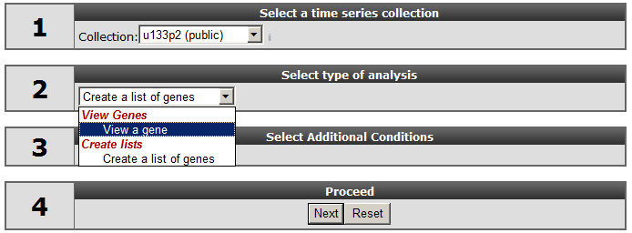

[**Figure    1: Single selection in the Time-series    module**](_static/images/AnalysingTime_Select.png)

2.  In field 1, select at collection "u133p2 (public)". Here
    "collection" is indicated as a category of Time series experiments.
    For time series the analysis is limited to the Affymetrix Hu133A or
    Hu133plus arrays. The "Collection" field not only implies the
    platform type but may also include another subgroup , in this a case
    a publically available Times series data. Select "View a gene; in
    field 2, type *HMOX1* in field 3*,* and click "next".
3.  In the next screen all the public available time series for the
    u133p platform R2 is hosting, is listed. In our example we make use
    of a Time series experiment published in
    [Bioinformatics.](http://www.ncbi.nlm.nih.gov/pubmed/20007254)"2010
    Feb 15;26(4):456-63. In this Time series, the experiments are
    performed in triplo . The A549 Adenocarcinoma cellline is treated
    with TGF-beta and the expression levels where measured at
    several timepoints. In Figure 2 click on the (+) sign to unfold the
    Time-course experiments belonging to the A549 cellline and
    click "next". In the adjustable settings menu, leave all the default
    settings and click "GO".
    
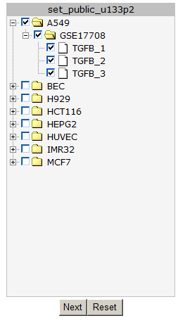

[**'Figure    2: Timeseries    selection screen.**](_static/images/AnalysingTime_SelectSeries.png)

    In Figure 3 the expression levels of the HMOX1 gene are represented
    in a triplicate Time course experiment after stimulation
    with TGF-beta. Clearly the HMOX1 gene is an early responder and is
    upregulated with a maximum at 4 hours. The HMOX1 gene is presented
    by the authors of the corresponding publication as one the
    upregulated genes after TGF-beta stimulation. It"s should be noted
    that a control experiment is missing in this experimental design.
    Hovering over the individual timepoint reveals
    additional information.
    
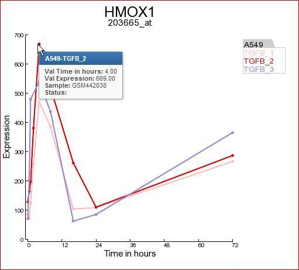

[**Figure    3: Expression levels of the HMOX1 gene during a time course    experiment**](_static/images/AnalysingTime_HMOX1.png)

4.  Another gene the authors claim to be upregulated by TGF-beta is the
    BCL6 gene. In the same screen you can quickly generate a time series
    graph by providing the BCL6 gene in the right upper corner and click
    "Search Gene".
    
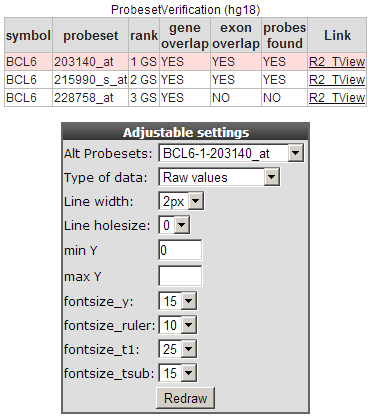

[**Figure    4: Probeset verification and    Adjustable Settings.**](_static/images/AnalysingTime_Probeset.png)

The probeset verification table lists in the case of BCL6 the 3
probesets designed for the BCL6 gene. By default R2 will select the
probeset with the highest average expression level. Clicking on the
Tview link opens a separate application "Transcript view" to investigate
the reporters in more detail. The Transcript view application is
explained in tutorial 2 "one-gene-view".

In the adjustable settings menu you can customize the Time series graph
to your personal needs. Such as fontsize , Line width etc.

  ------------------------------------------------------------------------------------------------------------------------------------------------------------------------------------------------------------------------
  ***Did you know that you can contact the R2-support team to add your Time-series experiments***
  Your Time series experiments will be listed as a separate collection and for private analyses only. The R2-support team requires the CEL datafiles provided by your Microarray facility, to generate the result files.
  ------------------------------------------------------------------------------------------------------------------------------------------------------------------------------------------------------------------------

Tutorial step 2
---------------

1.  Instead of looking at one single gene, you may most likely want to
    find novel up and-down regulated genes in your cell-line experiment.
    Go to the main screen and select in field 2 "Select type of
    analysis, "create a list of genes" and click "next".
2.  In the next screen select again all the A549 timeseries experiment
    and click "next".
3.  In following screen you can use the table builder to apply all kind
    of filtering options to find the novel regulated genes. Some of the
    options are already set.
    
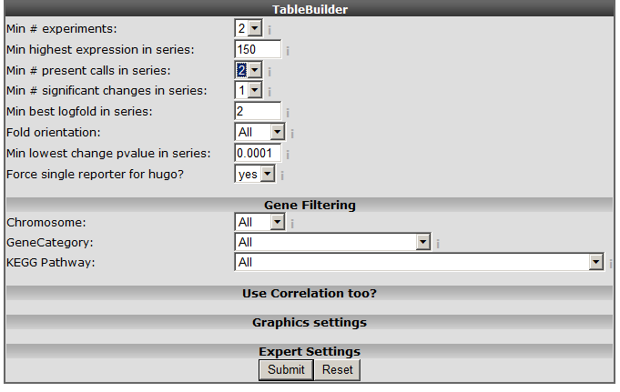

[**Figure    5: The time series    table builder.**](_static/images/AnalysingTime_Tablebuild.png)

    An explanation of some of the options follows below:
    ***Min \#experiments***: Depending on your experimental design
    select in how many experiments your gene should be regulated
    according to your filter.
    ***Min highest expression in series***: Set the minimal highest
    expression in at least one of the samples in your Time
    Series experiment. In this way the genes which are not expressed
    above a certain level (eg background) \#:will be skipped.
    ***Min\# present calls in series***: The affymetrix MAS5.0 algorithm
    detects whether a gene is significantly detected and receive a
    "present call".
    ***Min \#significant change in series***: Whenever the expression in
    a time series is significantly altered compared to time point 0, a
    "change" call is elevated. At least one change in expression level
    should be \#:significant (meaning that you also would like to see
    those results where only in 1 time point a change is observed).
    ***Fold orientation***: determine the orientation here. Up / Down /
    Both
    ***Minimal best fold in a series***: Set a minimal logfold that has
    to occur within the series.
    ***Min lowest change pvalue in series***: The MAS5 algorithm
    provides a p-value of the fold change, before a probeset is
    considered changed a minimal pvalue of 0.00025 should be met. Here
    you can set the pvalue to a more \#:strict level.
    ***Force single reporter for hugo***: It"s possible to analyse all
    probesets representing a single gene. As explained in another
    tutorial by default R2 will select the probeset with the highest
    average expression level.
    Select and set the options as depicted in Figure 5 and click "next".
    
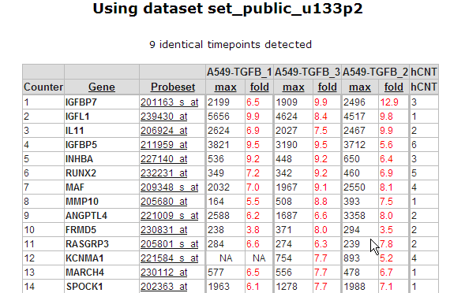

[**Figure    6: Up and down regulated genes table sorted on best fold    change**](_static/images/AnalysingTime_SortedTable.png)

4.  In Figure 6 a part of the up and down regulated genes are shown,
    listing the fold change and highest expression level for each Time
    series experiment. Clicking on a probeset link generates a single
    gene time series plot as shown in Figure 7.
    
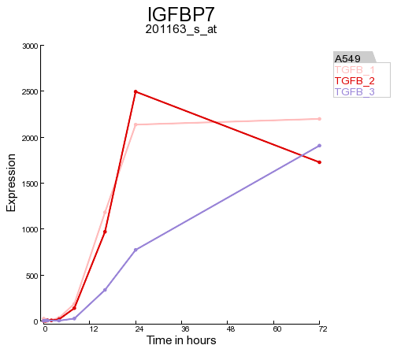

[**Figure    7:    regulated gene.**](_static/images/AnalysingTime_RegulatedGene.png)

5.  Clicking on the filter button will open the "adjustable settings"
    panel to re-adjust the selection options. Clicking on the Venn
    "diagram button re-direct to the automatically generated Venn
    Diagram representing the intersection of the genesets.
    

[**Figure    8: Top    buttons**](_static/images/AnalysingTime_Button.png)

    
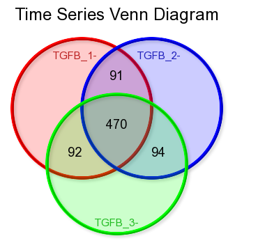

[**Figure    9: Time series Venn    diagram**](_static/images/AnalysingTime_Venn.png)

  -------------------------------------------------------------------------------------------------------------------------------------------------------------------------------------------------------------
  ***Did you know that Venn diagrams can be created directly from your genecategories of choice?***
  In the My Settings section you can upload text files containing your lists of genes and store them as genecaterory. Repeating the procedure described above will produce the desired Venn diagrams.
  -------------------------------------------------------------------------------------------------------------------------------------------------------------------------------------------------------------

Tutorial step 3.
----------------

1.  One of the strong points of R2 is that it supports directly further
    analyses with other modules and datasets stored in the database. Use
    the table of up and down-regulated genes of step2 to investigate if
    this list of genes can be of relevance in other datasets. In the
    left panel click "store results as gene category". A new screen
    appears where you can enter an informative name for your
    genecategory and add a short description. The genecategory can be
    stored for 24 hours or stored permanently in your account, after
    which it is available each time you log in to R2. For now choose the
    Temporary option at "Where" and remember the name of the stored
    genecategory for the next step.
    
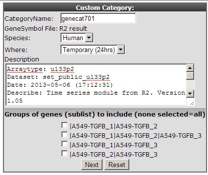

[**Figure    10: : Store a gene    category**](_static/images/AnalysingTime_CustomCat.png)

2.  It has been published that the timecourse expression data from the
    cell experiment used in this example is linked to
    epithelial-mesenchymal transition (EMT) by TGF-beta induction. It"s
    also known that this process plays an important role in
    Breast cancer. We can use this generated genecategory to investigate
    whether this of any relevance or not.
3.  Go the the main screen of R2 and select at "change dataset" the
    following dataset . Tumor Breast - Iglehart - 123 - MAS5.0 -
    u133p2 . In field 3 select "View Geneset" at "Select type of
    analyses" and click "next".
    
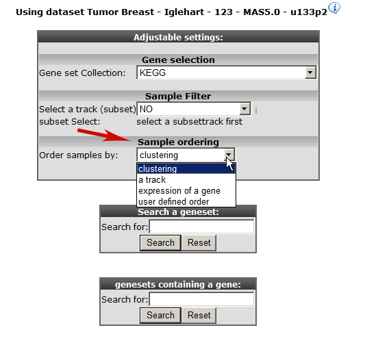

[**'Figure    11: Geneview    adjustable settings.**](_static/images/AnalysingTime_Geneview.png)

4.  At "Gene set Collection" choose " My 24h geneCategories" and select
    the generated "genecategory" from step 1. Instead of an unsupervised
    sample clustering you can also cluster samples within a track.
    Select at "Order samples" by " ordering by track and click next.
5.  Click next again.
6.  Choose the temporary Genecategory generated via the Timeserie
    experiments, the track b-r\_grade and click "next".
    
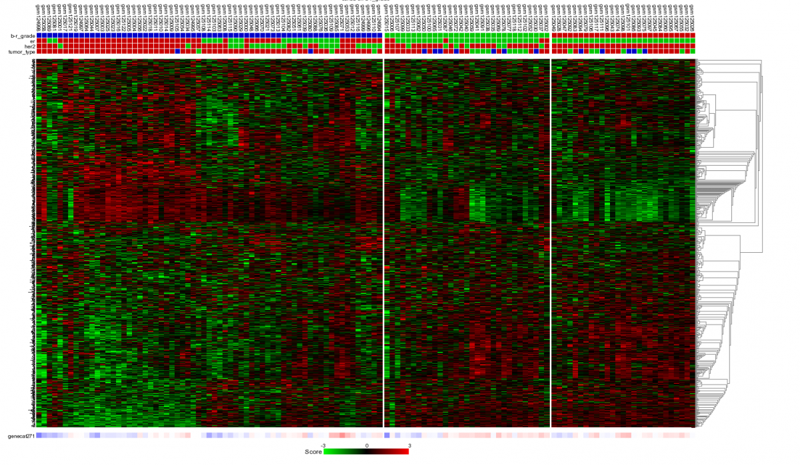

[**Figure    12: Heatmap of unsupervised clustering within a track of a    selected geneset.**](_static/images/AnalysingTime_Heatmap.png)

7.  The samples are unsupervised hierarchically clustered within each
    group of the selected track and presented in a heatmap. The selected
    genecategory resulting from the timeserie experiment could be of
    clinical relevance since the clustering correlates with the
    Oestrogen Recepter track. At the bottom of the heatmap the z-scores
    of the selected genecategory is represented./

  ------------------------------------------------------------------------------------------------------------------------------------------------------------------------------------
  ***Did you know that clicking a spot in the heatmap reveals more info***
  Clicking on a spot generates a one-gene-view for the chosen gene in the dataset only supported for a genecollection consisting &lt; \~400 genes.
  ------------------------------------------------------------------------------------------------------------------------------------------------------------------------------------

\

  ------------------------------------------------------------------------------------------------------------------------------------------------------------------------------------------------------------------------------------
  ***Did you know that with "sample ordering" (Figure 11) you can manage the way the samples are clustered.***
  By choosing "sample ordering " by "track" , the unsupervised clustering of the samples is applied within the groups of a track. It is even possible to customize the way the samples are ordered by yourself (user defined order).
  ------------------------------------------------------------------------------------------------------------------------------------------------------------------------------------------------------------------------------------

Tutorial step 4
---------------

1.  Instead view a " geneset, you can also choose perform a "K-means"
    clustering based on your stored genecategory described in the steps
    " above". Go to the main menu, select "K-means" at " Select type of
    analysis" and click "next".
2.  In the "Adjustable settings" panel leave most of the default
    settings but make sure that you select the already stored
    "Genecategory" at the clustering section select '10x10" at "numbers
    of draw" and click "next".
    
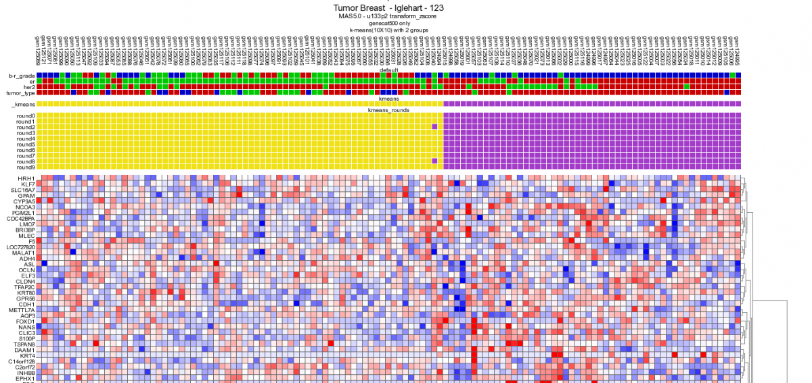

[**Figure    13: 10x10 Heatmap with the same dataset and gene category as    depicted in    Figure 9.**](_static/images/AnalysingTime_heatmap2.png)

Performing a 10x10 K-means clustering via de main menu supports the
potential clinical relevance of the genecategory extracted from the
timeserie experiment. The K-means cluster module is discussed in more
detail in tutorial 10.

  -------------------------------------------------------------------------------------------------------------------------------------------------------------------------------------------------------------------------------------------------------------------------------------
  ***Did you know that you can store the K-means generated track and use this track every time you log in to R2.***
  You can use this track for further analysis with a custom made track for example by using the "find differential expression between groups". This approach explained in more detail in tutorials : Differential Expression Of Gene Between Groups and "Adapting R2 to your needs" .
  -------------------------------------------------------------------------------------------------------------------------------------------------------------------------------------------------------------------------------------------------------------------------------------

Tutorial Step 5
---------------

1.  The module "correlate" the results with dataset compares the
    resulting genelist with a dataset of interest. Clicking the
    correlate with dataset button in the left menu redirects to a
    new screen. Choose the Igleheart " Breast in field 2, in field 3 ,
    choose "relate to differential expression" and click next.
2.  Choose "er" at select a track and click "next".
3.  In de background R2 generates a list of genes based on the module
    "Find differential expression between groups" and presents the
    overlay of the results with the list generated in the " time
    series module".
    
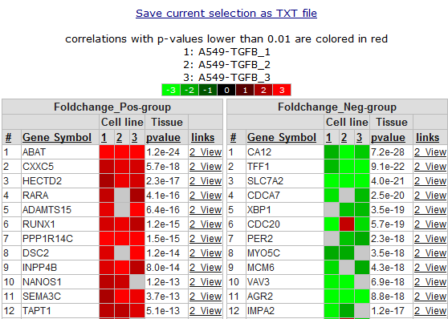

[**Figure    14: Part of correlate with    dataset genelist.**](_static/images/AnalysingTime_TableCorrelate.png)

4.  In *Figure 14* the overlap is presented between the result from the
    " time series" module and the " relate to differential
    expression" option. The list of genes is sub-divided in a positive
    and a negative correlation list of genes. Clicking the "2-view" link
    opens a new screen with a combined graph of a one-geneview and the
    time series experiment.

Final remarks / future directions
---------------------------------

Final remarks / future directions if applicable

We hope that this tutorial has been helpful,The R2 support team.

