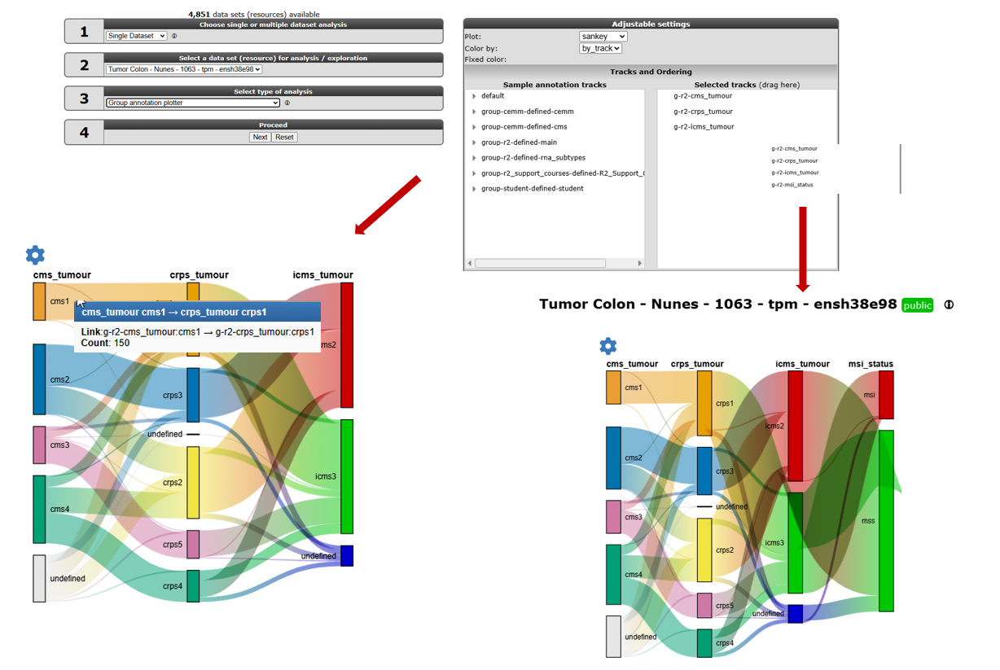
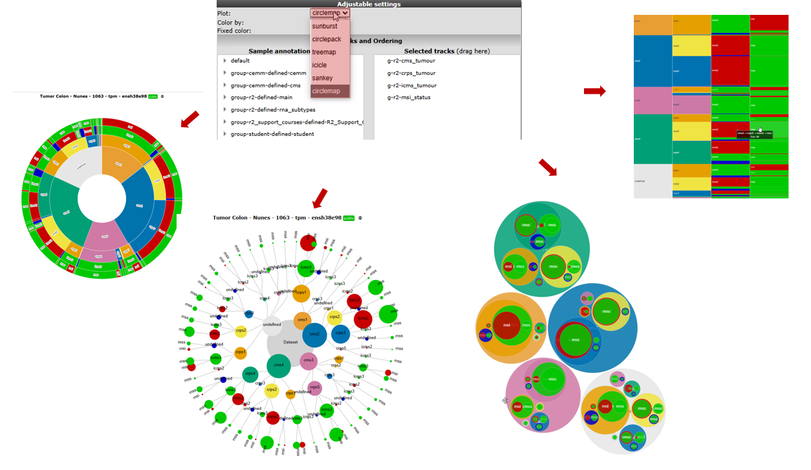

Annotation analyses
===================

*Using (custom) annotation tracks as input for analyses*

Scope
-----

As you know by now, annotation of your data is stored in R2 as "tracks".
Within R2, one can easily create new annotation tracks. This can be done
either based on results generated within analyses, or completely
independent by uploading of tracks. In some cases it is of interest to
start comparing one track with another. The type of statistics used to
compare the tracks depends on the type of data; either categorical or
numerical. One may wonder if there is significant overlap between 2
tracks (with categorical variables), based on Fisher's exact test.
Alternatively, if there are multiple numerical tracks available; one may
wonder if there is a significant correlation between 2 tracks. For these
cases, R2 contains the Annotation modules; *Relate 2 tracks* and
*Annotation_plotter*. Perhaps needless to mention, but the use of the *Relate 2 tracks* module only applies to tracks from the same dataset.

- Relate 2 tracks (categorical); test significant overlap and view as
    honeycomb-plot.
- Relate 2 tracks (numerical); assess significance of correlation and
    view as XY-plot.
- Relate 2 tracks (categorical vs numerical); assess differential
    values between groups.
- Annotation plotter; visualize tracks within sample cohort.
- Group annotation plotter; visualization options of tracks within a sample cohort including; Sunburst, Sankey, Treemap, etc.

Step 1: Relating 2 (categorical) tracks
------------------------------------------------

1. Make sure that you are on the R2 main page, and that the
    selected dataset is *Tumor Colon - Nunes - 1063 - tpm - ensh38e98*. In the **Select type of analysis** box (field 3) select *Relate 2 tracks*, which can be found in the 'Annotation' subsection
    and press 'Next' (**Figure 1**).
    
    
	
    [**Figure 1: Select Relate 2 tracks**](_static/images/Annotation/AnnotationAnalyses_relatev1b.png)
	
2. For the different tracks, make sure that you select two categorical
    tracks (which can be recognized by (cat)). Here, we will investigate whether
    there is a relation between the *MSI status* (**X track**) and *cms_tumour* subtypes (**Y track**). Select the *XY-Honeycomb* plot as **Graph type** adnt then press 'Submit' to generate the result (**Figure 2**).
    
    
	
    [**Figure 2: Select Selecting categorical tracks**](_static/images/Annotation/AnnotationAnalyses_adjustv1b.png)
	
3. The generated result is now displayed on the screen. As we are
    testing 2 categorical variables, R2 has tested the relation between
    the 2 tracks and finds a highly significant Fisher's exact p-value,
    indicating that there is a relation between the MSI-status and CMS classification of of the patients. The result is also shown in a honeycomb
    image, where every individual patient is represented as a separate
    dot and hovering over the dots will give you additional information. 

4. You can add more visual information to the plot, by coloring the
    patients on the basis of a track. From the "Adjustable settings" panel at
    the bottom of the page, set the **Color mode** to *Color by a Track* and
    select *hypermutation_status* as **Color track**. Press the 'Submit' button to
    create an updated image. Now we can clearly see that the hypermutation status is heavily overrepresented in the MSI group. As you may appreciate, the combinations that you can make here are virtually endless (Illustrated in **Figure 3**). 
    We have named this analysis the 'Visual Fisher's Exact test', due to the visual additional insights that it provides over the 'normal' p-value that can be interpreted for this test.

   
   

   [**Figure 3: Using the interactive plot options**](_static/images/Annotation/AnnotationAnalyses_Interactive_plot1a.gif)

	
5. To compare the absolute or relative shares of track values between subgroups of another track, you can adapt the **Graph type** in either the "Adjusable settings" panel or the "plot options" (accesible by clicking the Gear-icon) panel to *Stacked Bar* or *Stacked Bar (%)* plots. The Stacked Barplot ratio (%) option scales every group to 100%, thereby showing the relative contribution of the different groups. Also the grouped bar plot is a handy visualisation to split your representation for a group parameter.
  
     and relative (right) stacked barplots")
	
    [**Figure 4: Absolute (left) and relative (right) stacked barplots and in the middle a grouped bar plot**](_static/images/Annotation/AnnotationAnalyses_StackedBarplot1a.png)

Step 2: Relating 2 (numerical) tracks
----------------------------------------------

1.  Just as in the previous example, when we are in the R2 main page select the *relate 2 tracks*
    option in field 3 and click 'Next'. This time, we
    select 2 numerical tracks, which can be recognized by the (\#) sign
    at the end of a track. Within the Tumor Colon - Nunes - 1063 - tpm - ensh38e98 dataset our options
    are limited for this example, so we select the *mutated_driver_genes* track (**X track**) and the *age_at_diagnosis* track (**Y track**) and set the **Graph Type** to *XY* and click 'Submit'.
2.  In the result page, R2 has detected that 2 numerical tracks were
    selected, so the correlation between the different tracks is being
    displayed and tested for statistical significance which is shown at the bottom of the graph. Just as in the
    previous example, we could color the patients by CMS_tumour type by setting the **Color mode** in the "Adjustable settings" panel to *Color by a Track* and selecting *cms_tumour* as **Color Track**. This showed that the number of mutated driver genes is significant lower in the CMS2 group. This can be made clearer by going to the "plot options" panel and ticking the **Add Boxplot per group** box in the 'Extra' section (**Figure 5**). 

	
	
	[**Figure 5: Output of relating numerical tracks**](_static/images/Annotation/AnnotationAnalyse_relatetracks_v1b.png)
	

Step 3: Relating a categorical track to a numerical track
------------------------------------------------------------------

1. The last example for relating 2 tracks, involves the combination of
    a numerical one to a categorical track. Essentially, this option
    allows you to test meta-gene data (such as combined expression
    values of multiple genes expressed as a single value) as well, where
    you could create a track containing only value information for the
    patients, and test this track to clinical parameters. We again
    select *Relate 2 tracks* in the R2 main page and click 'Next'. 
2. From the track options, we choose for the **X track** the categorical track; *tumour_stage* and for the **Y track** the numerical track; *overall_survival_days* and click 'Submit'. 
3. The result page will now start to look like the 'View a Gene in Groups' result page,
    only this time using the data contained in your chosen tracks. Via the "Adjustable settings" panel, you can change the representation to another **Graph type**, such as a *box* plot,  with **Add Scatter** is * TRUE*,  change the **Color mode (groups)** to *Color by a Track*, **Color mode** to * Color by a Track*, **Color track** to *vital_status* and you have a nice result (**Figure 6**.

    
	
    [**Figure 6: Representing the relation between categorical and numerical tracks**](_static/images/Annotation/AnnotationAnalyse_relationnumcat1b.png)
	

As a recap for the last 3 tutorial steps, you have used the *relate 2
tracks* option from the annotation methods in R2 and represented
different types of tracks with each other to gain new insights from
combining 2 tracks. Below, the three different representations are depicted
side by side. Do remember, that this module allows you to use "meta
data" tracks that you can assemble either within, but also outside of R2
via the uploading of a track option that will be shown in Chapter 23; "Adapting
R2 to your needs".

[**Figure 7 : "Representations of relations between different types of tracks in R2**](_static/images/Annotation/AnnotationAnalyse_representation1a.png)
	

Step 4: Annotation plotter and Cohort Overview
-----------------------------------

1. In some publications, patient data is represented in slick looking
    annotation plots, showing the patient characteristics in rectangles.
    In a sense, these are just like the tracks that are represented
    underneath YY-plots in R2. To allow users to create these "track"
    figures, ordered in a user provided order, we have implemented the
    *Annotation plotter* in R2.
2. Make sure that you are on the R2 main page, and that the
    selected dataset in field 2 is *Tumor Colon - Nunes - 1063 - tpm - ensh38e98*. From the **Select type of analysis** dropdown menu select
    *Annotation plotter*, which can be found in the 'Annotation'
    subsection and click 'Next'.
3. The default view for the dataset will be plotted. Now you can change
    the tracks to display as well as the
    order in which the samples should be ordered. To add tracks to the display, hold and drag the track from the 'Sample annotation tracks' box to the 'Selected tracks' box. For removing tracks, drag the trackname outside the selection box. To adapt the order in the list, hold and drag the track name. The order in which tracks are selected for ordering will also dictate the final sort. To view the result click 'Adjust Settings'. For some complicated sorts, it may be necessary to
    create a numeric track that puts the sample in the intended order. To create **Figure 7**, select the tracks; *g-r2-cms_tumour, g-r2-recurrence, g-r2-sex, g-r2-structural_variants, g-r2-tumour_grade, g-r2-tumour_stage, g-r2-vital_status and g-r2-crps_tumour*.  

    
	
    [**Figure 7: Plotting the annotation tracks**](_static/images/Annotation/AnnotationAnalyse_plotting1b.png)
	
4. Another often useful overview is provided by the *Cohort Overview*, which can be selected in the **Select type of analysis** field on the R2 main page and click 'Next'. Here, pie charts show the shares of the different values of a track. You can visualize tracks using the dropdown menu lower left side of the screen. When you hover over the pie slices gives you the N-value and percentage. By clicking the pie slice, the table overview will be filtered with the values of different tracks of choice for each sample.  
The 'Build a track' button at the bottom of the page conveniently allows you to directly build a track from any selection of available tracks.

    
	
    [**Figure 8: Cohort Overview**](_static/images/Annotation/AnnotationAnalyses_CohortOverview1a.png)

Step 5: The Group Annotation plotter
-----------------------------------

R2 also offers a *Group Annotation Plotter* option in the **Select type of analysis** field of the R2 main page, providing different visualization options that overlays group-level information such as labels, classes, or metadata onto a data plot. This makes it easier to interpret patterns, group differences, or sample relationships.
The Sankey plot depicts a flow of one set of group parameters connected to another and is selected by default in the group annotation plotter.
The flows in the plot are always directional, the width corresponds to the size of the flow and can be split from node or converge from one to many. Other visualisation options are; Sunburst, Circlepack, Icicle and Circlemap.   

[**Figure 9: Sankey plotter**](_static/images/Annotation/AnnotationAnalyse_sunburst1a.png)

   

   [**Figure 10: Other group visualisations**](_static/images/Annotation/AnnotationAnalyse_sunburst1b.png)

Final remarks / future directions
---------------------------------

Some of these functionalities have been developed recently. If you run
into any quirks or annoyances do not hesitate to contact R2 support
(r2-support@amsterdamumc.nl).  
  
  
We hope that this tutorial has been helpful,  
the R2 support team.

