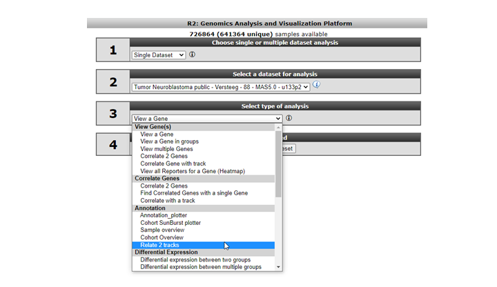
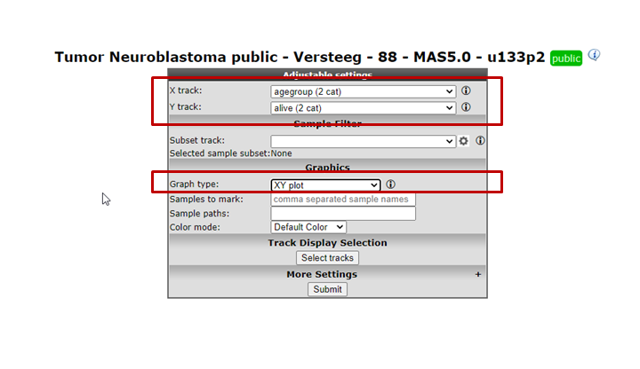
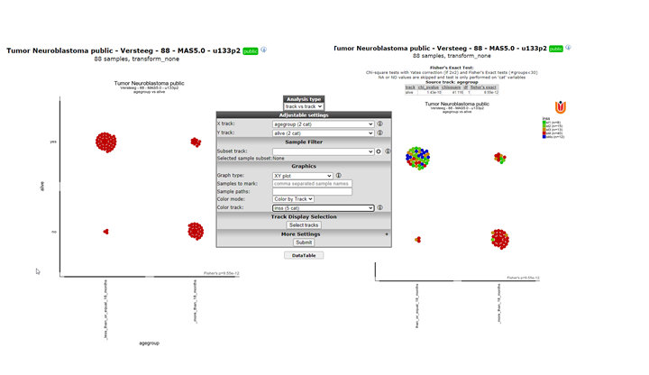
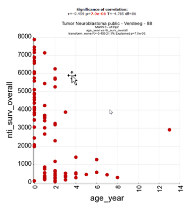
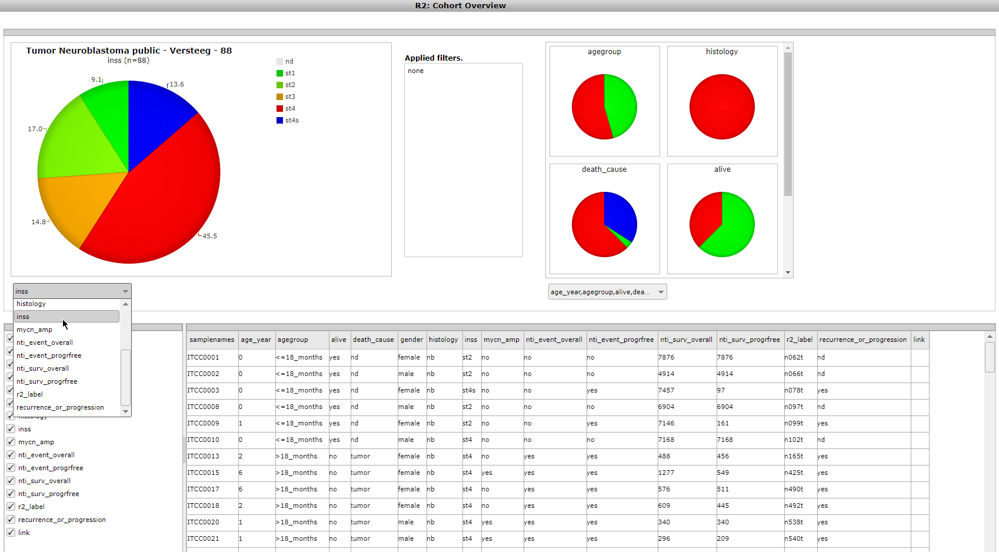
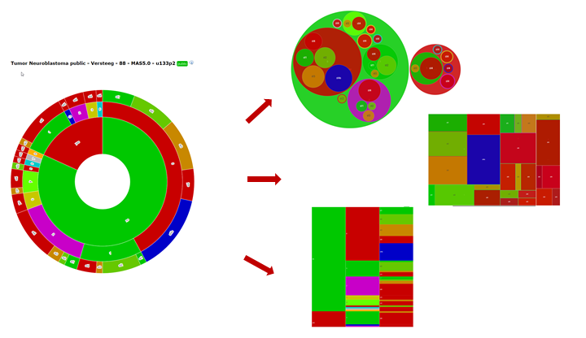

Annotation analyses
===================

*Using (custom) annotation tracks as input for analyses*

Scope
-----

As you know by now, annotation of your data is stored in R2 as "tracks".
Within R2, one can easily create new annotation tracks. This can be done
either based on results generated within analyses, or completely
independent by uploading of tracks. In some cases it is of interest to
start comparing one track with another. The type of statistics used to
compare the tracks depends on the type of data; either categorical or
numerical. One may wonder if there is significant overlap between 2
tracks (with categorical variables), based on Fisher's exact test.
Alternatively, if there are multiple numerical tracks available; one may
wonder if there is a significant correlation between 2 tracks. For these
cases, R2 contains the Annotation modules; "relate 2 tracks" and
"annotation plotter".

- Relate 2 tracks (categorical); test significant overlap and view as
    honeycomb-plot.
- Relate 2 tracks (numerical); assess significance of correlation and
    view as XY-plot.
- Relate 2 tracks (categorical vs numerical); assess differential
    values between groups.
- Annotation plotter; visualize tracks within sample cohort.
- Sunburst plotter and others; visualization options of tracks within a sample cohort.

Step 1: Relating 2 (categorical) tracks
------------------------------------------------

1. Make sure that you are on the "main" page of R2, and that the
    selected dataset is "Tumor Neuroblastoma public - Versteeg - 88 -
    MAS5.0 - u133p2". In the 'Select type of analysis'-box (3) select
    "Relate 2 tracks", which can be found in the annotation subsection
    and press 'Next'.
    
    
	
    [**Figure 1: Select "Relate 2 tracks"**](_static/images/AnnotationAnalyses_relate.png)
	
2. For the different tracks, make sure that you select a categorical
    one (which can be recognized by (cat)). We investigate whether
    there is a relation between the neuroblastoma age-group
    (track=agegroup, flip point being 18 months at diagnosis) and the
    survival status (track=alive). Select the 'XY' plot in the graph section. Then press 'Submit' to generate
    the result.
    
    
	
    [**Figure 2: Select Selecting categorical tracks**](_static/images/Annotation/AnnotationAnalyses_adjustv1.png)
	
3. The generated result is now displayed on the screen. As we are
    testing 2 categorical variables, R2 has tested the relation between
    the 2 tracks and finds a highly significant Fisher's exact p-value,
    indicating that there is a relation between the agegroup and vital
    status of the patients. The result is also shown in a honeycomb
    image, where every individual patient is represented as a separate
    circle, with the annotation as a hover box.

4. One can add more visual information to the plot, by coloring the
    patients on the basis of a track. From the adjustable settings at
    the bottom of the page, set the "colormode" to "color by track" and
    select "inss" as track. Press the 'Submit' button to
    create an updated image. Now we can clearly see that there is a
    great over-representation of stage 4 patients in the group of
    deceased patients who are older than 18 months. As you may appreciate, the combinations that you can make here are virtually endless. 
    We have named this analysis the 'Visual Fisher's Exact test', due to the visual additional insights that it provides over the 'normal' p-value that can be interpreted for this test.

    
	
    [**Figure3: Color samples by track**](_static/images/AnnotationAnalyses_colorsamples.png)
	
5. To compare the absolute or relative shares of track values between subgroups of another track, you can use the "Stacked
   Barplot" or "Stacked Barplot ratio" respectively. The "Stacked Barplot ratio" option scales every group to 100%, and thereby shows the relative contribution of the different groups.
  
     and relative (right) stacked barplots")
	
    [**Figure 4: Absolute (left) and relative (right) stacked barplots**](_static/images/Annotation/AnnotationAnalyses_StackedBarplot.png)

Step 2: Relating 2 (numerical) tracks
----------------------------------------------

1.  Just as in the previous example, we select the "relate 2 tracks"
    option from the main R2 screen and click 'Next'. Now this time, we
    select 2 numerical tracks, which can be recognized by the (\#) sign
    at the end of a track. Within the Neuroblastoma dataset our options
    are limited for this example, so we select the "age in years" track
    vs the "nti\_surv\_overall" track and proceed to the next screen.
2.  In the result page, R2 has detected that 2 numerical tracks were
    selected, so the correlation between the different tracks is being
    displayed and tested for statistical significance. Just as in the
    previous example, we could color the patients by a track if that
    would be appropriate.

	
	
	[**Figure 4: "Output of relating numerical tracks**](_static/images/Annotation/AnnotationAnalyse_relatetracks_v1.png)
	

Step 3: Relating a categorical track to a numerical track
------------------------------------------------------------------

1. The last example for relating 2 tracks, involves the combination of
    a numerical one to a categorical track. Essentially, this option
    allows you to test meta-gene data (such as combined expression
    values of multiple genes expressed as a single value) as well, where
    you could create a track containing only value information for the
    patients, and test this track to clinical parameters. We again
    select "Relate 2 tracks" from the main menu and navigate to the
    next page.
2. From the track options, we choose a categorical track for X (inss
    stage), and a numerical one for Y (nti\_surv\_overall) and navigate
    to the next page.
3. The result page will now start to look like view a gene in groups,
    only this time using the data contained in your track. Via the
    adjustable settings, you can change the representation to another
    plot type, such as a boxplot, change the colormode to color by
    track, and you have a nice result here, showing that the survival
    rate is significantly lower in patients of INSS stage 4.

    
	
    [**Figure 5: Representing the relation between categorical and numerical tracks**](_static/images/Annotation/AnnotationAnalyse_relationnumcat.png)
	

As a recap for the last 3 tutorial steps, you have used the "relate 2
tracks" option from the annotation methods in R2 and represented
different types of tracks with each other to gain new insights from
combining 2 tracks. Below, the three different representations are depicted
side by side. Do remember, that this module allows you to use "meta
data" tracks that you can assemble either within, but also outside of R2
via the uploading of a track option that will be shown in the "adapting
r2 to your needs" chapter.

[**Figure 6: "Representations of relations between different types of tracks in R2**](_static/images/Annotation/AnnotationAnalyse_representation.png)
	

Step 4: Annotation plotter and Cohort Overview
-----------------------------------

1. In some publications, patient data is represented in slick looking
    annotation plots, showing the patient characteristics in rectangles.
    In a sense, these are just like the tracks that are represented
    underneath YY-plots in R2. To allow users to create these "track"
    figures, ordered in a user provided order, we have implemented the
    annotation plotter in R2.
2. Make sure that you are on the "main" page of R2, and that the
    selected dataset is "Tumor Neuroblastoma public - Versteeg - 88 -
    MAS5.0 - u133p2". From the "Select type of analysis" dropdown select
    "Annotation plotter", which can be found in the annotation
    subsection and press next.
3. The default view for the dataset will be plotted. Now one can change
    the tracks to display (with track display selection), as well as the
    order in which the samples should be ordered (track sort order). The
    order in which tracks are selected for ordering will also dictate
    the final sort. For some complicated sorts, it may be necessary to
    create a numeric track that puts the sample in the intended order.

    
	
    [**Figure 7: Plotting the annotationtracks**](_static/images/Annotation/AnnotationAnalyse_plotting.png)
	
4. Another often useful overview is provided by the Cohort Overview. Click on 'Go to Main' in the upper left corner,
and this time select "Cohort Overview" in box 3 with the "Select type of analysis" dropdown. Then click 'Next'.  
Here, pie charts show the shares of the different values of a track. You can visualize tracks with the dropdown menus, 
hover over the different pie slices, and create a table overview with the values of different tracks of choice for each sample.  
The 'Build a track' button at the bottom of the page conveniently allows you to directly build a track from any selection of available tracks.

    
	
    [**Figure 8: Cohort Overview**](_static/images/Annotation/AnnotationAnalyses_CohortOverview.png)

5. The sunburst plotter is an often used annotation visualization. In the annotation section of the main menu, select 
   the Cohort sunburst plotter. The sunburst diagram displays a hierarchical structure in a circular shape. The origin 
   of the organization is represented by the center of the circle, and each level of the organization by an additional 
   ring. Additionally, other visualization plot types are implemented as illustrated in Figure 9 (circlepack, treemap and icicle).

   

   [**Figure 9: Sunburst plotter**](_static/images/Annotation/AnnotationAnalyse_sunburst.png)

Final remarks / future directions
---------------------------------

Some of these functionalities have been developed recently. If you run
into any quirks or annoyances do not hesitate to contact R2 support
(r2-support@amsterdamumc.nl).  
  
  
We hope that this tutorial has been helpful,  
the R2 support team.

