

Find genes correlating with your gene of interest
=================================================

*Or how you can find genes that have similar or opposite expression
patterns in your dataset of choice*

Scope
-----

-   R2 allows you to explore the relations your gene exhibits with other
    genes in your dataset of choice; correlation statistics is used to
    calculate this.
-   The expression of a set of genes correlating with the expression of
    MYCN in a series of Neuroblastoma tumors is used to demonstrate that
    in this tutorial
-   The results can be further explored in one-on-one graphs or as a
    heatmap
-   The set of genes can be further explored statistically in several
    domains as will be shown in this tutorial:
    -   In a gene ontology analysis
    -   On pathway maps
    -   On a chromosome map
-   Using this exploratory analysis, new biologically relevant
    hypotheses can be generated as will be shown in this tutorial by an
    example concerning MYCN and MCM genes.
-   The data can be saved and used in other tools
-   Further advanced analysis based on the use of sets of genes can be
    found in the Kaplan scanner and GeneSets tutorials.

Step 1: Selecting data
---------------

1.  Logon to the R2 homepage using your credentials and make sure the
    "Single Dataset" field is selected in field 1 of the R2 step-by-step
    guide
2.  Make sure the "Tumor Neuroblastoma public dataset" is selected in
    field 2 (For additional information on these first two steps,
    consult tutorial : Working with datasets
3.  In field 3 select 'Find Correlated genes with a single gene'
    (Figure 1).
4.  In field 4 type 'MYCN' as gene name
5.  Click 'Next'

	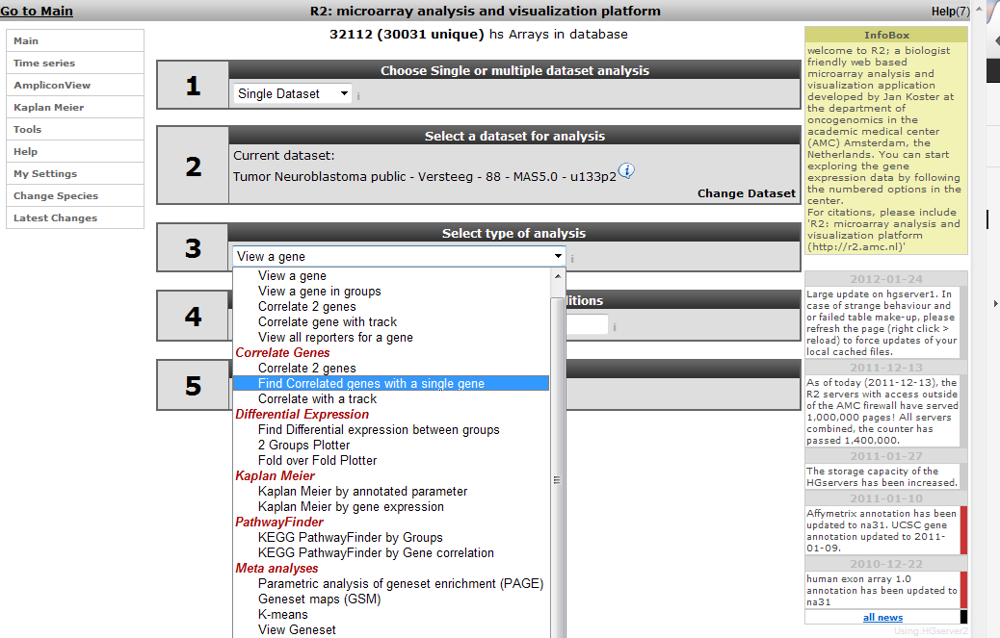
	
	[**Figure1: Choice of correlationanalysis.**](_static/images/FindGenes_Choiceof.png)
	

Step 2: Verifying settings
---------------

1.  Further information on the statistics choices and the meaning of the
    HugoOnce mode you can find in the 'Differential
    Expression' tutorial.
    
	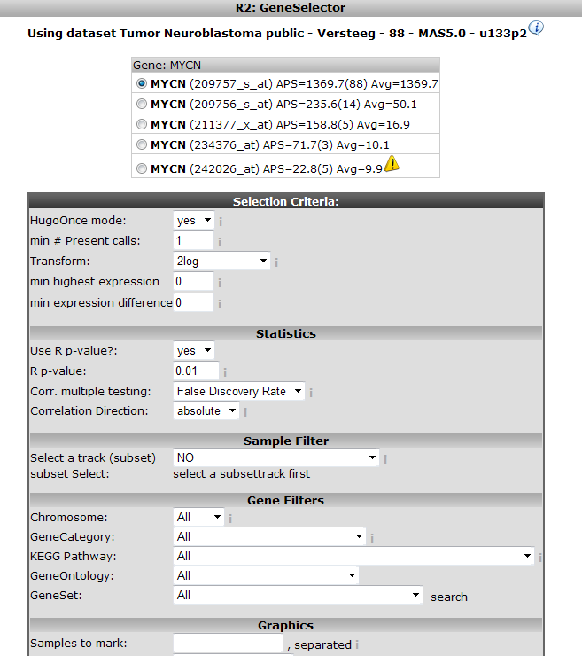
	
	[**Figure 2: Options page for correlation calculation**](_static/images/FindGenes_OptionPage.png)
	
2.  Scroll down the screen and click 'Next'

------------------
  **Did you know that you can find the correlation between two genes directly?**
  
>  *Just choose 'Correlate 2 genes' in field 3 if you have a specific gene you want to correlate with your gene of interest. Of course this method would be rather tedious if you want to find new genes, hence we're exploring exactly this scenario in this tutorial. Another possibility is to correlate your gene with a track (containing numerical data). This essentially tests whether the expression of your gene of interest correlates with the numerical order described in the track. This scenario is further explored in the 'Differential Expression' tutorial.*

------------------

Step 3: Inspecting correlating genes
---------------

1.  R2 calculates the correlation of the expression of MYCN with the
    expression of every other single gene in the current dataset. A lot
    of calculations! The result is presented as two tables (Figure 3 )
    In the header a summary is given: \~ 2200 combinations of MYCN and
    another gene met the criteria, i.e. having a significant correlation
    (p < 0.01) with the expression of MYCN, \~ 15000 genes did not
    obey these criteria. The left table represents the genes whose
    expression correlates positively, or is similar, with that of MYCN
    in this dataset. Of course MYCN has a perfect correlation
    with itself. Some characteristics of the genes are already described
    in red. R and p-values are given in separate columns (for a short
    description of their meaning, consult the 'Differential
    Expression' tutorial).
    
	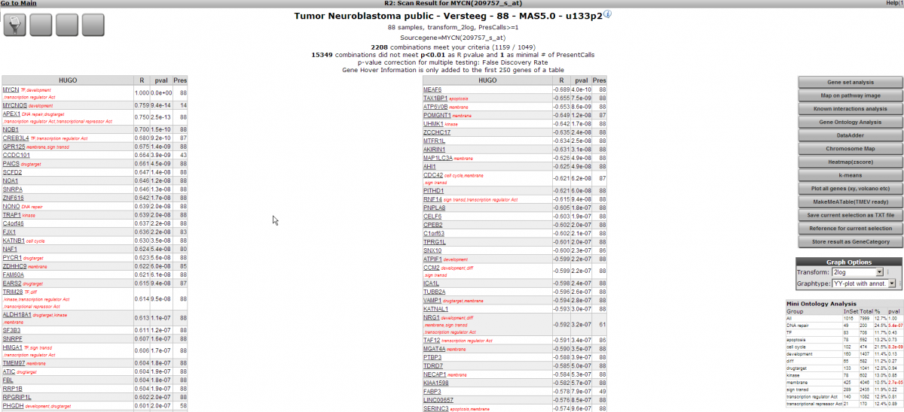
	
	[**Figure    3: Genes whose expression is correlating with that of the MYCN gene    in 88 Neuroblastoma    tumors**](_static/images/FindGenes_GeneList.png)
	

Exact (gene-) numbers listed in the tutorial Figures such as in this
example (2208 combinations) can vary. This is caused by database
updates upon a new genebuild release or an affymetrix annotation update.

1.  The right table summarizes the genes that show a negative
    correlation; the expression of MYCN behaves oppositely to that of
    these genes.
2.  A little table to the right summarizes the results of a limited
    Ontology analysis. More about that in subsequent steps where we also
    explore the menu items to the right. All gene names are clickable to
    explore the specifics of the correlation in a separate graph; try
    and click the APEX1 gene in the left column.
3.  In the left upper corner the filter icon is located , this links
    directly to the "adjustable settings panel " where you adapt the
    filtering conditions . The filter button is accessible in many
    analysis modules of R2.

	
	
	[**Figure4: Filterbutton**](_static/images/FindGenes_GotoMain.png)
	

Step 4: Inspecting correlation between specific genes
---------------

1.  The resulting graph depicts the expression of both genes in this
    tumor series in a graph. The tumor samples are ordered by increasing
    MYCN expression. Note that the expression of APEX1 follows the
    expression of MYCN quite good! This is reflected in the R and
    p-values that are quite significant.
    
	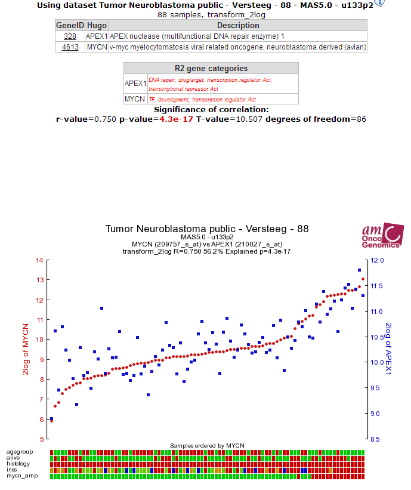
	
	[**Figure    5: The expression of the MYCN gene correlates with the expression of    the    APEX1 gene.**](_static/images/FindGenes_ExpressionPos.png)
	
2.  For an opposite example, click on one of the the top genes in the
    right column; MEAF6. This produces Figure 6. The original list of
    results is still open in another tab in your browser, return there.
    
	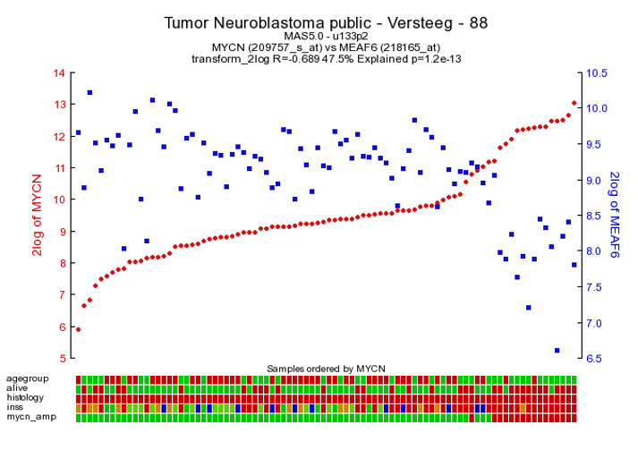
	
	[**Figure    6: The expression of MYCN has a negative correlation with that of    the MEAf6    gene**](_static/images/FindGenes_ExpressionNeg.png)

3.  To generate a correlation plot where the negative relation between MYCN
	and MEAF6 gene is more clearly visualized select "XY-plot" as graph type
	in the graphics section in the Adjustable Settings box and click the
	Adjust Settings button. In this correlation plot it"s also still
	possible to show expression levels for the samples are distributed. In
	order to do so click on more settings in the Adjustable Settings box and
	set Histogram to yes, click Adjust Settings button. Now the histogram
	boxes in the x and y axes show expression levels are distributed for the
	samples in the selected dataset see Figure 7.
	
	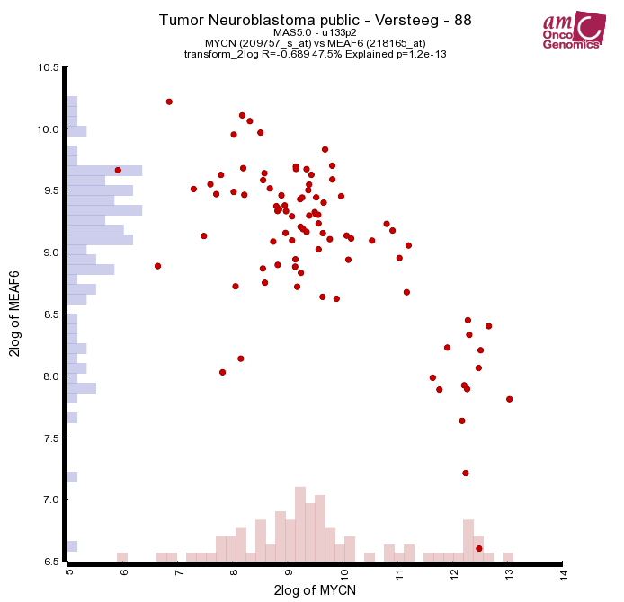
	
	[**Figure 7: Toggle Histogram**](_static/images/FindGenes_ExpressionHis.png)
	
4. Another nice way to visualize the gradient in gene expression levels in the XY-plot representation is to use the "Color by Gene" 		option by Color mode in Adjustable settings box. 

	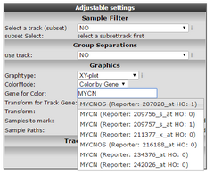
	
	[**Figure 8: Select Color by gene**](_static/images/Findgenes_ColorbyGene.png)
	
	Select in the "Color Mode" pull down menu the "Color by gene" option. In the next box enter the gene you want to use for 		coloring the dots reflecting the expression levels according to a gradient. Make sure that after entering  the gene name you 	 select  a probeset as well.
	
	
	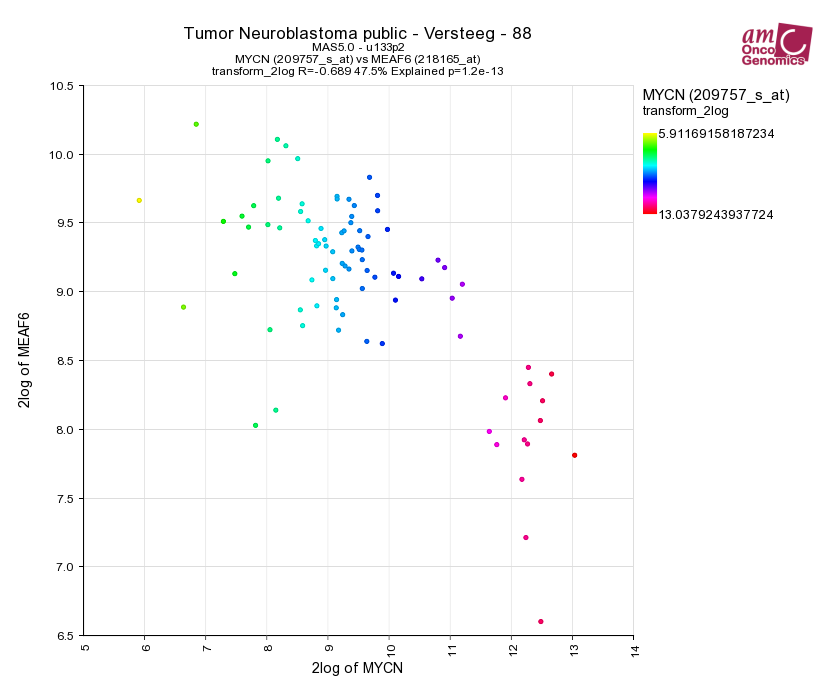
	
	[**Figure 9: Select Color by gene**](_static/imagesFindgenes_XYplotGeneColor.png)

5.  Through the menu to the right several additional dataviews and
    analyses are available. Let's start with different overviews; R2 is
    able to produce heatmaps of this analysis. Click on the 'Heatmap
    (zscore)' menu item Figure 8. The gene names are on the y-axis,
    sample names on the x-axis. Return to the genelist view (Figure 3)

	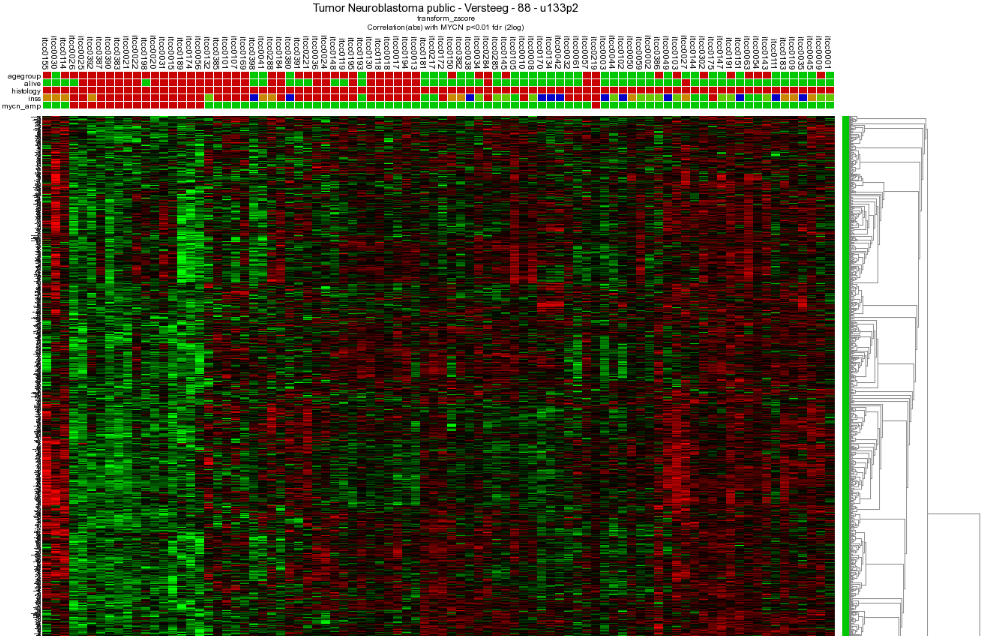
	
	[**Figure8: Heatmap view of the expression of all genes correlating with the expression of MYCN in 88 Neuroblastoma samples.**](_static/images/FindGenes_ExpressionHeat.png)
	

Step 5: Relation with Chromosome position
---------------

Another view is the mapping of these genes on all chromosomes. Click on
the 'Chromosome Map' menu item. In Figure 9 this mapping is depicted in
an overview. Sometimes, eyeballing already suggests that some regions
seem to be affected. R2 provides a table where the statistics behind
this analysis are given: Figure 10. The overrepresentation of genes that
correlate with MYCN expression with respect to all genes present on (an
arm of) a chromosome is calculated. You can also explore the results in the interactive R2 genome browser, where you can zoom into the results and locate individual genes. To enter this mode, just press the 'View in R2 genomebrowser' button.

  -------------------------------------------------------------------------------
  **Did you know that over-representation is explained here?**
>*Over-representation quantifies the notion that a subset of genes from a larger set can harbor more genes that have a certain characteristic than you would expect by chance. On the p-arm of chromosome 1 for example, there are 1157 genes located of the grand total of 21300 known genes. From our set of 2229 genes (only slightly more than 10% of the total number) some 210 are present on this arm. This is 18.2% ,an enrichment above what you would expect by chance. This can be quantified using a 2X2 contingency table with a chi-squared test that produces a p-value to establish whether this difference is significant*

-------------------------------------------------------------------------------

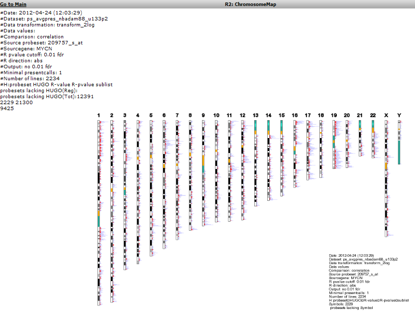

[**Figure9: Mapping of the genes correlating with MYCN on allchromosomes**](_static/images/FindGenes_Chromosome.png)

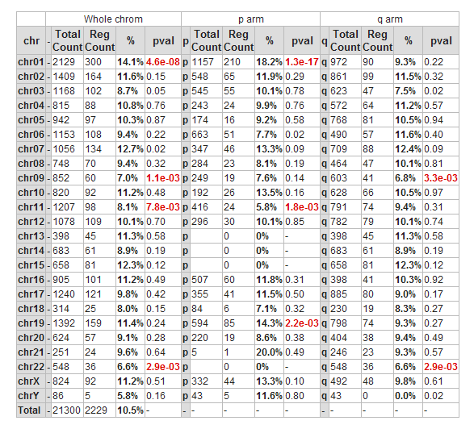

[**Figure10: Statistics of overrepresentation of genes that have a correlation with MYCN on different chromosomes**](_static/images/FindGenes_ChromeTable.png)

1.  To further explore this set of genes return to the list: Figure 3

Step 6: Establishing overrepresentation in other domains 
---------------

1.  Further overrepresentation analyses in other domains can give a
    first clue for processes that are of importance in this set
    of genes. A domain is the [Gene
    Ontology](http://geneontology.org/); a
    controlled vocabulary that systematically describes processes,
    locations and functions in biology. Click 'Gene Ontology analysis'
2.  The resulting categories are presented in a sortable table (Figure
    11), sort on p-value by clicking on the column header. Clickin on a pathway ID will open a new screen or tab with the heatmap of the selected pathway.
	    
	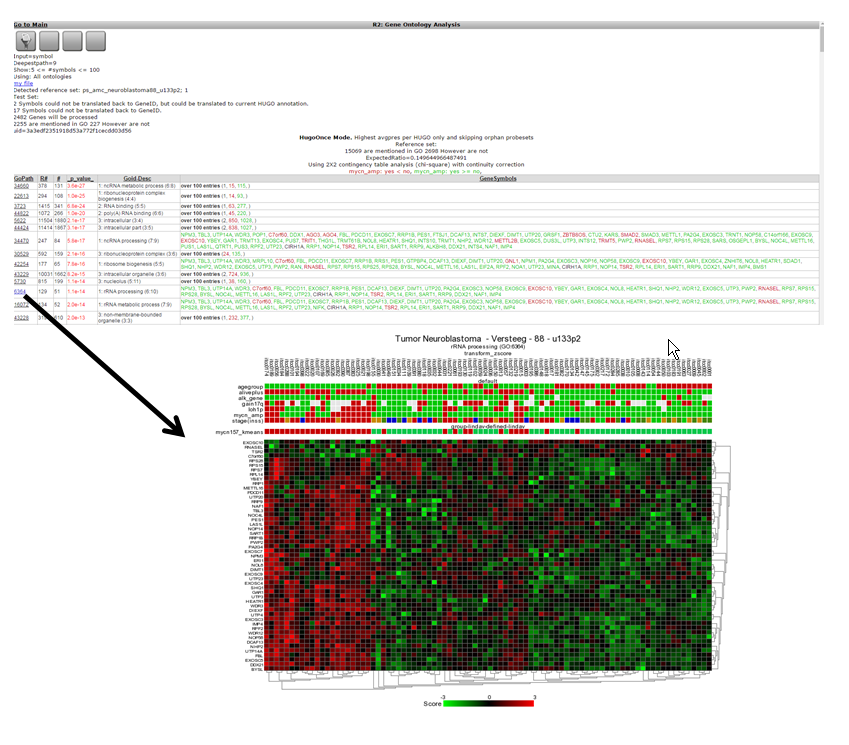
	
	[**Figure 11: Gene Ontology categories that are overrepresented in the set of genes that correlates with MYCN expression in the current dataset, sorted by increasing p-value of overrepresentation.**](_static/images/FindGenes_GeneOnto_v1.png)
	
3.  One of the categories where genes of our current set are
    overrepresented is 'DNA-strand elongation'; and what is also obvious
    that all genes in this process have a consistent positive
    correlation (as can be seen by the green color). Let's take a look
    if we can corroborate this observation in another domain.
4.  The adjustable panel settings menu allows you to redo the
    gene-ontology analysis with the up or down regulated genes only.

	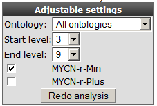
	
	[**Figure12: Re-do analysis with genes that are either positively or negativelycorrelated withMYCN.**](_static/images/FindGenes_Adjust.png)
	

Step 7: Gene list in pathway context
---------------

1.  Return to the gene list Figure 3 and click 'Map on pathway image'
2.  In the next screen a choice can be made for other datasets; we use
    the KEGG database. Click next.
    
	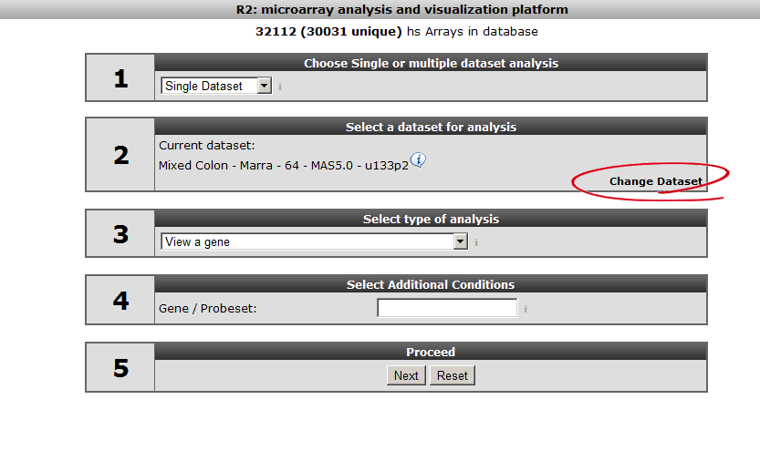
	
	[**Figure    13: Choice panel for other    datasets**](_static/images/First_image_select_dataset.png)
	
3.  A similar overrepresentation analysis is performed on all gene
    members of the pathways in the KEGG database. Click on the p-value
    column header again to find the most significant ones: Figure 14
    
	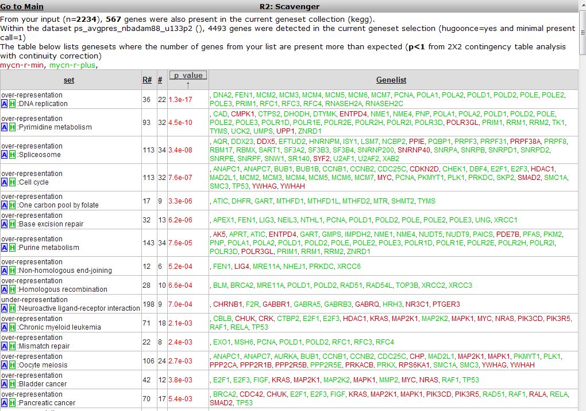
	
	[**Figure    14: KEGG pathways exhibiting an overrepresentation of genes of the    current dataset, ordered    by significance.**](_static/images/FindGenes_KeggPath.png)
	
4.  The DNA-replication pathway pops up as most significant. Note that
    most genes are similar to the GO process found in the
    former analysis. The pathway will be shown when the blue A in front
    of the pathway name is clicked.
5.  A hyperlinked KEGG pathway appears: Figure 15
	
	 in the MYCN
	correlating set on the DNA-replication pathway from the KEGG database. Hovering over the gene shows additional information")
	
	[**Figure 15: Mapping of the overrepresented genes (darker green) in the MYCN
	correlating set on the DNA-replication pathway from the KEGG database. Hovering over the gene shows additional information.**](_static/images/FindGenes_Pathway.png)
	
MCM-genes seem to play a role. Go back to list (Figure 3) to show their
individual relation with MYCN.

Step 8: Further pathways analysis
---------------

1.  Scroll down and look for the MCM2 gene, click on the link to show
    their relationship: Figure 16

    
	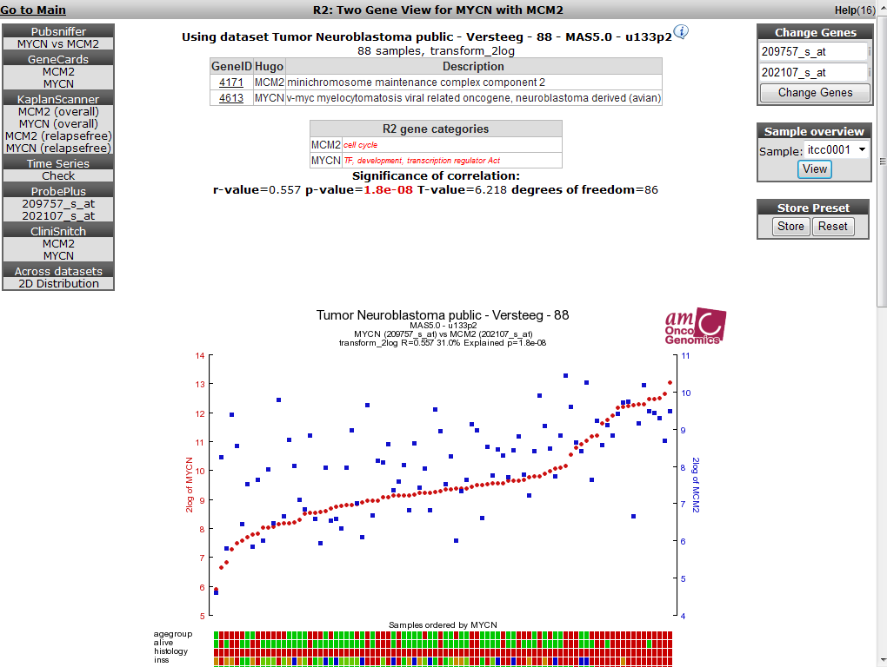
	
	[**Figure    16: MCM2 expression correlates with    MYCN expression.**](_static/images/FindGenes_MYCNMCM2.png)
	
2.  The correlation is significant. In the left upper table there is a
    link to the Pubsniffer tool within R2. This tool performs a live
    search in the Pubmed literature database for (co-)occurrences of
    MYCN and MCM2 (and some other keywords). Click the link: Figure 17
    
	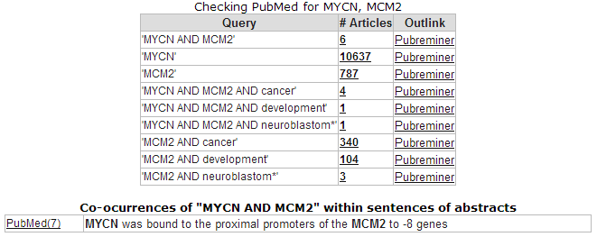
	
	[**Figure    17: Pubsniffer results for gene symbols MYCN and    MCM2**](_static/images/FindGenes_Pubsniffer.png)
	
3.  Apparently there are some abstracts where the two genes are
    mentioned together, you can view this article directly by clicking
    the hyperlinked number in the Articles column. The outlink
    Pubreminer column directs to the PubReminer tool:

	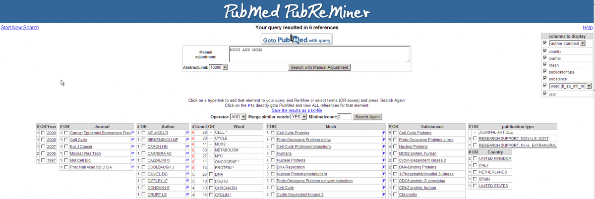

        [**Figure    18: The PubReminer tool web interface **](_static/images/FindGenes_Pubsniffer.png)
    

4.  This versatile tool offers quite some functionality to build a
    literature search query tailored to your needs. That being slightly
    out of scope of this tutorial, click the "Goto Pubmed with query"
    button to find the article.
5.  This article is actually published work by our group where the
    relation between the MCM genes and MYCN was proven experimentally.

	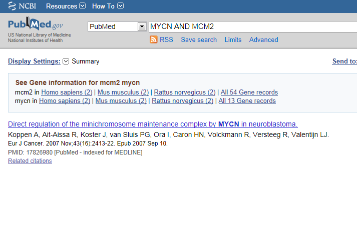
	
	[**Figure19: The correlation between MCM genes and MYCN was proven experimentallyin thisarticle.**](_static/images/FindGenes_PubReminerresult.png)
	

Step 9: Gene set analysis
---------------

1.  The genelist produced in the beginning of this tutorial (Figure 3)
    can be stored for use in later analyses in R2, or for use in
    other applications. Return to the page containing the list, this is
    still open in another tab in your browser.
2.  The menu to the right gives several possibilities (Figure 53). Some
    of these have been explored already; we'll touch shortly on the rest
    of them.

-   "Gene set analysis": use public genesets; this is further explored
    in the advanced Correlate with DataSet tutorial.
-   "Map on pathway image", "Chromosome map", "Gene Ontology analysis",
    "Heatmap" have been explored in this tutorial.
-   "MakeMeATable" produces a txt file that is formatted for direct
    input into the data analysis tool [TM4](http://www.tm4.org/mev.html)
-   "Save current selection as TXT file" produces a tab separated file
    containing the current analysis. In the header of such file all
    information is stored to be able to redo the analyses in the future.
-   Reference for current selection produces a list of probesets and
    genenames that are considered to be expressed in the
    current dataset. This is a suitable background set for eg. the DAVID
    tool
    [DAVID](http://david.abcc.ncifcrf.gov/)
-   Last but not least the data can be stored as a personal
    genecategory; this is further explored in the advanced tutorial
    "Adapting R2 to your own needs".

	
	
	[**Figure20: Menu choices forDataset**](_static/images/FindGenes_DatasetOptions.png)
	

Final remarks / future directions
---------------------------------

Based on this tutorial you can further explore R2 in the set of advanced
tutorials.

We hope that this tutorial has been helpful,The R2 support team.

