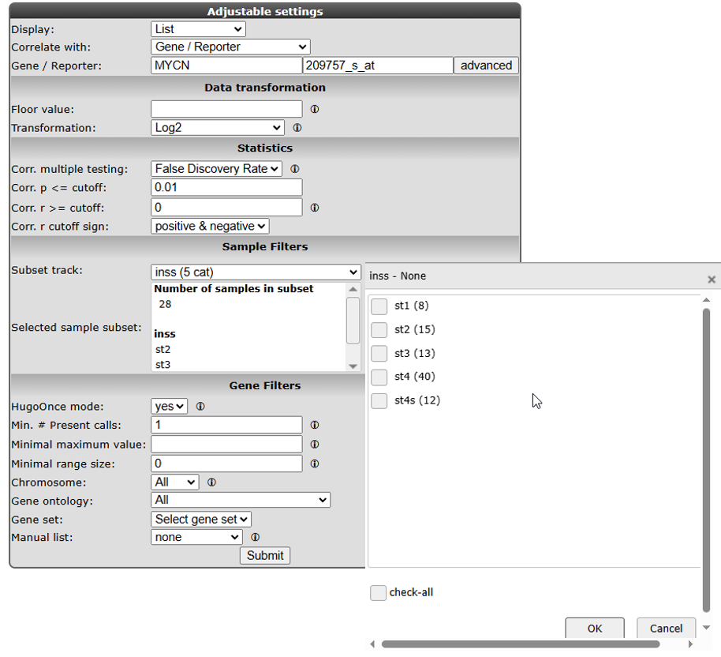

Find genes correlating with your gene of interest
=================================================

*Or how you can find genes that have similar or opposite expression
patterns in your dataset of choice*

Scope
-----

-   R2 allows you to explore the relations your gene exhibits with other
    genes in your dataset of choice; correlation statistics is used to
    calculate this.
-   The expression of a set of genes correlating with the expression of
    MYCN in a series of Neuroblastoma tumors is used to demonstrate that
    in this tutorial.
-   The results can be further explored in one-on-one graphs or as a
    heatmap.
-   The set of genes can be further explored statistically in several
    domains as will be shown in this tutorial:
    -   In a gene ontology analysis
    -   On pathway maps
    -   On a chromosome map
-   Using this exploratory analysis, new biologically relevant
    hypotheses can be generated and will be shown in this tutorial by an
    example concerning MYCN and MCM genes.
-   The data can be saved and used in other tools.
-   Further advanced analyses based on the use of sets of genes can be
    found in the Kaplan scanner and GeneSets tutorials.

Step 1: Selecting data
---------------

1.  Sign in to the R2 homepage using your credentials and make sure the
    *Single Dataset* option is selected in field **1** of the R2 step-by-step
    guide.
2.  Make sure the *Tumor Neuroblastoma public - Versteeg - 88 - MAS5.0 - u133p2* dataset is selected in
    field **2** (For additional information on these first two steps,
    consult Chapter 2; Using datasets).
3.  In field **3** select *Find Correlated genes with a single gene*
    (**Figure 1**) and click 'Next'.
4.  In the next screen, type 'MYCN' in the **Gene/Reporter** field and select the first reporter.
5.  Click 'Submit'.

    

    [**Figure 1: Choice of correlation analysis.**](_static/images/CorrelatingGenes/Correlatinggenes_findgene.png)

6. In the "Adjustable settings" panel, we set the p-value cut-off to 0.01 and leave the further settings at their default. Note in Figure 1 that you can select for both correlation directions or a single one. The p-value, r-value cut-offs and multiple testing can be adapted. 
 Scroll down the screen and click 'Submit .

------------------
**Did you know that you can find the correlation between two genes directly?**

>  *Just choose 'Correlate 2 genes' in the main menu in field 2 if you have a specific gene you want to correlate with your gene of interest. Of course this method would be rather tedious if you want to find new genes, hence we are exploring exactly this scenario in this tutorial. Another possibility is to correlate your gene with a track (containing numerical data). This essentially tests whether the expression of your gene of interest correlates with the numerical order described in the track. This scenario is further explored in the Chapter 6  "Differential expression of genes in your dataset".*

------------------

Step 2: Inspecting correlating genes
---------------

1.  R2 calculates the correlation of the expression of MYCN with the
    expression of every other single gene in the current dataset. A lot
    of calculations! The result is presented as two tables (**Figure 2**).
    In the header a summary is given: \~ 2200 combinations of MYCN and
    another gene met the criteria, i.e. having a significant correlation
    (**p < 0.01**) with the expression of MYCN, \~ 16000 genes did not
    obey these criteria. The left table represents the genes whose
    expression correlates positively, or is similar, to that of MYCN
    in this dataset. The right table represents the genes that have a negative reguation of MYCN, the expression of MYCN behaves opposite to that of
    these genes. Of course MYCN has a perfect correlation
    with itself. When hovering over the maynifying glass on the right side of the gene, some characteristics of the genes are already described
    R and p-values are given in separate columns (for a short
    description of their meaning, consult Chapter 6; "Differential expression of genes in your dataset").

    

    [**Figure    2: Genes whose expression correlate with that of the MYCN gene    in 88 Neuroblastoma    tumors**](_static/images/CorrelatingGenes/FindGenes_gotoadjust1a.png)

Exact (gene-) numbers listed in the tutorial, such as in this
example (2184 combinations), can vary. This is caused by database
updates upon a new genebuild release or from a commercial platform such as Affymetrix annotation update.

1.  At the bottom of the generated list , the "Adjustable settings" panel is located where the filter options can be adapted (**Figure 3**).
2.  A little table on the right side of the screen summarizes the results of a Mini
    Ontology analysis. This will be discussed in further detail in the subsequent steps where the menu items on the right will also be explored.
3.  By clicking the magnifying glass on the right side of the gene names, the speficis of the correlation can be explored in a separate graph; click on the magnifying glass of the APEX1 gene in the left column.

    

    [**Figure 3: Adjustable settings**](_static/images/CorrelatingGenes/FindGenes_filter.png)

Step 3: Inspecting correlation between specific genes
---------------

1. The resulting graph depicts the expression of both genes in this
    tumor series. The tumor samples are ordered by increasing
    MYCN expression. Note that the expression of APEX1 follows the
    expression of MYCN quite well! This is reflected in the R and
    p-values that are quite significant (**Figure 4**).

    

    [**Figure    4: The expression of the MYCN gene correlates with the expression of    the    APEX1 gene.**](_static/images/CorrelatingGenes/FindGenes_ExpressionPos_v1.png)

2. As an example of the opposite, click on one of the top genes in the
    right column (**figure 2**) for example; MEAF6. This produces Figure 5, which shows that MEAF6 reacts the opposite to MYCN. With a high MYCN expression there is a low MEAF6 expression and vice versa.

    

    [**Figure 5: The expression of MYCN has a negative correlation with that of    the MEAF6    gene**](_static/images/CorrelatingGenes/FindGenes_ExpressionNeg_v1.png)

3. To generate a correlation plot where the negative relationship between MYCN and the MEAF6 gene is more clearly visualized, select *XY-plot* as **Graph type** in the 'Graphics' section in the "Adjustable Settings" panel and click 'Submit'. You can also open the "plot options" panel by clicking the Gear-icon and the the **Graph type** to *XY plot* in the 'General' section. In this correlation plot it is also possible to show expression levels as a distribution. In order to do so, go to the "plot options" panel by clicking the Gear-icon click, go to the 'Extra' panel and tick the box next the **Histogram**. Now the histogram boxes in the X and Y axes show the distribution of the expression levels in the correlation plot (**Figure 6**). In the green bar located above your graph you can easily click through your generate    list instead of going each time to the list to inspect your genes.

    

    [**Figure 6: Toggle Histogram**](_static/images/CorrelatingGenes/FindGenes_ExpressionHis1a.png)

4. Another nice way to adjust the graphical representation of a XY plot is by using the gene expression levels 
   and applying these to a color gradient. This can be done in the "plot options panel" by adjusting the **Color mode** to *Color by a Gene* and chosing either *MEAF6* or *MYCN* as the **Reporter NAME/ID** (**Figure 7**). 

   

   [**Figure 7: Select Color by gene**](_static/images/CorrelatingGenes/Findgenes_ColorbyGene1c.png)

Changing the color of the dots can also be done in the "Adjustable settings"panel. Change the **Color Mode** to *Color by Gene* and enter the gene you want to use for coloring the dots in the **Gene/Reporter** box. Make sure that after entering the gene name you also select a corresponding probeset and click 'Submit'. In this example the reporters of the MYCN vs MEAF6 are plotted and subsequently colored by the MEAF6 expression levels (**Figure 8**). Multiple color schemes can be selected for the gradient. Of course, you can also enter another gene for coloring the dots.

   

   [**Figure 8: Select Color by gene epression**](_static/images/CorrelatingGenes/Findgenes_XYplotGeneColor_v1b.png)

5. Another way to visualize the relationship of the expression correlation in an XY plot is to switch on the linear
   fit option. This can be done by clicking the Gear-icon to open the "plot options" panel, go to the 'Extra' tab and tick the box next to **Linear Fit**. This will create an image like Figure 9. 

   

   [**Figure 9: Select Linear fit**](_static/images/CorrelatingGenes/FindGenes_linearFitAdjust1c.png)

6. It could be that you encounter a correlation plot for two genes where you can distinguish two clusters. One group of
   the samples seems to form a cluster with a positive correlation and a second cluster seems to have an inverse 
   correlation. An example, which is not directly listed in the previous list of correlating genes, is the
   relationship between MYCN and GATA2. In the "Adjustable settings" panel enter *MYCN* as the **Gene/Reporter 1** and *GATA2* for **Gene/Reporter 2** and click 'Submit'. Change the **Color mode** to *Color by track* and select *mycn_amp* as **Color track**. Open the "plot options" panel and tick the boxes next to **Add Boxplot per group**, **Linear fit** and **Histogram** (**Figure 10**). 
   
   

   [**Figure 10: Linear fit adjust**](_static/images/CorrelatingGenes/FindGenes_linearFittwogroupsadapt1b.png)

8. In de next figure, the trend line clearly illustrates that there is positive correlation for the MYCN non-amplified group and a negative correlation for the MYCN amplified group (**Figure 11**).

   

   [**Figure 11: Linear fit per track**](_static/images/CorrelatingGenes/FindGenes_LinearFittwogroups1a.png)

9. Return to the browser tab which contains the results of the correlation analysis (**Figure 2**). On the right side of this screens, several additional dataviews and analyses are available. One of the overviews that R2 is able to produce is the heatmaps of this analysis. Click on the **Heatmap (zscore)**, this will open a new window which shows the heatmap of the correlation analysis. Here, the gene names are on the y-axis and the sample names on the x-axis. Below the heatmap, there is a "Adapt the heatmap" panel, which gives you multiple options to adjust the view of the heatmap. For example, you can select to only show the *negative correlation* or the *positive correlation*, select the displayed tracks and change the **Color scheme**. 

    

    [**Figure 12 : Heatmap view of the expression of genes (P < 0.0005) correlating with the expression of MYCN in 88 Neuroblastoma samples.**](_static/images/CorrelatingGenes/FindGenes_ExpressionHeat_v1.png)

Step 4: Relation with Chromosome position
---------------

Another possible view is the mapping of these genes on all chromosomes. 

1. Return to the correlation analysis (**Figure 2**) and click on **Chromosome Map** in the panel on the right side.
2. This will return both an representation in a table (**Figure 13**) as well as an overview of the mapping (**Figure 14**) of the overrepresentation of genes that correlate with MYCN expression with respect to all genes present on (an
arm of) a chromosome is calculated. Sometimes, eyeballing already suggests that some regions
seem to be affected. R2 provides a table where the statistics behind
this analysis are given. You can also explore the results in the interactive R2 genome browser, where you can zoom into the results and locate individual genes. To enter this mode, just press the **View in R2 genomebrowser** button in the "Adjustable settings" panel.

-------------------------------------------------------------------------------
**Did you know that over-representation is explained here?**
>*Over-representation quantifies the notion that a subset of genes from a larger set can harbor more genes that have a certain characteristic than you would expect by chance. On the p-arm of chromosome 1 for example, there are 1157 genes located of the grand total of 21300 known genes. From our set of 2229 genes (only slightly more than 10% of the total number) some 210 are present on this arm. This is 18.2%, an enrichment above what you would expect by chance. This can be quantified using a 2X2 contingency table with a chi-squared test that produces a p-value to establish whether this difference is significant.*

-------------------------------------------------------------------------------

[**Figure 13: Statistics of overrepresentation of genes that have a correlation with MYCN on different chromosomes**](_static/images/CorrelatingGenes/FindGenes_ChromeTable.png)

[**Figure 14: Mapping of the genes correlating with MYCN on allchromosomes**](_static/images/CorrelatingGenes/FindGenes_Chromosome.png)

Step 5: Establishing overrepresentation in other domains
---------------

To further explore this set of genes return to the gene correlation list (**Figure 2**). 

1.  Further overrepresentation analyses in other domains can give a
    first clue of the processes that are of importance in this set
    of genes. A domain is the [Gene
    Ontology](http://geneontology.org/); a
    controlled vocabulary that systematically describes processes,
    locations and functions in biology. Click **Gene Ontology analysis** in the panel on the right side. 
2.  The resulting categories are presented in a sortable table. It is possible to sort on **p-value** by clicking on the column header. Clicking on a pathway ID will open a new screen or tab with the heatmap of the selected pathway (**Figure 15**).

    

    [**Figure 15: Gene Ontology categories that are overrepresented in the set of genes that correlates with MYCN expression in the current dataset, sorted by increasing p-value of overrepresentation.**](_static/images/CorrelatingGenes/FindGenes_GeneOnto_v1.png)

3.  One of the categories where genes of our current set are
    overrepresented is *DNA strand elongation*. All genes in this process have a consistent positive
    correlation (as can be seen by the green color). Let us take a look to see
    if we can corroborate this observation in another domain.
4.  At the bottom of the page in the "Adjustable settings" panel, the gene-ontology analysis can be redone with only the up or downregulated genes by ticking the box (**Figure 16**).

   

   [**Figure 16: Re-do analysis with genes that are either positively or negatively correlated with MYCN.**](_static/images/CorrelatingGenes/FindGenes_Adjust1b.png)

Step 7: Gene list in pathway context
---------------

1. Return to the gene correlation list (**Figure 2**) and click **Geneset analysis**. Select the *KEGG pathway* in the **Gene set selection** pull down and click 'Next'. 

2. A similar overrepresentation analysis as the gene ontology analysis is performed on all gene
    members of the pathways in the KEGG database. The genes are automatically sorted by p-value, with the most significant at the top (**Figure 17**).

    

    [**Figure    17: KEGG pathways exhibiting an overrepresentation of genes of the    current dataset, ordered    by significance.**](_static/images/CorrelatingGenes/FindGenes_KeggPath1a.png)

3. The DNA-replication pathway pops up as most significant. Note that
    most genes are similar to those found by the GO process in the
    former analysis. The pathway will be shown when the blue **A** in front
    of the pathway name is clicked (**Figure 18**).

 in the MYCN
    correlating set on the DNA-replication pathway from the KEGG database. Hovering over the gene shows additional information")

[**Figure 18: Mapping of the overrepresented genes (darker green) in the MYCN
    correlating set on the DNA-replication pathway from the KEGG database. Hovering over the gene shows additional information.**](_static/images/CorrelatingGenes/FindGenes_Pathway.png)

MCM-genes seem to play a role. Go back to the gene correlation list (**Figure 2**) to show their
individual relation with MYCN. However, it is important to realize that the KEGG pathway interactions are build on Protein-Protein interactions, Enzyme-Substrate Interactions, Protein-DNA Interactions, Protein-Compound Interactions etc etc and the genelist from this module is baed on RNA expression levels only.   

Step 8: Further pathways analysis
---------------

1.  In the gene correlation list (**Figure 2**), scroll down or sort first and look for the MCM2 gene, click on the maynifying glass in front of the gene name to show their relationship (**Figure 19**).

	
	
	[**Figure 19: MCM2 expression correlates with MYCN expression.**](_static/images/CorrelatingGenes/FindGenes_MYCNMCM2_v2.png)

2.  The correlation is significant. In the right upper table there is a
    link to the **Pubsniffer** tool within R2. This tool performs a live
    search in the Pubmed literature database for (co-)occurrences of
    MYCN and MCM2 (and some other keywords). Click on **Pubsniffer** to get the results (**Figure 20**).

    

    [**Figure    20: Pubsniffer results for gene symbols MYCN and    MCM2**](_static/images/CorrelatingGenes/FindGenes_Pubsniffer.png)

3.  Apparently there are some abstracts where the two genes are
    mentioned together, you can view this article directly by clicking
    the hyperlinked number in the Articles column. The outlink
    Pubreminer column directs to the PubReminer tool:

    

    [**Figure   21: The PubReminer tool web interface**](_static/images/CorrelatingGenes/FindGenes_Pubsniffer.png)

4.  This versatile tool offers quite some functionality to build a
    literature search query tailored to your needs. That being slightly
    out of scope of this tutorial, click the **Go to Pubmed with query**
    button to find the article.
5.  This article is actually published work by a collaborting group where the
    relation between the MCM genes and MYCN was proven experimentally.

    

    [**Figure 23: The correlation between MCM genes and MYCN was proven experimentally in this article.**](_static/images/CorrelatingGenes/FindGenes_PubReminerresult.png)

Step 9: Gene set analysis
---------------

1.  The genelist produced in the beginning of this tutorial (**Figure 2**)
    can be stored for use in later analyses in R2, or for use in
    other applications. Return to the gene correlation list (**Figure 2**). 
2.  The menu to the right gives several possibilities. Some
    of these have been explored already; we will shortly touch on the rest
    of them.

-   "Gene set analysis": use public genesets; this is further explored
    in the advanced Chapter 14 'Using genesets and creating heatmaps in R2' tutorial.
-   "Map on pathway image", "Chromosome map", "Gene Ontology analysis",
    "Heatmap" have been explored in this tutorial.
-   "MakeMeATable" produces a txt file that is formatted for direct
    input into another data analysis tool such as  [TM4](https://webmev.tm4.org/#/about).
-   "Save current selection as TXT file" produces a tab separated file
    containing the current analysis. In the header of such file all
    information is stored to be able to redo the analyses in the future.
-   Reference for current selection produces a list of probesets and
    genenames that are considered to be expressed in the
    current dataset. This is a suitable background set for eg. the DAVID
    tool
    [DAVID](https://davidbioinformatics.nih.gov/).
-   Last but not least, the data can be stored as a personal
    genecategory with the "Store result a custom geneset" this is further explored in the advanced chapter 23
    "Adapting R2 to your own needs" turotial.

Final remarks / future directions
---------------------------------

Based on this tutorial you can further explore R2 in the set of advanced
tutorials.

Everything described in this chapter can be performed in the R2: genomics analysis and visualization platform (http://r2platform.com / http://r2.amc.nl).

We hope that this tutorial has been helpful,  
the R2 support team.

