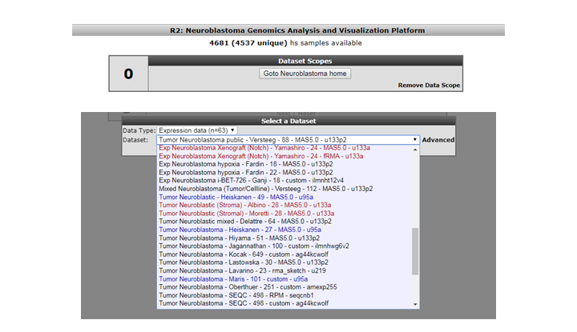
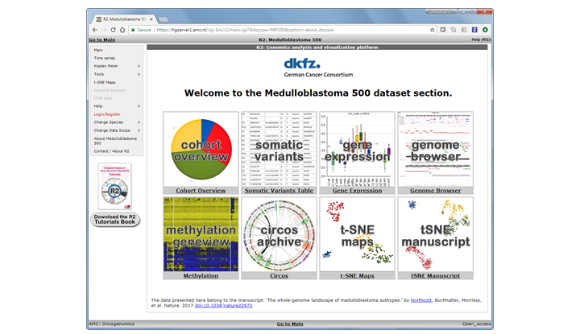

DataScopes
===================

*Quick jumps to (dedicated) analyses and visualizations in R2*

Scope
-----

-   Use data scopes to restrict data sets to a particular subject
-   Use data scopes as a landing page for a specific publication / subject

Step 1: Selecting a dataset restrictive DataScope
---------------

1.  DataScopes are represented in the left menu structure in R2 in the item named 'Change Data Scopes'.
Scopes can be grouped by different 'types' like 'paper' or 'tumor type'. Depending on your account access
more restricted scopes can be represented in your account. We will start by selecting a 'dataset'
restriction Scope by clicking on 'tumor' > 'neuroblastoma'.
    
	
	
	[**Figure    1: Selecting a Data Scope.**](_static/images/DataScope_select_a_datascope.png)
	

2.  You may notice that the 'title' of the platform now includes 'neuroblastoma'. Furthermore, the number
of samples that you have access to has now greatly decreased. That is, because you will now only look at
datasets that we 'annotated' as neuroblastoma. This data scope can be great if you only wish to see data
sets of a specific entity (that we have also defined). If you now want to select a new dataset, then you
will note that you can only select neuroblastoma assets. In analyses like '2D distribution', a restrictive
data scope will also be applicable there.
    
	
	
	[**Figure    2: This Data Scope restricts the resources to Neuroblastoma only.**](_static/images/DataScope_resources.png)
	

Step 2: Selecting a Data Scope with a landing page
---------------

1.  In the first example, the DataScope did nothing more than restrict the resourses at your disposal, which
can be handy for quick selections. A DataScope can become much more interesting if it has also got a 'landing page'
associated with it. In the next example, we will make use of a datascope that belongs to a manuscript on the analysis
of 500 whole genomes of medulloblastoma (Northcott et.al. Nature 2017). Select 'medulloblastoma 500' from the 'paper'
group in the Data Scopes menu.

2.	We can go to the 'landing page' for this data scope by either clicking on the button 'Goto Medulloblastoma 500 Home'
in Box 0, or click on the 'About Medulloblastoma 500' item near the end in the left menu.
	
	
	[**Figure    3: Landing Page for Medulloblastoma 500.**](_static/images/DataScope_mb500_1.png)
	
3.  Within a landing page 'tiles' are defined that will quickly bring you to specific analyses and or visualizations in R2.
These 'hotlinks' can be associated with advanced settings, and a such make the usage much easier. In the current Data Scope
you can eplore the genomics data for the 500 samples by investigating the annotation in the 'cohort overview', or check somatic
mutation status in the 'somatic variants' tile, etc. Most of these analyses can also be found / accessed via the main interface
while very specific ones may only be provided in the scope. Here the 'tSNE manuscript' would be an example of the latter. 

This chapter only serves to explain the basic usage of a data s cope. As you may realize, every scope can have many different options
and analyses associated with it, which goes beyond what we can document here. Just have a look at the available scopes once in a while
to discover what has been added, or make sure to follow our facebook page whare we make announcements on this as well.

Final remarks / future directions
---------------------------------

Some of these functionalities have been developed recently. If you run
into any quirks or annoyances don't hesitate to contact r2 support
(r2-support@amc.uva.nl). If you may have an idea for another data scope or would like to showcase your own data in this way,
then also please get in contact with us via the support address.

We hope that this tutorial has been helpful, the R2 support team.

