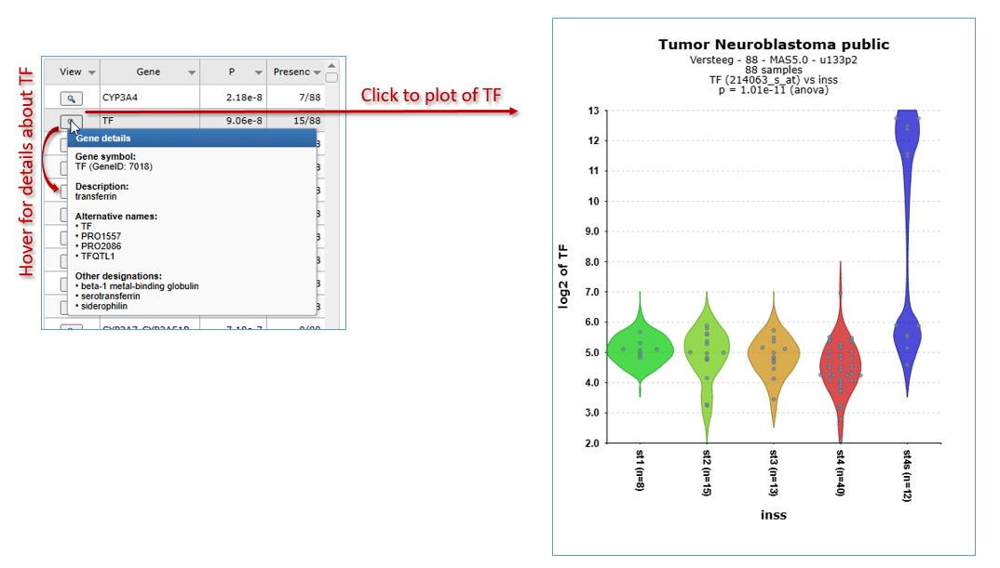

Differential expression of genes in your dataset
=======================================

*Find out which genes make a difference between groups of samples in
your dataset*

Scope
-----

-   Use R2 to determine whether the expression of your gene of interest
    is significantly different between groups of samples (step 1 to 5)
-   Use R2 to find all genes exhibiting differential expression between
    groups of samples in a dataset (step 6)
-   This is established by use of statistical tests. R2 will guide you
    through this process in a self-explanatory way
-   In order to enable assignment of samples to groups, proper annotation of the dataset is required. In this tutorial a set of neuroblastoma tumors is used that is annotated with several clinical parameters:
    survival, age of diagnosis, etc.
-   All (advanced) parameters can be adapted to your specific needs
-   In separate boxes these settings will be elaborated upon
-   The results of these analyses are presented in adaptable graphics

Step 1: Selecting data and gene
---------------

1.  Logon to the R2 homepage using your credentials and make sure the
    "Single Dataset" field is selected in field 1
2.  Make sure the Tumor Neuroblastoma public dataset is selected in
    field 2 (see chapter 1 of the tutorial for more information about the selection of a dataset)
3.	Choose "View a Gene in groups" in field 3.
4.  Type MYCN as gene (see Figure 1) in field 4.
5.  Click "next" in field 5.

	
	
	[**Figure 1: Step-by-step scenario to select 'View a gene in groups' on the main page of R2**](_static/images//FindDiff/DifferentialExpression_Genev1.png)
	

Step 2: Choose annotation track as grouping variable
---------------

----------------
  ***Did you know that you can create your own tracks?***

  *This is explained in a separate tutorial [Adapting R2 to your needs](DifferentialExpression_Select.png)
  Datasets are listed alphabetically*

------------------

1.  In the next screen you will decide which grouping variable to use to
    establish the differential expression of your gene of interest. In
    R2 the so called "tracks" contain this annotation. For the current
    dataset there is a track called "alive" containing survival data of
    the patients from whom the tumor sample was taken. Select this
    (Figure 2). Note that the other fields can be kept as is, the right
    choices are already provided. Note also that the proper reporter
    probeset is already selected.
2.  Click "next"

	
	
	[**Figure 2: Selecting the proper annotation track to differentiate expressiondata**](_static/images/FindDiff/DifferentialExpression_Select.png)
	
3.  In the next window a selection of the groups can be made. Only the
    selected group(s) will be displayed in the graph; the "one way
    Anova"/"student T test" test will be performed for data on the selected
    groups ( see explanation in the next step). In this case we
    want to see both groups so keep the selection as is.
    
	
	
	[**Figure 3: Selecting groups for the graph**](_static/images/FindDiff/DifferentialExpression_Selectgroup.png)
	
4.  Click "next"

Step 3: Anova results / adapting plots
---------------

R2 now performs a one-way Anova statistical test on the fly. This **AN**alyis **O**f **VA**riance is a statistical test that calculates whether the means of variables differ between two or more groups. In the case of 2 groups, this is identical to the student T-test. ANOVA can be considered a sound test when the variables are normally distributed and samples are independent. More information can be found here: <http://en.wikipedia.org/wiki/One-way_ANOVA>. A simple example calculation can be found here: <http://en.wikipedia.org/wiki/F_test#One-way_ANOVA_example>.  

1. Check the graph and the information that is displayed above in the resulting window. For a nicely ordered graph, you can adjust the settings in the menu below to "Track and Gene Sort" (Don't forget to click on Adjust Settings afterwards!). R2 displays the mRNA expression of the samples in a splitted plot in which per group the samples are ordered with increasing expression (Figure 4). Note that the "alive" annotation is in the second row (track) beneath the graph. The actual result of the ANOVA calculations is shown above the graph; the difference in average expression between the two groups is significant. These results can also be shown in a more conventional bar-plot by adapting the settings and redrawing the graph.
   

   [**Figure 4: Result of the one-way Anova test for the Neuroblastoma 88 samples.**](_static/images/FindDiff/DifferentialExpress_Result.png)

2.  Scroll down the window
3.  Adapt the selection in the dropdown box 'Graphtype' to a other graphtype and to 'Color by Track'
4.  Click 'Adjust Settings' (Figure 5). The resulting graph is adapted accordingly 

	
	
	[**Figure 5: Adapting the Graphtype to BarPlot and set Color by Track**](_static/images/DifferentialExpression_AdaptGraph.png)
	

   
	
   [**Figure  6: The same data now represented in a bar/box plots**](_static/images/FindDiff/DifferentialExpression_Barplotv1.png)

The difference can be shown more dramatically by plotting the data without a log2 transformation. Make sure to use log2 transformation in scientific reports, though, as none-transformed mRNA gene expression data is hardly ever normally distributed.

1. Scroll down in the window
2. In the 'Adjustable settings' dialog, set the 'Transform' dropdown to 'none' (Figure 7)
3. Click 'Adjust Settings'
4. The resulting 2 graphs also depicted in different types of plots in Figure 6 shows the difference between the expression values in the two groups more dramatically.

------------------
**Did you know that samples can be filtered and/or marked?**

*Under the sub-header "Sample Filter" you can select a specific subset of samples based on the annotation on track. The analysis will only be performed on the selected subset. Clicking the wheel icon will open a grid supporting all selection combination of interest*
 
*Filtering and marking samples: keep in mind that you can repeat the filter procedure on top of the previous one.  The extra graph option allows the users to select different graphical representations. In the samples to mark section, a sample name can be entered that will be highlighted in the resulting graph; ideal for publication purposes.*

[**Figure 7: Adjusting menu**](_static/images/DifferentialExpress_BarplotAdjustv1.png)

--------
Step 4: Finding differentially expressed genes in two groups
---------------

1. It would be a pretty tedious job to look for all genes whether they
    are differentially expressed between groups. Why not let R2 do the
    job for you? Go back to the Main screen, by clicking the link in the
    upper left corner of the screen.
2. In field 3 of the R2 step-by-step guide you find two options to find differential expressed gene lists.
3. In the analysis drop down menu you will find 'Find Differential expression between two groups' and  Differential expression between multiple groups (Figure 8). Both types of Differential expres modules harbor specific statistical tests. Depending on your choosen dataset , number of groups you want to test and the type of data (RNAseq,microarrays) you can choose from several statistical tests. 
    
    
	
    [**Figure 8: Selecting Find Differential Expression.**](_static/images/FindDiff/DifferentialExpression_Selectgroups)
	
4. Select **"Differential expression between two groups" and** click next.
5. Here you can select several types of statistical tests which are present in the selection menu. By default the T-test is selected. Which test is suitable for a given dataset, depends on the normalization of selected dataset and on what kind of data the dataset is build of.   Most expression sets are continuous and normally distributed data so the T-test is the most applicable , in case of a dataset which contains catigorical data the Mann-whitney test is more suitable. A special remark for de DESeq2 algorithm is at place here, this test is only avaible for RNAseq data which also contains the un-normalised counts.   Most of the datasets which have DESeq_rlog in the name consist of a normalised data part in case you want to use the T-test and a part with the counts so the DESeq2 algorithm can be applied to run the test. Note that the counts are only used for the test, the values depicted in the graphs etc etc etc are always normalized data.

6. Using the DESEq2 algorithme in case of rnaseq is often appriciated since this is a well established statistical test package dedicated to data such als **rnaseq data**. In the dataset selection grid box you can search for datasets which have **deseq2_rlog** or **deseq2_vst**  as normalization procedure. Datasets with this annnotation have three slots, rlog normalized data, deseq normalized data and a counts slot. This count slot is used when you run the deseq2 algorithm on the fly for two group comparisons.

   

   [**Figure 8: Selecting Find Differential Expression.**](_static/images/FindDiff/DifferentialExpress_deseq2select.png)

Step 5 Setting parameters
---------------

1.  In the next window there appear quite a few choices for setting the
    statistical parameters for this analysis. Luckily only one setting is of
    real immediate importance; selecting the track of choice (shown
    in red). The samples will be divided by the groups this track provides.  
    Select the 'alive' track again.
    
	
	
	[**'Figure 9: Differential expression parameters**](_static/images/FindDiff/DifferentialExpress_AdaptParamv1.png)
	
2.  Click "next"
3.  DifferentialExpress_AdaptParamv2.png

	
	
	[**Figure 10: Progress dialog during on the fly calculation**](_static/images/DifferentialExpress_Progress.png)
	
	The result is a list of genes that is ordered for having the most significant differential expression between the groups you chose (Figure 12). A short summary of the calculation is given above the table; \~ 2600 genes have met the criteria set by default; their expression exhibits a correlation with the separation in the two groups.  The generated list can be sorted according the the column headers in the grid such als p-value and the log2 foldchange (Log2FC). In the right menu numerous moduels kan be selected to continue the analysis. Also the generated list can be extracted to continue for further usage outside R2.

	

	[**Figure 11: Genes differentially expressed between groups.**](_static/images/DifferentialExpress_Genelist.png)

	
--------------------------------------------------------------------------
  ***Did you know that...***

  *Very useful background information for this tutorial can be found in Chapter 25 [Concepts of R2: did you know..?](Did_You_Know.md)*
    
  *Check it out:*

>  **What were those R and p-values again?**:  R is the correlation coefficient; it ranges from -1 to +1, if R > 0 the value of two variables tends to increase or decrease together... Read all about R & p-values [Chapter 25](Did_You_Know.md)
>
>  **You can specify the preferred statistical test and choose a subset of genes?**
> *Use any (combination) of the following parameters to adapt the analysis to your needs.*  
> - **Hugo Once (hugoonce)**: *For most analysis genes should only be reported once in a dataset. R2 uses an algorithm called Hugoonce to choose a single probe-set to represent a gene. Scroll down in [Chapter 25](Did_You_Know.md) to the Settings section about Hugo Once.*
> - **Statistics panel**: *R2 determines p-values for the differential expression of genes by performing either a one-way anova (default setting) or alternatively a brute-force t-test on any combination of groups when the data is untransformed or log2 transformed. For rank-transformed data, a Kruskal Wallis test is performed. Besides these statistical tests, users can also ask for genes with a certain fold change or obtain a top-X list of the genes which are ordered by a user-specified test.*
> - **Correct for multiple testing**: *We are testing a lot of genes here; so we have to correct for multiple testing. Why? Read on about multiple testing in [Chapter 25](Did_You_Know.md)*
> - **Gene Filters:** *As for many analyses in R2, the gene filters allow you to study a specific subset of genes for differential expression. There are several domains you can choose from. Learn more about gene filters in [Chapter 25](Did_You_Know.md)*

 *Of course, to really get familiar with these settings you should not only read about, but also toy around with them!*

-----------------

Step 6: Find differential expression in multiple groups.
---------------

As mentioned above,  Find Differential Expression for multiple groups can also be applied  with a slightly different "Adjustable settings menu" and including other types of statistical tests.

1. Select **"Differential expression between multiple groups" and** leave all the settins at their default click next.

2. 

   [**Figure 11: Genes differentially expressed between groups.**](_static/images/FindDiff/DifferentialExpress_AdaptParamv2.png)

3. A list of Differential expressed gene between de groups is generated of course without the Log2 foldchange and group columns.

-----------------
Step 7: Inspecting single gene
---------------

1.  Click on the magnify symbol in the list next to the gene name. 
2.  A similar graph as produced for MYCN appears, the differential
    expression is more pronounced for this gene (Figure 14). In the
    generated picture the genes are not ordered for their gene
    expression go to the adjustable settings menu and select "Track and
    gene sort" in the "Extra Graph Option" pulldown menu. Click
    "adjust settings".

[**Figure 12: In the main screen *Changedataset*.**](_static/images/FindDfiff/DifferentialExpress_TopGene.png)

--------------
Step 8: Plot all genes and adapt visualization: Volcano plot etc
---------------

1.  The tab with the list of differentially expressed genes (Figure 11) is still open. Click on this tab.
2.  Most of the functionalities in the right panel of this window will be explored
    in more advanced tutorials (K-Means clustering etc). We'll explore one
    additional data visualization however to plot all genes of this
    analysis. In the right menu click see Figure 11 'Plot all genes (xy,
    volcano, etc)'.
    
	

2. The resulting plot shows all genes of the list in a XY-plot; datapoints above and below the diagonal are
    differentially expressed. Hovering over the points shows the
    genesymbol, in this case the NTRK1 gene (Figure 16). To speed up the
    graph generation this information is not automatically loaded: click
    on the "add hovering" button below the graph to add
    this information. Note: every plot in R2 with larger amounts of
    datapoints (>5000) will have this "add hovering" button.

    
	
    [**Figure 13: XY plot of all genes differentially expressed in the current    track;**](_static/images/FindDiff/DifferentialExpress_XYplot.png)
	
3. Clicking on the datapoint in the plot opens up a new window showing the expression
    of the gene in the two groups as a box plot.
    
    
	
    [**Figure 14: Differential expression of    NTRK1**](_static/images/FibdDiff/DifferentialExpress_BoxdotplotCircle.png)
	
4. R2 allows further annotation of the XY plot of all genes; in the XY
    plot window (still open in your browser) scroll down and adapt the
    settings; add a genesymbol to mark, eg AKR1C1; choose a KEGG pathway
    to emphasize, eg DNA replication and set the 'Draw fold lines'
    option to 'yes'.
    
    
	
    [**Figure 15: Adjustable settings for the all genes    plot**](_static/images/DifferentialExpress_AdjustAllgenes.png)
	
5. Click redraw image. The plot has been adapted to show the AKR1C1
    genesymbol, DNA-replication genes are highlighted in red. Fold
    change lines show the regions where differential expression is 1 and
    2 fold (Figure 19). Note that most genes of the DNA replication
    pathway seem to be located below the diagonal.
    
    
	
    [**Figure 16: Adjusted visualization of gene expression,hovering over the dots    shows the    gene name.**](_static/images/DifferentialExpres_graphtypes.png)
	
6. R2 can visualize the same data also as a Volcano plot or an MA plot.
    In the Adjustable Settings dialog change the Plot type to Volcano or
    MA (Figure 19). Note that the distinct
    characteristics of the AKR1C1 gene and the DNA replication are more
    obvious in the Volcano plot. The DNA replication pathway statistics
    will be explored in more detail in the 'Find genes correlating with
    your gene of interest'-tutorial

-------------------------------------------
  **Did you know that you can tailor visualization of specific genes in one go?**
>  *You can annotate gene names (gene symbols) by providing them in the 'Mark genes' field of the Adjustable Settings panel. By default, these will appear in red, size=10, on your plot. You can change the size and/or color of these genes either individually, or in groups.* 
>
> *Please take note of the following rules: to mark groups of genes for which the same criteria apply,
first type the genes (comma separated), followed by :s=size, followed by :c=r,g,b  
for single genes: gene1:s=25:c=0,0,255;gene2:s=20:c=200,0,0  
for groups of genes: (gene1,gene2,gene3):s=25:c=0,0,255;(gene4,gene5,gene6):s=20:c=200,0,0"*

-------------------------------

Final remarks / future directions
---------------------------------

This tutorial has shown you how to find genes that are differentially
expressed in your dataset of choice. Now go ahead and toy around with
selecting groups and tracks of choice and see what interesting
scientific discoveries might lie ahead!

We hope that this tutorial has been helpful, the R2 support team.

