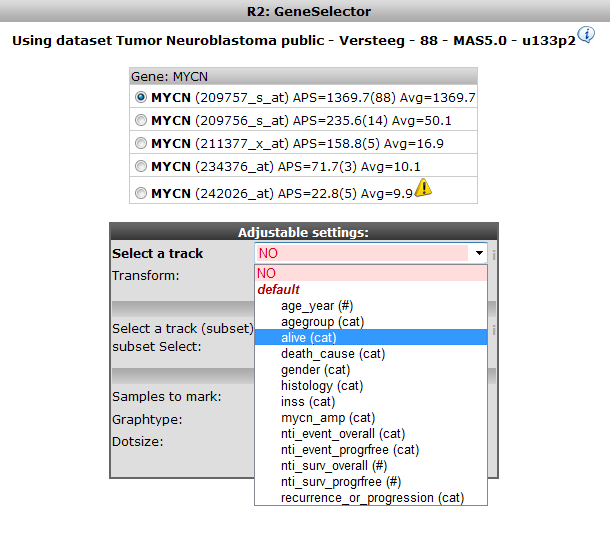
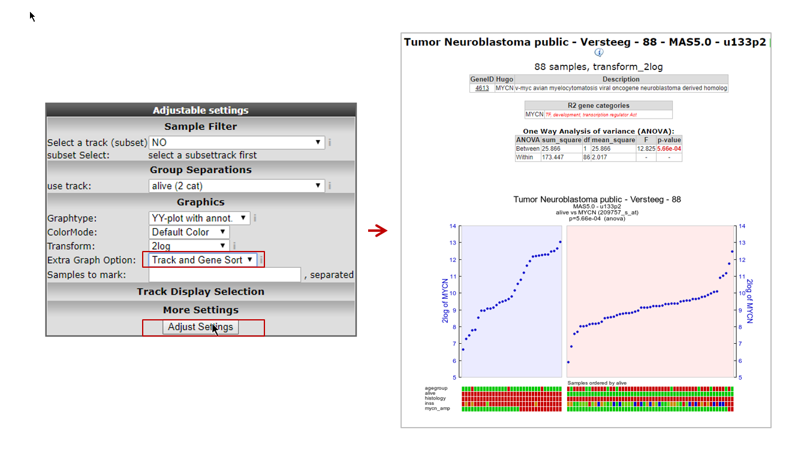

Differential expression of genes in your dataset
================================================

*Find out which genes make a difference between groups of samples in
your dataset*

Scope
-----

-   Use R2 to find which genes exhibit differential expression between
    groups of samples in a dataset.
-   Use R2 to determine whether the expression of your gene of interest
    is significantly different between groups of samples
-   This is established by use of statistical tests. R2 will guide you
    through this process in a self-explanatory way
-   This requires proper annotation of the dataset to enable assignment
    of samples to groups. In this tutorial a set of neuroblastoma tumors
    is used that is annotated with several clinical parameters:
    survival, age of diagnosis, etc.
-   All (advanced) parameters can be adapted to your specific needs
-   In separate boxes these settings will be elaborated upon
-   The results of these analyses are presented in adaptable graphics

Step 1: Selecting data and gene
---------------

1.  Logon to the R2 homepage using your credentials and make sure the
    "Single Dataset" field is selected in field 1 of the R2
    step-by-step guide.
2.  Make sure the Tumor Neuroblastoma public dataset is selected in
    field 2 (For additional information on these first two steps,
    consult tutorial 1: Choose "View a gene in groups" in field 3.
3.  Type MYCN as gene (see Figure 1) in field 4.
4.  Click "next" in field 5.

	
	
	[**Figure1: Step-by-step scenario: selecting to 'View a gene in groups' on themain page ofR2**](_static/images/DiffentialExpression_Gene.png)
	

Step 2: Choose annotation track as grouping variable
---------------

----------------
  ***Did you know that you can create your own tracks?***

  *This is explained in a separate tutorial [Adapting R2 to your needs](DiffentialExpression_Select.png)
  Datasets are listed alphabetically*
  
------------------

1.  In the next screen you will decide which grouping variable to use to
    establish the differential expression of your gene of interest. In
    R2 the so called "tracks" contain this annotation. For the current
    dataset there is a track called "alive" containing survival data of
    the patients from whom the tumor sample was taken. Select this
    (Figure 2). Note that the other fields can be kept as is, the right
    choices are already provided. Note also that the proper reporter
    probeset is already selected.
2.  Click "next"

	
	
	[**'Figure2: Selecting the proper annotation track to differentiate expressiondata**](_static/images/DiffentialExpression_Select.png)
	
------------------
**Did you know that samples can be filtered and/or marked?**

> *Under the sub-header "Sample Filter" you can select a specific subset of
samples based on the annotation (track).                               
The analysis will only be performed on the selected subset. In Fig 2a   
the track gender was selected that enables filtering on gender.        
Be sure to click the red confirm link to set the filter, or make further
selections. Filtering and marking samples Keep in mind that you can     
repeat the filter procedure on top of the previous one.                
Don"t forget the red "confirm" link before switching tracks. The extra  
graph option allows the users to select different graphical             
representations.                                                       
In the samples to mark section, a sample name can be entered that will  
be highlighted resulting graph; ideal for publication purposes.*         
                                                                                                                                          
                                                                        

                           
----------

Step 3: Defining groups
---------------

1.  In the next window a selection of the groups can be made. Only the
    selected group will be displayed in the graph; the "one way
    Anova"/"student T test" test will be performed for data on both
    groups (of course, see explanation in step 4). In this case this we
    want to see both groups so keep the selection as is.
    
	
	
	[**Figure    3: Selecting groups for the    graph**](_static/images/DiffentialExpression_Selectgroup.png)
	
2.  Click "next"

Step 4: Anova results
---------------

1.  R2 now performs a one-way Anova statistical test on the fly. This
    **AN**alyis **O**f **VA**riance is a statistical test that
    calculates whether the means of variables differ between two or
    more groups. In the case of 2 groups, this is identical to the
    student T-test. ANOVA can be concerned a sound test when the
    variables are normally distributed and samples are independent. More
    information here:
    <http://en.wikipedia.org/wiki/One-way_ANOVA>.
    A simple example calculation can be found here:
    <http://en.wikipedia.org/wiki/F_test#One-way_ANOVA_example>.
    R2 shows the result by default as a graph where the mRNA expression
    of the samples is plotted over the two groups with increasing
    expression (Figure 3Figure 4). Note that the "alive" annotation is
    in the second row (track) beneath the graph. The actual result of
    the calculations is shown above the graph; the difference in average
    expression between the two groups is significant. These results can
    also be shown in a more conventional bar-plot by adapting the
    settings and redrawing the graph.
    
	
	
	[**Figure    4: Result of the one-way Anova test for the Neuroblastoma    88 samples.**](_static/images/DiffentialExpress_Result.png)
	
2.  Scroll down the window
3.  Adapt the selection in the dropdown box 'Graphtype' to 'Barplot' and
    'ColorMode' to 'Color by Track'
4.  Click 'Adjust Settings' (Figure 5)

	
	
	[**Figure5: Adapting the Graphtype to BarPlot and set Color byTrack**](_static/images/DiffentialExpression_AdaptGraph.png)
	

Step 5: Adapting plots
---------------

1.  The resulting graph is adapted accordingly (Figure 5)
    
	
	
	[**Figure    6: The same data as a    Barplot**](_static/images/DiffentialExpression_Barplot.png)
	
2.  The difference can be shown more dramatically by plotting the data
    without a log2 transformation, scroll down again. Do report the test
    results based on the log transformed data though, as
    none-transformed mRNA gene expression data is hardly ever
    normally distributed.
3.  In the 'Adjustable settings' dialog, set the 'Transform' dropdown to
    'none' (Figure 7)
4.  Click 'Adjust Settings'
    
	
	
	[**Figure    7: Adjusting data    transformation**](_static/images/DiffentialExpress_BarplotAdjust.png)
	
5.  The resulting graph in Figure 8 shows the difference
    more dramatically.
    
	
	
	[**Figure    8: Bar plot without    transformation**](_static/images/DiffentialExpress_BarplotNotransform.png)
	
6.  Note furthermore the menu items to the right and left of the graph.
    The left panel contains hyperlinks that provide further information
    about this gene and additional analysis options. The KaplanScanner
    will be explained in a separate tutorial. The right panel allows you
    to change your gene of interest immediately, while keeping all the
    changes that you have made to the graphical representation; just
    type a gene name and click 'Change Gene'. The "sample overview"
    shows the clinical data associated with the samples. Click the view
    button for the first sample.
7.  Figure 9 shows the clinical data associated with that
    particular sample.
    
	
	
	[**Figure    9: Clinical annotation of a    sample**](_static/images/DiffentialExpress_ClinAnno.png)
	

Step 6: Finding all differentially expressed genes 
---------------

1.  It would be a pretty tedious job to look for all genes whether they
    are differentially expressed between groups. Why not let R2 do the
    job for you? Go back to the Main screen, by clicking the link in the
    upper left corner of the screen
2.  In field 3 of the R2 step-by-step guide select 'Find Differential
    expression between groups' (Figure 10)
    
	
	
	[**Figure    10: Selecting Find    Differential Expression.**](_static/images/DiffentialExpress_FindDiff.png)
	
3.  Click 'Next'

Step 7: Setting parameters
---------------

1.  In the next window there appear quite a few choices for setting the
    statistical parameters for this analysis. Luckily only one is of
    real immediate importance; selecting the track of choice (shown
    in red). Select the 'Alive' track again.
    
	
	
	[**'Figure    11: Differential expression    parameters**](_static/images/DiffentialExpress_AdaptParam.png)
	
2.  Click "next"
3.  In the next screen click next also; R2 now calculates for all genes
    (under the parameters set) a one way anova test and also corrects
    this for multiple testing! (Figure 12). An amazing amount of
    calculations! R2 performs this on the fly.

	
	
	[**Figure12: Progress dialog during on the flycalculation**](_static/images/DiffentialExpress_Progress.png)
	
  ----------------
  ***Did you know that all other parameters have a meaning?***

>  **HugoOnce**:*For most analysis genes should only be reported once in a dataset. R2 uses an algorithm called HugoOnce to choose a single probe-set to represent a gene. For each probe set of a gene, the average expression over all samples with a present call (from the MAS5.0 normalization) is calculated (average present signal APS). The probe set with the highest signal is chosen to represent this gene in the analyzed dataset. For every dataset this procedure is repeated, thereby allowing tissue specific selection for probesets to represent a gene. When no call information is available, the average expression of a probeset is used.*
>  **Differential Expression**: *R2 determines p-values for the differential expression of genes by performing either a one-way anova (default setting) or alternatively a brute-force t-test on any combination of groups when the data is untransformed or log2 transformed. For rank-transformed data, a Kruskal Wallis test is performed. Besides these statistical tests, users can also ask for genes with a certain fold change or obtain a top-X list of the genes which are ordered by a user-specified test.*
>  **Multiple Testing:** *We are testing a lot of genes here; so we have to correct for Multiple testing. For example, one might declare that a coin was biased if in 10 flips it landed heads at least 9 times. Indeed, if one assumes as a;null hypothesis ;that the coin is fair, then the probability that a fair coin would come up heads at least 9 out of 10 times is (10 + 1)x(1/2)^ 10 = 0.0107 This is relatively unlikely, and under statistical criteria; such as p-value < 0.05, one would declare that the null hypothesis should be rejected i.e., the coin is unfair. A multiple-comparisons problem arises if one wanted to use this test (which is appropriate for testing the fairness of a single coin), to test the fairness of many coins. Imagine if one was to test 100 fair coins by this method. Given that the probability of a fair coin coming up 9 or 10 heads in 10 flips is 0.0107, one would expect that in flipping 100 fair coins ten times each, to see ;*a particular*;(i.e., pre-selected) coin come up heads 9 or 10 times would still be very unlikely, but seeing any coin behave that way, without concern for which one, would be more likely than not. Precisely, the likelihood that all 100 fair coins are identified as fair by this criterion is (1 - 0.0107)^100 \~ 0.34.. Therefore the application of our single-test coin-fairness criterion to multiple comparisons would be more likely to falsely identify at least one fair coin as unfair. This occurs in a similar way if we are testing multiple genes in one experiment; we have to correct for this. There are several ways to do so; a conservative approach is the Bonferroni correction. The correction is based on the idea that if an experimenter is testing n dependent or independent hypotheses on a set of data, then one way of maintaining the familywise error rate is to test each individual hypothesis at a statistical significance level of 1/n times what it would be if only one hypothesis were tested. So, if it is desired that the significance level for the whole family of tests should be (at most) a, then the Bonferroni correction would be to test each of the individual tests at a significance level of a/n. The more sophisticated False Discovery Rate controls the expected proportion of false positives. A FDR threshold is determined from the observed p-value distribution, and hence is adaptive to the amount of signal in your data.*

>  **Gene Filters:** *The gene filters allow you to study a specific subset of genes only. There are several domains you can choose from. A specific chromosome can be chosen, note when a chromosome is chosen a specific position range can be defined also. Under GeneCategory some predefined categories can be selected, some examples are known transcription factors or drugtargets Here you'll find the categories you've defined yourself also. \#\# Kegg pathway selects a set of genes present in the [KEGG pathway database](http://www.genome.jp/kegg/pathway.html) . Gene ontology select a group of genes belonging to a specific Gene Ontology category (www.geneontology.org). Note that if you click a category, further choices deeper down the ontology tree are enabled \#\# Genesets are publicly defined sets or sets you've constructed yourself yourself (see also: tutorial adapting R2 to your needs). A convenient search functionality is available to find what you're looking for. Combinations are also possible; this enables you for example to find the developmental genes on chromosome 1.*

> *Of course: to really get familiar with these settings you have to toy around with them!*

-----------------

Step 8: Inspecting single gene
---------------

--------------------------------------------------------------------------
  ***What were those R and p-values again?***>
>  *R is the correlation coefficient; it ranges from -1 to +1, if R > 0 the value of two variables tends to increase or decrease together. If R < 0 the value of X increases if that of Y decreases, if R\~0 there is no relation. Perhaps the best way to interpret the value of R is to square it. This is the fraction of the variance in the two variables that is shared. For example, if R^2 = 0.59 then 59% of the variance in Y can be explained by (or goes along with) variation in X. The p-value for this calculation estimates the probability that this is an observation by pure chance; a p-value of 0.01 you can be 99% sure that this is not the case.*

---------------------

1.  The result is a list of genes that is ordered for having the most
    significant differential expression between the groups you chose
    (Figure 13). A short summary of the calculation is given above the
    table; \~ 2600 genes have met the criteria set by default; their
    expression exhibits a correlation with the separation in two groups.
    
	
	
	[**Figure    13: Genes differentially expressed    between groups.**](_static/images/DiffentialExpress_Genelist.png)
	
2.  Click on the hyperlinked top gene in the list
3.  A similar graph as produced for MYCN appears, the differential
    expression is more pronounced for this gene (Figure 14). In the
    generated picture the genes are not ordered for their gene
    expression go to the adjustable settings menu and select "Track and
    gene sort" in the "Extra Graph Option" pulldown menu. Click
    "adjust settings".
4.  The functionality in the right panel of Figure 15 will be explored
    in more advanced tutorials (K-Means clustering). We'll explore one
    additional data visualization however; that of all genes I this
    dataset; in the right menu click 'Plot all genes (xy,
    volcano, etc)'.

[**Figure14: In the main screen *Changedataset*.**](_static/images/DiffentialExpress_TopGene.png)

[**Figure 15: Right menu in genelist windos; choosing plot all genes**](_static/images/DiffentialExpress_RightMenu.png)

Step 9: Adapting visualization: Volcano plot etc
---------------

1.  The resulting plot shows all genes in the list in a XY-plot;
    datapoints above and below the diagonal are
    differentially expressed. Hovering over the points shows the
    genesymbol, in this case the NTRK1 gene (Figure 16). To speed up the
    graph generation this information is not automatically loaded: click
    on the "add hovering" button below the graph to add
    this information. Note: every plot in R2 with larger amounts of
    datapoints (>5000) will have this "add hovering" button.
    
	
	
	[**Figure    16: XY plot of all genes differentially expressed in the current    track;**](_static/images/DiffentialExpress_XYplot.png)
	
2.  Clicking on the symbol opens up a new window showing the expression
    of the gene in the two groups as a box plot.
    
	
	
	[**Figure    17: Differential expression of    NTRK1**](_static/images/DiffentialExpress_BoxdotplotCircle.png)
	
3.  R2 allows further annotation of the XY plot of all genes; in the XY
    plot window (still open in your browser) scroll down and adapt the
    settings; add a genesymbol to mark, eg AKR1C1; choose a KEGG pathway
    to emphasize, eg DNA replication and set the 'Draw fold lines'
    option to 'yes'.
    
	
	
	[**Figure    18: Adjustable settings for the all genes    plot**](_static/images/DiffentialExpress_AdjustAllgenes.png)
	
4.  Click redraw image. The plot has been adapted to show the AKR1C1
    genesymbol, DNA-replication genes are highlighted in red. Fold
    change lines show the regions where differential expression is 1 and
    2 fold (Figure 19). Note that most genes of the DNA replication
    pathway seem to be located below the diagonal.
    
	
	
	[**Figure    19: Adjusted visualization of gene expression,hovering over the dots    shows the    gene name.**](_static/images/DiffentialExpres_graphtypes.png)
	
5.  R2 can visualize the same data also as a Volcano plot or a MA plot.
    In the Adjustable Settings dialog change the Plot type to Volcano
    MA (Figure 19). Note that the distinct
    characteristics of the AKR1C1 gene and the DNA replication are more
    obvious in the Volcano plot. The DNA replication pathway statistics
    will be explored in more detail in the 'Find genes correlating with
    your gene of interest'-tutorial

-------------------------------------------
  **Did you know that you can tailor visualization of specific genes in one go?**
>  *You can annotate genenames by providing them in this box. By default, these will appear in red, size=10, on your plot. You can change the size and/or color of these genes either individually, or in groups. Please take note of the following rules: \# \#\* mark groups of genes for which the same criteria apply. First type the genes (comma separated), followed by :s=size, followed by :c=r,g,b \#\* for single genes: gene1:s=25:c=0,0,255;gene2:s=20:c=200,0,0 \#\* for groups of genes: (gene1,gene2,gene3):s=25:c=0,0,255;(gene4,gene5,gene6):s=20:c=200,0,0"*

Final remarks / future directions
---------------------------------

This tutorial has shown you how to find genes that are differentially
expressed in your dataset of choice. Now go ahead and toy around with
selecting groups and tracks of choice and see what interesting
scientific discoveries might lie ahead!

We hope that this tutorial has been helpful,The R2 support team.

