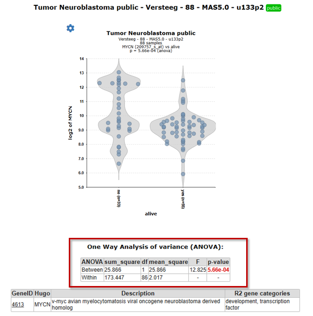
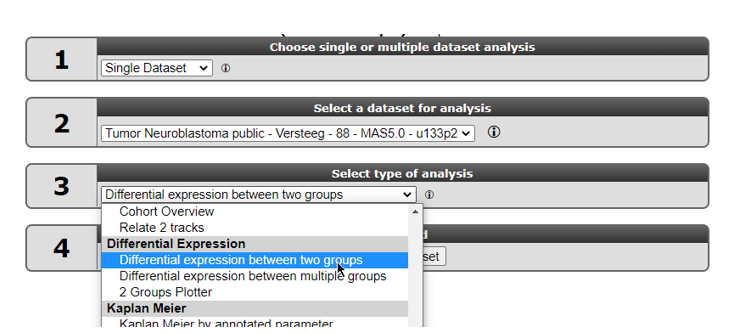

Differential expression of genes in your dataset
=======================================

*Find out which genes make a difference between groups of samples in
your dataset*

Scope
-----

-   Use R2 to determine whether the expression of your gene of interest
    is significantly different between groups of samples (steps 1 to 5).
-   Use R2 to find all genes exhibiting differential expression between
    groups of samples in a dataset (step 6).
-   This is established by use of statistical tests. R2 will guide you
    through this process in a self-explanatory way.
-   In order to enable assignment of samples to groups, proper annotation of the dataset is required. In this tutorial a set of Neuroblastoma tumors is used that is annotated with several clinical parameters:
    survival, age of diagnosis, etc.
-   All (advanced) parameters can be adapted to your specific needs.
-   These settings will be elaborated upon in separate boxes.
-   The results of these analyses are presented in adaptable graphics.

Step 1: Selecting data and the type of analysis
---------------

1.  Log on to the R2 homepage using your credentials and make sure the
    **Single Dataset** field is selected in field 1.
2.  Make sure the **Tumor Neuroblastoma public - Versteeg - 88 - MAS5.0 - u133p2** dataset is selected in
    field 2 (see chapter 1 of the tutorial for more information about the selection of a dataset).
3.	Choose **View a Gene in groups** in field 3 and click Submit.

Step 2: Choose the gene and the annotation track as grouping variable
---------------
In the next screen you will choose the gene of interest and decide which grouping variable to use to establish the differential expression of your gene of interest.

[**Figure 1: Step-by-step scenario to select 'View a gene in groups' on the main page of R2**](_static/images/FindDiff/DifferentialExpression_Genev1a.png)

1. Type **mycn** as gene (see Figure 1) in the first text field in the Adjustable settings box. Select with a mouse click the first reporter in the popup (the first row). The reporter textfield is automatically filled in.

To view the expression of this gene in groups, you can use dataset specific annotation, the so-called "tracks", as grouping variable in R2.

2. In the dropdown of the setting *Track* select the track called **alive (2 cat)**. This track contains survival data of the patients from whom the tumor sample was taken.
3. Note that the other fields can be kept as is, the right choices are already provided. Click **Submit**.

The "one-way Analysis of variance (Anova) / student T-test" will be performed for data on the selected
groups (see explanation in the next step).

----------------
***Did you know that you can create your own tracks?***

*Many datasets in R2 contain annotations. You can use these annotation tracks as grouping variable. Another option is to create your own annotation track for any dataset in R2. This is explained in a separate tutorial [Adapting R2 to your needs](Adapting_R2.md).*

------------------

Step 3: Anova results / adapting plots
---------------

R2 now performs a one-way Anova statistical test on the fly. More information about which test to choose can be found here: [Statistical test: did you know..?](Did_You_Know.md).

1. Check the graph and the information that is displayed underneath the graph in the resulting window.

R2 displays the mRNA expression of the samples in a violin plot that illustrates the distribution of the expression values per group (Figure 4a).  
The actual result of the ANOVA calculations is shown in the table under the graph; the difference in average expression between the two groups is significant.

[**Figure 4a: Result of the one-way Anova test for the Neuroblastoma 88 samples.**](_static/images/FindDiff/DifferentialExpression_ResultViewInGroups_violin.png)

With the gear icon you can open up the _plot options_ menu, where many settings can be adjusted to which the plot immediately responds.  Let's try a few tweaks (Figure 4b):
1. Click on the **gear icon** upperleft from the violin plot.
2. The plot options menu opens up on the _General tab_. The second settings in that tab, _Order Groups by_, is set to __group name__. Click on __group name__, and choose __median (numeric Y)__ in the dropdown options.
3. You have multiple different options to color both the dots as well as the group violin shapes. Set _Color mode (groups)_ to **Color by Track** and *Color mode* to **Color by Gene**. Notice how, by default teh chosen gene and source are the currently chosen dataset and gene, but that you can choose a different dataset or gene and add layers of information this way.
4. Also, we adjusted to dot size in the example to 3.5

[**Figure 4b: Click the gear icon to customize the appearance of the result plot with _plot options_.**](_static/images/FindDiff/Result_adjusted_with_plotoptions.png)

Thus, with a click on the **gear icon**, you are offered many options to customize the appearance of this plot directly.  
  
The **graph type** (e.g. violin plot, box plot, YY plot etc.) can be changed as well with one click in the plot options menu. It is the first setting in the *General tab* of the plot options menu. Each graph type might offer an alternative perspective on the same data.  

In the picture below you can see a few examples: a rainbow plot, a box plot with scatter and a ridge plot.

   

[**Figure 5: Graph type enables you to choose from various graph types to visualize the data.**](_static/images/FindDiff/DifferentialExpression_Alternative_graph_types.png)

  
To get a sense of the ease of this graph type setting and the different perspectives of your data that it can offer you when you play around with it, lets try the _YY with annotations_.  
The _YY with annotations_ plot provides a raw overview of gene expression per sample. The richness of this view is provided by the corresponding annotation values per sample that are displayed underneath. The samples will be grouped by the same track, **alive (2 cat)**, and ordered on their gene expression values.   
1. Click on the gear icon upper left from the violin plot if the plot options menu is not open yet. 
2. Check that you are in the General tab of the menu and adapt the selection in the dropdown box *Graph type* to the option **YY with annotation**. 
3. The setting _Extra Graph Option_ is set to **Track and Gene Sort**, which causes the samples within their respective groups to be ordered in increasing value of MYCN expression.
4. Lastly, for _Color mode_ we chose **Defined Color**, and with the _color picker_ next to it, we chose a color of a blue-grey. This blue-grey color is one of teh standard colors that you can find in the color picker. Note that you do have the option to click on **Other**, which allows you to pick a color from a gradient color wheel and also to use the color picker.

[**Figure 6: Adapt the Graph type setting to _YY with annotation_ to view MYCN expressions plus annotation underneath"**](_static/images/FindDiff/DifferentialExpression_YY_annoation.png)

The difference in expression between the groups can be shown more dramatically by plotting the data without a log2 data **transformation**. Make sure to use log2 transformation in scientific reports, though, as untransformed mRNA gene expression data is hardly ever normally distributed. For this setting we scroll down to the _Adjustable settings menu_ at the bottom of the page. More and more settings are transferred to the directly responsive plot options menu that pops up with a click on the gear icon. Some options, however, are still residing (or also residing) in the menu at the bottom of the page. 

5. Scroll down to the Adjustable settings menu and change the setting *Transformation* to **None**. This Adjustable settings menu still requires a click on the **Submit** button in order for adaptations to take effect.
6. In the plot option menu that you pop up with the gear icon, visit the other tabs as well, to e.g. add markers around samples by name (**tab Marked**), or to add/remove tracks in the **Tracks tab**

[**Figure 6a: Change Transformation in the _Adjustable Settings menu_; Add/ delete Markers and Tracks in the different tabs of the _plot options menu_**](_static/images/FindDiff/DifferentialExpression_AdaptGraphYYPlots.png)

You can also mark or unmark a sample with a simple click on the desired sample in the graph. Once a sample is marked, you can adjust the marker appearance in the plot options menu (figure 6b).

[**Figure 6b: Mark a sample with a click on the dot in the graph, and customize the marking in plot options**](_static/images/FindDiff/DifferentialExpression_Mark_sample_by_graphclick.png)

The resulting graph is also depicted in different types of plots in Figure 7, with a simple change in the _graph type setting_ (plot options menu). Here too it shows the difference between the expression values in the two groups with Log2 _transformation_ (left) or without (right) transformation of the data to Log2. Log2 transformation (in the Adjustable settings menu underneath the graph) causes high extremes to seem less extreme. Differences between lower values will be more accentuated.  
You can see that with a change of graph type or transformation setting, the marked sample stays marked. This enables you to view your data from various perspectives and effortlessly track the samples that matter to you across different graphs.

 and dot(down) plots")

[**Figure 7: The same data represented with log2 data transformation (left) and without transformation in box (up) and dot (down) plots**](_static/images/FindDiff/DifferentialExpression_transformationbox.png)

Figure 8 shows that you can add or remove the sample dots after selecting "Add scatter = TRUE" when e.g. a box plot is selected. With scatter allows you to add a second level of coloring by using the group parameters or coloring by gene.

[**Figure 8: Add/remove scatter and color the dots by track or by gene expression values**](_static/images/FindDiff/DifferentialExpression_AddScatter.png)

------------------
**Did you know that samples can be filtered and/or marked?**

*In the Adjustable settings menu under the sub-header "Sample Filter" you can select a specific subset of samples based on the annotation on track. First choose a track, then select the wanted subgroups in the track. The analysis will only be performed on the selected subset and only the selected samples will appear in a graph.*

[**Figure 9: Sample selection with the Sample Filter**](_static/images/FindDiff/DifferentialExpress_SampleFilterDropdown.png)

*If you click the wheel icon in the Sample Filter, a grid pops up with which you can make an advanced selection of samples based on combinations of tracks of interest*

[**Figure 10: Advanced sample selection**](_static/images/FindDiff/DifferentialExpress_SampleFilterAdvanced.png)

--------
Step 4: Finding differentially expressed genes in two groups
---------------
It would be a pretty tedious job to look for all genes whether they are differentially expressed between groups. Why not let R2 do the job for you? 
1. Go back to the Main screen, by clicking the **R2 Main link** in the
   upper left corner of the screen.
2. In box 3 of the R2 analysis steps on the main page, you find two options to find differential expressed gene lists: 'Find Differential expression between two groups' and  Differential expression between multiple groups (Figure 11). 
3. Both types of Differential expression modules harbor specific statistical tests. Depending on your chosen dataset, number of groups you want to test and the type of data (RNAseq,microarrays) you can choose from several statistical tests.

   

   [**Figure 11: Selecting Find Differential Expression.**](_static/images/FindDiff/DifferentialExpression_Selectgroups.png)

4. Select **"Differential expression between two groups"** and click **Next**.
  
5. In the next window you can select several types of statistical tests which are present in the selection menu. By default, the **T-test** is selected. We too will use this default test.  

Which test is suitable for a given dataset, depends on the normalization of the selected dataset and on what kind of data the dataset is build of.  Most expression sets are continuous and normally distributed data so the T-test is the most applicable. In case of a dataset which contains categorical data the Mann-whitney test is more suitable.  

A special remark for the **DESeq2 algorithm** is at place here. This test is only available for RNAseq data where R2 also has access to the un-normalized counts. Most of the datasets that have 'DESeq2_rlog' or 'DESeq2_vst' in the name consist of multiple data parts. One or more normalised data parts are available in case you want to use the 'T-test', or 'limma' and in addition a data part with the raw non-normalized counts is available. If available, then making use of the DESeq2 algorithm is preferred (especially for smaller data sets). Note that in the case of DESeq2,  the counts are only used for the statistical tests, the values depicted in the graphs etc. are always normalized data.  

Using the DESEq2 algorithm in case of RNAseq is often preferred since this is a well-established statistical test package dedicated to data such as RNAseq data. In the dataset selection grid box you can search for datasets which have '**deseq2_rlog**' or **'deseq2_vst'** as normalization procedure. Data sets with this annotation have three slots, rlog/vst normalized data, deseq normalized data (normcounts) and a counts slot. This counts slot is used when you run the DESeq2 algorithm on the fly for two group comparisons.  

   

   [**Figure 12: Selecting the DESEq2 test.**](_static/images/FindDiff/DifferentialExpress_deseq2select.png)

Step 5 Setting parameters
---------------

In our case we continue with the Tumor Neuroblastoma dataset and the Differential Expression between two groups analysis with the T-test. 

1. Now we also make the choice for the two groups. Select behind *Group by* the track **Alive (2cat)** again. Click **Next**.  

   

   [**Figure 13: Differential expression parameters**](_static/images/FindDiff/DifferentialExpression_Default_steps_diffexpr_parameters.png)

3. An extra menu with many options shows up <u>above</u> the test selection menu. Note that the required Group 1 and Group 2 setting is already filled in: the value **no (33)** for *Group 1* and **yes (55)** for *Group 2*.
4. Click **Submit**.

   [**Figure 14: Progress dialog during on the fly calculation**](_static/images/FindDiff/DifferentialExpress_Progress1a.png)

The result is a list of genes that is ordered by the most significant differential expression between the groups that you chose (Figure 15). A short summary of the calculation is given above the table; ~ 2600 genes have met the criteria set by default; their expression exhibits a correlation with the separation in the two groups.  
The generated list can be sorted or filtered by any of the column headers in the grid, such as by the p-value (P) or the difference.  

In the right menu numerous modules can be selected to continue the analysis. Also, the generated list can be extracted to continue for further usage outside R2 and stored as temporary or permanent geneset in R2, as indicated in the right menu

   

   [**Figure 15: Genes differentially expressed between groups and follow up analyses / save options.**](_static/images/FindDiff/DifferentialExpression_GenelistFollowup.png)

-----------------

Step 5: Correct for setting in paired analysis
---------------

A paired analysis is often performed when observations are natural paired or matched such as in the following example. 
1. In box 2 of the main screen, click on the current dataset name, such that the dataset grid pops up and you can type **George** in the blank search field unerneath the _Author_ column header. Click on the row of the dataset Exp - Neuroblastoma Adrn Mes resistant - George - 12 - tpm - gse165748 and **Confirm selection**.
Also, in box 3, select **Differential expression between two groups** analysis, select _group by_ **cell_lineage** and click **Next**. Leave adrenergic and mesenchymal for the groups and click the **Submit** button (! _Not_ the lower Next button) of the _Adjustable settings menu_.  
  
Take a look at the number of found combinations and continue with adapting the settings in the adjustable settings box below the list of combinations.

   

   [**Figure 16: Genes differentially expressed between groups with Limma test.**](_static/images/FindDiff/DifferentialExpres_Limmawithoutcorrectfor.png)

2. In the _Select a test_ menu at the bottom, select **Limma**, click **Next** and leave _Group by_ on **cell_lineage (2cat)** and click **Next**. Leave adrenergic and mesenchymal for the groups. Now you can select a track in the _Correct for_ setting, in this case, the  **genomic_mycn_status (2cat)**, click the **Submit** button.

   

   [**Figure 17: Genes differentially expressed between groups AND with pairing correction.**](_static/images/FindDiff/DifferentialExpres_Limmawithcorrectfor.png)

3. After correction for the genomic mycn status more genes are found to be significant differentially expressed between the two groups. For example also the PAX5 gene appears higher and more significant in the list which could be a candidate for further investigation.

   

   [**Figure 18: Genes differentially expressed between groups with correcttion.**](_static/images/FindDiff/DifferentialExpres_withandwithoutcorPAX5.png)

​	
--------------------------------------------------------------------------
***Did you know that...***

*Useful background information for this tutorial can be found in Chapter 25 [Concepts of R2: did you know..?](Did_You_Know.md)*

*Check it out:*

>  **What were those R and p-values again?**:  R is the correlation coefficient; it ranges from -1 to +1, if R > 0 the value of two variables tends to increase or decrease together... Read all about R & p-values in [Chapter 25](Did_You_Know.md)
>
>  **You can specify the preferred statistical test and choose a subset of genes?**
> *Use any (combination) of the following parameters to adapt the analysis to your needs.*
> - **Hugo Once (Hugoonce)**: *For most analysis genes should only be reported once in a dataset. R2 uses an algorithm called Hugoonce to choose a single probe-set to represent a gene. Scroll down in [Chapter 25](Did_You_Know.md) to the Settings section about Hugo Once.*
> - **Statistics panel**: *R2 determines p-values for the differential expression of genes by performing either a one-way anova (default setting) or alternatively a brute-force t-test on any combination of groups when the data is untransformed or log2 transformed. For rank-transformed data, a Kruskal-Wallis test is performed. In addition to these statistical tests, users can also ask for genes with a certain fold change or obtain a top-X list of the genes which are ordered by a user-specified test.*
> - **Correction for multiple testing**: *We are testing a lot of genes here; so we have to correct for multiple testing. Why? Read on about multiple testing in [Chapter 25](Did_You_Know.md)*
> - **Gene Filters:** *As for many analyses in R2, the gene filters allow you to study a specific subset of genes for differential expression. There are several domains you can choose from. Learn more about gene filters in [Chapter 25](Did_You_Know.md)*

*Of course, to actually get familiar with these settings you should not only read about it, but also toy around with them!*

-----------------

Step 6: Find differential expression in multiple groups
---------------

As mentioned above, Find Differential Expression can also be applied with a different parameters and including other types of statistical tests. Read further about which test to use in [Chapter 25](Did_You_Know.md).  
  
We will now continue to find differentially expressed genes, this time for multiple groups.

1. Go back to the **Main** page by the link in the upper left corner and select again the Neuroblastoma 88 set.
2. Select **Differential expression between multiple groups** and click **Next**
3. Select for *Group by* the value **inss (5 cat)** and leave all the other settings at their default value. Click **Submit**.

[**Figure 19: Genes differentially expressed between groups.**](_static/images/FindDiff/DifferentialExpress_AdaptParamv2.png)

A list of differentially expressed genes between the groups is generated. Of course, now that we have more than two groups, the table no longer contains the Difference column and group order column.

-----------------
Step 7: Inspecting single genes
---------------

1. Choose one of the genes in the table to inspect further.
2. Hover over the magnify symbol in the list next to the gene name to find a description of the gene. 
3. Now click on the magnify symbol. A similar graph is produced as for TF, the differential
    expression is more pronounced for this gene (Figure 18). In stage 4s, even indicating  based on the TF expression that there is possible subgroup within the INSS 4s stage.
4. Of course, as usual, with the gear icon upper left from the graph, you can customize the plot to your liking in teh plot options menu. Or, in the tab _Save_ in this menu, you can save the graph as png, svg or copy to clipboard. 

[**Figure 20: Hover over and click on any gene of interest**](_static/images/FindDiff/DifferentialExpress_TopGene.png)

--------------
Step 8: Plot all genes and adapt visualization: Volcano plot etc
---------------

1. The tab with the list of differentially expressed genes (Figure 15) is still open or perform the analysis again. Click on this tab.

2. Most of the functionalities in the right panel of this window will be explored in more advanced tutorials (K-Means clustering etc.). We will explore one
   additional data visualization however to plot all genes of this analysis. In the 'Adjustable settings' form, open the pull down of 'Display' and select 'Volcano plot'. Then press 'submit'.

      

      [**Figure  21 : Display options for Differential Expression analysis**](_static/images/FindDiff/DifferentiaExpression_display_dropdown.png)

3. The Analysis will now be initiated again, but since the result is kept for a little while, the analysis should not take more than a couple of seconds. The resulting plot shows all genes of the list in a so called volcano plot. Hovering over the points shows the gene symbol, left-clicking on the dots will annotate the dots with the gene name (or other markings, as you can adapt in the 'Marked' tab of the plot options). To speed up the
   graph generation, some adaptations may not update automatically. Click on the "redraw plot" button at the bottom of the plot options to add
   this information. 

4. In the adjustable settings menu you select gene sets to highlight the genes and toggle on histograms along the X and Y axis.

   

   [**Figure 21: XY, MA , Volcano plot of all genes differentially expressed in the current    track;**](_static/images/FindDiff/DifferentialExpress_vulconoplot1b.png)

This example is from another differential analysis, right clicking on the datapoint in the plot opens a new window showing the expression
   of the gene in the two groups as a violin plot.

   

   [**Figure  21 : Differential expression of MYCN**](_static/images/FindDiff/DifferentialExpress_Violinplot.png)

6. The plot has been adapted to show the AKR1C1, PIRT etc
   gene symbols also  DNA-replication genes are highlighted in green. Fold
   change lines show the regions where differential expression is 1 and
   2 fold (Figure 16). Note that most genes of the DNA replication
   pathway seem to be located below the diagonal.

   

   [**Figure 22: Adjusted visualization of gene expression,hovering over the dots shows the    gene name.**](_static/images/FindDiff/DifferentialExpres_DNArepl1a.png)

8. In another example in the selected Colon carcinoma TCGA set, some Ribosomal gene categories were selected in the gene filter. The KRT16-gene was selected and adapted in the Adjustable settings box.

    

 [**Figure 22 : Gene set(s) Emphasis on TCGA COAD samples**](_static/images/FindDiff/DifferentialExpression_vulcano_emphasize.png)

--------------
Step 9: Using the Enrichr
---------------

The right menu also allows you to take your result list of differentially expressed genes (DEG) outside R2 to the public available Enrichr platform. Enrichr (https://maayanlab.cloud/Enrichr/enrich) is a web-based platform designed for gene set enrichment analysis (GSEA) and functional annotation of gene lists. It allows you to gain insights into the biological processes, pathways, and functions associated with their gene sets of interest. The Enrichr performs an enrichment analysis by comparing the generated R2-list against a large collection of well curated databases such as Gene Ontology, KEGG pathways and disease-associated gene sets

[**Figure 23: Taking the result to the Enrichr platform.**](_static/images/FindDiff/DifferentialExpres_enrichr.png)

Figure 23 shows the Enrichr button you can click directly when the DEG list genes is ready, in the next screen you can select  just one group when coming from the two group analysis or you want to include and even add of delete genes from list. Hitting the submit button will direct lead to the Enrichr platform. 

-------------------------------------------
**Did you know that you can tailor visualization of specific genes in one go?**

* You can annotate gene names (gene symbols) by providing them in the 'Mark genes' field of the Adjustable Settings panel. By default, these will appear in red, size=10, on your plot. You can change the size and/or color of these genes either individually, or in groups.
* Clicking on the dots will annotate the dots with the gene name.  
* Please take note of the following rules: to mark groups of genes for which the same criteria apply,
first type the genes (comma separated), followed by :s=size, followed by :c=r,g,b  
for single genes: gene1:s=25:c=0,0,255;gene2:s=20:c=200,0,0  
for groups of genes: (gene1,gene2,gene3):s=25:c=0,0,255;(gene4,gene5,gene6):s=20:c=200,0,0"*

-------------------------------

Final remarks / future directions
---------------------------------

This tutorial has shown you how to find genes that are differentially
expressed in your dataset of choice. Now go ahead and toy around with
selecting groups and tracks of choice and see what interesting
scientific discoveries might lie ahead!

We hope that this tutorial has been helpful, the R2 support team.

