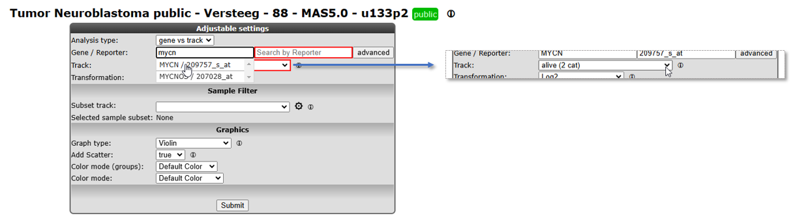
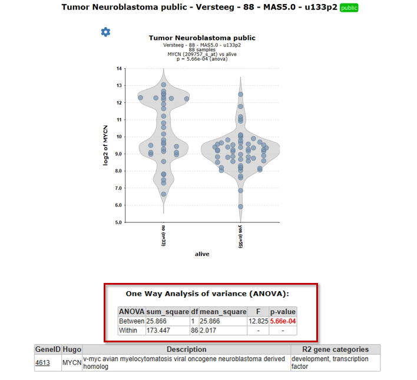

Differential expression of genes in your dataset
=======================================

*Find out which genes make a difference between groups of samples in
your dataset*

Scope
-----

-   Use R2 to determine whether the expression of your gene of interest
    is significantly different between groups of samples (steps 1 to 5).
-   Use R2 to find all genes exhibiting differential expression between
    groups of samples in a dataset (step 6).
-   This is established by use of statistical tests. R2 will guide you
    through this process in a self-explanatory way.
-   In order to enable assignment of samples to groups, proper annotation of the dataset is required. In this tutorial a set of Neuroblastoma tumors is used that is annotated with several clinical parameters:
    survival, age of diagnosis, etc.
-   All (advanced) parameters can be adapted to your specific needs.
-   These settings will be elaborated upon in separate boxes.
-   The results of these analyses are presented in adaptable graphics.

Step 1: Selecting data and the type of analysis
---------------

1.  Logon to the R2 homepage using your credentials and make sure the
    **Single Dataset** field is selected in field 1.
2.  Make sure the **Tumor Neuroblastoma public - Versteeg - 88 - MAS5.0 - u133p2** dataset is selected in
    field 2 (see chapter 1 of the tutorial for more information about the selection of a dataset).
3.	Choose **View a Gene in groups** in field 3 and click Next.

Step 2: Choose the gene and the annotation track as grouping variable
---------------
In the next screen you will choose the gene of interest and decide which grouping variable to use to establish the differential expression of your gene of interest.

[**Figure 1: Step-by-step scenario to select 'View a gene in groups' on the main page of R2**](_static/images/FindDiff/DifferentialExpression_Genev1a.png)

1. Type **mycn** as gene (see Figure 1) in the first textfield in the Adjustable settings box. Select with a mouse click the first reporter in the popup (the first row). The reporter textfield is automatically filled in.

To view the expression of this gene in groups, you can use dataset specific annotation, the so-called "tracks", as grouping variable in R2.

2. In the dropdown of the setting *Track* select the track called **Alive (2 cat)**. This track contains survival data of the patients from whom the tumor sample was taken.
3. Note that the other fields can be kept as is, the right choices are already provided. Click **Submit**.

The "one way
Anova"/"student T test" test will be performed for data on the selected
groups (see explanation in the next step).

----------------
***Did you know that you can create your own tracks?***

*Many datasets in R2 contain annotations. You can use these annotation tracks as grouping variable. Another option is to create your own annotation track for any dataset in R2. This is explained in a separate tutorial [Adapting R2 to your needs](Adapting_R2.md).*

------------------

Step 3: Anova results / adapting plots
---------------

R2 now performs a one-way Anova statistical test on the fly. More information about which test to choose can be found here: [Statistical test: did you know..?](Did_You_Know.md).

1. Check the graph and the information that is displayed underneath the graph in the resulting window.

The actual result of the ANOVA calculations is shown in the table under the graph; the difference in average expression between the two groups is significant.

[**Figure 4: Result of the one-way Anova test for the Neuroblastoma 88 samples.**](_static/images/FindDiff/DifferentialExpression_ResultViewInGroups.png)

2. For a nicely ordered graph, you can adjust the settings in the menu at the bottom. Set *Extra Graph Option*  to **Track and Gene Sort** (Do not forget to click on Submit afterwards!).  
  
R2 displays the mRNA expression of the samples in a splitted plot in which per group the samples are ordered with increasing expression (Figure 4). Note that the "alive" annotation is in the second row (track) beneath the graph.

   

[**Figure 4: Order the samples per group with increasing expression.**](_static/images/FindDiff/DifferentialExpress_Result.png)

These results can also be shown in different types of plots (Figure 5).
1. Scroll down the window to the Adjustable settings menu.
2. Adapt the selection in the dropdown box *Graph type* to another graphtype, e.g. **Dot plot (dots)**, and change *Color mode* to **Color by Track**.
3. Note that you can change the order of the groups with *Order Groups By*, let's take **median (numeric Y)** in our case.
4. Click **Submit**. The resulting graph is adapted accordingly.

[**Figure 5: Adapting the Graph type to Dot plot, change order and set Color by Track**](_static/images/FindDiff/DifferentialExpression_AdaptGraphDotPlots.png)

The difference in expression between the groups can be shown more dramatically by plotting the data without a log2 transformation. Make sure to use log2 transformation in scientific reports, though, as untransformed mRNA gene expression data is hardly ever normally distributed.

5. In the 'Adjustable settings' menu, set the *Transformation* dropdown to **none** (Figure 7).
6. Click **Submit**.

The resulting 2 graphs also depicted in different types of plots in Figure 6 show the difference between the expression values in the two groups more dramatically.

[**Figure  6: The same data now represented without transformation in bar/box plots**](_static/images/FindDiff/DifferentialExpression_Barplotv1.png)

------------------
**Did you know that samples can be filtered and/or marked?**

*Under the sub-header "Sample Filter" you can select a specific subset of samples based on the annotation on track. First choose a track, then select the wanted subgroups in the track. The analysis will only be performed on the selected subset.*

[**Figure 7: Sample selection with the Sample Filter**](_static/images/FindDiff/DifferentialExpress_SampleFilterDropdown.png)

*Clicking the wheel icon will open a grid supporting all selection combinations of interest*

[**Figure 7: Advanced sample selection**](_static/images/FindDiff/DifferentialExpress_SampleFilterAdvanced.png)

*In the samples to mark section, a sample name can be entered that will be highlighted in the resulting graph; ideal for publication purposes.*

[**Figure 7: Graph with sample selection INSS 3 and 4 and a marked sample**](_static/images/FindDiff/DifferentialExpress_SampleFilterMarkedSample.png)

--------
Step 4: Finding differentially expressed genes in two groups
---------------
It would be a pretty tedious job to look for all genes whether they are differentially expressed between groups. Why not let R2 do the job for you? 
1. Go back to the Main screen, by clicking the link in the
   upper left corner of the screen.
2. In field 3 of the R2 step-by-step guide you find two options to find differential expressed gene lists: 'Find Differential expression between two groups' and  Differential expression between multiple groups (Figure 8). 
3. Both types of Differential expression modules harbor specific statistical tests. Depending on your chosen dataset, number of groups you want to test and the type of data (RNAseq,microarrays) you can choose from several statistical tests.

   

   [**Figure 8: Selecting Find Differential Expression.**](_static/images/FindDiff/DifferentialExpression_Selectgroups.png)

4. Select **"Differential expression between two groups"** and click **Next**.
  
5. In the next window you can select several types of statistical tests which are present in the selection menu. By default, the **T-test** is selected. We too will use this default test.  

Which test is suitable for a given dataset, depends on the normalization of selected dataset and on what kind of data the dataset is build of.  Most expression sets are continuous and normally distributed data so the T-test is the most applicable. In case of a dataset which contains categorical data the Mann-whitney test is more suitable.  

A special remark for the **DESeq2 algorithm** is at place here. This test is only available for RNAseq data that contains the un-normalised counts. Most of the datasets that have DESeq2_rlog or DESeq2_vst in the name, consist of two data parts. A normalised data part is available in case you want to use the T-test and a data part with the counts is available in case the DESeq2 algorithm is preferred. Note that the counts are only used for the test, the values depicted in the graphs etc. are always normalized data.  
Using the DESEq2 algorithm in case of RNAseq is often appreciated since this is a well established statistical test package dedicated to data such as RNAseq data. In the dataset selection grid box you can search for datasets which have **deseq2_rlog** or **deseq2_vst** as normalization procedure. Datasets with this annotation have three slots, rlog normalized data, deseq normalized data (normcounts) and a counts slot. This counts slot is used when you run the DESeq2 algorithm on the fly for two group comparisons.  

   

   [**Figure 9: Selecting the DESEq2 test.**](_static/images/FindDiff/DifferentialExpress_deseq2select.png)

Step 5 Setting parameters
---------------

In our case we continue with the Tumor Neuroblastoma dataset and the Differential Expression between two groups analysis with the T-test. 

1. Now we also make the choice for the two groups. Select behind *Group by* the track **Alive (2cat)** again. Click **Submit**.  

   

   [**Figure 10: Differential expression parameters**](_static/images/FindDiff/DifferentialExpress_AdaptParamv1.png)

3. An extra menu shows up with many options. For now we only adjust the required Group 1 and Group 2 setting: we choose the value **no (33)** for *Group 1* and **yes (55)** for *Group 2*.
4.  Click **Submit**.

   [**Figure 11: Progress dialog during on the fly calculation**](_static/images/DifferentialExpress_Progress.png)

The result is a list of genes that is ordered by the most significant differential expression between the groups that you chose (Figure 12). A short summary of the calculation is given above the table; ~ 2600 genes have met the criteria set by default; their expression exhibits a correlation with the separation in the two groups.  
The generated list can be sorted or filtered by any of the column headers in the grid, such as by the p-value (P) or the difference.  
  
In the right menu numerous modules can be selected to continue the analysis. Also, the generated list can be extracted to continue for further usage outside R2. As indicated in the right menu

   

   [**Figure 12: Genes differentially expressed between groups.**](_static/images/FindDiff/DifferentialExpress_Genelistv2.png)

	
--------------------------------------------------------------------------
***Did you know that...***

*Very useful background information for this tutorial can be found in Chapter 25 [Concepts of R2: did you know..?](Did_You_Know.md)*

*Check it out:*

>  **What were those R and p-values again?**:  R is the correlation coefficient; it ranges from -1 to +1, if R > 0 the value of two variables tends to increase or decrease together... Read all about R & p-values in [Chapter 25](Did_You_Know.md)
>
>  **You can specify the preferred statistical test and choose a subset of genes?**
> *Use any (combination) of the following parameters to adapt the analysis to your needs.*
> - **Hugo Once (hugoonce)**: *For most analysis genes should only be reported once in a dataset. R2 uses an algorithm called Hugoonce to choose a single probe-set to represent a gene. Scroll down in [Chapter 25](Did_You_Know.md) to the Settings section about Hugo Once.*
> - **Statistics panel**: *R2 determines p-values for the differential expression of genes by performing either a one-way anova (default setting) or alternatively a brute-force t-test on any combination of groups when the data is untransformed or log2 transformed. For rank-transformed data, a Kruskal Wallis test is performed. In addition to these statistical tests, users can also ask for genes with a certain fold change or obtain a top-X list of the genes which are ordered by a user-specified test.*
> - **Correction for multiple testing**: *We are testing a lot of genes here; so we have to correct for multiple testing. Why? Read on about multiple testing in [Chapter 25](Did_You_Know.md)*
> - **Gene Filters:** *As for many analyses in R2, the gene filters allow you to study a specific subset of genes for differential expression. There are several domains you can choose from. Learn more about gene filters in [Chapter 25](Did_You_Know.md)*

*Of course, to actually get familiar with these settings you should not only read about, but also toy around with them!*

-----------------

Step 6: Find differential expression in multiple groups
---------------

As mentioned above, Find Differential Expression for multiple groups can also be applied with a slightly different "Adjustable settings menu" and including other types of statistical tests. Read further about which test to use in [Chapter 25](Did_You_Know.md).

1. Go back to the **Main** page by the link in the upper left corner.
2. Select **Differential expression between multiple groups** and click **Next**
3. Select for *Group by* the value **inss (5 cat)** and leave all the other settings at their default value. Click **Submit**.

[**Figure 11: Genes differentially expressed between groups.**](_static/images/FindDiff/DifferentialExpress_AdaptParamv2.png)

4. A list of differentially expressed genes between the groups is generated. Of course, now that we have more than two groups, the table no longer contains the Difference column and group order column.

-----------------
Step 7: Inspecting single genes
---------------

1. Choose one of the genes in the table to inspect further.
2. Hover over the magnify symbol in the list next to the gene name to find a description of the gene. 
3. Now click on the magnify symbol. A similar graph is produced as for MYCN, the differential
    expression is more pronounced for this gene (Figure 12).
4. In the
    generated picture the samples are not ordered by their gene
    expression. Go to the adjustable settings menu and select **Track and
    gene sort** in the *Extra Graph Option* pulldown menu. Click
    **Submit**.

[**Figure 12: Hover over and click on any gene of interest**](_static/images/FindDiff/DifferentialExpress_TopGene.png)

--------------
Step 8: Plot all genes and adapt visualization: Volcano plot etc
---------------

1.  The tab with the list of differentially expressed genes (Figure 11) is still open. Click on this tab.
2.  Most of the functionalities in the right panel of this window will be explored
    in more advanced tutorials (K-Means clustering etc.). We will explore one
    additional data visualization however to plot all genes of this
    analysis. In the right menu click see Figure 11 'Plot all genes (xy,
    volcano, etc.)'.

3. The resulting plot shows all genes of the list in a XY-plot; datapoints above and below the diagonal are
   differentially expressed. Hovering over the points shows the
   genesymbol, in this case the NTRK1 gene (Figure 16). To speed up the
   graph generation this information is not automatically loaded: click
   on the "add hovering" button below the graph to add
   this information. Note: every plot in R2 with larger amounts of
   datapoints (>5000) will have this "add hovering" button.

   

   [**Figure 13: XY plot of all genes differentially expressed in the current    track;**](_static/images/FindDiff/DifferentialExpress_XYplot.png)

4. Clicking on the datapoint in the plot opens up a new window showing the expression
   of the gene in the two groups as a box plot.

   

   [**Figure 14: Differential expression of    NTRK1**](_static/images/FindDiff/DifferentialExpress_BoxdotplotCircle.png)

5. R2 allows further annotation of the XY plot of all genes; in the XY
   plot window (still open in your browser) scroll down and adapt the
   settings; add a genesymbol to mark, eg AKR1C1; choose a KEGG pathway
   to emphasize, e.g. DNA replication and set the 'Draw fold lines'
   option to 'yes'.

   

   [**Figure 15: Adjustable settings for the all genes plot**](_static/images/FindDiff/DifferentialExpress_AdjustAllgenesv1.png)

6. Click redraw image. The plot has been adapted to show the AKR1C1
   genesymbol, DNA-replication genes are highlighted in red. Fold
   change lines show the regions where differential expression is 1 and
   2 fold (Figure 16). Note that most genes of the DNA replication
   pathway seem to be located below the diagonal.

   

   [**Figure 16: Adjusted visualization of gene expression,hovering over the dots shows the    gene name.**](_static/images/FindDiff/DifferentialExpres_graphtypes.png)

7. R2 can visualize the same data also as a Volcano plot or an MA plot.
   In the Adjustable Settings dialog change the Plot type to Volcano or
   MA (Figure 16). Note that the distinct
   characteristics of the AKR1C1 gene and the DNA replication are more
   obvious in the Volcano plot. The DNA replication pathway statistics
   will be explored in more detail in the 'Find genes correlating with
   your gene of interest'-tutorial

--------------
Step 9: Using the Enrichr
---------------

The right menu also allows you to take your result list of differentially expressed genes (DEG) outside R2 to the public available Enrichr platform. Enrichr (https://maayanlab.cloud/Enrichr/enrich) is a web-based platform designed for gene set enrichment analysis (GSEA) and functional annotation of gene lists. It allows you to gain insights into the biological processes, pathways, and functions associated with their gene sets of interest. The Enrichr performs an enrichment analysis by comparing the generated R2-list against a large collection of well curated databases such as Gene Ontlogy, KEGG pathways and disease-associated gene sets

[**Figure 17: Taking the result to the Enrichr platform.**](_static/images/FindDiff/DifferentialExpres_graphtypes.png)

Figure 17 shows the Enrichr button you can click directly when the DEG list genes is ready, in the next screen you can select  just one group when coming from the two group analysis or you want to include and even add of delete genes from list. Hitting the submit button will direct lead to the Enrichr platform. 

-------------------------------------------
**Did you know that you can tailor visualization of specific genes in one go?**
>  *You can annotate gene names (gene symbols) by providing them in the 'Mark genes' field of the Adjustable Settings panel. By default, these will appear in red, size=10, on your plot. You can change the size and/or color of these genes either individually, or in groups.*
>
> *Please take note of the following rules: to mark groups of genes for which the same criteria apply,
first type the genes (comma separated), followed by :s=size, followed by :c=r,g,b  
for single genes: gene1:s=25:c=0,0,255;gene2:s=20:c=200,0,0  
for groups of genes: (gene1,gene2,gene3):s=25:c=0,0,255;(gene4,gene5,gene6):s=20:c=200,0,0"*

-------------------------------

Final remarks / future directions
---------------------------------

This tutorial has shown you how to find genes that are differentially
expressed in your dataset of choice. Now go ahead and toy around with
selecting groups and tracks of choice and see what interesting
scientific discoveries might lie ahead!

We hope that this tutorial has been helpful, the R2 support team.

