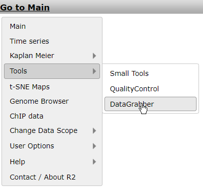

Exporting data
==============

*Export (filtered) normalized data for additional analysis outside of
R2*

Scope
-----

-   Export gene expression data with the ‘Data Grabber’ functionality
    directly from the main menu of R2 (<http://r2platform.com> / <http://r2.amc.nl>)
-   Export focussed gene expression data in R2 after an analysis (result).

Tutorial step 1
---------------

1.  In the main menu select ‘Tools’ &gt; ‘Data Grabber’. A dropdown menu
    appears from where you can select the dataset of interest and
    click ‘next’.
    

[**Figure    1: In the main menu “Data    Grabber**](_static/images/ExportData_datagrabber.png)

2.  A settings menu appears where several filter options can be applied
    to the data you want to export. You may optionally select a
    track (subset) to filter the samples by the annotated groups; in
    this example select “inss (cat)” and select one or more stage(s). Be
    sure to click the red ‘**confirm’** link to enforce your selection
    before proceeding.
3.  In the ’reporters’ section, by default, a specific set of reporters
    (either reporter names or genesymbols) can be selected via
    copy/paste a set of genes in the “input\_identifiers” box. Another
    option for the reporter selection would be the ‘HugoOnce’, where
    only a single reporter is chosen for all of the genes annotated
    within the dataset, and where orphan reporters are omitted. In this
    example we are interested to perform an additional analysis outside
    R2 with all reporters for several stages. In the menu select
    “HugoOnce” and click ‘next’.
    

[**Figure    2: Filter options for    exporting data.**](_static/images/ExportData_filter.png)

A “datagrabber.txt” hyperlink is generated on the fly and appears on
your screen. Right-click the link and store the tab delimited file with
expression data on your hard drive. In case a dataset contains more than
60.000 reporters, then R2 only allows up to 60.000 reporters to be
exported, due to the large file-sizes which would have to be created.
You may always drop r2-support a note, if you require these large
amounts, and we will dispatch those via other means.

Tutorial step 2.
----------------

The example listed above shows that R2 facilitates the export of data
without performing any analysis. Of course you may want to do the same
after analyzing data in R2. In most of the analyses options you can
export the data via the right menu.

1.  To illustrate this option. Select in the main screen in box 3 “Find
    Correlated genes with a single gene”.
2.  Type “MYCN” in box and click ‘next’, in the next screen leave all
    the selection criteria at their default settings and click ‘next’.
3.  A list of genes significantly correlating (up and down) with the
    MYCN gene is generated. The right menu provides you with a set of
    options to continue your analysis including exporting data.
    

[**Figure    3: Continuing    your analysis.**](_static/images/ExportData_menu.png)

4.  Click on “MakeMeATable (TMEV) ready” in a new (tab) screen you can
    download the table matrix with the corresponding annotation by using
    the right click of your mouse. The generated table can be used
    directly in external programs such as the commonly used clustering
    program as the TIGR Multi experiment viewer (TMEV) which is
    freely available.
5.  Try also the other options listed in this menu, ‘save current ….’,
    ‘reference for …’ and “Store results …. These are all different
    formats to export your results for use outside R2 or store in R2 to
    continue your analyses at a later time-point.

  ----------------------------------------------------------------------------------------------------------------------------------------------------------------------------------------

  ***Did you know that you can export data from different types of modules?***

  Using a different module such as “Time Series” also provides the option to export the results of use outside R2 or at a later time point within R2.
  ----------------------------------------------------------------------------------------------------------------------------------------------------------------------------------------

Note: If the requested file size exceeds \~200MB, R2 will terminate the
request because of the system load. Or course there is a workaround by
mailing the r2-support@amc.nl and request for the dataset expression
values of interest.

Final remarks / future directions
---------------------------------

We hope that this tutorial has been helpful,The R2 support team.

