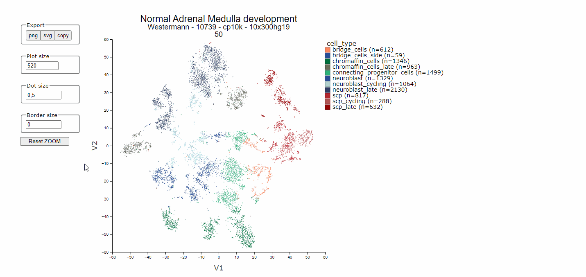

## Graphs: Adjustable Settings menu versus Repsonsive Settings

*Adapt and export graphs in R2*

R2 often offers the user settings to adapt or enhance the looks of a visualization. Adaptations could be purely 
aesthetical preferences, but often they are functional, for instance to overlay the plot with extra layers of information.   
Traditionally in R2, the user can control such settings with an *Adjustable Settings* menu that is placed 
underneath many graphs in the platform. Adjustments in the settings of these graphs take effect after 
the button at the bottom of the menu is hit. 
Increasingly, the platform offers responsive controls as well: 
when a setting is adjusted, the changes in the menu are directly visible in the graph without the need to 
click any submit button. Certain graph elements can even be adjusted directly within the plot interface. Plots that 
offer responsive functionalities can be recognized by a settings wheel, a gear icon, in the upper left corner of the graph. 
Some options may not be immediately evident to users, however, they facilitate swift adaptability. Therefore, this 
chapter aims to show a few examples as showcases of how to tweak the plots with the different setting types. 

### Save or copy a graph with the gear icon menu

The **Save** tab of teh plot options menu, that opens when you click on the gear icon, allows you to:
* Save a plot to a file, as png or svg
* Copy-paste your plot directly to the clipboard to use it in another application, such as PowerPoint.
Check out the below animation to see an example:

 

[**Figure 1: The gear icon opens a menu with settings, e.g. to save and copy a graph**](_static/images/Graphs/graphgear2inf.gif)

### Interactively switch between graph types and customize your plot

Many graphs in R2 are now adaptable without the need to hit a Submit button upon change. Most of the settings that have a direct impact on your graph, can be found in the plot options menu that shows up when you click the gear icon.  
  
This level of interactivity enables more direct and smooth play with the plots. 

[**Figure 2: To switch between graph types and customize your plot, left-click the gear icon**](_static/images/Graphs/graphgear3inf.gif)

### Example settings: color the sample maps

In the Sample maps module, underneath the scatter plots we can find the R2-wide grey Adjustable Settings menu and a 
Color settings menu.
Options listed in these menus require the user to press the "Set [setting name]" button in order for the requested
changes to the specific setting to take effect.
For instance, here the graph colors can be set to the colors of a track, or they can be set to the expression levels
of a gene. This setting requires the user to click on the button "Set colors" in order to take effect.  
Other settings can be adjusted directly in the plot itself. When your mouse hovers over the legend categories, an
information pop up tells you that the respective subgroup of samples can be toggled off and on in the plot with a click on the
legend box. Also, a click on the legend title "histology" will invert the selection. If all groups are shown, which 
is the default situation when you color a map with a track, then the invert option will deselect all groups leaving the
plot blank. One more click allows you to subsequently single out a subgroup quickly. 
With one more click you then toggle one or a few groups on. 

 vs responsive settings (toggle legend subgroups)")

[**Figure 3: Submit buttons (color by track) vs responsive settings (toggle legend subgroups)**](_static/images/Graphs/samplemaps_color_settings_legend_toggle.gif)

In the animation below, we show several responsive settings that you can find in various graphs in R2. In
responsive graphs, samples can be marked with a click on the sample in the graph; you can zoom in and out with the
scrolling wheel of your mouse and the graph can be repositioned by dragging the plot while holding the right mouse 
button.

[**Figure 4: Zoom in / out and reposition the plot, mark a
sample**](_static/images/Graphs/samplemaps_zoom_drag_mark.gif)

Some graphs offer additional responsive options outside the graph. Below the animation shows several other options in 
the Sample maps module. 

[**Figure 5: Adapt dot size / add border/ copy paste to powerpoint**](_static/images/Graphs/sample_maps_dot_size.gif)
