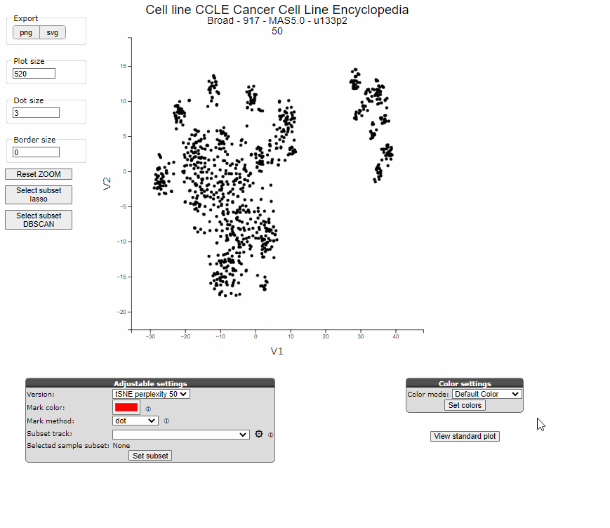

## Graphs

*Adapt and export graphs in R2*

Visualization is a key feature of R2, with an ongoing commitment to developing new types of visualizations and 
enhancing existing ones. The recently developed graphs often offer adaptability in an interactive way. Our latest 
graph developments prioritize adaptability through interactive features. While some graph options may not be immediately evident to users, they facilitate swift adaptability once users become familiar with how to tweak the plots. This tutorial aims to offer a comprehensive overview of frequently employed or requested plots, alongside lesser-known yet valuable visualization functionalities.

### Settings with submit buttons versus Interactive Settings

In the Sample maps module, underneath the scatter plots we can find the R2-wide grey Adjustable Settings menu. 
Options listed in these menu require the user to press the "Set [functionality]" button in order for the requested 
changes to take effect. 
For instance, here the graph colors can be set to the colors of a track or they can be set to the expression levels 
of a gene. This setting requires the user to click on the button "Set colors" in order to take effect. Other 
settings can be adjusted directly in the plot itself. When your mouse hovers over the legend categories, an information 
pop up tells you that the respective subgroup of samples can be toggled off and on in the plot with a click on the 
legens box. Also, a click on the legend title "histology" wil invert the selection, This allows you to quickly only 
display one or a few of the categories of your dataset. 

[**Figure 2: Loop Interactive settings in the Sample Maps module**](_static/images/Graphs/samplemaps_color_settings_legend_toggle.gif)

In the animation below, we show several interactive settings, such as marking samples with a click in the graph, 
zoom in and out with the scrolling wheel of your mouse, and repositioning the graph by dragging the plot while 
holding the right mouse button. Also you can see that some items might display information when the mouse hovers 
over the position. 