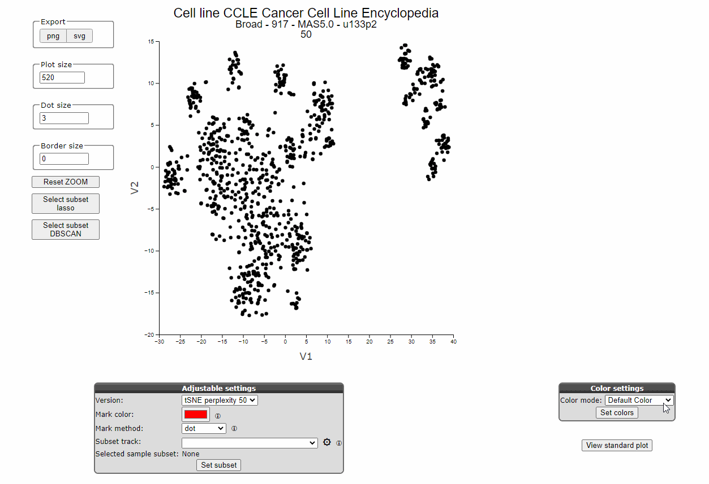

## Graphs

*Adapt and export graphs in R2*

Visualization is one of R2's main functionalities. We continuously work on creating new kind of visualizations and 
on improving already existing ones. Many graphs are adaptable in a multitude of different ways, sometimes in ways 
that are not obvious for the user. This tutorial aims to provide an overview of several much used or requested graph 
options. 

### Two types of settings: settings that need to be submitted responsive interactive settings 

[**Figure 1: Loop Interactive settings in the Sample Maps module**](_static/images/Graphs/samplemaps.gif)

[**Figure 2: Loop Interactive settings in the Sample Maps module**](_static/images/Graphs/samplemaps_color_settings.gif)

