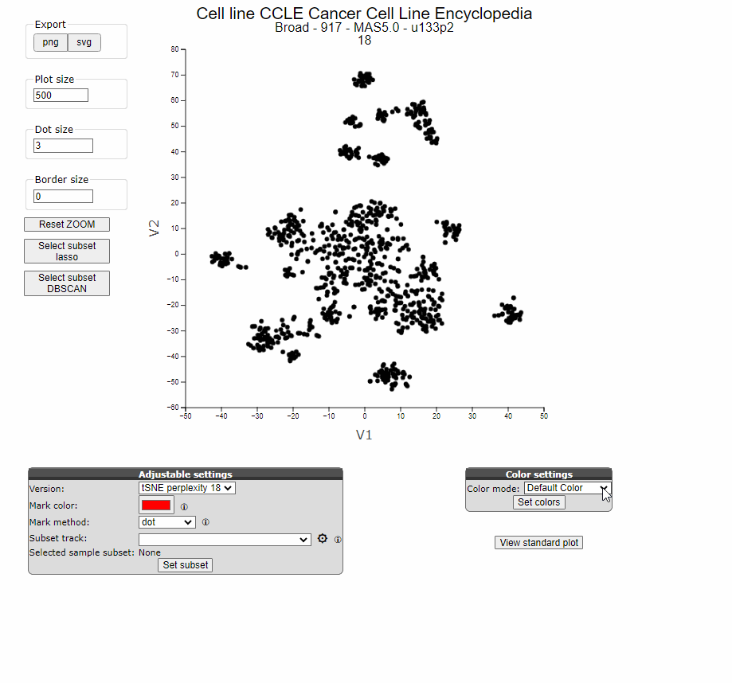

## Graphs

*Adapt and export graphs in R2*

Visualization is a key feature of R2, with an ongoing commitment to developing new types of visualizations and 
enhancing existing ones. The recently developed graphs often offer adaptability in an interactive way. Our latest 
graph developments prioritize adaptability through interactive features. While some graph options may not be immediately evident to users, they facilitate swift adaptability once users become familiar with how to tweak the plots. This tutorial aims to offer a comprehensive overview of frequently employed or requested plots, alongside lesser-known yet valuable visualization functionalities.

### Settings with submit buttons versus Interactive Settings

In the Sample maps module, underneath the scatter plots we can find the R2-wide grey Adjustable Settings menu. 
Options listed in these menu require the user to press the "Set [functionality]" button in order for the requested 
changes to take effect. 
For instance, here the graph colors can be set to the colors of a track or they can be set to the expression levels 
of a gene. This setting requires the user to click on the button "Set colors" in order to take effect. Other 
settings can be adjusted directly in the plot itself, such as omitting subgroups in the scatter plot with a click on 
the respective category in the legend. 

[**Figure 2: Loop Interactive settings in the Sample Maps module**](_static/images/Graphs/samplemaps_color_settings.gif)

