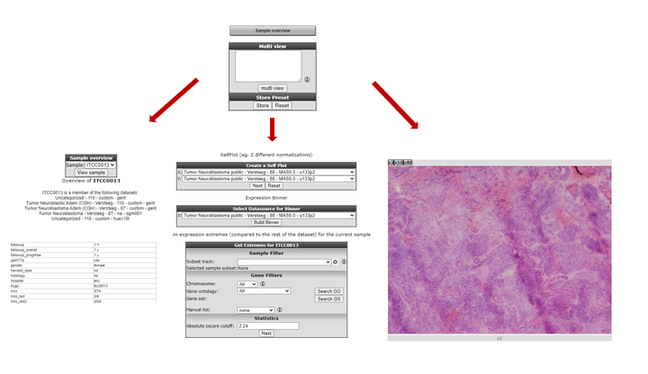

Collection of handy tools in r2
===========================================

In R2 we have impleted a large collection of functionalities which could be of  great assistance during your analysis sessions in R2. In this chapters we try to attract your attentions to this type of functions.

In many  graphical display sections such as one-gene view a small module is located in the right upper corner!. Here you can investigate more information of each individual sample of the teh dataset you are analysing.

1. Clicking om sample overview will present you an overview of all the information R2 is hosting for a particlur samples. Such as the presence of a sample in other datasets, the clinical annotation and in some cases even histology pictures if avaibable.

   

   [**Figure 1: Clinical annotation of a sample**](_static/images/Handy/DifferentialExpress_ClinAnno.png)

Also you can create xy-plots between samples for particular gene/probe, an expression binner which divides the expression levels in 10 groups with the average of each gene for download to further usage and find expression extremes based on z-score for the selected sample within a dataset.

   

   [**Figure 2: Multigene view**](_static/images/Handy/DifferentialExpress_ClinAnno.png)

In this box you can enter multiple genes and for each gene the YY plot will be generated for each gene combination. 
 