

Integrative analysis: ChIP-seq data
===================================

*ChIP data visualization can be combined with other types of data*

Scope
---
-	Provide an introduction to the concepts and algorithms used in ChIP-seq data
-	Check the properties of binding sites based on methylation and acetylation data
-	Relate this to expression data
-	Investigate the location of super-enhancers on the genome

Some concepts
---

Given the advanced character of this type of data analysis, some introduction on the concepts and algorithms used is in place.

### What is ChIP-seq
With **C**hromatine **I**mmuno **P**recipitation binding of elements to the genome can be studied. Transcription of DNA to RNA is regulated by the binding of these elements. These can be Transcription Factors, that bind temporarily to start transcription, but also chemical modification of the histones (molecular structures that coil the DNA) by methylation, acetylation, etc. (Figure 1) These modifications change the accessibility of the DNA for transcription. 

[**Figure 1: Transcription; taken from Nature Reviews Genetics 12, 283-293 (April 2011)**](_static/images/IntAnalysis_ChIPSeq_Transcription.png)

When a specific antibody is used in the pulldown that recognizes these chemically modified regions, these specific regions can be studied. Regions with H3K27Ac acetylation mark active enhancers and active transcription, H3K4Me3 methylation marks active and poised transcription (Figure 2). Studying the relative contributions of both types of modifications allows a researcher to discern enhancer regions from active transcription sites.

[**Figure 2: Specific chemical modifications mark specific states of cis-regulatory elements; taken from doi:10.1016/j.molcel.2013.01.038**](_static/images/IntAnalysis_ChIPSeq_ModificationTypes.png)

The assembly of the billions of fragments that result from a ChIP-seq experiment is a challenge. Algorithms to combine and map the reads into a consistent representation are under development. R2 allows you to study the outcome of these computationally intensive calculations through an intuitive visualization. Most default settings are suitable for a first impression of your data. To adapt certain parameters requires some knowledge about the actual computation, so we'll explain some of the concepts used below.

#### Peak calling 

R2 provides a couple of algorithms to assess significant enrichment ChIP between experiment and control.  
First is the MACS algorithm; this is often used in ChIP-seq data analyses and publications. In R2 it is used to study the binding of transcription factors. It's drawback is that it is not very suitable for broad signals.

Some experiments can also be analyzed with the MACS2 algorithm. This version can detect narrow (like transcription factors) or broad (like histone modifications). 

Yet another algorithm is RSEG; it is especially designed for histone modification detection. In R2 this used to analyse the histone modification patterns. To distinguish between specific histone modifications (e.g. acetylation vs methylation), R2 allows you to assess the same region in two profiles.

In the sections below, we will briefly explain how you can utilize and visualize the peaks as well as the histogram data (landscapes) that is available for most of the experiments.
  
#### Super-enhancers
An *enhancer* is a short (50-1500 bp) region of DNA that can be bound by proteins (activators) to increase the likelihood transcription will occur at a gene. They can be located up to 1 Mbp (1,000,000 bp) away from the gene, either upstream or downstream from the start site, and either in the forward or backward direction.  A *super-enhancer* is a region of the mammalian genome comprising multiple of these enhancers, collectively bound by an array of transcription factor proteins to drive transcription of genes, often involved in regulation of cell identity. They can be up to 20 times the size of an enhancer.

For identification of super-enhancers R2 uses the *R*ank *O*rdering of *S*uper-*E*nhancers algorithm (ROSE; [more on the algorithm here](http://www.cell.com/abstract/S0092-8674(13)00392-9)). This takes the peaks called by RSEG for acetylation and calculates the distances in-between to judge whether they can be considered super-enhancers. The ranked values can be plotted and by locating the inflection point in the resulting graph, super-enhancers can be assigned. It can also be used with the MACS calculated data (figure 3).

	

[**Figure 3: Result of a typical ROSE analysis. Above the inflection point, marked in red, are super-enhancer regions**](_static/images/IntAnalysis_ChIPSeq_InflectionPoint.png)

Now that these concepts have been explained we're going to see how the ChIP-seq data can be accessed through R2.

## Step 1: Choosing data and modules

1. To enter the ChIP-seq analysis module in R2 select *ChIP data* in Box 3 (Fig 4) and click "Next".
	
	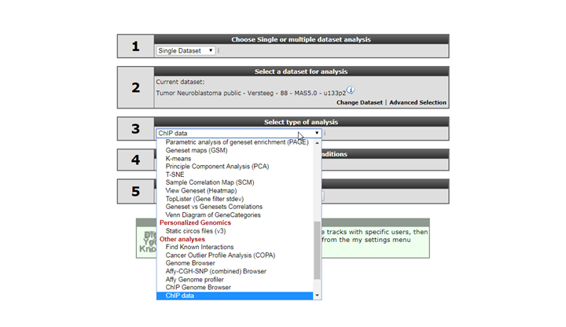
	
	[**Figure 4: Choose the ChIP-seq module**](_static/images/IntAnalysis_ChIPSeq_ChooseInMenu3a.png)
	
2. See figure 5. Several analysis paths start from here. First we're going to explore the genomic environment of some genes in context of ChIP-seq data. In the ChIP-seq menu choose the *ChIP-chip Genome Browser* 
	
	
	
	[**Figure 5: ChIP-seq Menu in R2**](_static/images/IntAnalysis_ChIPSeq_ChIPSeqMenu_a.png)
	

## Step 2: Exploring genes in a transcriptional context

You're now in the R2 genome browser in ChIP-seq context. By default the browser display shows a stretch on the genome around the location of the MYCN gene.  Encoding regions of genes are drawn at the bottom of the graph. When in red they’re encoded in the reverse direction, coding exons are colored darker. Zooming and panning is enabled through buttons at the top of the page or by selecting an area. See [chapter 17](Using_The_Genome_Browser.html#step-2-zooming-and-panning) for a more detailed explanation.  
The *Properties* panel on the left provides access to ChIP-seq datasets that can be added to the genome browser view. Options in the *Tracks* panel on the right allow for additional public data to be added to the genome browser as so called tracks. In the center panel you control what is being drawn. Always click the "redraw" button in the center panel for any changed settings to take effect. 

1. As a first toe in the water we'll explore the GATA3 gene, but you can choose your own. The genomic location of the gene will be used to map the annotation. Type the name of your gene in the text field of the *Find gene* textbox located in the upper-left corner and click "Go". 

2. To select the proper transcript in the next screen, click the "View" button. 
	
	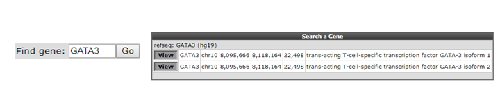
	
	[**Figure 6: Looking up a single gene in the R2 Genome Browser in ChIP-seq context**](_static/images/IntAnalysis_ChIPSeq_GATA3_select.png).
 
	
3. To select one or more ChIP-seq datasets, click "Select/Adapt ChIP-Experiments" in the *Properties* panel on the left. As an example we write "lan1" in the text field of the *chip_celline* column. Check the box in front of the preferred experiment(s), optionally change the display colors using the "c.c." buttons on the right and click "Update" at the bottom. Before we redraw the display, we adjust some additional settings in step 4.  

	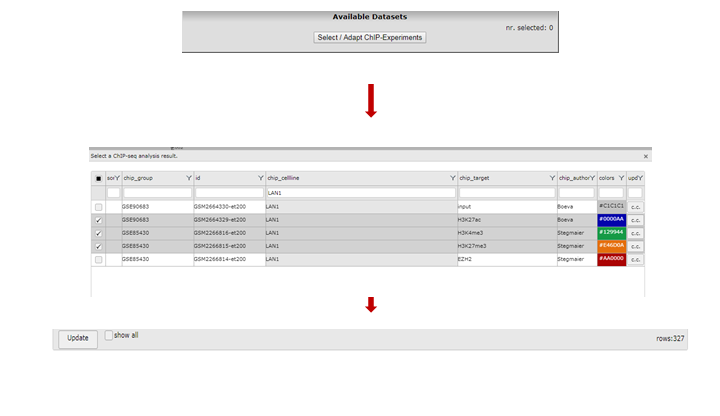
	
	[**Figure 7: Selecting experiments by using grid filtering**](_static/images/IntAnalysis_ChIPSeq_SelectLan1_profiles.png)

4. In the *Tracks* panel on the right different annotation settings can be chosen. In Fig 8 we first adjusted the TranscriptView Annotation settings:  The *NIH Epigenome Roadmap* to 'all' and the *SuperEnhancers NB (George)* to 'on'. Next to the dropdown menus a toolset icon gives access to alternative displays of the information (e.g. a more detailed display per cell line can be chosen for the NIH Epigenome Roadmap information in stead of the cell line aggregated information obtained with 'all').  
	An interesting feature of the center panel is the option to show the z-score of the expression data of the chosen datatset for each subgroup of a certain annotation track. This is illusrated in our example by the separate z-scores for each INSS-stage: in the center panel, choose "dataset_track" in the *sample* drop-down menu and set *Select_a_express_track* to inss (5cat). Now click on the "redraw" button in the center panel for the changes to take effect. The buttons at the top of the page allow for a further exploration around the gene. Clicking three times the "zoom out 2x" button reveals more binding in front of the MYCN gene.  

	In the resulting figure the H3K4me3,H3K27me3 and H3K27ac profiles for the GATA3 location in LAN1 neuroblastoma cell lines are shown. Above the genome strand the different histone modifications are depicted. The annotated locations of the Neuroblastoma superenhancer reported by George et al are drawn as colored blocks underneath the genome strand. Furthermore, the epigenetic profiles of the NIH Epigenome Roadmap project are shown color coded for the chosen cell lines. 
  
	In this ADRN type cell line it is clearly shown that active GATA3 is associated with an enrichment of H3K4me3 and H3K27Ac, but not of H3K27me3.
	
	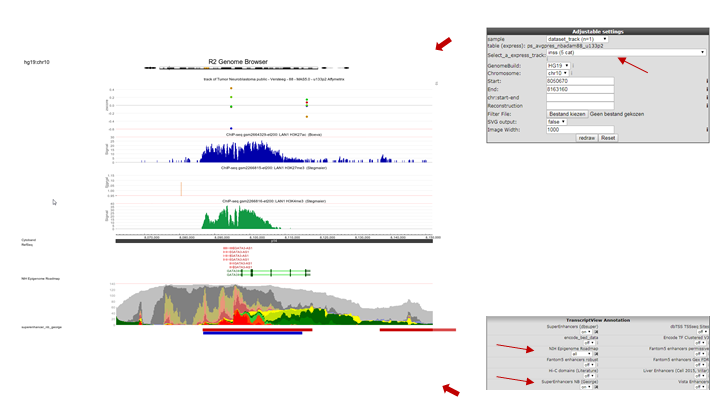
	
	[**Figure 8: Histone modification profiles around GATA3 location**](_static/images/IntAnalysis_ChIPSeq_GATA3_b.png)

5. Going through these steps would be a tedious job if you wish to inspect several genes. Suppose we obtained a list of differentially expressed genes from a transcription factor regulation experiment. As an additional requirement we selected for genes with a known cancer association. [You can find the list here](_static/files/DiffExprCancerGenesList.txt). Go back to the ChIP-seq choice menu. Now choose the *ChIPSeq TSS Peak/Coverage Plotter*

6. We're going to inspect Transcription Factor binding; Click on "Select a ChIP profile" and filter the grid by typing 'BE' in the *name* textbox, click somewhere in the table row of the BE2 cell line to select the data collected by Oldridge et al. and confirm by a click on the button "Use this experiment".  

7. Copy paste the genes obtained in step 5 or type genes of your interest into the *Enter genesymbols / genome positions* textbox.  In the *Gene Order* selection box select 'by_row_signal' and 'peaks' as setting for *Perspective*, click "Next". The Gata binding sites around the genes in the list are shown (Figure 9). 

	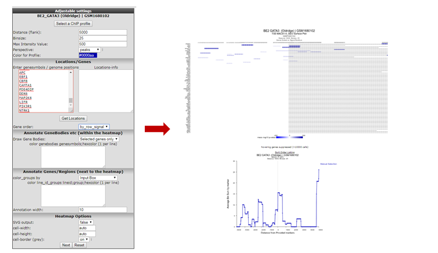
	
	[**Figure 9: Gata binding site around genes**](_static/images/IntAnalysis_ChIPSeq_ExpSelect_a.png)
	

8. Since the ordering of the ChIPSeq Peak Plotter lists the genes with the highest signals on top  (due to *Gene order* set to 'by_row_signal'), we'll select one of the first listed genes; click on ALK, in a new tab the GATA3 binding signal at the gene location is plotted in the R2 Genome Browser (Figure 10). The view can be adapted by ticking additional datasets; e.g. GATA ChIP-seq experiments in other cell lines. Colors of the data can be adapted on the right side of the grid to easily distinguish them. Remember to always click the "redraw" button in the center panel for any changed settings to take effect.  
	Zooming out produces Figure 11 from which it is apparent that in some specific cell lines there is enriched binding of GATA3 near the Transcription Start Site of ALK. Note that the properties have been adapted accordingly *Range* 'a to 120' and *Slider* on 'average' 5.  
	
	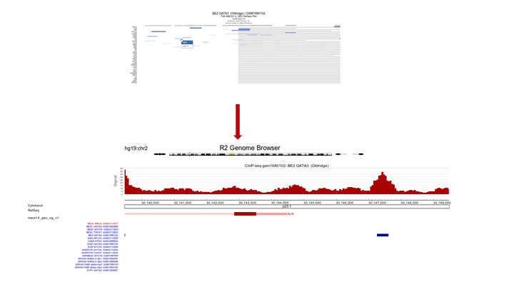
	
	[**Figure 10: ALK profile within GATA3 ChIP-seq experiment**](_static/images/IntAnalysis_ChIPSeq_GATA3_ALKprofile.png)
	
	
	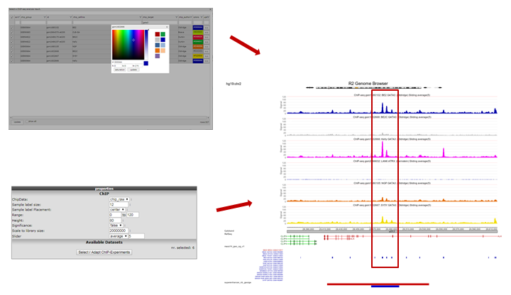
	
	[**Figure 11: GATA3 binding data around the ALK gene in multiple datasets**](_static/images/IntAnalysis_ChIPSeq_Alk_GATA3_oldridge.png)
	

## Step 3: Exploring histone modification patterns

Within R2 the regions of histone modification are calculated with the RSEG algorithm. The relative contributions of acetylation and methylation can be used to determine whether a region can be considered to be actively transcribed or to function as enhancer. This assignment can be further corroborated by including actual Transcription Factor binding data. 

1. To perform such analyses go back to the ChIP-seq choice menu. Again choose the *ChIPseq TSS Peak/Coverage Plotter*. Use the grid to filter for the experiment used in this example: the SY5Y cellline that was profiled by Oldridge et al. for H3K27 acetylation, the RSEG peaks of this experiment are additionally scored by ROSE.

2. On the next page indicate the region to show on either side of the TSS; a commonly used value is 100 KB up and downstream; that makes 100000 for *Distance (flank)* an appropiate setting. Also indicate how many bases are to be collected within a bin. Do note that images are getting very large with small bin-sizes in combination with large regions, 1000 is a proper value in this case. Paste the same set of genes as used above in the genesymbols box. Set the *Gene order* to 'by_row_signal'; this will make sure the gene with most enhancers in this region will top the list. Additionally we're going to color the genebodies of ALK and BRD4: copy-paste without quotation marks "ALK;3BAA3B" and on the next line "BRD4;AA0000" in the *color genebodies* textbox and choose 'Selected genes only' for the setting *Draw Gene Bodies*. 
	
---------
  **Did you know that you can provide arbitrary locations on the genome?**

> *Other than GeneSymbols (where R2 will find the most downstream TSS for you) to jump to a different location on the genome, you can also provide genome positions in the center panel, e.g. *Chromosome* 'chr1', *Start* '10020035', *End* 'chr1:10020035'. Or try clicking on a different part of the chromosome strand above the graph section.*

---------
	
3. R2 now shows for all provided genes a 100 Kb region up and downstream of the TSS. Note that the genebody of ALK and BRD4 are colored green and red respectively. Projected on the stretch are the bins that the Rseg-ROSE algorithm considers super-enhancers (Figure 12). Each stretch is clickable and will open a new tab. Click the topmost gene.
	
	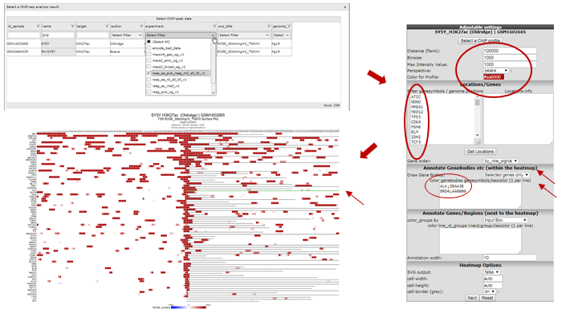
	
	[**Figure 12: Histone acetylation around the TSS of a set of genes**](_static/images/IntAnalysis_ChIPSeq_list_RSEG.png)
	
4. For the topmost gene the acetylation data is shown on the chosen stretch. To further analyze what's going on we'll add GATA3 binding data and methylation data for the same cell line by checking the appropriate boxes. Click "redraw". Note especially the region to the right where a super-enhancer is located, methylation signal is lower and there is not much GATA binding (Figure 13).
	
	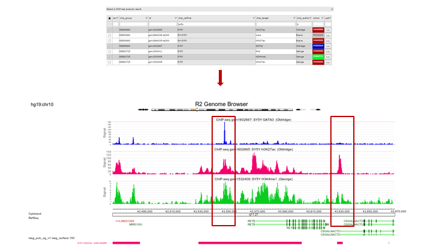
	
	[**Figure 13: ChIP-seq signals around the TSS of a single gene**](_static/images/IntAnalysis_ChIPSeq_HistoneAcetylation_for_topgene_a.png)
	
## Step 4: Finding active super-enhancers

1. We're now going to explore the ChIP-seq data the other way around, from the super-enhancer perspective. The selection of histone modified stretches on the genome are judged as super-enhancers by the ROSE algorithm. In R2 the most active regions can be explored through an interactive ROSE plot. Go back to the ChIP-seq choice menu, this time choose *ROSE Super Enhancer Plot*

2. In the next screen, change the *GenomeBuild* to 'hg19' and click "Next"; The same algorithm as above is chosen: *rose_se_pub_rseg_m2_s0_t0_v1*

3. Again select the SY5Y dataset from Oldridge in the next panel
	
	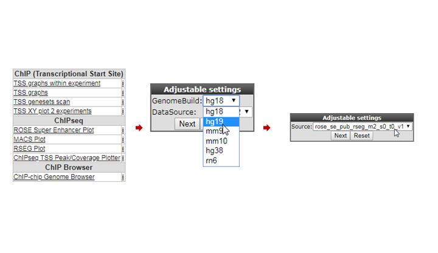
	
	[**Figure 14: Selecting super-enhancers from an interactive ROSE plot**](_static/images/IntAnalysis_ChIPSeq_Rose_select.png)
	

4. R2 shows an interactive ROSE plot (Figure 15); dots in red are clickable and represent areas on the genome that ROSE has assigned as super-enhancer. Click one of them. In this example the 5th ranked enhancer was chosen.

	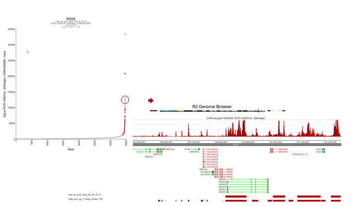
	
	[**Figure 15: Selecting super-enhancers from an interactive ROSE plot**](_static/images/IntAnalysis_ChIPSeq_Rose_Genomebr.png)

5. R2 opens a new panel showing the location on the genome of the super-enhancer. To further explore which genes might be influenced, rescale the signal to a value of 150 (*Range*), put *Slider* to 'median' with value 5 and zoom out. The resulting picture shows that there are several genes in the proximity (Figure 16). Also present are other super-enhancers nearby. Feel free to toy around with the settings, and corroborate your findings by showing additional datasets in the same region.
	
	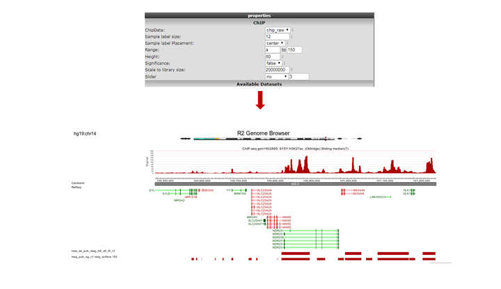
	
	[**Figure 16: The genomic context of a top-ranking super-enhancer**](_static/images/IntAnalysis_ChIPSeq_Rose_Genomebradapt.png)

Note the "Load/ Store Profile" button in the upper-right corner of the page. With this button your chosen settings can be stored as a profile. Such a profile can be retrieved later on, and function as a template to wander on the genome using the same settings.  

## Final remarks

Any ChIP-seq dataset can profit from the visualizations provided by R2, just contact us if you want your data added.
In R2 the ChIP-seq data visualization is still under development, any suggestions for improvements are welcome.
Mail us at r2-support@amc.nl, also if you have any questions or remarks.
