

Integrative analysis: ChIP-Seq data
===================================

*ChIP data visualization can be combined with other types of data*

Scope
---
-	Provide an introduction to the concepts and algorithms used in ChIP-Seq data
-	Check the properties of binding sites based on methylation and acetylation data
-	Relate this to expression data
-	Investigate the location of super enhancers on the genome

Some concepts
---

Given the advanced character of this type of data analysis, some introduction on the concepts and algorithms used is in place.

### What is ChIP-Seq
With **C**hromatine **I**mmuno **P**recipitation binding of elements to the genome can be studied. Transcription of DNA to RNA is regulated by the binding of these elements. These can be Transcription Factors, that bind temporarily to start transcription, but also chemical modification of the histones (molecular structures that coil the DNA) by methylation, acetylation, etc. (Figure 1) These modifications change the accessibility of the DNA for transcription. 

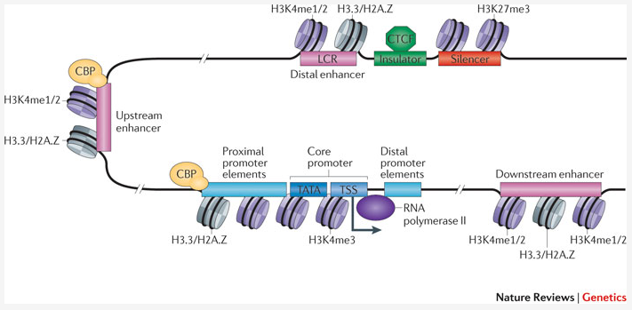

[**Figure 1: Transcription; taken from Nature Reviews Genetics 12, 283-293 (April 2011)**](_static/images/IntAnalysis_ChIPSeq_Transcription.png)

When a specific antibody is used in the pulldown that recognizes these chemically modified regions, these specific regions can be studied. Regions with H3K27Ac acetylation mark active enhancers and active transcription, H3K4Me3 methylation marks active and poised transcription (Figure 2). Studying the relative contributions of both types of modifications allows a researcher to discern enhancer regions from active transcription sites.

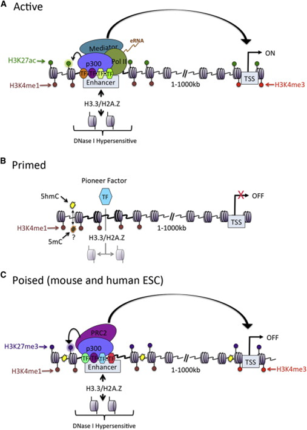

[**Figure 2: Specific chemical modifications mark specific states of cis-regulatory elements; taken from doi:10.1016/j.molcel.2013.01.038**](_static/images/IntAnalysis_ChIPSeq_ModificationTypes.png)

The assembly of the billions of fragments that result from a ChIPSeq experiment is a challenge. Algorithms to combine and map the reads into a consistent representation are under development. R2 allows you to study the outcome of these computationally intensive calculations through an intuitive visualization. Most default settings are suitable for a first impression of your data, to adapt certain parameters requires some knowledge about the actual computation, so we'll explain some of the concepts used below.

#### Peak calling 

R2 provides a couple of algorithms to assess significant enrichment ChIP between experiment and control.  
First is the MACS algorithm; this is often used in ChIP-seq data analyses and publications. In R2 it is used to study the binding of transcription factors. It's drawback is that it is not very suitable for broad signals.

Some experiments can also be analyzed with the MACS2 algorithm. In this version it is possible to detect narrow (like transcription factors) or broad (like histone modifications). 

Yet another algorithm is RSEG; it is especially designed for histone modification detection. In R2 this used to analyse the histone modification patterns. To distinguish between specific histone modifications (e.g. acetylation vs methylation), R2 allows you to assess the same region in two profiles.

In the sections below, we will briefly explain how you can utilize and visualize the peaks as well as the histogram data (landscapes) that is available for most of the experiments.
  
#### Super enhancers
An *enhancer* is a short (50-1500 bp) region of DNA that can be bound by proteins (activators) to increase the likelihood transcription will occur at a gene. They can be located up to 1 Mbp (1,000,000 bp) away from the gene, either upstream or downstream from the start site, and either in the forward or backward direction.  A *super-enhancer* is a region of the mammalian genome comprising multiple of these enhancers, collectively bound by an array of transcription factor proteins to drive transcription of genes, often involved in regulation of cell identity. They can be up to 20 times the size of an enhancer.

For identification of super enhancers R2 uses the *R*ank *O*rdering of *S*uper-*E*nhancers algorithm (ROSE; [more on the algorithm here](http://www.cell.com/abstract/S0092-8674(13)00392-9)). This takes the peaks called by RSEG for acetylation and calculates the distances in-between to judge whether they can be considered super-enhancers. The ranked values can be plotted and by locating the inflection point in the resulting graph, super-enhancers can be assigned. It can also be used with the MACS calculated data (figure 3).

[**Figure 3: Result of a typical ROSE analysis. Above the inflection point, marked in red, are super-enhancer regions**](_static/images/IntAnalysis_ChIPSeq_InflectionPoint.png)

Now that these concepts have been explained we're going to see how the ChIPSeq data can be accessed through R2.

## Step 1: Choosing data and modules

1. To enter the ChIP-Seq analysis module in R2 select *ChIPSeq data* in Box 3 (Fig 4).
	
	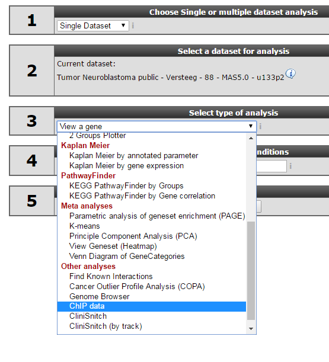
	
	[**Figure 4: Choose the ChIPSeq module**](_static/images/IntAnalysis_ChIPSeq_ChooseInMenu3.png)
	
2. See figure 5. Several analysis paths start here. First we're going to explore the genomic environment of some genes in context of ChIP-seq data.   
	
	
	
	[**Figure 5: ChIPSeq Menu in R2**](_static/images/IntAnalysis_ChIPSeq_ChIPSeqMenu_a.png)
	

## Step 2: Exploring genes in a transcriptional context

1. As a first toe in the water we'll explore our favorite gene. We'll use the MYCN gene, but you can choose your own. In the ChIP-seq menu choose the *ChIP-chip Genome Browser*

2. In the next screen type the name of your gene in left upper corner in find shield field (that's what's being used to map the annotation) and click "Go". For now the MYCN gene is already pre-selected accordingly. 

3. You can select the proper transcript in the next screen; click view on the link in front.
	
	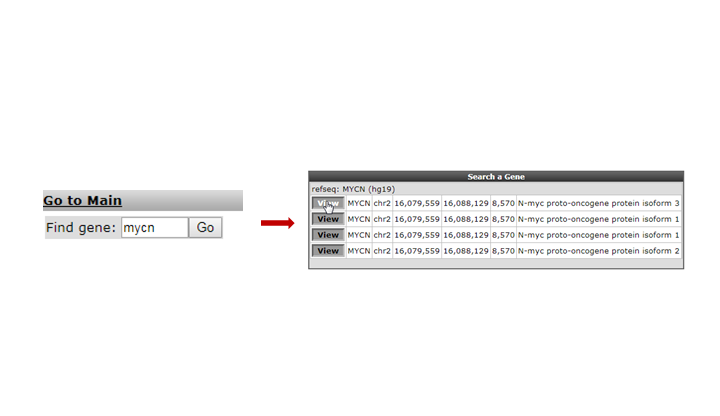
	
	[**Figure 6: Looking up a single gene in the R2 Genome Browser in ChIP-Seq context**](_static/images/IntAnalysis_ChIPSeq_SingleGene_a.png)
	
4. You have now selected the mycn of another gene as starting point top to select a chipseq experiment of interest. In the left corner at the bottom .........

[- click update in figure 7] 
[- next figure  select the proper tracks in the left panel] .

	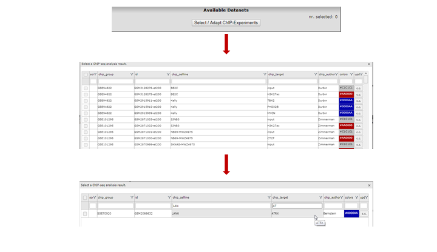
	
	[**Figure 7: The MYCN gene in ChIP-seq context**](_static/images/IntAnalysis_ChIPSeq_MYCN_a.png)

You're now in the R2 genome browser in ChIP-seq context (Figure 6). Centered in view is the stretch on the genome where your gene is located. Zooming and panning is enabled through buttons or by selecting an area. [See chapter 16 for more on this](Using_The_Genome_Browser.html#step-2-zooming-and-panning). The lower left panel contains ChIP-seq datasets that can be added to the center view. The right panel has additional public data available to show there as so called tracks. In the center panel you control what is being drawn. In Fig 7 a dataset on ATRX binding in the cell line LAN is selected. Also two genome annotation tracks have been selected before re-drawing: the dbsuper enhancer and Neuroblastoma super enhancer sets. In the resulting picture these are drawn as colored blocks underneath the genome strand. Also added, above the genome strand, are the ATRX ChIP-seq binding peaks. Zooming out reveals that there is more binding in front of the MYCN gene. 
	
	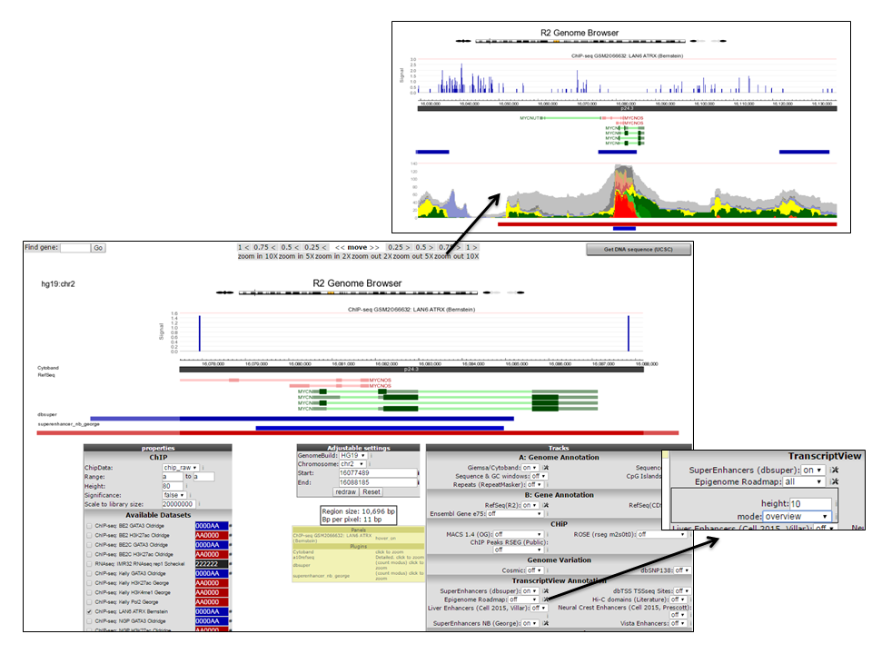
	
	[**Figure 7: The MYCN gene in ChIP-seq context**](_static/images/IntAnalysis_ChIPSeq_MYCN.png)
	
5. Of course this would be a tedious job for a list of genes. Suppose we obtained a list of differentially expressed genes from a transcription factor regulation experiment. [You can find the list here](_static/files/DiffExprCancerGenesList.txt), as additional requirement we selected for genes having a known cancer association. Go back to the ChIP-seq choice menu. Now choose the *ChIPseq TSS Peak Plotter* 

6. We're going to inspect Transcription Factor binding; so select the macs datatype in the next screen.

7. On the next page you can add the list of genes; or type genes you're interested in. In the *Gene Order* selection box select *by_row_signal* and make sure all gene bodies will be drawn. Click next (Figure 8).
	
	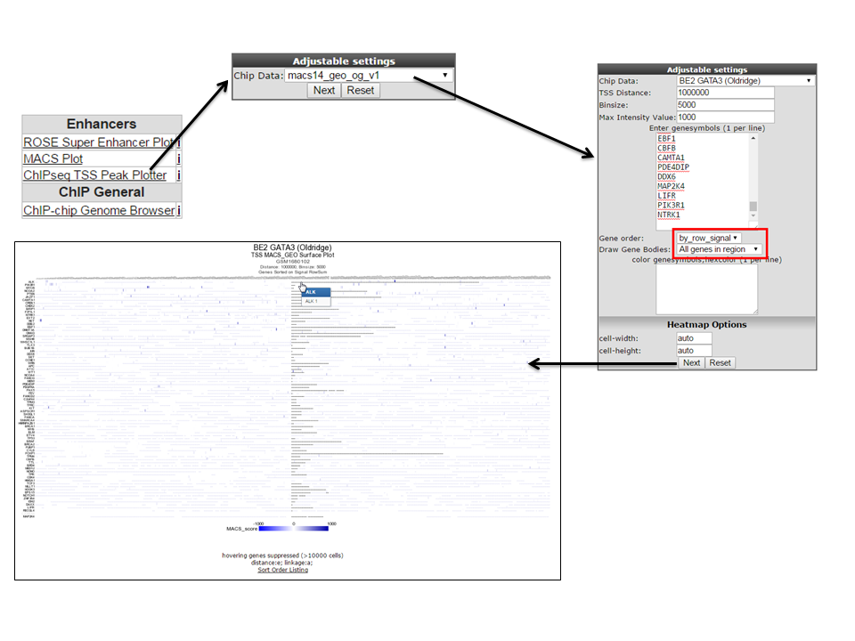
	
	[**Figure 8: Selecting GATA binding data for a set of genes**](_static/images/IntAnalysis_ChIPSeq_GATA_binding_for_set.png)
	
8. In an overview all GATA ChIP binding around the genes in the selection is shown. Since the ordering puts the gene with the highest signal we'll select that gene; ALK. In a new tab the resulting view of the gene location is plotted in the R2 Genome Browser. The view can be adapted by ticking additional datasets; e.g. GATA ChIPseq experiments in other cell lines. Colors of the data can be adapted to easily distinguish them. Additional zooming in produces Figure 9 from which it is apparent that in some specific cell lines there is binding of ATRX near the Transcription Start Site of ALK.
	
	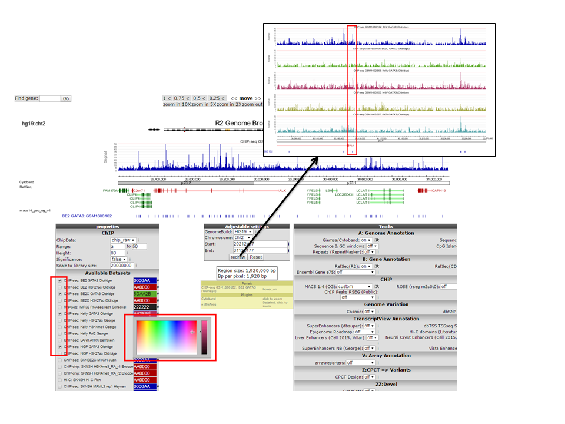
	
	[**Figure 9 Selecting GATA binding data around the ALK gene**](_static/images/IntAnalysis_ChIPSeq_GATA_binding_for_ALK.png)
	
## Step 3: Exploring histone modification patterns

1. Within R2 the regions of histone modification are calculated with the RSEG algorithm. The relative contributions of acetylation and methylation can be used to determine whether a region can be considered to be actively transcribed or as having enhancer functionality. This assignment can be further corroborated by including actual Transcription Factor binding data. To perform such analyses go back to the ChIP-seq choice menu. Again choose the *ChIPseq TSS Peak Plotter* 

2. Choose *ROSE_se_pub_rseg_m2_s0_t0_v1* as algorithm in the Adjustable Settings dialog. This denotes that the RSEG peaks will be additionally scored by ROSE. Click next.

3. In the next screen we choose a dataset, for this example take the SY5Y cellline that was profiled by Oldridge e.a. for acetylation. Indicate the region to show on either side of the TSS; a commonly used value is 50 KB up and downstream; so 100.000. Also indicate how many bases are to be collected within a bin. Do note that images are getting very large with small bin-sizes in combination with large regions; 1000 is a proper value in this case. Paste the same set of genes as used above in the genesymbols box. Additionally we're going to color the genebodies of genes of interest; in our case ALK. Set the gene order to *by_row_signal* ; this will make sure the gene with most enhancers in this region will top the list. 
	
---------
  **Did you know that you can provide arbitrary locations on the genome?**

> *Other than GeneSymbols (where R2 will find the most downstream TSS for you), you can also provide genome positions in the form of 'chr1:10020035:-' or 'chr1:10020035' where +/- indicates the strand and thus orientation. If no strand information is provided, R2 assumes +.*

---------
	
4. R2 now shows for all provided genes a 100 Kb region up and downstream of the TSS. Note that the genebody of ALK is colored green. Projected on the stretch are the bins that the Rseg-ROSE algorithm considers super-enhancers (Figure 10). Each stretch is clickable and will open a new tab. Click the topmost gene.
	
	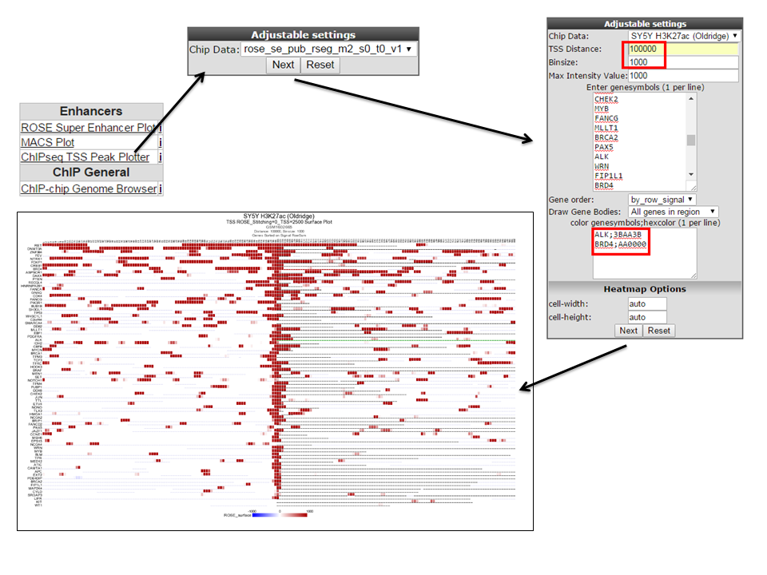
	
	[**Figure 10: Histone acetylation around the TSS of a set of genes**](_static/images/IntAnalysis_ChIPSeq_HistoneAcetylation_for_set.png)
	
5. For the topmost gene the acetylation data is shown on the chosen stretch. To further analyze what's going on we'll add GATA3 binding data and methylation data for the same cellline by checking the appropriate boxes. Click redraw. Note especially the region to the right where a super-enhancer is located, methylation signal is lower and there is not much GATA binding (Figure 11).
	
	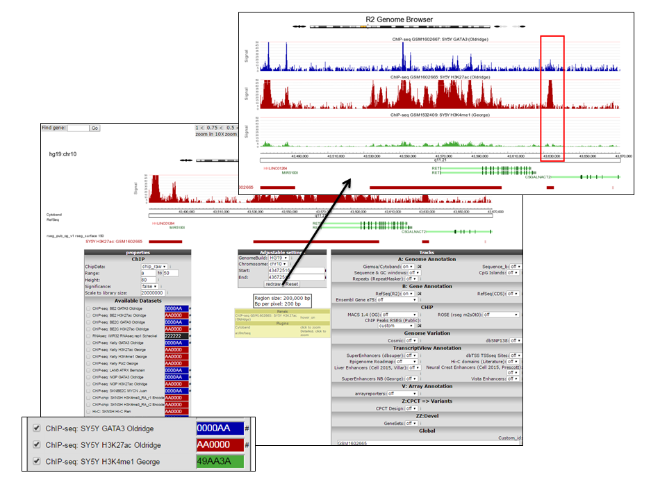
	
	[**Figure 11: ChIPseq signals around the TSS of a single gene**](_static/images/IntAnalysis_ChIPSeq_HistoneAcetylation_for_topgene.png)
	
## Step 4: Finding active super-enhancers

1. We're now going to explore the ChIPseq data the other way around, from the super-enhancer perspective. The selection of histone modified stretches on the genome are judged as super-enhancers by the ROSE algorithm. In R2 the most active regions can be explored through an interactive ROSE plot. Go back to the ChIPseq choice menu, this time choose *ROSE Super Enhancer Plot*

2. In the next screen the same algorithm as above is chosen: *ROSE_se_pub_rseg_m2_s0_t0_v1*

3. Select the same SY5Y dataset from Oldridge in the next panel
	
	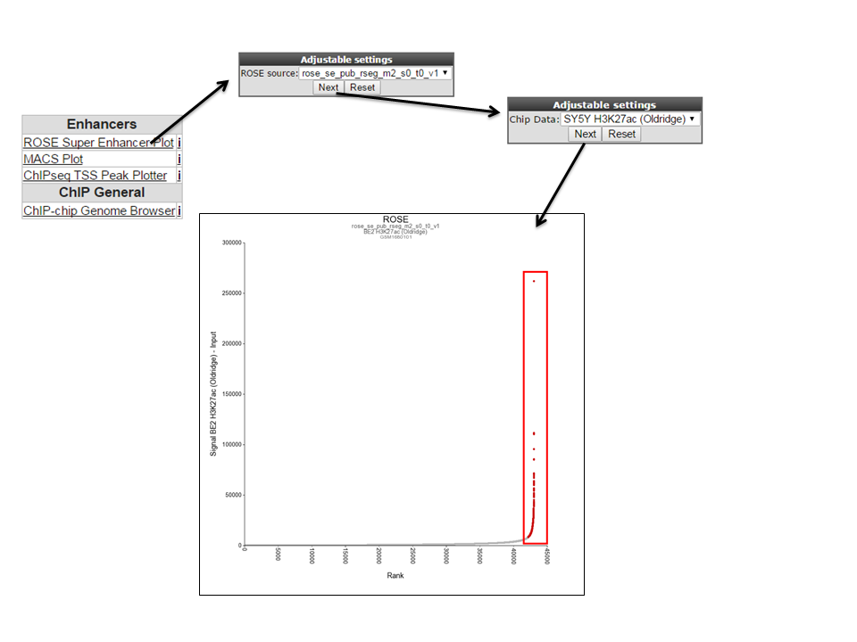
	
	[**Figure 12: Selecting super-enhancers from an interactive ROSE plot**](_static/images/IntAnalysis_ChIPSeq_SuperEnhancer_from_ROSE_plot.png)
	
4. R2 shows an interactive ROSE plot (figure 12); dots in red are clickable and represent areas on the genome that ROSE has assigned as super-enhancer. Click one of them. In this example the 5th ranked enhancer was chosen.

5. R2 opens a new panel showing the location on the genome of the super-enhancer. To further explore which genes might be influenced, rescale the signal to a value of 150 and zoom out. The resulting picture shows that there are several genes in the proximity (Figure 13). Also present are other super-enhancers nearby. Feel free to toy around with the settings, and corroborate your findings by showing additional datasets in the same region.
	
	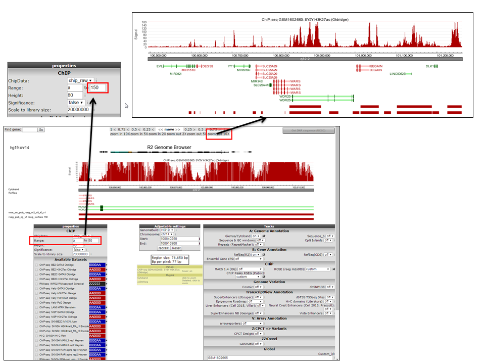
	
	[**Figure 13: The genomic context of a top-ranking super-enhancer**](_static/images/IntAnalysis_ChIPSeq_TopRanking_SuperEnhancer.png)
	
## Final remarks

Any ChIPseq dataset can profit from the visualizations provided by R2, just contact us if you want your data added.
In R2 the ChIP-Seq data visualization is still under development, so any suggestions for improvements are welcome.
Mail us at r2-support@amc.nl , also if you have any questions or remarks.

