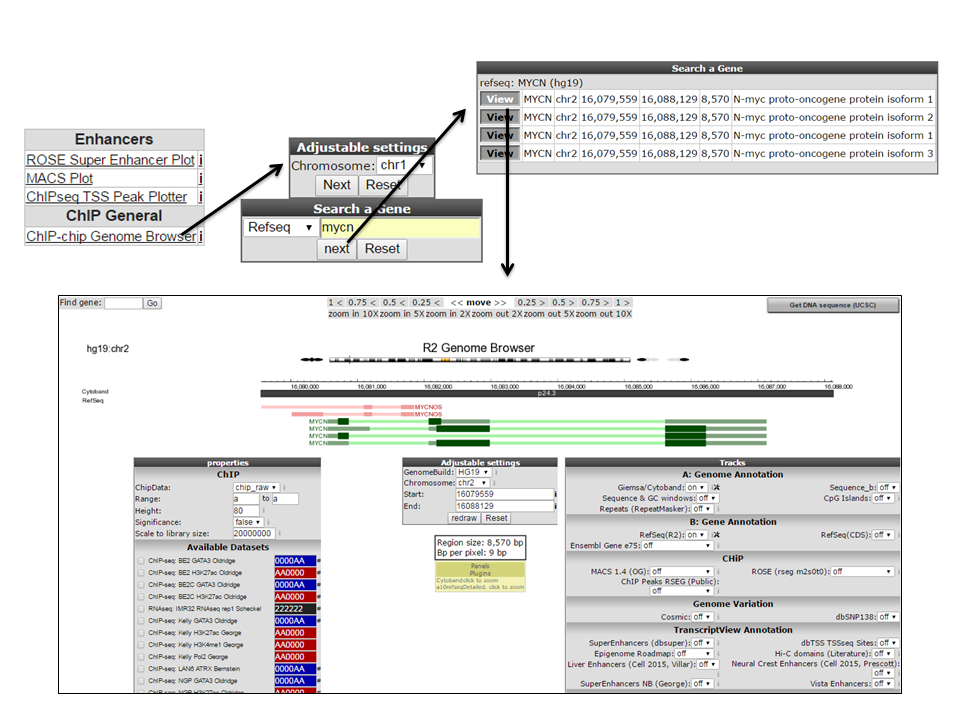

Integrative analysis: ChIP-Seq data
===================================

*ChIP data visualization can be combined with other types of data*

Scope
---
-	Provide an introduction to the concepts and algorithms used in ChIP-Seq data
-	Check the properties of binding sites based on methylation and acetylation data
-	Relate this to expression data
-	Investigate the location of super enhancers on the genome

Some concepts
---

Given the advanced character of this type of data analysis, some introduction on the concepts and algorithms used is in place.

### What is ChIP-Seq
With **C**hromatine **I**mmuno **P**recipitation binding of elements to the genome can be studied. Transcription of DNA to RNA is regulated by the binding of these elements. These can be Transcription Factors, that bind temporarily to start transcription, but also chemical modification of the histones (molecular structures that coil the DNA) by methylation, acetylation, etc. (Figure 1) These modifications change the accessibility of the DNA for transcription. 

[**Figure 1: Transcription; taken from Nature Reviews Genetics 12, 283-293 (April 2011)**](_static/images/IntAnalysis_ChIPSeq_Transcription.png)

When a specific antibody is used in the pulldown that recognizes these chemically modified regions, these specific regions can be studied. Regions with H3K27Ac acetylation mark active enhancers and active transcription, H3K4Me3 methylation marks active and poised transcription (Figure 2). Studying the relative contributions of both types of modifications allows a researcher to discern enhancer regions from active transcription sites.

[**Figure 2: Specific chemical modifications mark specific states of cis-regulatory elements; taken from doi:10.1016/j.molcel.2013.01.038**](_static/images/IntAnalysis_ChIPSeq_ModificationTypes.png)

The assembly of the billions of fragments that result from a ChIPSeq experiment is a challenge. Algorithms to combine and map the reads into a consistent representation are under development. R2 allows you to study the outcome of these computationally intensive calculations through an intuitive visualization. Most default settings are suitable for a first impression of your data, to adapt certain parameters requires some knowledge about the actual computation, so we'll explain some of the concepts used below.

#### Peak calling 

R2 provides two algorithms to assess significant enrichment ChIP between experiment and control.  
First is the MACS algorithm; this is often used in ChIP-seq data analyses and publications. In R2 it is used to study the binding of transcription factors. It's drawback is that it is not very suitable for broad signals.

The other algorithm is RSEG; it is especially designed for histone modification detection. In R2 this used to analyse the histone modification patterns. To distinguish between specific histone modifications (e.g. acetylation vs methylation), R2 allows you to assess the same region in two profiles. 
  
#### Super enhancers
An *enhancer* is a short (50-1500 bp) region of DNA that can be bound by proteins (activators) to increase the likelihood transcription will occur at a gene. They can be located up to 1 Mbp (1,000,000 bp) away from the gene, either upstream or downstream from the start site, and either in the forward or backward direction.  A *super-enhancer* is a region of the mammalian genome comprising multiple of these enhancers, collectively bound by an array of transcription factor proteins to drive transcription of genes, often involved in regulation of cell identity. 

For identification of super enhancers R2 uses the *R*ank *O*rdering of *S*uper-*E*nhancers algorithm (ROSE; [more on the algorithm here](http://www.cell.com/abstract/S0092-8674(13)00392-9)). This takes the peaks called by RSEG for acetylation and calculates the distances in-between to judge whether they can be considered super-enhancers. The ranked values can be plotted and by locating the infliction point in the resulting graph, super-enhancers can be assigned. It can also be used with the MACS calculated data (figure 3).

[**Figure 3: Result of a typical ROSE analysis. Above the inflection point, marked in red, are super-enhancer regions**](_static/images/IntAnalysis_ChIPSeq_InflectionPoint.png)

Now that these concepts have been explained we're going to see how the ChIPSeq data can be accessed through R2.

## Step 1: Choosing data and modules

1. To enter the ChIP-Seq analysis module in R2 select *ChIPSeq data* in Box 3 (Fig 4).
	
	
	
	[**Figure 4: Choose the ChIPSeq module**](_static/images/IntAnalysis_ChIPSeq_ChooseInMenu3.png)
	
2. See figure 5. Several analysis paths start here. First we're going to explore the genomic environment of some genes in context of ChIP-seq data.   
	
	
	
	[**Figure 5: ChIPSeq Menu in R2**](_static/images/IntAnalysis_ChIPSeq_ChIPSeqMenu.png)
	

## Step 2: Exploring genes in a transcriptional context

1. As a first toe in the water we'll explore our favorite gene. We'll use the MYCN gene, but you can choose your own. In the ChIP-seq menu choose the ChIP-chip Genome Browser

2. In the next screen type the name of your gene in the refseq field (that's what's being used to map the annotation) and click next.

3. You can select the proper transcript in the next screen; click view on the link in front.
	
	
	
	[**Figure 6: Looking up a single gene in the R2 Genome Browser in ChIP-Seq context**](_static/images/IntAnalysis_ChIPSeq_SingleGene.png)
	
4  You're now in the R2 genome browser in ChIP-seq context (Figure 6). Centered in view is the stretch on the genome where your gene is located. Zooming and panning is enabled through buttons or by selecting an area. [See chapter 16 for more on this](Using_The_Genome_Browser.html#step-2-zooming-and-panning). The lower left panel contains ChIP-seq datasets that can be added to the center view. The right panel has additional public data available to show there as so called tracks. In the center panel you control what is being drawn. In Fig 7 a dataset on ATRX binding in the cell line LAN is selected. Also two genome annotation tracks have been selected before re-drawing: the dbsuper enhancer and Neuroblastoma super enhancer sets. In the resulting picture these are drawn as colored blocks underneath the genome strand. Also added, above the genome strand, are the ATRX ChIP-seq binding peaks. Zooming out reveals that there is more binding in front of the MYCN gene. 
	
	
	
	[**Figure 7: The MYCN gene in ChIP-seq context**](_static/images/IntAnalysis_ChIPSeq_MYCN.png)
	
5. Of course this would be a tedious job for a list of genes. Suppose we obtained a list of differentially expressed genes from a transcription factor regulation experiment. We're going to explore a list of genes in the context of a set of ChIPSeq datasets. 

## Step 3: Exploring histone modification patterns

1. Within R2 the regions of histone modification are calculated with the RSEG algorithm.

## Step 4: Finding active super-enhancers

1. R2 provides easy access to potential enhancer regions for specific datasets

## Final remarks

In R2 the ChIP-Seq data visualization is under development, so any suggestions are welcome.
Mail us at r2-support@amc.nl , also if you have any questions or remarks.

