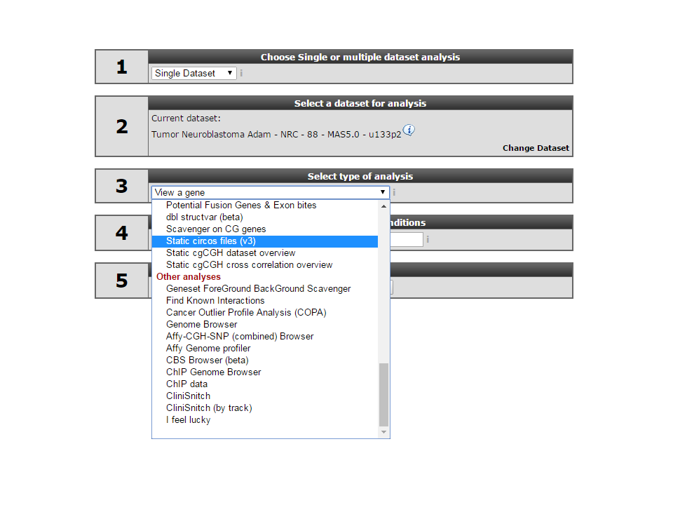
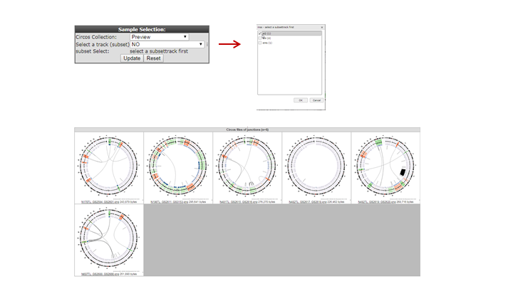
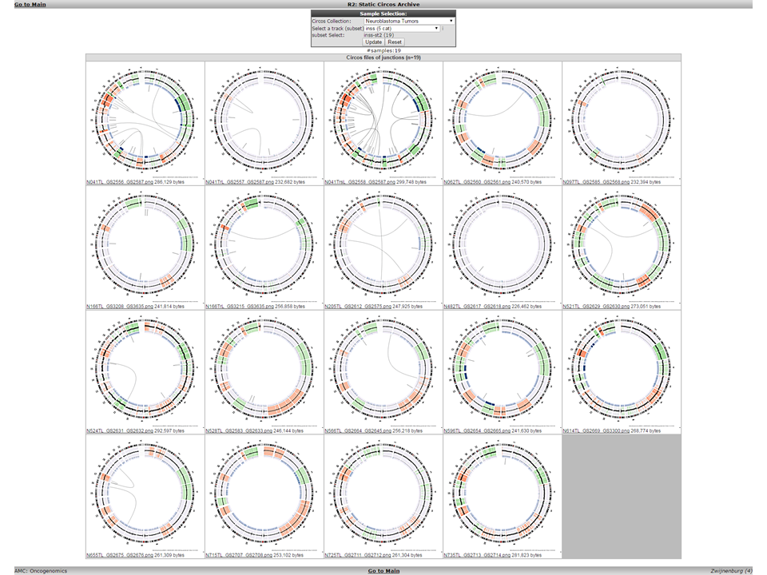
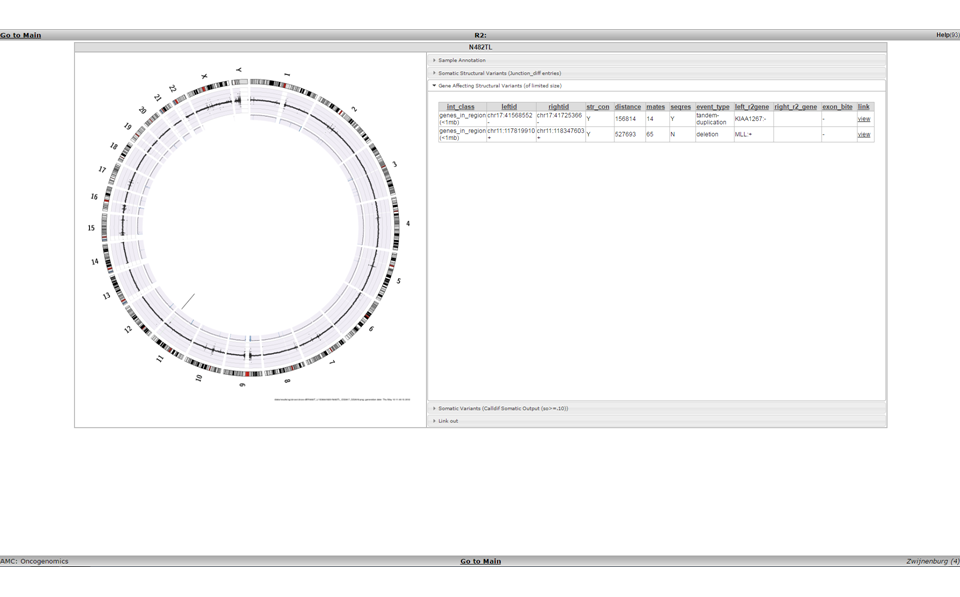
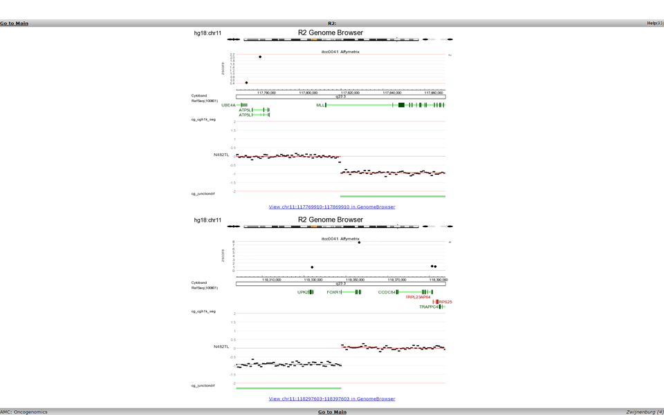
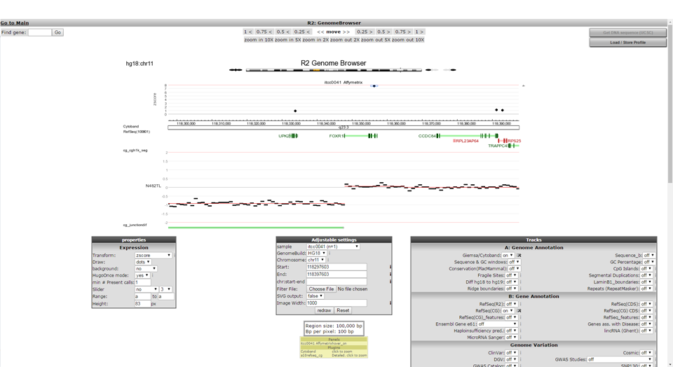
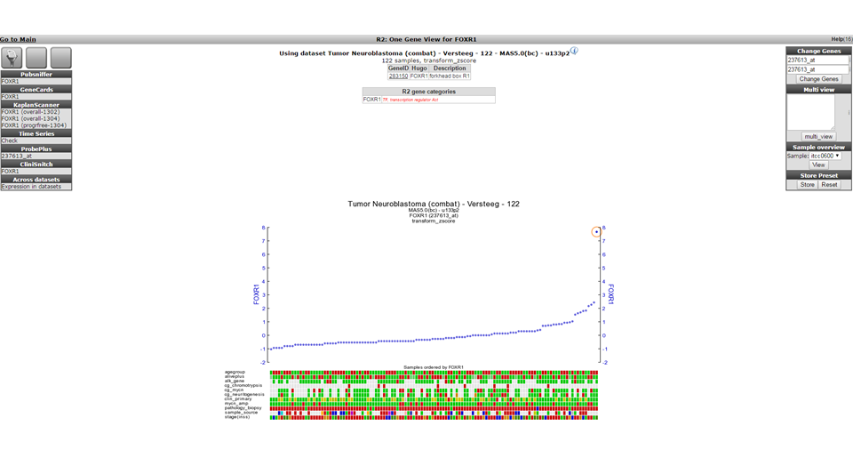

Integrative Analysis : WGS/NGS data
===========================================

*Datatypes: Whole Genome Sequencing data and expression data*

Scope
-----
- In this part R2 is used to provide information about how Whole Genome Sequencing (WGS) data can be viewed, shared and analyzed.
  This is a specialized topic for which you need access to a dataset containing such information. Most likely close collaboration is needed to tailor your own data to your needs.

## Step 1: View circos files.

1. To view circos plots of the sequenced genomes in R2, select *Static circos files (v3)* in Box 3 (Fig 1).
	
	
	
	[**Figure 1: Choose the Circos plot module**](_static/images/IntAnalysis_WGS_main_staticCircosFiles.png)
	
2. Select a subset of samples by using the menu on the top.
	- Select *inss (cat 3)* from the select a track (subset) selection box.
	- Select *st2 (1)* from the pop-up selection window and click 'OK'.
	
	
	
	[**Figure 2: Select a subset of samples**](_static/images/IntAnalysis_WGS_SelectSubset_a.png)
	
2. In Neuroblastoma whole and partial chromosome gains and losses are frequent. This is indicated by the red and green colouring of the cgh-like scatterplots.
	- One sample doesn't appear to have large structural defects (N482TL).
	- N482 indicates the sample_id, TL indicates that the circos plot shows data of the **T**umor compared to the **L**ymphocytes DNA sequence data.
	- Click on the N482TL tile and go to the newly opened tab of your browser.

	
	
	[**Figure 3: Circos plot**](_static/images/IntAnalysis_WGS_inssSt2Subset.png)
	
3. Here we entered the detailed view of the circos plot section.
   On the right side you can open different information tabs.
	1.	Sample annotation.
	2.	Somatic structural variants.
	3.	Somatic structural variants of a limited size inside or close to genes that could be affected by them.
	4.	Hight quality non structural somatic variants.
	5.	A link out to the genome browsers showing a cgh-like plot of the sequencing data of a region of interest.

	
	
	[**Figure 4: Cgh-like plot in the Genome Browser**](_static/images/IntAnalysis_WGS_CircosDetailView.png)
	
	- When you open the *Gene Affecting Structural Variants (of limited size)* tab you can now see two variants listed and not one as shown in the circos plot.
	  For the circos plot a higher threshold was used for the read pair matches. For the table we show more but less accurate data.
	- Click on *view* inside the *link* column.
	- This opens a double genomebrowser view showing both sides of the selected structural variation.

	
	
	[**Figure 5: Structural variant in Genome Browser**](_static/images/IntAnalysis_WGS_StucVarDuoPlot.png)

4. When the link under a genomebrowser location view is clicked the same location is shown inside the full genomebrowser view.
   Here you will be able to use the zoom buttons and select extra data to plot with the cgh-like scatterplot and junction information.
   For this sample there is also affymetrix gene expression data available. Here the zscore is shown above the cgh-like plot.

	
	
	[**Figure 6: Including Array data in the scatterplot**](_static/images/IntAnalysis_WGS_StucVarGenomebrowser.png)
	
5. The *FOXR1* gene shows a high zscore and by clicking on the dot above this gene you wil be taken into the one gene view of r2 showing the expression of this gene inside a Neuroblastoma tumor series. The investigated tumor is highlighted with a red circle.

	
	
	[**Figure 7: FOXR1 in the tumorseries**](_static/images/IntAnalysis_WGS_FoxM1oneGeneView.png)

Using the MegaSampler tool from within R2 you can also show that the FOXR1 gene is only expressed in a hand full of samples out out thousands, and that these mostly are neuroblastoma cases. Out of the samples that could be checked, all appear to have created in-frame fusions with FOXR1. All of these findings, and additional experiments proving that FOXR1 can serve as an oncogene in neuroblastoma have been published by Santo et al in Oncogene (2012).

