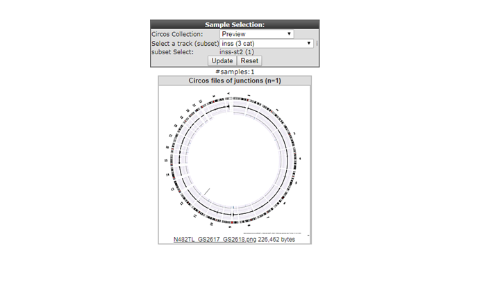

Integrative Analysis : WGS/NGS data
===========================================

*Datatypes: Whole Genome Sequencing data and expression data*

Scope
-----
- In this part R2 is used to provide information about how Whole Genome Sequencing (WGS) data can be viewed, shared and analysed.
  This is a specialized topic for with most likely close collaboration is needed to tailor your own data to your needs.
- ...

## Step 1: View circos files.

1. To view circos plots of the sequenced genomes in R2, select *Static circos files (v3)* in Box 3 (Fig 1).
	
	
	
	[**Figure 1: Choose the ChIPSeq module**](_static/images/IntAnalysis_WGS_main_staticCircosFiles.png)
	
2. Select a subset of samples by using the menu on the top.
	- Select *inss (cat 5)* from the select a track (subset) selection box.
	- Select *st2 (19)*, click confirm and *update*.
	
	
	
	[**Figure 1: Choose the ChIPSeq module**](_static/images/IntAnalysis_WGS_SelectSubset.png)
	
2. In Neuroblatoma whole chromosome and partial gains and losses are frequent. Indicated by the red and green colouring of the cgh-like scatterplots.
	- One sample doesn't apears to have large structural defects (N482TL).
	- N482 indicates the sample_id, TL indecates that the circos plot shows data of the **T**umor compared to the **L**ymphosites DNA sequence data.
	- Click on the N482TL tile and go to the newly opened tab of your browser.

	
	
	[**Figure 1: Choose the ChIPSeq module**](_static/images/IntAnalysis_WGS_inssSt2Subset.png)
	
IntAnalysis_WGS_CircosDetailView

	
	
	[**Figure 1: Choose the ChIPSeq module**](_static/images/IntAnalysis_WGS_CircosDetailView.png)
	