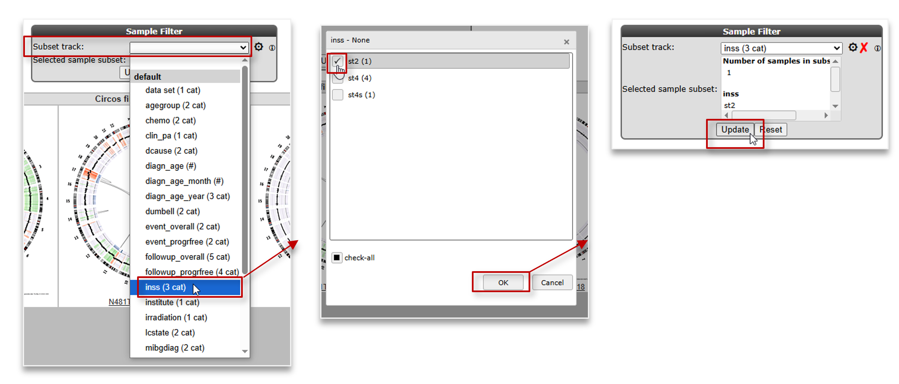

Integrative Analysis : WGS/NGS data
===========================================

*Datatypes: Whole Genome Sequencing data and expression data*

Scope
-----
- In this part R2 is used to provide information about how Whole Genome Sequencing (WGS) data can be viewed, shared and analyzed.
  Find the tools for WGS/WES data on the left side of the left menu.

  

  [**Figure 1: Find the Personalized Genomics (WGS / WES) analysis options from the left side menu**](_static/images/IntAnaWGS/IntAnalysis_WGS_LeftMenuButton.png)

## Step 1: View circos files.

1. After a click on the WGS/WES button from the left side menu on the main page (red square in Figure 1), click on the *Static circos files* link in the middle menu (Fig 2a).
From the Collection dropdown, select **Preview**
	
	
	[**Figure 2a: Choose the Circos plot module and the example Preview collection**](_static/images/IntAnaWGS/IntAnalysis_WGS_staticCircosFiles_preview.png)

You are presented with an overview of circos plots, each corresponding to a sample in this Preview collection. 
  

	
[**Figure 2b: Overview of circos plots of the Preview collection samples**](_static/images/IntAnaWGS/IntAnalysis_WGS_preview_overview.png)

In most collections, the circos plots show the karyogram in a circular layout, fragmented in chromosomal segments. Often you will find a ring containing a cgh-like scatterplot that indicates the copy number variations (green, loss; red, gain). 
In this collection, the lines traversing the ring represent interchromosomal and intrachromosomal rearrangements identified by discordant mate pairs from paired-end reads.  

To find out more about the detailed information tables on th eright of the circos plots, we will now select one sample to look further into.
  

2. You can select a subset of samples, based on metadata characteristics of the samples, by using the menu on the top.
	- Select *inss (cat 3)* from the select a track (subset) selection box.
	- Select *st2 (1)* from the pop-up selection window and click 'OK'.
    - Click on **Update**.   

	

	
[**Figure 2c: Select a subset of samples**](_static/images/IntAnaWGS/IntAnalysis_WGS_SelectSubset.png)  
  

3. 	One sample doesn't appear to have large structural defects (N482TL).  
	- N482 indicates the sample_id, TL indicates that the circos plot shows data of the **T**umor compared to the **L**ymphocytes DNA sequence data.  
	- Click on the N482TL tile and go to the newly opened tab of your browser.

(_static/images/IntAnaWGS/IntAnalysis_WGS_inssSt2Subset1a.png)
	
[**Figure 3: Circos plot**](_static/images/IntAnaWGS/IntAnalysis_WGS_inssSt2Subset1a.png)  
  

4. Here we entered the detailed view of the circos plot section.
   On the right side you can open different information tabs.
	1.	Sample annotation.
	2.	Somatic structural variants.
	3.	Somatic structural variants of a limited size inside or close to genes that could be affected by them.
	4.	High quality non structural somatic variants.
	5.	A link out to the genome browsers showing a cgh-like plot of the sequencing data of a region of interest.
   
	
	
	[**Figure 4: Structural variants**](_static/images/IntAnaWGS/IntAnalysis_WGS_CircosDetailView1a.png)
	
	- When you open the *Gene Affecting Structural Variants (of limited size)* tab you can now see two variants listed and not one as shown in the circos plot.
	  For the circos plot a higher threshold was used for the read pair matches. For the table we show more but less accurate data.
	- Click on *view* inside the *link* column.
	- This opens a double genomebrowser view showing both sides of the selected structural variation.

	
	
	[**Figure 5: Structural variant in Genome Browser**](_static/images/IntAnalysis_WGS_StucVarDuoPlot.png)

4. When the link under a genomebrowser location view is clicked the same location is shown inside the full genomebrowser view.
   Here you will be able to use the zoom buttons and select extra data to plot with the cgh-like scatterplot and junction information.
   For this sample there is also affymetrix gene expression data available. Here the zscore is shown above the cgh-like plot.

	
	
	[**Figure 6: Including Array data in the scatterplot**](_static/images/IntAnalysis_WGS_StucVarGenomebrowser.png)
	
5. The *FOXR1* gene shows a high zscore and by clicking on the dot above this gene you will be taken into the one gene view of r2 showing the expression of this gene inside a Neuroblastoma tumor series. The investigated tumor is highlighted with a red circle.

	
	
	[**Figure 7: FOXR1 in the tumor series**](_static/images/IntAnalysis_WGS_FoxM1oneGeneView.png)

Using the MegaSampler tool from within R2 you can also show that the FOXR1 gene is only expressed in a hand full of samples out of thousands, and that these mostly are neuroblastoma cases. Out of the samples that could be checked, all appear to have created in-frame fusions with FOXR1. All of these findings, and additional experiments proving that FOXR1 can serve as an oncogene in neuroblastoma have been published by Santo et al in Oncogene (2012).

