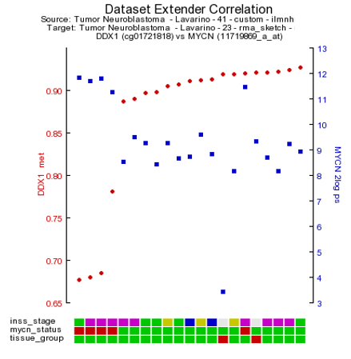

Integrative Analysis : Across Platforms
===========================================

*Datatypes: Methylation data and expression data*

Scope
-----

- Analyzing data with different datatypes this tutorial will focus on using methylation data and expression data.
- For some patients, R2 may have multiple types of measurements within the platform. Assumed  that you have access to more than one datatype (for public data, or when you are part of an r2 
- The Tumor Neuroblastoma - Lavarino - 23 - rma_sketch - u219 and Tumor Neuroblastoma - Lavarino - 41 - custom - ilmnhm450 datasets will be used for this tutorial.
- Find correlation between methylated sites within a gene and gene expression

Tutorial Step 1
-----

1.	From R2’s perspective, an analysis where multiple datatypes will be combined is an ‘across datasets’ analysis, so we need to select this from the main page in box 1.
2.	The easiest example of a combined analysis would be to simply plot the contents of 2 different types within a single plot. To do this, we select ‘view a gene in 2 datatypes’ and click ‘next’.
3.	Since R2 needs to be instructed that overlapping samples may be identified, we create so called collections, which list datasets with overlapping patients. In this tutorial, we will make use of a public cohort where both mRNA gene expression as well as Illumina 450k methylation bead chip data is available.  Select ‘’neuroblastoma_gse54721” from the collection and click ‘next’.
4.	Within the current screen you are able to select 2 datatypes to plot against each other. In the current example, only mRNA (Tumor Neuroblastoma - Lavarino - 23 - rma_sketch - u219) and Methylation (Tumor Neuroblastoma - Lavarino - 41 - custom - ilmnhm450) data is available, and within this collection only 1 option can be selected. Select the 2 datasets to combine in the pulldowns and type behind the dataset names   ‘DDX1’ in the methylation data box and ‘MYCN’ in the expression data box and click next. R2 will automatically identify overlapping samples within the current selection and create ‘subsets’ for both datasets to only allow the overlapping samples for the plot.   From the perspective of both datasets we can now select the reporter to represent the gene(s) that we indicated on the previous page.  For now we will keep the preselected reporters. Furthermore, we can select the transformation for both datasets and continue to the actual plot. Click ‘next’ to advance to the image.
5.	R2 has generated  a XY-plot with the MYCN expression values on the Y-axis against  the methylation ratios on the the X-axis (Figure 1) with the combined annotation of both datasets. Annotation is being merged on the basis of the name of a track. In a perfect setting this would never result in conflicting data, however sometimes it may happen that the different datasets contain a different annotation. In that situation, R2 will concatenate both values by a semicolon and thus create a new group identifier. If there is an obvious mistake in one of the datasets, then we appreciate a message to R2-support@amc.uva.nl on this, so that we can correct it accordingly.

	

	[**Figure 1: XY-plot Methylation versus expression**](_static/images/IntgrAnalysis_methexpr_viewagene.png)

6.	Both sides of the image represent the signals from both dataset perspectives. The image displays the correlation between the 2 datatypes for those patients that were represented in both data sets.  In this example plot we  observe two main groups,  to gain more insight in  possible characteristics for the observed groups, we can adapt the visualization in a couple of ways.  We can annotate the graph with a track distinction and color all of the circles accordingly.  To achieve this, simply select ‘color by track’ and select  at track for color  “mycn_status”   to be used for the coloring (Figure 1b) and click “Adjust Settings:.  Once redrawn, this will also add ‘boxplot’ representations on the sides of the  image to represent the signals from both dataset perspectives.
7.	Alternatively, we can also represent the image as a ‘YY’ plot, where multiple annotations will be represented underneath the image.  In the adjustable settings menu, select ‘yy’ plot and click adjust able settings. (Figure 2).

	

	[**Figure 2: XY-plot Methylation versus expression**](_static/images/IntgrAnalysis_methexpr_YY.png)

8.	As is customary for a methylation array, multiple reporters are represented around a gene. It could be of interest to inspect the methylation pattern for the other reporters of a gene. To visualize this information, we leave the current analysis by a right mouse click on  ‘Go to main’ (upper left corner). In box 2 click ‘change dataset’ , select methylation data  and the Tumor neuroblastoma Lavarino dataset (Figure 3). Type ‘DDX1’ in box 4 click next. Leave the settings at their default and click 'next'. 

	
	
	[**Figure 3:Heatmap select all reporters**](_static/images/IntgrAnalysis_methexpr_heatmapa.png)
	
	Now click on, 'view all' below de gene name. In a new screen (Figure 4) a heat map is generated with the methylation pattern for all samples of a given dataset. Beneath the heatmap the R2 genome browser is plotted with all the methylation reporters for the DDX1 gene plottend against there location on the genome. An alternative route, to the same heatmap representation would be to select 'view all reporters for a gene' in box 3 of the 'Main page'.

	

	[**Figure 4:Heatmap select all reporters**](_static/images/IntgrAnalysis_methexpr_heatmapb.png)

## Tutorial Step 2

1.	Next to simply ‘looking’ at reporters from the different datasets, we can also correlate 2 data types with each other. To achieve this, we first go back to the 'main page' by clicking on the upper left link.
2.	We would now like to identify which gene has the best association with its methylation status. Therefore we need to correlate every gene with the methylation reporters that are in the annotated (for the the same gene) to belong to a gene.
3.	Just like the previous example, we select ‘across datasets’ in box 1 and now select ‘dataset extender (within genes)’ in box 2. This will allow us to identify the best possible combinations where the expression of a gene correlates with the methylation status for the same gene.
4.	Again, we need to identify the collection within which R2 will look for the overlapping samples. Select ‘neuroblastoma_gse54721’ and click ‘next’.
5.	Leave all settings in the adjustable settings box and click ‘next’.
6.	R2 will now perform the search for you. Do keep in mind that the across dataset searches can be quite intensive as all genes are being correlated to all methylation probes. For a simple setup like the current one, more than 2 minutes will be needed to obtain the result. To reduce the strain on the servers and speed up the serving of results, R2 will store the results of an analysis for a couple of days. If you are lucky that someone else has performed the exact analysis that you are interested in in the past few days, then R2 will serve those for you (which reduces the search from 2 min to a mere couple of seconds). This routine is used at multiple places within the platform.
7.	Now R2 has generated a list of significant correlations for all the DNA-methylation reporters with the expression value of the corresponding gene (Figure 5). In Figure 5 a chromosomal overview of the significant p-value correlations are plotted,  beneath the graph a table is generated divided  in a list of genes which  have a positive or inverse correlation selected gene expression probesets and their methylation reporter counter parts. 

	

	[**Figure 5:Table of Correlations**](_static/images/IntgrAnalysis_methexpr_withingenetable.png)

	Further the green dots and red dots indicate respectively a positive correlation and negative correlation between the methylation and expression reporters for the same gene. Hoovering over the dots will reveal more details such as  the correlation values. Here you can investigate further the correlation between gene or methylation by clicking on the gene name. This will generate a YY plot of the gene expression and methylation correlation. (Figure 6b).

	
	
	[**Figure 6:Genomebrowser**](_static/images/IntgrAnalysis_methexpr_withingenechoose.png)

	Next to the YY-plot,  more insight can be obtained by using  using the interactive genome browser. The genome browser is equiped with extended search options to find and explore more regions. The genome browser is a core module within R2  and will be discussed in a separate chapter of this tutorial.    Click on the R2 – genome browser button. The genome browser graph is re-generated together with a complete panel of tools to adjust and / or annotate your visualization of the genome region where you are interested in. 

8. In the correlation plot there is clearly a high correlation visible between the expression and methylation reporters located at chromosome 2.  By clicking on the chromosome 2 area R2 will regenerate a correlation plot zoomed into chromosome 2.   In order to investigate the area in more detail you can zoom into this particular region. Press and hold the left mouse button in the designated area (Figure 8) mark the area by dragging the pointer , release de mouse button and click ‘redraw’.

	
	
	[**Figure 7:Explore chromosomal regions**](_static/images/IntgrAnalysis_methexpr_zoom.png)

On this zoom - level more known information is automatically plotted  in the  genome browser.   In this example it is shown that the DDX1 is located near to the MYCN gene on the the genome.  This could explain the high inverse correlation of the MYNC methylation reporters and expression reporteres.

---------
  **Did you know that R2 will determine the overlap between datasets automatically?**

> *R2 will scan for overlapping samples on the basis of the r2_samplename. Overlap is automatically determined and therefore can also use cohorts that are not completely overlapping. R2 will simply exclude samples that are only found in 1 of the datasets. In addition, the order in which samples are represented is also accounted for.*

---------
  **Did you know that the annotation from both datasets is combined?**

> *on the sides of the image to represent the signals from both dataset perspectives.The image displays the correlation between the 2 datatypes for those patients that were represented in both data sets. From within this view we can adapt the visualization in a couple of ways. When we look at the XY plot, we can annotate the graph with a track distinction and color all of the circles accordingly. To achieve this, simply select ‘color by track’ and select the annotation source to be used for the coloring. Once redrawn, this will also add ‘boxplot’ representations*

## Optional Tutorial Step 3

- Select Genecat from article
- use PCA module

	
	
	[**Figure 8:PCA CpG vs Non-CpG**](_static/images/IntgrAnalysis_PCA_article.png)
	
---------

