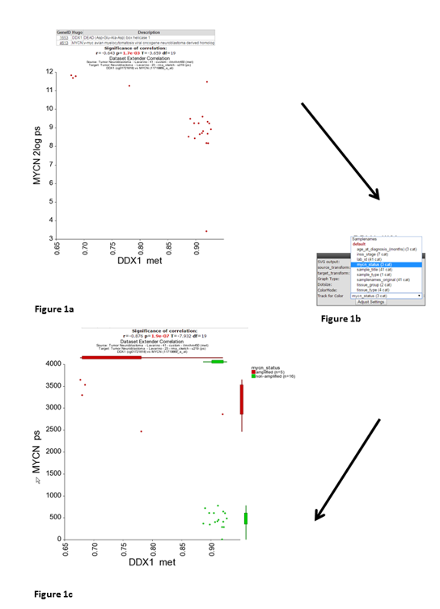

Integrative Analysis
===========================================

*Across platform: Methylation data and expression data*

Scope
-----

- Analyzing data with different datatypes this tutorial will focus on using methylation data and expression data.
- For some patients, R2 may have multiple types of measurements within the platform. Assumed  that you have access to more than one datatype (for public data, or when you are part of an r2 
- Tumor Neuroblastoma - Lavarino - 23 - rma_sketch - u219 and Tumor Neuroblastoma - Lavarino - 41 - custom - ilmnhm450 will be used for this tutorial.
- Find correlation between methylated sites within a gene and gene expression

Tutorial Step 1
-----

1.	From R2’s perspective, an analysis where multiple datatypes will be combined is an ‘across datasets’ analysis, so we need to select this from the main page in box 1.
2.	The easiest example of a combined analysis would be to simply plot the contents of 2 different types within a single plot. To do this, we select ‘view a gene in 2 datatypes’ and click ‘next’.
3.	Since R2 needs to be instructed that overlapping samples may be identified, we create so called collections, which list datasets with overlapping patients. In this tutorial, we will make use of a public cohort where both mRNA gene expression as well as Illumina 450k methylation bead chip data is available.  Select ‘’neuroblastoma_gse54721” from the collection and click ‘next’.
4.	Within the current screen you are able to select 2 datatypes to plot against each other. In the current example, only mRNA (Tumor Neuroblastoma - Lavarino - 23 - rma_sketch - u219) and Methylation (Tumor Neuroblastoma - Lavarino - 41 - custom - ilmnhm450) data is available, and within this collection only 1 option can be selected. Select the 2 datasets to combine in the pulldowns and type behind the dataset names   ‘DDX1’ in the methylation data box and ‘MYCN’ in the expression data box and click next. R2 will automatically identify overlapping samples within the current selection and create ‘subsets’ for both datasets to only allow the overlapping samples for the plot.   From the perspective of both datasets we can now select the reporter to represent the gene(s) that we indicated on the previous page.  For now we will keep the preselected reporters. Furthermore, we can select the transformation for both datasets and continue to the actual plot. Click ‘next’ to advance to the image.
5.	R2 has generated  a XY-plot with the MYCN expression values on the Y-axis against  the methylation ratios on the the X-axis (Figure 1) with the combined annotation of both datasets. Annotation is being merged on the basis of the name of a track. In a perfect setting this would never result in conflicting data, however sometimes it may happen that the different datasets contain a different annotation. In that situation, R2 will concatenate both values by a semicolon and thus create a new group identifier. If there is an obvious mistake in one of the datasets, then we appreciate a message to R2-support@amc.uva.nl on this, so that we can correct it accordingly.

	

	[**Figure 1: XY-plot Methylation versus expression**](_static/images/IntgrAnalysis_methexpr_viewagene.png)

6.	Both sides of the image represent the signals from both dataset perspectives. The image displays the correlation between the 2 datatypes for those patients that were represented in both data sets.  In this example plot we  observe two main groups,  to gain more insight in  possible characteristics for the observed groups, we can adapt the visualization in a couple of ways.  We can annotate the graph with a track distinction and color all of the circles accordingly.  To achieve this, simply select ‘color by track’ and select  at track for color  “mycn_status”   to be used for the coloring (Figure 1b) and click “Adjust Settings:.  In thOnce redrawn, this will also add ‘boxplot’ representations on the sides of the  image to represent the signals from both dataset perspectives.
7.	Alternatively, we can also represent the image as a ‘YY’ plot, where multiple annotations will be represented underneath the image.  In the adjustable settings menu, select ‘yy’ plot and click adjust able settings. (Figure 2).

Any text between restarts numbering

4.  Next list
  1. Two spaces create a sublist
  *  They can be mixed
	To continue numbering after enter or figure, indent the whole paragraph with a tab, or more tabs when in sublist
Images are formatted as follows:

[**Figure 11: the extra settings Panel**](_static/images/OneGene_Adapting.png)

Note the enter between the lines; this is to guarantee proper formatting in pdf

The Did you know box is formatted as follows

---------
  **Did you know box**

> *Three or more minusses preceded by a return create a line; the > sign in front of a paragraph indents the whole paragraph and the single asterisks put it in italic*

---------

You'll have to get used to the use of spaces and enters in Markdown; these are used for formatting

  Two spaces at the start of a line creates a paragraph
Type on here below  

  

