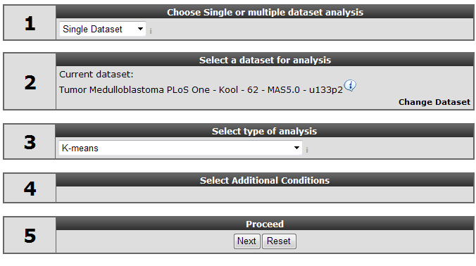
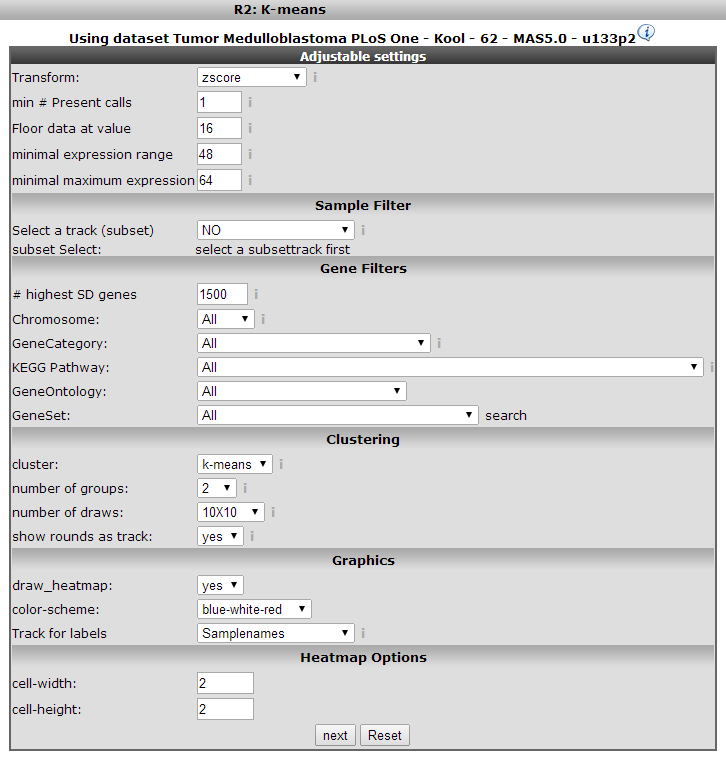
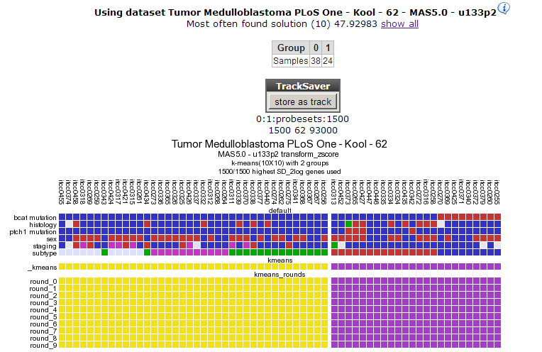
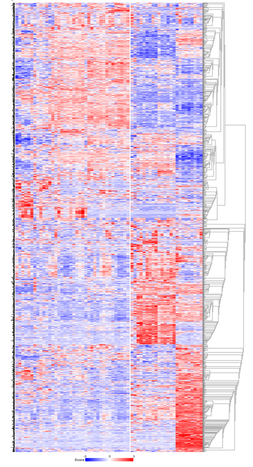
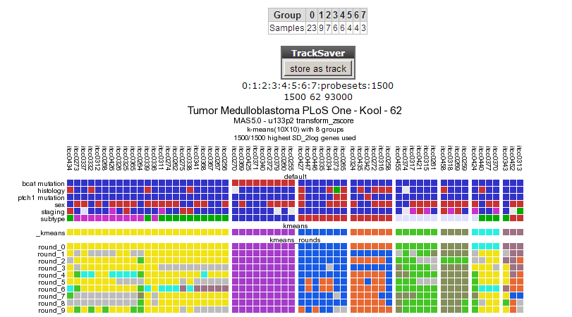
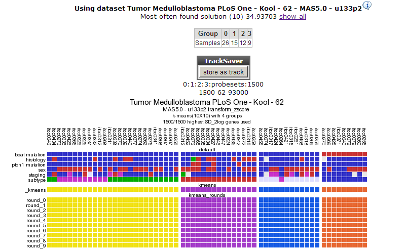
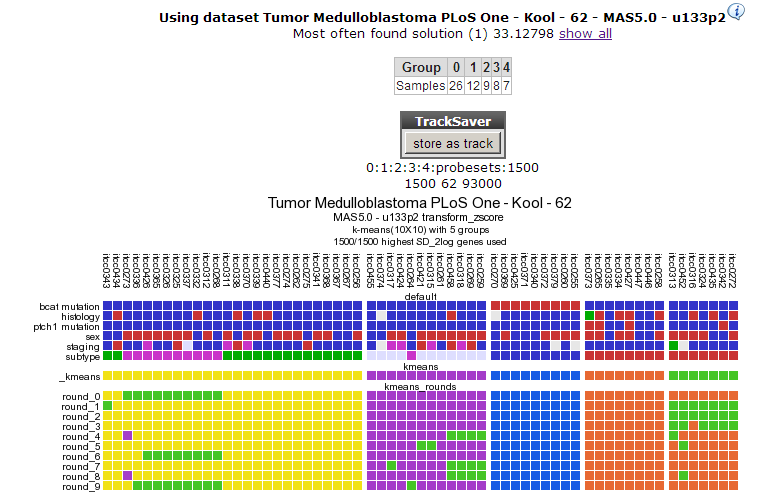

K-means clustering in R2
========================

*How to discover novel groups or subtypes in your dataset using k-means
clustering*

Scope
-----

-   In this tutorial expression data of a set of Medulloblastoma tumors
    will be investigated for the occurrence of groups that have similar
    expression patterns.
-   Affymetrix data will be used in a k-means clustering analysis.

Tutorial step 1
---------------

1.  Make sure that the Single Dataset option is selected in field 1 of
    the step by step guide.
2.  In field 2 locate and select the 'Tumor Medulloblastoma PLoS One-
    Kool - 62 MAS5.0 -u133p2' dataset by clicking 'Change Dataset'
3.  In field 3 choose the 'K-means' option (Figure 1)
    [**Figure
    1: Selecting K-means clustering on the R2 main
    page**](Image:Image:Kmeans_selecting.png)
4.  Click ‘next’

Tutorial step 2
---------------

1.  The next window presents a set of fields where specific settings of
    the clustering algorithm used can be set. There are only a few
    settings immediately relevant, the others are appropriate for
    most analyses. For the k-means clustering these are the number of
    groups and the number of draws. We'll explain these shortly; for
    other settings refer to the boxed items.
2.  K-means clustering requires a number of groups beforehand, we start
    with two. To see whether the outcome of the clustering is stable
    (see boxed text on K-means clustering) we set the number of draws
    (performing of the calculation) to 10x10.
    [**Figure
    2: K-means clustering
    settings**](Image:Image:Kmeans_clustersettings.png)
3.  Dependending on the size of your dataset or geneset you can enlarge
    of minimize your K-means plot by adapting te size of the retangles
    at heatmap option. click ‘next’

+--------------------------------------------------------------------------+
| ***Did                                 |
| you know that K-means is a method of cluster analysis?***                |
+--------------------------------------------------------------------------+
| [{width="400"}](Image:Image:K |
| means_didyouknow.png)                                   |
|                                               |
|                                                                          |
| \                                                                        |
| In data mining, k-means clustering is a method of cluster analysis which |
| aims to partition n observations into k clusters in which each           |
| observation belongs to the cluster with the nearest mean. This might     |
| sound complicated but is easily illustrated: suppose we have a set of 12 |
| patients where we observe the expression of two genes; expression of     |
| gene 1 along the x-axis, gene 2 on the y-axis (in our situation we have  |
| much more genes; the calculation will then be done in more dimensions).  |
| We're now going to try to cluster this set of n patients observed in     |
| three groups; k = 3. The following steps illustrate the algorithm (1-4   |
| from left to right) \# k = 3 initial "means" are randomly selected in    |
| the data set (shown in color) \# k clusters are created by associating   |
| every observation with the nearest mean. This partitions 2-D plane (the  |
| so called dataspace) in three areas. \# The initial means are moved to   |
| the centers of the three areas; the centroids. \# Steps 2 and 3 are      |
| repeated until convergence has been reached. As is obvious from the end  |
| point from this calculation this is a heuristic algorithm, there is no   |
| guarantee that it will converge to the global optimum, and the result    |
| may depend on the initial, randomly assigned clusters. As the algorithm  |
| is usually very fast, it is common to run it multiple times with         |
| different starting conditions and compare the outcome. R2 visualizes     |
| this in the end result of the calculation.                               |
|                                                                          |
|                                                                    |
+--------------------------------------------------------------------------+

Tutorial step 3
---------------

1.  R2 clusters the samples using the expression of 1500 genes
    exhibiting the highest standard deviation in this set. The result of
    10 sets of 10 calculations each, is shown as colored bars
    (Figure 3). Below the bars a heatmap is shown of the expression of
    the genes involved. It is obvious that two consistent clusters are
    formed; the assignment of the samples to a respective cluster is
    always the same. Note that figures reproduced by yourself might
    differ slightly when weaker associations are investigated; k-means
    is non-deterministic (random initiation).
    [**Figure
    3: Results for the 10x10 k-means clustering in two groups; two
    consistent clusters
    are formed.**](Image:Image:Kmeans_cluster.png)
2.  For visualization of k-means clusters, R2 performs hierarchical
    clustering on the samples for every group of k. Finally a
    hierarchical clustering is performed on the genes, making use of the
    information present in all samples. Because this is a large set only
    part of the map is shown in Figure 4
3.  This dataset has a clinical annotation for BCAT mutations; the upper
    bar or track in Figure 3. The subgroup having this annotation seems
    to cluster together in one of the two groups; this is however a
    subset of one of the two current clusters; more groups are expected.
    We're going to use a larger value for k to investigate this. In your
    browser click the back button and change the number of groups to 8.
4.  Click ‘next’.

[**Figure
    4: The heatmap for the k-means clustering in 2 groups; it is obvious
    that the data is represented in
    the clusters.**](Image:Image:Kmeans_heatmap.png)

  --------------------------------------------------------------------------------------------------------------------------------------------------------------------------------------------------------------------------------------------------------------------------------------------
  )***Did you know that 'the \# highest SD genes is the number of genes with highest Standard Deviation?***
  Most of the other options (Sample/Gene filters etc) are explained in former tutorials. The "\# highest SD genes" is the number of genes with highest Standard Deviation (genes that 'make a difference' in this set) that is used for the K-means analysis. By default this value is 1500.
  --------------------------------------------------------------------------------------------------------------------------------------------------------------------------------------------------------------------------------------------------------------------------------------------

\

  ---------------------------------------------------------------------------------------------------------------------------------------------------------------------------------------------------------------------------------------------------------------------
  )**'Did you know that** ***some virus scanners slow drawing of these graphs??***
  If R2 takes a long time to draw images like these this might have to do with your virus scanner. The graphs are interactive and contain a lot of scripts that are usually scanned by a virus-scanner like McAffee. You can avoid this by disabling Script scanning.
  ---------------------------------------------------------------------------------------------------------------------------------------------------------------------------------------------------------------------------------------------------------------------

Tutorial step 4
---------------

1.  The resulting clustering in 8 groups is depicted in Figure 5
    [**Figure
    5: Clustering in 8 groups produces no
    consistent outcome.**](Image:Image:Kmeans_track1.png)
2.  The outcome is not consistent (except for the cluster of samples
    having a bcat mutation)
3.  Repeat the procedure for 4 groups.
4.  In Figure 6 a clear and almost perfect clustering in 4 groups
    is established. Kool e.a. (2008) identified 5 subtypes in
    Medulloblastoma; this set is annotated in the lower track above the
    k-means tracks; they neatly follow 3 out of 4 clusters; the
    remaining two subtypes are less clear as is also clear when we try
    to separate the data in 5 clusters (Figure 7). By choosing
    subsets (categories) of genes before clustering you might be able to
    determine more precisely defined groups. An example of this method
    can be found in the Adapting R2 tutorial.

[**Figure
6: Consistent clustering for 4
groups.**](Image:Image:Kmeans_track2.png)[**Figure
7: Clustering in 5
groups**](Image:Image:Kmeans_track3.png)

Final remarks / future directions
---------------------------------

The identification of medulloblastoma subtypes has been published here:
Kool M, Koster J, Bunt J, Hasselt NE, Lakeman A, van Sluis P, Troost D,
Meeteren NS, Caron HN, Cloos J, Mrsic A, Ylstra B, Grajkowska W,
Hartmann W, Pietsch T, Ellison D, Clifford SC, Versteeg R.; Integrated
genomics identifies five medulloblastoma subtypes with distinct genetic
profiles, pathway signatures and clinicopathological features. PLoS One.
2008 Aug 28;3(8):e3088.

We hope that this tutorial has been helpful,The R2 support team.

