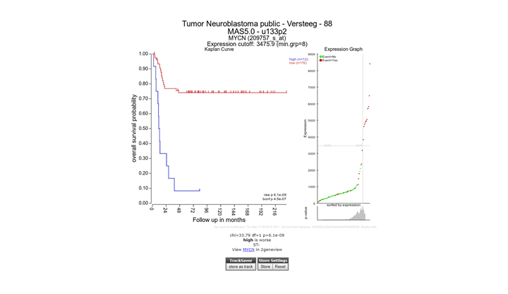
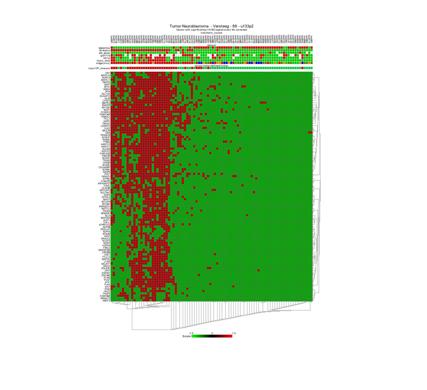

Working with Kaplan Meier
=========================

*Investigate the prognostic value of a gene or a group of genes*

Scope
-----

-   Use R2 to generate a Kaplan graph by "annotated parameter". Use
    tracks or combine two tracks to assign the group separation of a
    specific dataset.

-   R2 supports any type of survival data, such as overall survival and
    relapse free survival.

-   Use the Kaplan Scan for a group of genes.

Step 1: Selecting the Kaplan Meier module
---------------

1.  Logon the R2 homepage and select *Kaplan Meier By
    Annotated parameter*. You can find this option either in the left
    menu panel on the main screen or in field 3 at the type of analysis
    pull down menu. Using the Kaplan Meier module via the left menu
    directly shows from which datasets survival data is available.  
    Make sure that "Tumor Neuroblastoma public " Versteeg " 88" is selected and click next.
    
	
	
	[**Figure    1: Select a Kaplan    Meier option.**](_static/images/WorkingWithKaplan_menu.png)
	
2.  In the adjustable settings menu choose overall survival "overall-c1103", select
    "track" at Separate by and select "inss-cat" stage in use track pull
    down menu . Click "next". Note that stage st4s en st1 survival curves are overlapping which 	is in agreement with the clinical outcome of the INSS stages.
    
	
	
	[**Figure 2: Kaplan Meier by Annotated parameter.**](_static/images/WorkingWithKaplan_Kaplan.png)

3.  A handy feature of the R2 kaplan module is the option to combine two
    tracks to generate subgroups for the Kaplan Meier analyses. Use the
    back-button from the browser and select at " separate by " , "
    combination of two tracks". Choose for example for the first track "
    agegroup (cat) " and for the second track "mycn\_amp (cat) ". And
    click next.
    
	
	
	[**Figure    3: Kaplan Meier graph with    combined tracks.**](_static/images/WorkingWithKaplan_Combined.png)
	

The combined track agegroup ( >18 year) and no mycn application
results in intermediate survival probability. Note that there are 3
groups instead of "expected" 4 since there are no patients <= 18 year
and a mycn amplification, in this cohort.

----------
**Did you know that you can apply a filter to KaplanScan analyze a subgroup of patients for survival? In addition you can also adapt the graphical representation***                      

                           

>*You can select a subset from your samples by one or more tracks. Click on the pulldown of 'Select a track (subset)' and click on the track by which you want to define the subset. In the popup you need to check the box of your preferred subset(s). A successful subset selection will be shown as a small message indicating the used trackname, groups and the final number of samples between brackets.*  
>
>*If you want to further narrow down your selection with a different track, click on the same pulldown menu. Select the next track that you are interested in and in the popdown, check the preferred subset(s) from that track. Don't forget to click on "Redraw Graph" after you made your final selection to redraw the Kaplan Meijer curve.*  
>
>*Nb. If you use the 'back' button in your webbroswer, then this selection will be lost and needs to be defined again.*                          
                                                                  
----------

Step 2: Kaplan Meier by gene expression; the Kaplan Scan
---------------
An often used feature of R2 is the Kaplan Scan (KaplanScan), where an optimum 
survival cut-off is established based on statistical testing instead 
of for example just taking the average or median. The Kaplan scanner 
separates the samples of a dataset into two groups based on the gene 
expression of one gene. In the order of expression, it will use 
every increasing expression value as a cutoff to create 2 groups and 
test the p-value in a logrank test. The highest value is then 
reported, accompanied by a Kaplan Meier picture. So in short, it 
will find the most significant expression cutoff for 
survival analysis. The best possible Kaplan Meier curve is based on 
the logrank test. However, R2 does also allow you to use median, 
average and more as a cutoff in assessing whether a gene of interest 
has the potential to separate patient survival.Of course, such 
analysis id only possible for datasets where survival data 
is present.  
  

1.  Select from the main screen either the left menu or in field 3,
    Kaplan Meier "by gene expression". Make sure that "Tumor
    Neuroblastoma public Versteeg 88" is selected, for analysis
    choose "Kaplan Scan a single gene", fill in MYCN and use as cut-off
    method "scan" and click "Next".
2.  In the next screen use the prefilled settings and click "next".
3.  The Kaplan scan generates a Kaplan Meier Plot based on the most
    optimal mRNA cut-off expression level to discriminate between a good
    and bad prognosis cohort.
4.  The determined separation in groups can be stored in a track and
    used in other analyes, click the "store as track" button
    
	
	
	[**Figure    5: Kaplan Scan for a single gene**](_static/images/KaplanScanASingleGene.png)
	
5.  To illustrate that with the Kaplan Scan more significant biological
    subgroups can be found, adjust the cut-off mode to "median" in the
    settings menu and click "Redraw Graph".
    
	 Scan B) First Quartile C)    Median D)    Average")
	
	[**Figure    6: Kaplan plot with multiple cutoffs: A) Scan B) First Quartile C)    Median D)    Average**](_static/images/WorkingWithKaplan_Multiple.png)
	

It is obvious that with the Kaplan Meier "scan modus" the sample grouping is
much more significant compared to the median cut-off modus. Try to find
out whether this is also the case with other cut-off modi.

6.  Next to the Kaplan plot in Figure 5, a small sub-plot is
    generated (underlined) which represents a graphical representation
    of the p-value plotted against the mRNA expression level values. In
    some cases it could be useful to change the p-value cut-off level
    and for this reason this graphical p-value plot (which is clickable)
    could be of help. Alternatively, you could use the "cutoff" field to
    regenerate a Kaplan curve with that separation.

	
	
	[**Figure 7: Adjustable settings menu: change p-value cutoff.**](_static/images/WorkingWithKaplan_ChangePvalue.png)
	

Step 3: Kaplan scan for a group of genes
---------------

1.  Instead of using the Kaplan Scan for a single gene you can also
    analyse a group of genes at the same time. Go back to the main page ("Go to Main" , upperleft corner), choose Kaplan Meier "by
    gene expression", select at analysis "Kaplan Scan a group of
    genes" and click "Next".
2.  In this example select the apoptosis route at the Kegg path way
    pulldown menu. Leave the "type of survival" at overall survival. In
    the statistics panel there are several filtering options possible,
    leave these options unchanged.
3.  In the graphics section select "yes" at "Draw heatmap" and
    click next.
4.  In the next screen R2 has generated a list of the genes within the
    apoptosis pathway which have significant prognostic value. A heatmap
    for this list of genes is generated as well.

	
	
	[**Figure 8: A list of Kaplan Meier for a group of genes**](_static/images/WorkingWithKaplan_Kaplanlist.png)
	

In Figure 8, clicking on each gene name in the hugo column will result
in a new screen or tab with the corresponding Kaplan plot.

[**Figure 9: Heatmap of the significant prognostic list of genes.**](_static/images/WorkingWithKaplan_Heatmap.png)

In this case, the heatmap shows 2 or 3 possible biologically relevant
clusters based on this set of genes. Clicking a spot in the heatmap will
show directly the gene expression level for all samples via a new
one-gene-view screen.

5.  To generate a binary heatmap based on the GOOD versus BAD prognoses, click on the back arrow of your browser and in the Adjustable Settings table set the Kegg Pathway under Gene Filters back to "All". 

6. Select in the Graphics panel next to Heatmap data "good_bad (binary)" from the pull down menu. Click Next.

[**Figure 10: Select binary heatmap.**](_static/imagesWorkingwithkaplan_heatmapadjust.png)

 Now the heatmap shows a clustering based on the GOOD vs BAD prognoses.
 
 

[**Figure 11 : Binary heatmap.**](_static/Workingwithkaplan_heatmapbadgood.png)
 

Step 4: Kaplan scan on your own cohort
---------------

1.  It may happen that you would like to use the KaplanScan method on a
    dataset that is not available in R2. Especially for this reason we
    have made a user defined version within R2, where you can paste your
    cohort into R2 from e.g. a textfile and run the procedure. To initiate such a user
    defined Kaplan Scan, select the "Kaplan Meier" > "Kaplan Meier by
    user provided data" option from the left hand menu.
    
	
	
	[**Figure    12: Kaplanscan with user defined    data**](_static/images/Kaplanscan_userdefined_1a.png)
	
2.  For the remaining steps to work as intended, we need to take into account
    a couple of things. You should prepare your data in the following
    four tab- or semicolon(;) separated columns.
    -   Column 1 contains a sample identifiers (without spaces)
    -   Column 2 contains the survival time in days (R2 will convert
        these)
    -   Column 3 contains the censoring information (event) and can be
        yes/no or 1/0
    -   Column 4 contains the expression value of the gene of interest
        for the kaplanscan

3.  One can easily prepare this information in Microsoft Excel and paste the
    selected columns into the large white paste box. Do take care that
    we use "." for decimal signs.  
4.  After you pasted the dataset information, you make the selection for the cutoff option and
    subsequently press next. R2 will now calculate the kaplan method
    that you selected and display the result in an interactive image.
    
	
	
	[**Figure    13: Kaplanscan with user defined data    result**](_static/images/Kaplanscan_userdefined_2a.png)
	
5.  Once the image has been created, you are able to adapt various
    parameters to optimize appearance of your result.

-----------------------
  **Did you know that the survival data used in your scan produces a unique signature?**
>*R2 will indicate within the image a checksum (MD5 sum) of all the survival information, which can be used to identify whether the same cohort information has been used in different scans that you may perform (this code should remain identical).*
  
-----------------------

Final remarks / future directions
---------------------------------

Everything described in this chapter can be performed in the R2: genomics analysis and visualization platform (http://r2platform.com or http://r2.amc.nl) 

We hope that this tutorial has been helpful, the R2 support team.

