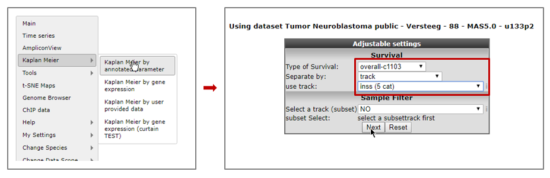
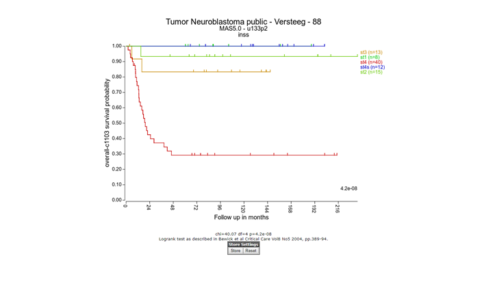
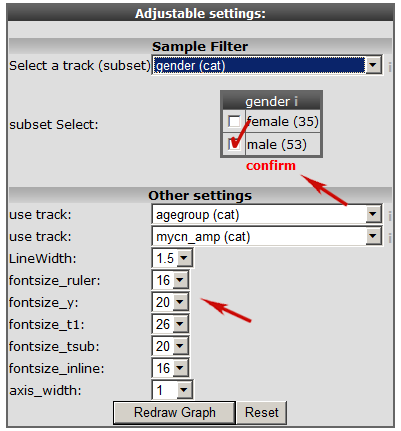
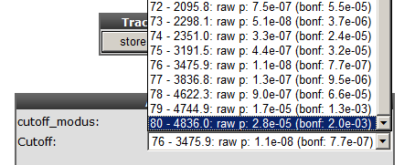
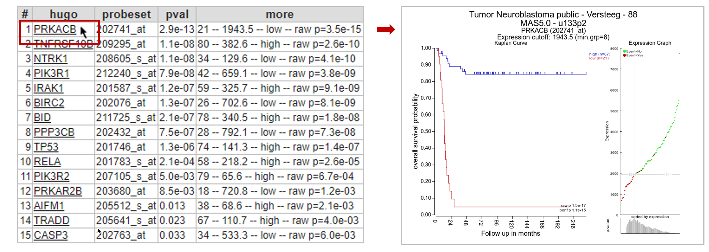
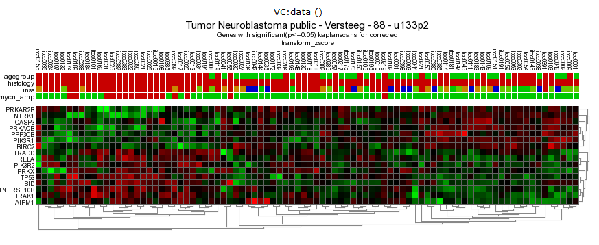
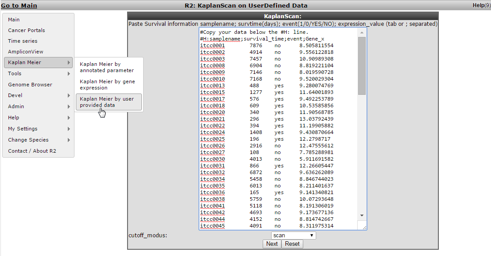
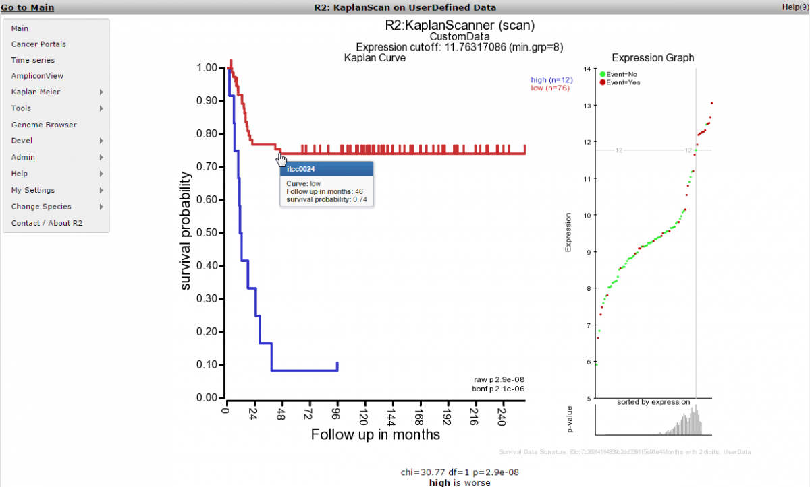

Working with Kaplan Meier
=========================

*Investigate the prognostic value of a gene or a group of genes*

Scope
-----

-   Use R2 to generate a Kaplan graph by "annotated parameter". Use
    tracks or combine two tracks to assign the group separation of a
    specific dataset.

-   R2 supports any type of survival data, such as overall survival and
    relapse free survival.

-   An often used feature of R2 is the Kaplan Scan, where an optimum
    survival cut-off is established based on statistical testing instead
    of for example just taking the average of median. The Kaplan scanner
    separates the samples of a dataset into two groups based on the gene
    expression of one gene. In the order of expression, it will use
    every increasing expression value as a cutoff to create 2 groups and
    test the p-value in a logrank test. The highest value is then
    reported, accompanied by a kaplan meier picture. So in short, it
    will find the most significant expression cutoff for
    survival analysis. The best possible Kaplan Meier curve is based on
    the logrank test. However, R2 does also allow you to use median,
    average and more as a cutoff in assessing whether a gene of interest
    has the potential to separate patient survival.Of course, such
    analysis id only possible for datasets where survival data
    is present.

-   Use the Kaplan Scan for a group of genes.

Step 1: Selecting the Kaplan Meier module
---------------

1.  Logon the R2 homepage and select *Kaplan Meier By
    Annotated parameter*. You can find this option either in the left
    menu panel on the main screen or in field 3 at the type of analysis
    pull down menu. Using the Kaplan Meier module via the left menu
    directly shows from which datasets survival data is available.
    
	
	
	[**Figure    1: Select a Kaplan    Meier option.**](_static/images/WorkingWithKaplan_menu.png)
	
2.  In the adjustable settings menu choose "overall survival" , select
    "track" at Separate by and select "inss-cat" stage in use track pull
    down menu . Click "next". Note that stage st4s en st1 survival curves are overlapping which 	is in agreement with the clinical outcome of the INSS stages.
    
	
	
	[**Figure 2: Kaplan Meier by Annotated parameter.**](_static/images/WorkingWithKaplan_Kaplan.png)

3.  A handy feature of the R2 kaplan module is the option to combine two
    tracks to generate subgroups for the Kaplan meier analyses. Use the
    back-button from the browser and select at " separate by " , "
    combination of two tracks". Choose for example for the first track "
    agegroup (cat) " and for the second track "mycn\_amp (cat) ". And
    click next.
    
	
	
	[**Figure    3: Kaplan Meier graph with    combined tracks.**](_static/images/WorkingWithKaplan_Combined.png)
	

The combined track agegroup ( >=1 year) and no mycn application
results in intermediate survival probability. Note that there are 3
groups instead of "expected" 4 since there are no patients < 1 year
and a mycn amplification, in this cohort.

----------
**Did you know that you can apply a filter to analyze a subgroup. In addition you can also adapt the graphical representation***                      

                           

> *When you are defining a subsection of the samples, you can execute      
multiple selections after each other. To use the selection (subset), you
need to click on **confirm** to finalize it. A successful subset        
selection will be shown as a small message indicating the used          
trackname, groups and the final number of samples between brackets.    
Nb. If you use the 'back' button in your webbroswer, then this selection
will be lost and needs to be defined again.*                          
                                                                  
----------

Step 2: Adapting Kaplan Meier settings; the Kaplan scan
---------------

1.  Select from the main screen either the left menu or in field 3,
    Kaplan Meier " By gene expression. Make sure that "Tumor
    Neuroblastoma public " Versteeg " 88" is selected, for analyses
    choose "Kaplan Scan a single gene" fill in MYCN and use as cut-off
    method " scan " and click "next".
2.  In the next screen use the prefilled settings and click "next".
3.  The Kaplan scan generates a Kaplan Meier Plot based on the most
    optimal mRNA cut-off expression level to discriminate between a good
    and bad prognosis cohort.
4.  The determined separation in groups can be stored in a track and
    used in other analyes, click the "store as track" button
    
	 Scan B) Quartile C)    Median D)    Average")
	
	[**Figure    5: Kaplan plot with multiple cutoffs: A) Scan B) Quartile C)    Median D)    Average**](_static/images/WorkingWithKaplan_GroupPvalue.png)
	
5.  To illustrate that with the Kaplan scan more significant biological
    subgroups can be found, adjust the cut-off mode to "median" in the
    settings menu and click "redraw"graph.
    
	 Scan B) Quartile C)    Median D)    Average")
	
	[**Figure    6:Kaplan plot with multiple cutoffs: A) Scan B) Quartile C)    Median D)    Average**](_static/images/WorkingWithKaplan_Multiple.png)
	

It is obvious that with the Kaplan Meier scan the group separation is
much more significant compared to the median cut-off modus. Try to find
out whether this is also the case with other cut-off modi.

1.  Next to the Kaplan plot Figure 4, a small sub-plot is
    generated (underlined) which represents a graphical representation
    of the p-value plotted against the mRNA expression level values. In
    some cases it could be useful to change the p-value cut-off level
    and for this reason this graphical p-value plot (which is clickable)
    could be of help. Alternatively, you could use the "cutoff" field to
    regenerate a Kaplan curve with that separation.

	
	
	[**Figure6-a: Adjustable settings menu: change p-value cutoff.**](_static/images/WorkingWithKaplan_ChangePvalue.png)
	

Step 3: Kaplan scan for a group of genes
---------------

1.  Instead of using the Kaplan Scan for a single gene you can also
    analyse a group of genes at the same time. Go to Kaplan Meier " by
    gene expression, select at analysis "Kaplan Scan a group of
    genes"and click "next"
2.  In this example select the apoptosis route at the Kegg path way
    pulldown menu. Leave the "type of survival" at overall survival. In
    the statistics panel there are several filtering options possible
    leave these options unchanged
3.  In the graphics section select "yes" at "Draw heatmap and
    click next.
4.  In the next screen R2 had generated a list of the genes within the
    apoptosis pathway which have significant prognostic value. A heatmap
    for this list of genes is generated as well.

	
	
	[**Figure7: A list of Kaplan Meier for a group of genes**](_static/images/WorkingWithKaplan_Kaplanlist.png)
	

In Figure 7, clicking on each gene name in the hugo column will result
in a new screen or tab with the corresponding Kaplan plot.

[**Figure8: Heatmap of the significant prognostic list of genes.**](_static/images/WorkingWithKaplan_Heatmap.png)

The heatmap shows in this case that 2 or 3 possible biological relevant
clusters based on this set of genes. Clicking a spot in the heatmap will
show directly the gene expression level for all samples via a new
one-gene-view screen.

Step 4: Kaplan scan on your own cohort
---------------

1.  It may happen that you would like to use the KaplanScan method on a
    dataset that is not available in R2. Especially for this reason we
    have made a user defined version within R2, where you can paste your
    cohort into R2 and run the procedure. To initiate such a user
    defined kaplanscan, select the "Kaplan Meier" > "Kaplan Meier by
    user provide data" option from the left hand menu.
    
	
	
	[**Figure    9: Kaplanscan with user defined    data**](_static/images/Kaplanscan_userdefined_1a.png)
	
2.  For the remaining to work as intended, we need to take into account
    a couple of things. You should prepare your data in the following
    four tab- or semicolon(;) separated columns.
    -   Column1 contains a sample identifiers (without spaces)
    -   Column2 contains the survival time in days (R2 will convert
        these )
    -   Column3 contains the censoring information (Event) and can be
        yes/no or 1/0
    -   Column4 contains the expression value of the gene of interest
        for the kaplanscan

3.  One can easily prepare this information in Excel and paste the
    selected columns into the large white paste box. Do take care that
    we use "." for decimal signs. After you pasted the dataset
    information, you make the selection for the cutoff option and
    subsequently press next. R2 will now calculate the kaplan method
    that you selected and display the result in an interactive image.
    
	
	
	[**Figure    10: Kaplanscan with user defined data    result**](_static/images/Kaplanscan_userdefined_2a.png)
	
4.  Once the image has been created, you are able to adapt various
    parameters to optimize appearance of your result.

-----------------------
  **Did you know that The survival data used in your scan produces a unique signature**
>*R2 will indicate within the image a checksum (MD5 sum) of all the survival information, which can be used to identify whether the same cohort information has been used in different scans that you may perform (this code should remain identical).*
  
-----------------------

Final remarks / future directions
---------------------------------

We hope that this tutorial has been helpful,The R2 support team.

