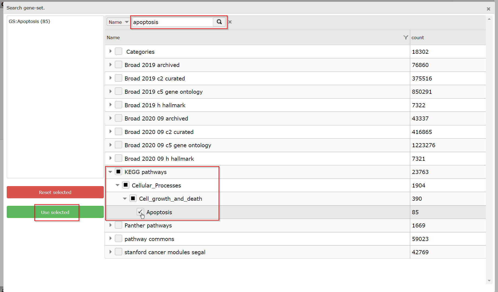
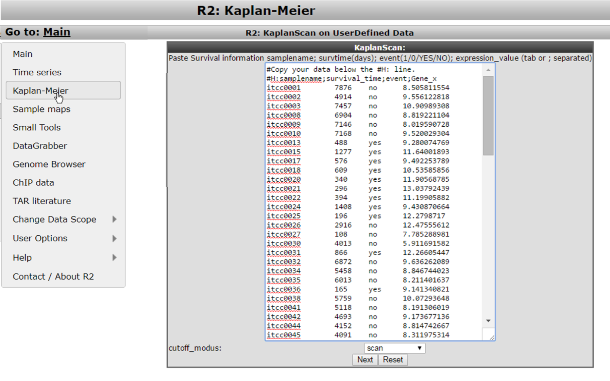
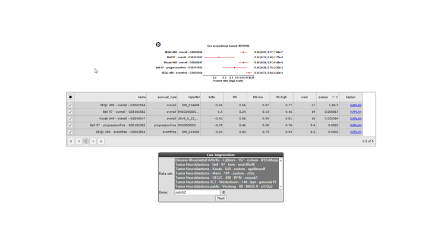

Working with Kaplan Meier
=========================

*Investigate the prognostic value of a gene or a group of genes*

Scope
-----

-   Use R2 to generate a Kaplan graph by "annotated parameter". Use
    tracks or combine two tracks to assign the group separation of a
    specific dataset.

-   R2 supports any type of survival data, such as overall survival and
    relapse free survival.

-   Use the Kaplan Scan for a group of genes.

Step 1: Selecting the Kaplan Meier module
---------------

1.  Logon the R2 homepage and select the option *Kaplan Meier* either in the left
    menu panel on the main screen or in field 3 at the type of analysis
    pull down menu. Using the Kaplan Meier module via the left menu
    directly shows from which datasets survival data is available.  
    For this example, make sure that *Data type* is set  "Tumor Neuroblastoma public " Versteeg " 88". From the dropdown of the setting *Separate by* choose the option 'a categorical track'. Click *Next*.
    
	
	
	[**Figure    1: Select a Kaplan    Meier option.**](_static/images/KaplanMeier/KaplanMeier_selectKManalysis_v1b.png)
	
2.  In the adjustable settings menu choose for *Type of survival* the value "overall-c1103", select "track" at *Separate by* and select "inss (5 cat)" at the *Track* pull-down menu . Click "Next". Note that stage st4s en st1 survival curves are overlapping which is in agreement with the clinical outcome of the INSS stages.
    
	
	
	[**Figure 2: Kaplan Meier by a categorical track**](_static/images/KaplanMeier/WorkingWithKaplan_Kaplan1a.png)

3.  A handy feature of the R2 Kaplan module is the option to combine two
    tracks to generate subgroups for the Kaplan Meier analysis. Use the
    Kaplan-start button and select at *Separate by* the option 'combination of two tracks'. For example, choose for the first track 'agegroup (2 cat)' and for the second track 'mycn\_amp (2 cat)'. And click *Next*.
    
	
	
	[**Figure    3: Kaplan Meier graph with    combined tracks.**](_static/images/KaplanMeier/WorkingWithKaplan_Combined_1a.png)
	

The combined track agegroup ( >18 year) and no mycn application
results in intermediate survival probability. Note that there are 3
groups instead of "expected" 4 since there are no patients <= 18 year
and a mycn amplification, in this cohort.

----------
**Did you know that you can apply a filter to KaplanScan analyze a subgroup of patients for survival? In addition you can also adapt the graphical representation***                      

 or with the dropdown (dropdown)") 
    
[**Apply sample filters to your dataset for the Kaplan Meier either with the grid (left) or with the dropdown (right)**](_static/images/KaplanMeier/WorkingWithKaplan_Adjust.png)                  

>*You can either use the annotation grid (left) or you can use the pull down (right) to select a subset of your samples by one or more tracks. If you click on the subscription of the picture above, the picture will open in large.*
>
>*For the use of the grid, use the clog icon in the 'Advanced settings box' and hover your mouse over the side of the column of choice to show the filering options for that track. You can use the filtering options of multiple tracks to make a specific subset. Here we used gender to only select male samples (i.e. deselect female) and death_cause to select tumor and nd samples. A successful subset selection will be shown as a small message indicating the number of samples in the subset, the used track name and the number of groups/categories between brackets* 
>
>*If you instead want to make the subset selection with the pull-down of **Subset track**, click on the track by which you want to define the subset (in the example: gender). In the popup you need to check the box of your preferred subset(s) (here: male).  
 If you want to further narrow down your selection with a different track, click on the same pull-down menu. Select the next track (here: death_cause) that you are interested in and in the popdown, check the preferred subset(s) from that track (here: tumor and nd).* 
>
>*Don't forget to click on **Redraw Graph** after you made your final selection to redraw the Kaplan Meijer curve.*  
>
>*Nb. If you use the 'back' button in your webbroswer, then this selection will be lost and needs to be defined again.*                          

----------

Step 2: Kaplan Meier by gene expression; the Kaplan Scan
---------------
An often used feature of R2 is the Kaplan Scan (KaplanScan), where an optimum 
survival cut-off is established based on statistical testing instead 
of for example just taking the average or median. The Kaplan scanner 
separates the samples of a dataset into two groups based on the gene 
expression of one gene. In the order of expression, it will use 
every increasing expression value as a cutoff to create 2 groups and 
test the p-value in a logrank test. The highest value is then 
reported, accompanied by a Kaplan Meier picture. So in short, it 
will find the most significant expression cutoff for 
survival analysis. The best possible Kaplan Meier curve is based on 
the logrank test. However, R2 does also allow you to use median, 
average and more as a cutoff in assessing whether a gene of interest 
has the potential to separate patient survival. Of course, such 
analysis is only possible for datasets where survival data 
is present.  

1.  Select from the main screen either the left menu the *Kaplan Meier* option or in field 3 of the main menu, and choose 
    *Separate by* 'a single gene'. Make sure that "Tumor
    Neuroblastoma public Versteeg 88" is selected with *Data type* 'Expression data (H. sapiens) and select in the Separate by menu: "single gene (Kaplan-Meier)" and click next.
2.  In the next screen fill in 'mycn' in the Search by Gene field and use the first reporter in the list of the dropdown that popspup. Select "overall-c1103" at type of survival and click "Next". In the gear box puc
3.  The Kaplan scan generates a Kaplan Meier Plot based on the most
    optimal mRNA cut-off expression level to discriminate between a good
    and bad prognosis cohort.
4.  The determined separation in groups can be stored in a track and
    used in other analyes, click the "store as track" button
    
	
	
	[**Figure    5: Kaplan Scan for a single gene**](_static/images/KaplanMeier/KaplanScanASingleGene.png)
	
5.  To illustrate that with the Kaplan Scan more significant biological
    subgroups can be found, adjust the cut-off mode to "median" in the
    settings menu and click *Redraw Graph*.
    
	 Scan B) First Quartile C)    Median D)    Average")
	
	[**Figure    6: Kaplan plot with multiple cutoffs: A) Scan B) First Quartile C)    Median D)    Average**](_static/images/KaplanMeier/WorkingWithKaplan_Multiple1a.png)
	

It is obvious that with the Kaplan Meier "scan modus" the sample grouping is
much more significant compared to the median cut-off modus. Try to find
out whether this is also the case with other cut-off modus

6.  The animated gif in figure 5 shows that in the gear box the scan plot can be depicted
    which represents a graphical representation
    of the p-value plotted against the mRNA expression level values. In
    some cases it could be useful to change the p-value cut-off level
    and for this reason this graphical p-value plot (which is clickable)
    could be of help. Alternatively, you could use the "cutoff" field to
    regenerate a Kaplan curve with that separation.

	
	
	[**Figure 7: Adjustable settings menu: change p-value cutoff.**](_static/images/KaplanMeier/WorkingWithKaplan_ChangePvalue.png)
	

Step 3: Kaplan scan for a group of genes
---------------

1.  Instead of using the Kaplan Scan for a single gene you can also
    analyse a group of genes at the same time click on Kaplan start and choose *Separate by* 'multiple genes' and click "Next".
2.  In this example search for a *Gene set* with clicking on "select geneset". In the popup grid, type 'apoptosis' in the text field on top and click on the search button. In the adapted grid, open the KEGG pathways by a click on the arrow scroll and go on till you can check the KEGG 'Apoptosis' pathway. Click *Use selected* to go back to the menu, where the 'GS: Apoptosis (85)' geneset is now shown to be selected.
    
    
    	
    [**Figure 8A: Select a KEGG gene set**](_static/images/KaplanMeier/KaplanMeier_selectKEGGPathway.png)
    
3. Leave the *Type of survival* at 'overall-c1103'. In
    the statistics panel there are several filtering options possible,
    leave these options unchanged.
4.  In the graphics section select "yes" at *Draw heatmap* and
    click *Next*.
5.  In the next screen R2 has generated a list of the genes within the
    apoptosis pathway which have significant prognostic value. A heatmap
    for this list of genes is generated as well.

	
	
	[**Figure 8B: A list of Kaplan Meier for a group of genes**](_static/images/KaplanMeier/WorkingWithKaplan_Kaplanlist1a.png)
	

In Figure 8B, clicking on each gene name in the hugo column will result
in a new screen or tab with the corresponding Kaplan plot.

In case the *Draw heatmap* is set to **Yes**  heatmap directly plotted next to list of  found genes with significant cut-offs. Clicking a spot in the heatmap will
show directly the gene expression level for all samples via a new
one-gene-view screen.

[**Figure 9: Heatmap of the significant prognostic list of genes.**](_static/images/KaplanMeier/WorkingWithKaplan_Heatmap.png)

5.  To generate a binary heatmap based on the GOOD versus BAD prognoses, again go to the main page, click on *Kaplan-Meier* from the left menu, select 'by multiple genes' in the *Separate by* option, click next. This time don't select anay gene set, but adapt in the Graphic Settings *Draw a heatmap* again to 'yes', choose in *Heatmap data* dropdown 'good_bad (binary)' and click *Next*. 

[**Figure 10: Select binary heatmap.**](_static/images/KaplanMeier/Workingwithkaplan_heatmapadjust.png)

Now the heatmap shows a clustering based on the GOOD vs BAD prognoses.

 

[**Figure 11 : Binary heatmap.**](_static/images/KaplanMeier/Workingwithkaplan_heatmapbadgood.png)

Step 4: Kaplan scan on your own cohort
---------------

1.  It may happen that you would like to use the KaplanScan method on a
    dataset that is not available in R2. Especially for this reason we
    have made a user defined version within R2, where you can paste your
    cohort into R2 from e.g. a textfile and run the procedure. To initiate such a user
    defined Kaplan Scan, select the *Kaplan Meier* option again from the main page left menu, and click  on the *Kaplan-Meier analysis using custom data* button underneath the panel. 
    
	
	
	[**Figure    12: Kaplanscan with user defined    data**](_static/images/KaplanMeier/Kaplanscan_userdefined_1a.png)
	
2.  For the remaining steps to work as intended, we need to take into account
    a couple of things. You should prepare your data in the following
    four tab- or semicolon(;) separated columns.
    -   Column 1 contains a sample identifiers (without spaces)
    -   Column 2 contains the survival time in days (R2 will convert
        these)
    -   Column 3 contains the censoring information (event) and can be
        yes/no or 1/0
    -   Column 4 contains the expression value of the gene of interest
        for the kaplanscan

3.  One can easily prepare this information in Microsoft Excel and paste the
    selected columns into the large white paste box. Do take care that
    we use "." for decimal signs.  
4.  After you pasted the dataset information, you make the selection for the cutoff option and
    subsequently press next. R2 will now calculate the kaplan method
    that you selected and display the result in an interactive image.
    
	
	
	[**Figure    13: Kaplanscan with user defined data    result**](_static/images/KaplanMeier/Kaplanscan_userdefined_2a.png)
	
5.  Once the image has been created, you are able to adapt various
    parameters to optimize appearance of your result.

-----------------------
  **Did you know that the survival data used in your scan produces a unique signature?**
>*R2 will indicate within the image a checksum (MD5 sum) of all the survival information, which can be used to identify whether the same cohort information has been used in different scans that you may perform (this code should remain identical).*

-----------------------

Step 4: Cox Regression analysis and hazard ratio
---------------

The Cox regression analysis is a statistical method commonly used in biomedical research to analyze the relationship between gene expression and survival outcomes. It is particularly useful for studying the impact of gene expression levels on patient survival times. In this analysis, gene expression data is combined with survival data to assess whether specific genes or gene signatures are associated with increased or decreased survival rates. In r2 your can identify genes or multiple genes (genesets which may act as potential prognostic markers). In general Cox regression analysis in gene expression provides valuable insights into the molecular mechanisms underlying survival outcomes in various diseases, including cancer.

[**Figure    14: Cox regression and  hazard ratios**](_static/images/KaplanMeier/KaplanMeier_Coxregression1a.png)

The hazard ratio (HR) is a fundamental concept in Cox regression analysis. It represents the relative risk or likelihood of an event occurring in one group compared to another.  The hazard ratio quantifies the effect of gene expression levels on the hazard or risk of a specific outcome, typically survival.

[**Figure    15: Cox regression and  hazard ratios steps**](_static/images/KaplanMeier/Kaplan_hazardratio_genes.png)

In R2 you can scan for significant hazard ratios for a single gene or multiple genes for a single dataset, follow the steps as indicated in Figure 15 and select the drug target geneset and click next. A Hazard ratio quantifies the effect of gene expression levels on the hazard of risk for a typical outcome. When the Hazard ratio is greater then 1, higher expression levels suggest a poor prognosis indicated in blue.  Having the opposite,  a hazard ratio less than 1 indicates a decreased risk or hazard, suggesting a better prognosis indicated with red. A hazard ratio of 1 implies that there is no difference in risk between the groups being compared.

[**Figure    15: Cox regression and  hazard ratios list**](_static/images/KaplanMeier/Kaplan_hazardratio_genes_list.png)

The hazard ratio outcome can easily be inspected by clicking on the **KAPLAN"** link in the table. As clearly depicted in figure 16 the CSKN2A1 gene with a hazard ratio > 1 in blue show a poor prognosis for a high expression level cut-off while the NTKR1 gene shows a poor prognosis for a low expression level.

[**Figure    16: Cox regression and  hazard ratios list**](_static/images/KaplanMeier/Kaplan_hazardratio_genes_inspect.png)

After checking the hazard ratio for multiple genes in one dataset you can also check for hazard ratios across multiple datasets. Select via de main menu survival > cox regresssion in multiple datasets. (Figure 17). Clicking "select datasets" will open de grid where you select the datasets of interest, keep in mind that these dataset are already preselected for those containing survival data.

[**Figure    17: Cox regression for multiple datasets**](_static/images/KaplanMeier/Kaplan_hazardratio_selectsets1a.png)

In Figure 18, the selected datasets show a significant low hazard ratios with a poor survival for the NOTCH2 gene in the low gene expressed group in contrast to the hazard rations where the group with the high MYCN expression shows a poor prognosis. (Figure 19.)

[**Figure    18:  Hazard ratios for the NOTCH2 gene**](_static/images/KaplanMeier/Kaplan_hazardratio_notchdatasets.png)

[**Figure    19: Hazard ratios for the MYCN gene**](_static/images/KaplanMeier/Kaplan_hazardratio_mycndatasets.png)

Final remarks / future directions
---------------------------------

Everything described in this chapter can be performed in the R2: genomics analysis and visualization platform (http://r2platform.com or http://r2.amc.nl) 

We hope that this tutorial has been helpful, the R2 support team.

