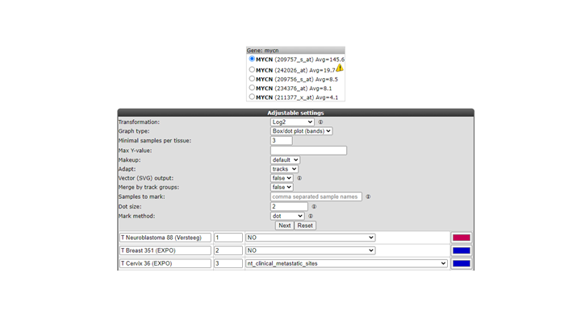

Multiple datasets overview with Megasampler
===========================================

*Create an overview of the expression level of genes in multiple
datasets*

Scope
-----

-   The megasampler is a R2 module to investigate the expression level
    of a gene in any number of the numerous datasets stored in the R2
    database
-   Use R2 to compose your selection of datasets to investigate the
    expression level of a gene
-   Use the megasampler "adjustable settings" to adapt the megasampler
    graphics
-   The megasampler allows you to quickly get an overview of the
    selected gene expression level for all the datasets available in the
    R2 database
-   Go directy from the overview to one-gene view to investigate in
    detail the expression level in a single dataset.

Step 1: Selecting multiple datasets
---------------

1.  Select "Across Datasets" in field 1, by default the "megasampler" option
    will be selected in field 2 and click "next".
    
	
	
	[**Figure 1: Using across datasets**](_static/images/MultipleDatasets_across1.png)
	
2.  Leave "u133p2, mas5.0" at the "type of data" option and select " XPO
    sampler" at "use presets". The meaning of presets will be explained
    later on.

--------------------------------------------------------------------------

 **Did you know that R2 harbours different types of microarray platforms**

              
                                                                          
> *Megasampler only allows you to query multiple datasets if they are of the same chiptype and normalized by the same algorithm.*

--------------------------------------------------------------------------

1.  With the "selection preset" option a pre-stored dataset collection
    with associated settings can be selected. Select "XPO sampler"
    (Expression Project for Oncology (expO)) to pre-select a series of
    tumor datasets. Click "next".
    
	
	
	[**Figure 2: Select a preset**](_static/images/megasampler/MultipleDatasets_Preset.png)
	
2.  In the previous screen the preset "XPOsampler" is selected, a
    collection of datasets is already marked for the
    megasampler analyses. In Figure 3 clicking the small triangle
    unfolds the available dataset categories, notice that some of the
    datasets in the "tumor" section are already marked. In this way this
    you can adapt your pre-selection of datasets. Unfold the normal and
    tumor category and select the following datasets. Normal Adrenal
    gland - Various " 13, Normal Brain PFC - Harris " 44 and the " Tumor
    Neuroblastoma public - Versteeg " 88" . Enter MYCN and click "next".
    
	
	
	[**Figure 3: Megasampler adjustment selection**](_static/images/megasampler_selectsdatasetsgroups.png)
	

Step 2: Viewing a gene in multiple datasets
---------------

1.  In the "adjustable settings" panel there are several options to
    customize the megasampler graph. For every selected dataset, you can
    change the order in which they are drawn by adjusting the number in
    the selection boxes. These are processed first, followed by the
    dataset names in alphabetical order (so changing the order of 1 or 2
    datasets should be sufficient). The pull down next to "dataset
    ordering pull down menu" enables to split one or more dataset by
    selecting a track , in this way the chosen dataset(s) will be
    split according to the numbers of groups of the selected track.
    and click "next".
    
	
	
	[**Figure 4: Adjusting the megasampler graph.**](_static/megasampler/MultipleDatasets_AdjustGraph1.png)
	
3.  R2 now performs a one-way Anova statistical test on the fly. This
    **AN**alyis **O**f **VA**riance is a statistical test that
    calculates whether the means of the expression levels between the
    selected datasets are significantly different.

	
	
	[**Figure 5: Anova test for the selected datasets.**](_static/images/megasampler/MultipleDatasets_Anova.png)
	

By default de megasampler graph is plotted in a so called Boxdotplot
representation. The Boxdotplot shows a combined boxplot, on top of which
the signals of the separate samples are plotted; a quickly interpretable
graph.

[**Figure 6: MYCN expression levels in 15 datasets covering 2173 samples.**](_static/images/megasampler/MultipleDatasets_YCC-express.png)

Additional insight can be obtained transforming the data, in this case
transform the data to logical values (none) set "graphtype" on barplot
and click on "redraw at the bottom of the screen.

	
[**Figure 7: Different Megasampler graphical representations**](_static/images/megasampler/MultipleDatasets_Representations.png)
	

The plotted graphs for "MYCN" clearly show a high expression level
specifically in the Neuroblastoma data sets compared to Normal Tissue
and other Tumor datasets. At the bottom of the page it's possible to
adapt dataset coloring, change the order and split datasets in tracks
directly.

--------------------------------------------------------------------------
**Did you know that you can save your selection of datasets and select your stored dataset the next time you login to R2.**

                         
> *Storing a preset not only stores the selection of datasets for future use, but will also keep all of the other settings such as order,
colors, plot type etc. The same visual representation for any other gene can be generated in this way.*

--------------------------------------------------------------------------

You can can use the adjustable panel to adapt the megasampler graph. In
case you split one or more datasets according to a specific track in
the previous screen, it's now possible to skip subgroups from your
dataset or, more interestingly, apply different colors for groups within a
dataset (see Figure 8).

	
[**Figure 8: Adjustable settings panel, color groups within adataset.**](_static/images/megasampler/MultipleDatasets_AdjustGroups1.png)

Step 3: Stacking subgroups (or datasets)
----------------

It could be that you also want to stack subgroups of datasets in one singlebox (or bar etc)  in such way that each single box contains one subgroup of multiple datasets for a selected track. Keep in mind that the track name and the corresponding subgroups must have exactly the same spelling since R2 is checking this in the background.  To illustrate this we make use of the EXPO  datasets which are currated for their annotation. After selection the datasets, make sure that the Merge track by groups is set to **true** and you have selected a track in this case the *histology* track and click submit.

   

   [**Figure 9: Adjustable settings panel, stacking subgroups.**](_static/images//megasampler/megasampler_stacking_subgroups.png)

Now the expression level of the TP53 gene  for a single dataset is plotted next to the separate subgroups of the histology track,  each box containing the expression levels for single gene of two datasets divided over the subgroups. Of course there is a big chance that you're not so lucky that tracks and their subgroups have the same spelling or you want to stack different subgroups for your research questions. In that case you have to create for each dataset new subgroups with the same spelling for each dataset. You can create these custized tracks you want to incorporate in the user section of the main page of R2. Once created you can select those in the megasampler section. In case you want to stack complete datasets in one box/bar you have to make a track with a subrgroups containing all the samples.

   

   [**Figure 10: Adjustable settings panel, stacking subgroups.**](_static/images//megasampler/megasampler_stacking_subgroups2.png)

Step 4: Expression distribution over many datasets
----------------

The red arrow in the "did you know box" brings you to a handy module to
obtain a quick overview of the expression level patterns for most of the
datasets R2 contains (providing that the normalization allows
comparison).

1.  Click "view Expression in many datasets" and a new screen (or tab)
    appears containing a Probeset distribution graph. The color of the dots represent
    the different dataset categories (cell line dataset, Tumor or Normal
    Tissue etcetera). Via this 2D distribution module 
    you can easily detect in what way your probeset of interest is
    expressed in many other datasets. At the Y-axis the 2log transformed
    average expression level and the standard deviation is represented.
    The X-axis "overlap avoider" is simply a way to represent all
    datasets in the plot without overlap of the circles. Figure 9
    clearly shows that the MYCN expression is also high in other dataset
    which could be of interest and a second Neuroblastoma dataset. Next
    to the graph 2 tables summarize dataset names and a R-value set
    to "1. This has no specific meaning in this context but comes of use with the 2D-distrubution module
    where you can quickly scan the correlation between two genes for all
    datasets of the same platform in R2. This module is discussed in the
    Correlate Genes tutorial.
    
	
	
	[**Figure 11: MYCN expression level distribution for all u133-2 datasets in R2.**](_static/images/MultipleDatasets_LevelDistribution.png)
	
2.  Via the the probeset distribution view you can easily investigate a
    specific dataset in more detail. Click a preferred colored dataset
    dot and R2 will generate an one-gene-view graph. The one-gene-view
    representation is explained in more details in tutorial 2.

       
Step 5: Megasearch
----------------

We have already discussed the 'find differential expression' module for a single dataset to find differentially expressed genes.
In the across dataset section  we can also apply a similar approach, not between groups within 
single dataset but for a user defined selection of multiple datasets. However, keep in mind that you can only
select datasets of the same platform,  the most abundant datasets are of the Affymetrix u133p2 platform. As explained
before not every platform can be used for the megasearch due to the normalisation procedure which has been used.

 
	
 [**Figure 12: MYCN expression level distribution for all u133-2 datasets in R2.**](_static/images/megasampler/Megasampler_Select1.png)
	
 
1. Select 'Megasearch' in Box 2 and click next
 
2. At step 1 select the platform you want to use, for now select the default (u133p2).

3. Select the datasets you want to use for the analyses, in this example we have selected Normal Brain , AML and Medulloblastoma datasets, click next.

 

 [**Figure 13:  Dataset selection.**](_static/images/megasampler/megasampler_selectsdatasets1.png)

4. For the megasearch module only two groups can be used to find the statistical differently expressed genes.  In the settings box assign the proper grouping parameters (1 or 2) leave the pulldown menu at the default setting ('NO') for the datasets and click
next.

 

 [**Figure 14: Assign the statistical group for testing**](_static/images/megasampler/megasampler_selectsdatasetsgroups2.png)
 
5. In the next adjustable settings menu select at Genecategory 'transcription regulator Act' for gene filtering.  In the 'Hugoonce Dataset' pulldown menu the first selected dataset will be used as target dataset for probeset usage.
For most platforms each gene has multiple probesets, when using this option R2 takes the probeset with the highest average signal.  For the megasearch you can not use for
each dataset a different probeset for a particular gene. In the 'Hugooce Dataset' pulldown menu you can change the target dataset in case you already familar with one of the selected datasets to make sure that probesets from single datasets analysis are used. In case of OTX2 which is a marker gene for Medulloblastoma two probesets are designed (242128_at and 231731_at) in the most 
Medulloblastoma datasets depending of the subgroups 242128_at has the highest expression level and will be picked by R2 however in other type of cancers/tissues there is hardly any expression of the OTX2 gene and in that case the other probeset could easily be selected.
 At the statictics pulldown  menu you can select fdr_modarate_t_statistics ([Limma](http://bioconductor.org/packages/release/bioc/html/limma.html "Limma") ,
[Limma-git]( http://genomicsclass.github.io/book/pages/using_limma.html)) 
or the standard uncorrected_t_test. The Limma algorithm is specifically designed for the analysis of gene expression data , leave the statistics at moderate_t_statistics and click next.
Two tables of genes are generated with the highest significantly expressed genes for group 1 and group 2. In the left genelist (group 2) we find in the top 10 ,
the OTX2 gene which is accociated with medulloblastoma.
6. 
 

 [**Figure 15: OTX2 BoxDotplot**](_static/images/megasampler/megasampler_otx2fig.png)

6. In the previous Adjustable settings box, where the grouping parameters were assigned,  you can also split datasets based on their subgoups (tracks) and 
incorparate the subgroups in different test groups as illustrated in Figure 14.

 [**Figure 16: Assign the statistical subgroup for testing**](_static/images/megasampler/megasampler_subgroupsttest.png)

---------------
  **Did you know that the Megasampler can also be used to investigate through the methylation datasets**

---------------

Final remarks / future directions
---------------------------------

We hope that this tutorial has been helpful, the R2 support team.

