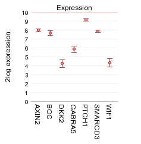
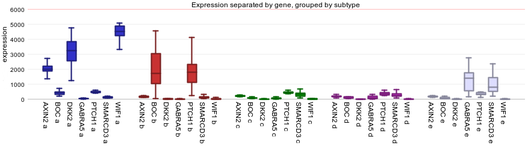

Multiple Genes View
===================

*Analyze the expression levels of a group of genes within a dataset*

Scope
-----

-   Use R2 to investigate the expression levels of more than 1 gene
    within a specific dataset.
-   In this example the expression levels of small groups of genes
    listed from several pathways will be used showing which genes are
    differentially expressed per subgroup.
-   Adjust several parameters in the settings panel
-   In R2, the samples are annotated with e.g. clinical data. Each group
    of annotated data is called a "Track" in R2. These tracks can be
    used to split the group gene expression levels per track.

Tutorial step 1
---------------

1.  Use "single dataset" in field 1 and select the "Tumor
    Medulloblastoma PLoS One - Kool - 62 - MAS5.0 - u133p2" dataset in
    field 2.
2.  Choose "View multiple genes " in field 3 and Click Next
3.  To illustrate the possibilities of the multiple gene view. Genes
    identified as classifiers for Medulloblastoma subtypes (Kool et al,
    Plos one) will be used. In the GENE/reporter textbox type or copy
    the following genes: AXIN2, BOC, dkk2, GABRA5, PTCH1, SMARCD3, WIF1
    and click next.

[**Figure
1: Default multiple gene
view.**](_static/images/MultipleGenesView_Default.png)

Tutorial step 2
---------------

1.  In Figure 1 a selection of gene expression profiles are depicted in
    one picture in contrast to the one gene view. The multiple gene view
    enables the option to represent the gene expression separately for
    each track. In this manner potential relations between subgroups and
    gene expression can be visualized.
2.  The dataset we are using is described in
    [PLoS One.](http://www.ncbi.nlm.nih.gov/pubmed/18769486)"2008
    Aug 28;3(8), Kool M et al. Here the classification of 5
    medulloblastoma subgroups are reported and annotated as such:
    A,B,C,D and E. To investigate the expression levels of a small group
    of genes per sub-category select in the adjustable settings box
    "subtype (cat)" at use track, "lump by group plot gene" at handle
    groups by and "Track" at color by track. Further set transform tot
    "none", select "boxplot" at Plot type and click NEXT.

[**Figure
2: Multiple gene view per
track**](_static/images/MultipleGenesView_perTrack.png)
1.  Most of the used genes are part of the WNT (subgroup A) and de SHH
    (subgroup B) signaling pathway overexpressed per subtype as shown by
    Kool et al. These genes are overexpressed in different
    Medulloblastoma molecular subtypes a,b,c,d and e are plotted
    together with the gene names. s
2.  Also try the "lump by gene plot group" which will produce an image
    where the genes are shown, separated by the subtypes.
3.  The sample filter option allows the user to generate a multiple gene
    view per track.

Final remarks / future directions
---------------------------------

Some of these functionalities have been developed recently. If you run
into any quirks or annoyances don't hesitate to contact r2 support
(r2-support@amc.uva.nl).

We hope that this tutorial has been helpful,The R2 support team.

