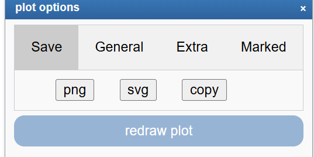

Multiple Genes View
===================

*Analyze the expression levels of a group of genes within a dataset*

Scope
-----

-   Use R2 to investigate the expression levels of more than 1 gene
    within a specific dataset.
-   In this example the expression levels of small groups of genes
    listed from several pathways will be used showing which genes are
    differentially expressed per subgroup.
-   Adjust several parameters in the settings panel
-   In R2, the samples are annotated with e.g. clinical data. Each group
    of annotated data is called a "Track" in R2. These tracks can be
    used to split the group gene expression levels per track.

Step 1: Viewing multiple genes
---------------

1.  Use "single dataset" in field 1 and select the "Mixed Cholangiocarcinoma (2022-v32) - tcga - 44 - tpm - gencode36 " dataset in
field 2.
2.  Choose "View multiple genes " in field 3 and Click Next
3.  To illustrate the possibilities of the multiple gene view, genes
    identified as classifiers for  Cholangiocarcinomea in literature 
    will be used. In the GENE/reporter textbox type or copy
    the following genes: S100P,KRT19,EPCAM,CEACAM5,GPC3, also genes separated on each line in the text box will work,
    and click next.
    
	
	
	[**Figure    1: Default multiple genes view.**](_static/images/Multiplegeneview/MultipleGenesView_Default_1.png)
	
4.  In the adjustable settings below the graph **(Track Separations)** or in the toolbox of the steering wheel, you can select the grouping variable **(Handle groups by)**  *sample_type* from the dropdown menu to separate your data into normal vs tumor tissue. Then, in the **Graph Type** field, choose *Average with stderr* and click Redraw Plot. This will generate visual subgroups in the gene representation.

    
    	
    [**Figure    2: Adapted group padding**](_static/images/Multiplegeneview/MultipleGenesView_sepgene.png)
    	

Step 2: Viewing multiple genes through track annotation
---------------

1.  In Figure 1, a selection of gene expression profiles is depicted in
    one picture in contrast to the one gene view. Figure 2 shows the possibility to make gene subgroups. Adapting the *group padding* makes the difference more clear, also the graph type is adapted. 
    Now we will look at the option to represent the gene expression separately for
    each subgroup of a categorical track. In this manner potential relations between subgroups and
    gene expression can be visualized.
2.  Now we change to another data, Mixed Colon Adenocarcinoma (2022-v32) with a collection of annotations including the CMS classification. Here the classification of the dataset we are using  is provided by R2 and is described in
    [Nat Med ](https://pubmed.ncbi.nlm.nih.gov/26457759/)2015 Nov;21(1) Guinney et al. The classification of  4 molecular subtypes subgroups are described and annotated as such:
    CMS 1,2,3 and 4. To investigate the expression levels of a small group
    of genes use as an example the following genes;BEST4,OTOP2, CDH3 and BMP3. Select the categorical track "cms_nearest_ssp" of the Colon cohort in the Adjustable settings box at 'Track separations' and click next. Use the gear box to adapt **Handle groups by**: *separated by gene grouped by track*,**Separation Track**: *cms_nearest*, tick **add scatter**, adapt **Dot size**:*0.5* and select at **color mode**;**color by track**. No need to click **next**  in the settings panel, the graph is adapted on the fly.

	
	
	[**Figure    3: Multiple gene view per subgroup**](_static/images/Multiplegeneview/MultipleGenesView_perTrack_v2.png)
	

3.  The genes used in this example are the result of a Differential Expressed gene analysis from normal vs tumor tissue in this cohort.
    In Figure 3, the gene names and the subgroup labels CMS1,CMS2,CMS3 and CMS4 are concatenated on the x-axis. The grouping per track gives more insight how the genes are expressed for each each subgroup.
4.  Also try separated track grouped by gene. This which will produce an image
    where the genes are shown, separated by the subtypes. The "group by panel" option in the gear box will display the same information in a multifaceted graph with separate panels for each sub-group of the chosen track. 
    
	
	
	[**Figure    4: Multiple gene view, panel per subgroup**](_static/images/Multiplegeneview/MultipleGenesView_perpanel_v2.png)
	

5. The sample filter option allows you to generate a multiple gene view representation, that can also depict parts of the data set using subsets, as is available throughout R2. For example you could choose to exclude one or more of the subgroups or use another track to make any intersection you would like to use.

6. In some situations, you may want to highlight one or more samples or patients from a data set in the multiple gene view. This is easily achieved, if you use the r2 samplename. Let's try it with one of the patients within this tcga Colon cohort ('tcga-cm-6169-01a_v32'). If you know a sample name, go to the marked section in the gear box. To mark this sample, we simply paste the samplename in the 'samples to mark' field and the plot will be automatically updated. Note, that you can  also click the dot in case the scatter option iss turned on to highlight samples of interest. Using the options provided by the settings you can tweak the result to your personal taste.

   

   [**Figure    5: Multiple gene view, mark a sample**](_static/images/Multiplegeneview/MultipleGenesView_mark_v1.png )

7. The graph can be stored as a png and/or svg output to use upon publication and adapt in vector supported programs as Adope illustrator or Incape.

[**Figure    5: Multiple gene view, save options**](_static/images/Multiplegeneview/MultipleGenesView_mark_v1.png )

Step 3: View multiple genes (Bubble plot)
---------------

1. Up to now, we have used the more classical graphs to look at more than 1 gene at once within a data set. Within R2, you can also depict multiple genes in a graphical format that is often used within single cell analyses, called 'bubble plot'. The concept here shows the average expression of genes (optionally within different groups contained in a track) as a color representation in a grid. Every cel in this grid is then drawn as a circle, such that the surface area reflects the ratio of the samples within such a group that is considered to be expressed (having a Present call within R2). 

   So let's have a look and explore this feature in a scRNA dataset first. From the main page, we first select a data set called : '**Cell line Neuroblastoma 13 cell lines - Chapple - 35323 - seurat_cp10k - ensh38e98**'. This resource contains 13 neuroblastoma cell lines, measured by 10x Genomics technology. 

2.  From the option box 3 we then select 'view multiple genes (bubble plot)' and progress to the next page. Since we will work with a large resource, it may take a few seconds for the page to finish loading the 1st time that you use it within your current session. 

    At first nothing much is shown. Now paste a few genes in the 'genes' box "PHOX2A,DBH,ALK,CD24,PRRX1,CD44" and press 'next'.  We now see 1 row of circles, showing the expression of the different genes in the color representation, and the ratio of cell showing expression as the size of the circles
    , 1")

    [**Figure    6: Multiple gene view (bubble), 1**](_static/images/VMGB_bubble_1.png)

3. We can also use a track, to segregate the cells (or samples in case a bulk data set is used). Let's use the 'cell_line' track and press 'next' again. We can now see 13 rows of the circles, one row for every cell line. This starts to look more interesting, as not every gene seems to be equally expressed in the different cell lines.

   , 2")

   [**Figure    7: Multiple gene view (bubble), 2**](_static/images/VMGB_bubble_2.png)

4. We can also reorganize the genes, by putting them in another order. It is also possible to 'group' the genes, by adding an additional ','. Let's try the following order "PHOX2A,CD24,DBH,ALK,,PRRX1,CD44" and press 'next' again. The image looks more organized now. 

   , 3")

   [**Figure    8: Multiple gene view (bubble), 3**](_static/images/VMGB_bubble_3.png)

5. By default the circle areas are represented as proportion of the complete data set. To not end up with very small circles, the largest identified proportion is chosen as the maximal bubble width, and all the others are scaled proportionally. This allows you to see the expression in those cells that have a signal, but also that not every cell line has equal numbers of cells. If you are not so much interested in the relative numbers between the different cell lines. then we use the 'scale bubble by' drop down and use 'group size proportion'. Press 'next' again. The image now reflects how the different genes are proportionally expressed by row. 

   , 4")

   [**Figure    9: Multiple gene view (bubble), 4**](_static/images/VMGB_bubble_4.png)

6. As with many plots in R2, you can also use different transformations, use other color schemas or make the circles bigger etc. Hovering over the circles will also show you the statistics for a circle, that may be helpful when exploring the data.

   , 5")

   [**Figure    10: Multiple gene view (bubble), 5**](_static/images/VMGB_bubble_5.png)

7. As will also be explained in the dimensionality reduction tutorial of the tutorials book, single cell data is often explored in so called 'UMAP' plots as well. These are also available in R2 via the 'menu' at the left side named 'sample maps'. Using that route, you can also explore the expression of a gene, or annotation features in our interactive plots. Combining some of these functions will enable you to test hypotheses, and produce images for your next publication ;)

   , 6")

   [**Figure    11: Multiple gene view (bubble), 6**](_static/images/VMGB_bubble_6.png)

Finally, we have now used these bubble plots in a single cell dataset, where they are very well suited to convey both expression level, as well as 'proportion expressed' information. These plots can be equally informative in many of the bulk expression data sets that are provided within the R2 platform. In many data sets a notion of 'is expressed' is also captured in the 'present call' variable. 

Final remarks / future directions
---------------------------------

Some of these functionalities have been developed recently. If you run
into any quirks or annoyances don't hesitate to contact r2 support
(r2-support@amsterdamumc.nl).

Everything described in this chapter can be performed in the R2: genomics analysis and visualization platform ([http://r2platform.com](http://r2platform.com) / [https://r2.amc.nl]( https://r2.amc.nl)).

We hope that this tutorial has been helpful,  
the R2 support team.

