

One Gene View
=============

*Analyze the expression levels of a single gene within a dataset*

Scope
-----

- Use R2 to investigate the expression levels of all samples from a
    specific dataset.
- In this example the expression levels of the MYCN gene will be used.
- Adjust several parameters in the advanced settings panel to get a
    better insight in the expression levels or adapt your
    graphic layout.
- In R2, the samples are annotated with e.g. clinical data, each group
    of annotated data is called a “Track” in R2. These tracks can be
    used to filter data in all types of analyses that R2 is offering.
- A separate info panel in the one-gene expression level screen
    provides different types of analyses based on the expression level
    of the chosen gene.
- Many mRNA expression datasets were generated with Affymetrix
    profiling arrays and NGS data (RNA-seq). In general, the Affymetrix arrays use more than one so-called probeset to measure the expression level of one single gene.
    With a separate module “Transcript view”, the details of the
    probesets can be studied. This also holds for multiple RNA-seq data in case the chromosomal  location of the reporter (Gene) is stored in the R2 database.

Step 1: Select the View a Gene module 
---------------

1.  Use “Single Dataset” in field 1 and make sure that the “Tumor
    Neuroblastoma public - Versteeg - 88 - MAS5.0 - u133p2” dataset is
    selected in field 2.
2.  Choose “View a Gene” in field 3 and click "Next".

[**Figure 1: Single gene selection**](_static/images/Onegeneview/OneGene_singleselect_v2a.png)

Step 2: Select the gene or reporter
---------------

1. We will take a look at the expression levels of the samples for the MYCN gene. Type "mycn" in the left "Search by Gene" text field and click on the first MYCN reporter that shows up in the list of the dropdown. The reporter ID will then be listed in the right "Search by Reporter" box.  
   
   In the case of Affymetrix datasets, the term probeset is often used instead of reporter, and more than one probeset can be associated with a gene. The term probeset originates from Affymetrix arrays, the terms probeset and reporter will be used in this tutorial interchangeably.
   
   Clicking the *advanced search* button provides a grid where other selection criteria can be applied, such as gene symbol or average signal. Additionally, the sorting option allows for quick checking of genes with a certain expression level. When typing "mycn" in the "gene symbol" text field, you can see that multiple probesets are annotated for the MYCN gene in a dropdown list.  
   
   By default, *the probeset with the highest average present signal (APS) is annotated as the default probeset in R2*. This APS signal is simply the average of all samples that are considered to express a selected gene (have a present call). After you enter the first letters for the mycn gene in the textfield, you can see the available probesets listed in a small dropdown. The default R2 probeset will be the first one in the list. Occasionally, other probesets assigned to the same gene could be of interest depending on the structure of the gene (for example a potential splice variant). By clicking the desired probeset in the small dropdown of the advanced search, these other probesets can be investigated. Also realize that the most informative probeset is re-determined by R2 in every dataset, sometimes resulting in a different probeset.  
   The last column of the grid, named "R2 default", indicates whether the reporter is set as default in R2 (TRUE) or not (FALSE). This information is not available for each dataset in R2.
   
   The expression levels of datasets are by default converted to log2 values, thereby being the default setting in the tranformation box. This does not apply to datasets that contain ratios or logfolds such as methylation arrays, double labeling arrays, drug data etc. Other options for transformation are also avalaible when clicking the pulldown menu.
   
   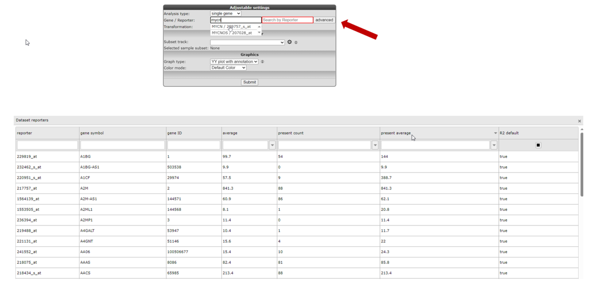
   
   [**Figure 2: Top, by default the reporter with the highest expression level is selected. Below, the advanced search option with the grid**](_static/images/Onegeneview/OneGene_multipleprobegrid2.png)

2. To follow the example of this tutorial, use the pre-defined default settings in the rest of the "Adjustable settings" panel, and click ‘Next’.
   

Step 3: Plotting Gene expression 
---------------

1. R2 generates a YY-graph (Figure 3) from the MYCN expression levels of
   all samples with expression levels ordered from left (low) to
   right (high). Hovering over the dots reveals additional annotation
   that R2 has stored for the focused sample.

   
   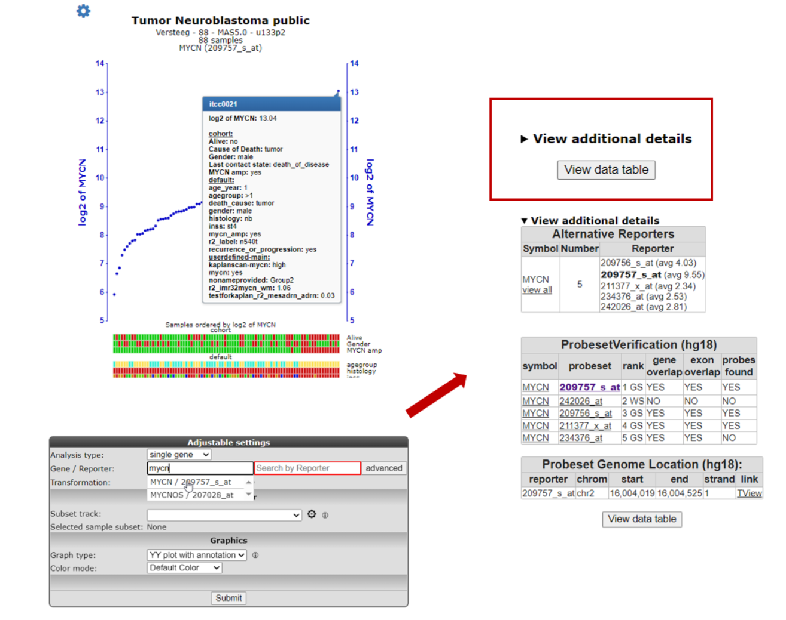

   [**Figure 3: YY plot MYCN expression**](_static/images/Onegeneview/OneGene_MYCN1c.png)
  
2. Underneath the X-axis, colored boxes are depicted, representing
   clinical information of the samples in so-called "tracks". Again,
   hovering over them will reveal underlying data. For MYCN there is a
   clear relationship between the expression levels and the tracks for
   “MYCN amplification” and “INSS-stage“. The display of these tracks underneath
   the image gives a quick glance at some of the clinical parameters,
   defined for the dataset. Clicking the triangle at  **View additional detail** provides functional information for the reporters and the genome location if available.  It is also possible to define your own
   custom-made tracks, or disable/adapt the settings for default tracks
   (further explained in the chapter 23 “Adapting R2 to your needs“)

3. Sometimes you get more insight by reviewing the expression levels
   with other transformations. In order to change the transformation, scroll down to the "Adjustable settings" panel underneath the graph and tracks. In the pulldown menu of the ‘Transformation’ setting, choose “none” 
   and then click the button *Submit* at the bottom of the panel.   

   
   

---------------
 **Did you know that converting expression levels using the “transform” option can help you gain additional insight?**                              

> *There are several data transformations available*                         
>  -   *“none”: Raw untransformed expression values, as they are represented 
>        in the R2 database.*                                                  
>  -   *“2log”: logarithmic values with base of 2. Every increment constitutes twice the amount.*                                        
>  -   *“rank”: Data transformation in which numerical or ordinal values are 
>        replaced by their rank when the data are sorted by expression. This transformation is useful for non-parametric statistical tests.*       
>  -   *“zscore”: 2log transformed data, centered around the average and expressed as the number of standard deviations from the average.*     
>  -   *“zscore\_nonlog”: raw intensity values, centered around the average and expressed as the number of standard deviations from the average. This transformation is useful when the intensities in R2 are not raw, but for example logfolds as is often the case for aCGH data.*    
>  -   *“mad/mad2log”: Median absolute deviation (on raw values, or log2 transformed values). The MAD is particularly useful in situations where the data may contain outliers or is not normally distributed.*                                                 
>  -   *“center/log2center”: Expression values centered around 0 (on raw     
>        values, or log2 transformed values).*
>  -   *“Rank”: numerical or ordinal values are replaced by their rank when the data are sorted*
>  -   *“zscore\_group”: Converts the expression levels from the zscore within 
>        a group (track). Applicable when e.g. technical variation in          
>        expression levels is expected. A possible reason could be when       
>        samples from the same dataset originate from different centers.*  
>  -   *“Square root”: The square root of a number is the number that gets multiplied to itself to give the product.*
>  -   *“log2 grouped zscore”: 2log transformed data within each group of a selected track separately and re-merged after calculation*
----------

---------------
Step 4: Selecting other analysis types:
----------------

In the one gene view plot we have investigated the gene expression of a single gene together with the sample annotation depicted below the graph.

1. Thus far, we have been looking at the expression of MYCN ordered by the expression levels. From the one-gene view "Adjustable settings" panel there are also other analysis types. Here, we will discuss the analysis type; gene vs gene. 

2. Select in the analysis type menu, the gene vs gene option. The "Adjustable settings" panel will adapt automatically according to the selected analysis type. As illustrated in Figure 4 you simply fill in a different Gene for Gene/Reporter 1 than for Gene/Reporter 2.

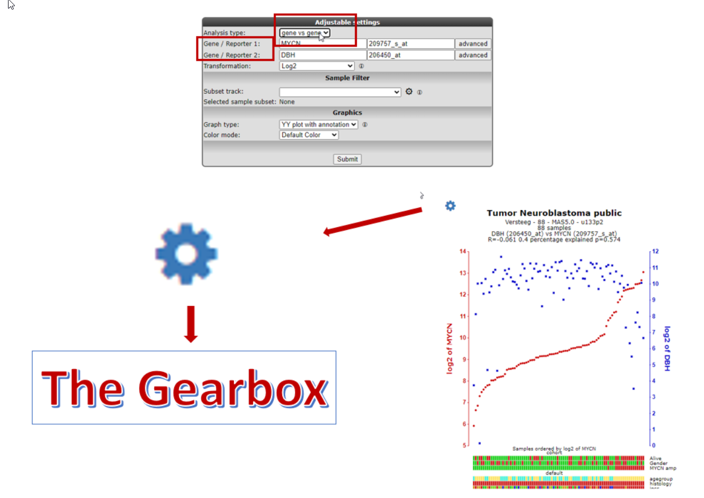
[**Figure 4: Select other analysis types**](_static/images/Onegeneview/OneGene_otheranalysis_v3.png).

3. In the top left corner of almost every figure in R2, you will find an gear-icon as depicted in Figure 4. By clicking the gear-icon, the "plot options" box will open which allows you to adapt a large selection of all kinds of settings and combinations. Some examples of things you can do;

* Adapting fonts & Colors
* Coloring individual samples by track
* Manipulate the axis
* Plot extra  or de-select tracks

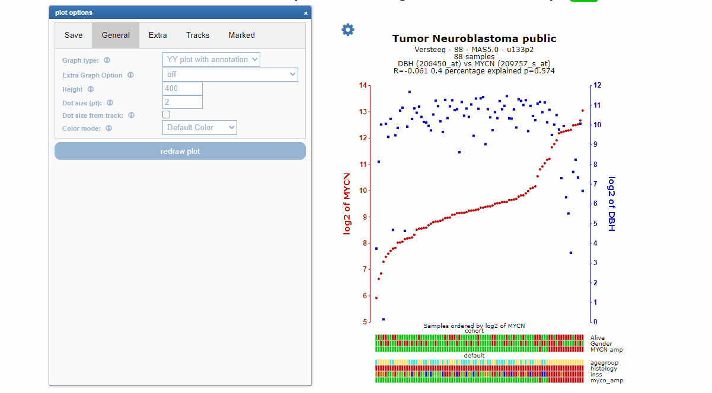

[**Figure 5: Adjusting the 2 gene plot**](_static/images/Onegeneview/OneGene_plotoptionesettings_v1.png)

Step 5: Marking / highlighting samples within a plot 
----------------

1. In the “plot options” panel, several other settings can be found to change the specific input for the analysis or to adapt the looks of the graph:

  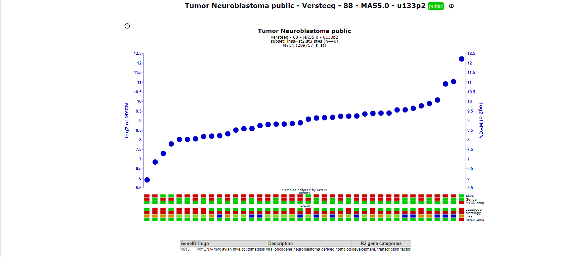

[**Figure 6a: Marking samples in an interactive plot**](_static/images/Onegeneview/OneGene_view_interactive1a.gif)

To highlight specific samples in the graph, you can simply click on the marker-points of the samples in the graph that you want to highlight, or you can enter the R2 sample IDs (shown at the top of the additional information when hovering a sample dot) in the 'id' field in the 'Marked' section of the "plot options" panel.
* Several marking options can be selected with the 'type' dropdown menu that can be found in the 'Marked' section of the "plot options" panel (e.g.; ‘epicenter’ and ‘arrow’).

[//]: # (The skeleton for advanced usage is: ‘sample1,sample2:hexcolor1:method1;sample3,sample4:hexcolor2:method2’. )

[//]: # ()
[//]: # (Please note, that there is a semicolon **;** between the 2 groups of samples here. For example: ‘“itcc0288:ff4444:epicenter;itcc0021:#FF0000:arrow;itcc0013,itcc0132:00ff00:dot”’ creates the markings as shown in the figure below.)

[//]: # (![]&#40;_static/images/Onegeneview/OneGene_view_samplesmark_v2a.png "Figure 6: Adjusting the graph settings"&#41;)

[//]: # ()
[//]: # ([**Figure 6: Adjusting the sample mark layout**]&#40;_static/images/Onegeneview/OneGene_view_samplesmark_v2a.png&#41;)

---------------
**Did you know that R2 allows you to emphasize samples in the graph with many different marker options?**

> *R2 knows a couple of marker options, that you can make use of in the advanced prescriptions:*
>
> - *'dot': places a thick border around the sample*
>
> - *'circle': Places a ring around the sample (diameter 9)*
>
> - *'circle_2': Places a ring around the sample (diameter 4)*
>
> - *'circle_3': Places a ring around the sample (diameter 1), effectively a thin border*
>
> - *'epicenter': Places a set of 3 rings descending in width around a sample*
>
> - *'arrow': Places a block arrow pointing to the sample*
>
> - *'triangle': Places a filled triangle under the sample*
> 
> - *'text': will plot the sample name by the corresponding plot (interactive plot only)*
>
> *Note: The dotsize does not scale with 'arrow' and 'triangle' method.*
---------------

Another often used feature present in the "plot options panel" is the **Vector (SVG) output** option. The vector images are often used in manuscripts and this funciton should be used to create images with the resolution meeting your own demands. In the "plot options" panel the SVG output option can be selected.

 image of your graph")

[**Figure 7: Obtain a vector (SVG) image of your graph**](_static/images/Onegeneview/OneGene_adjustablesettings_svg_v2.png)

----------
**Did you know that the 'Adjustable settings' panel is available under most graphs and analysis results in R2?**

> *Just scroll down the page to find the Adjustable settings panel with options to adjust the settings of the analysis or to adjust the looks of the graph. **Don't forget to press the Submit** button at the bottom of the panel in order for your changes to take effect!*

2. When you are in the one gene view plot, a logical step is to investigate the expression levels in correspondence  with a group parameter. Select in the 'Analysis type' menu of the "Adjustable settings" panel: gene vs track. Select the inss track in the 'Track' menu and click "submit" (**Figure 8**). The cohort is separated accordingly by the patient INSS staging in alphabetical order. It could be that the ordering of the group parameters is not the most convenient representation for your analysis. In order to customize this, you can create your own track as described in Chapter 23 (“Adapting R2 to your needs”) and make your own track with the correct ordering eg: a_stage IV, b_stage 1 etc. 

N.B.  The same analysis can also be obtained with the module "View a Gene in Groups" from the main page.  

3. The current representation is the most honest way of showing your data, as every single value is visible in the plot. In the 'General' section of the "plot options", the Track and Gene Sort can be selected in the 'Extra Graph Option' dropdown menu to organise the epxression levels in your graph per group (Figure 8).

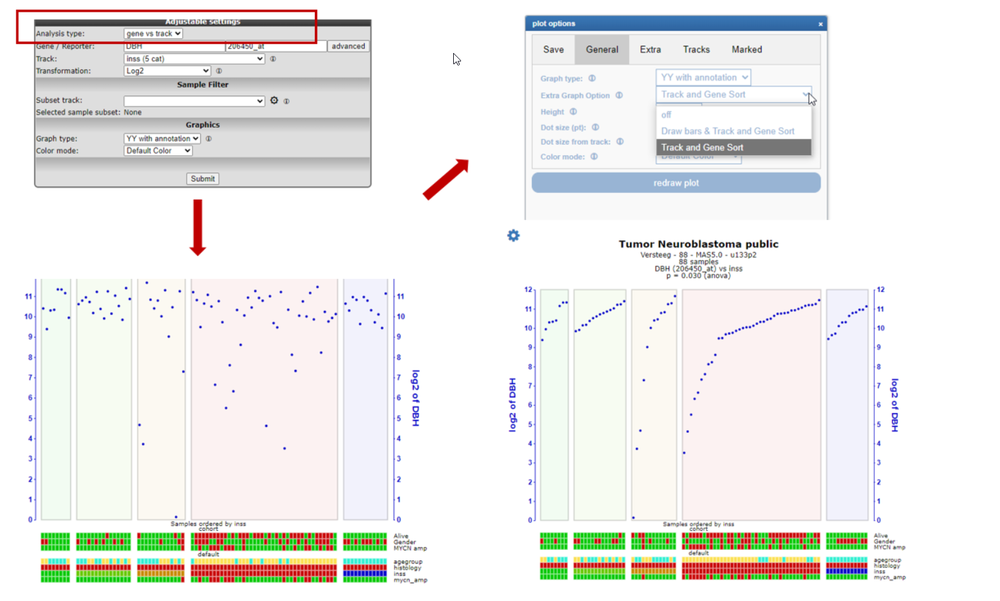

[**Figure 8: Gene versus track / track and gene sort**](_static/images/Onegeneview/OneGene_genevstrack1a.png)

4. We can also change the graphical representation of the data by selecting another graph type. Select for example 'boxplot' from the 'Graph Type' dropdown in the "Adjustable settings" panel and change 'Color mode' to 'color by track', such that the inss track is used to color the boxes. Press the 'Submit' button again to change the view. We now obtain a boxplot image where the respective groups have been colored according to the INSS groups (**Figure 9**). Adaptations to other graph types can be made in a similar way. The plot types can be selected on two places; in the "plot options" panel and in the "Adjustable settings" panel.  

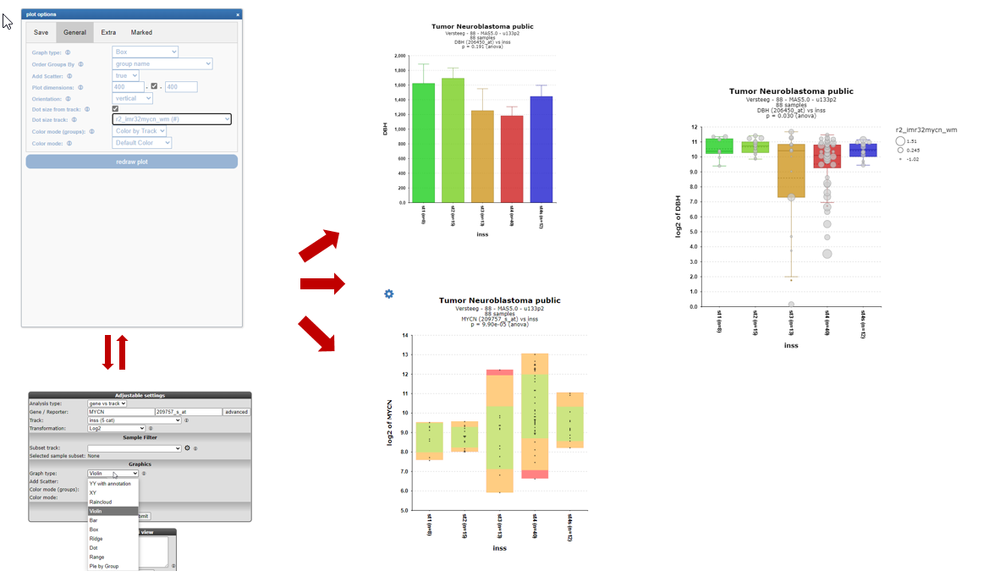

[**Figure 9: Making boxplots**](_static/images/Onegeneview/OneGene_viewinGroups_v1b.png)

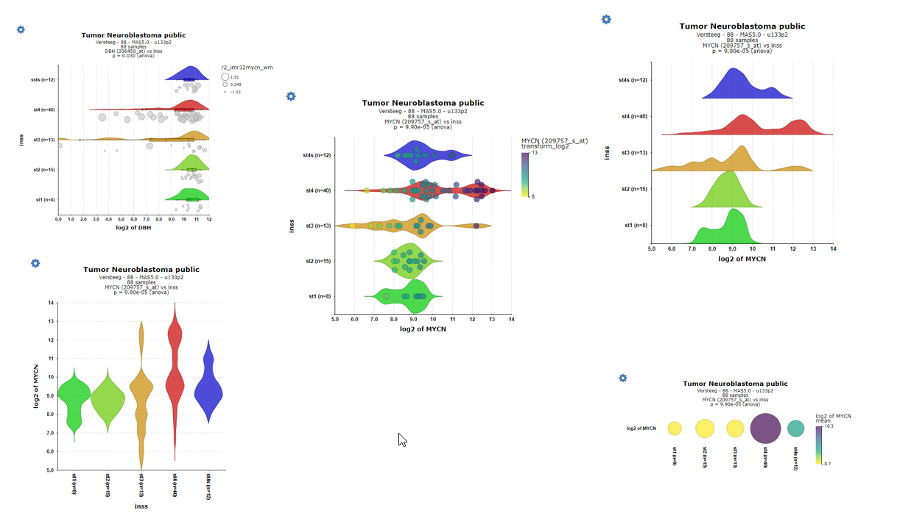

[**Figure 10: Making raincloud plots and more**](_static/images/Onegeneview/OneGene_othergraphs_v2.png)

The boxplot (with add_scatter = **TRUE**) can of course reveal valuable information about statistics and the distribution of data. Another relative new visualization technique which combines several aspects of the traditional plots such as the box plot, dot plot and violin plot is  the **raincloud** plot combining summary statistics such as median and quartiles and the density estimation of the violin plot. The individual datapoints are represented as points or raindrops along the vertical axis which provides a better understanding of the data distribution (see left graph in **Figure 10**).

5. You can also sort the groups by their average or median gene expression and customize your graph in various ways by clicking the Gear-icon and using the 'General' section of the "plot options" panel. In Figure 11 this illustrated by using the Median options of the 'Order Groups By' dropdown menu, thereby ordering the INSS stage sequence according to the median gene expression of MYCN. On top of that the individual dots can be colored by the Z-score of for example the DBH expression by using the Color by a Gene options of the 'Color mode' dropdown menu and selecting DBH as reporter NAME. In case the samples have also been profiled for another type of data such as methylation or drug data, you can also select these datatypes in the pull-down menu when you have selected color by gene. You can use the values from these corresponding sets in the same graph (Figure 11) thereby combining expression and other omics data.

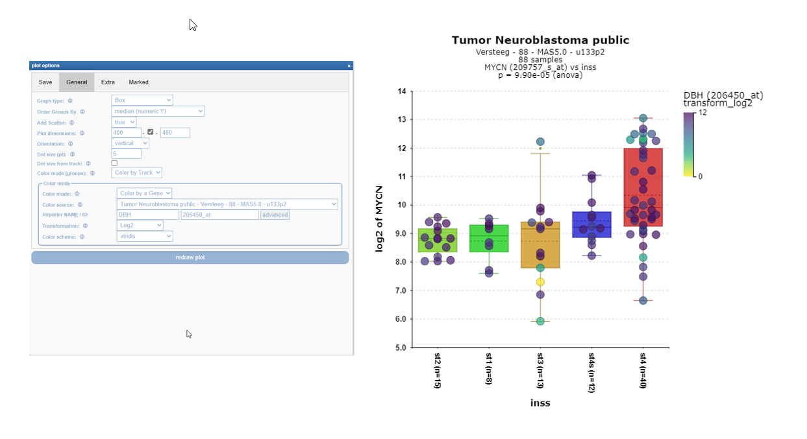

[**Figure 11: Ordering boxplots**](_static/images/Onegeneview/OneGene_boxplotsorderby_v1b.png)

6. Also, directly accessible from the "Adjustable settings" panel is the track vs track option described in more detail in Chapter 5: Annotation Analyses; "Relate two tracks". Keep in mind that the analysis type options described in this chapter can also be selected directly from the main menu. 

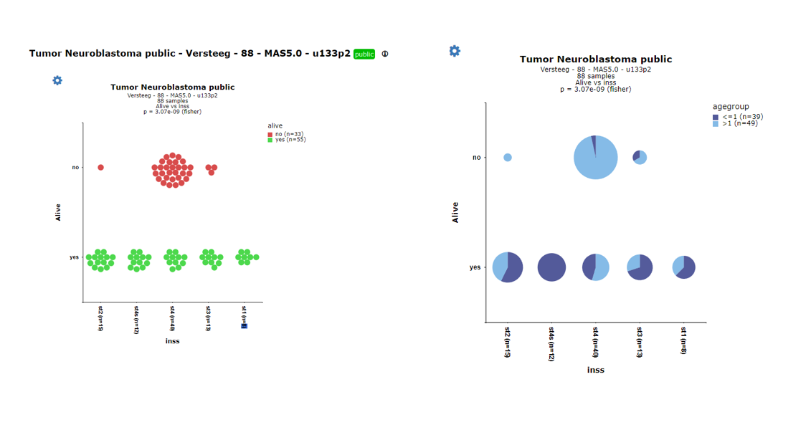

[**Figure 12: Track versus Tracks / Main menu**](_static/images/Onegeneview/OneGene_boxmainmnu1a.png)

Analyses in "Adjustable settings" panel vs Main Menu: 
- *'single gene': In main menu: "view a gene"*
- *'gene vs track': In main menu: "View a gene in groups"*
- *'track vs track': In main menu: "Relate two tracks"*

-----------
***Did you know that once you separate a dataset in more than 2 groups, R2 will identify the most significant pair?***

> *If you view a gene in groups within the one-gene-view page and the number of sub-groups is greater than 2, R2 will automatically perform brute-force t-testing with Welch correction to identify the combination of 2 groups that have the most significant difference. Just click the triangle at "View additional details" and gain insight into all the tested combinations.

Step 6: Sources for additional information on the selected gene 
----------------

1. In almost all the types of view, also a right menu panel is generated (**Figure 12**).

    and analyses options")

   [**Figure 12: Left menu panel providing additional info (including link-out) and analyses options**](_static/images/Onegeneview/OneGene_rightmenupanel.png)

In the right upper menu-panel several options are available to provide
you with additional information sources of the MYCN gene and additional
analyses;
- Pubsniffer. When you click on the link (the name of the gene) under the PubSniffer header, a new screen opens that lists the number of times your gene of interest is found within the NCBI PubMed database in
combination with dataset keywords. Clicking on one of the "PubReMiner" links redirects you
**to PubMed PubReMiner** which is a tool for PubMed query building and
literature mining.

- KaplanScan and Time Series analyses will be discussed in
separate tutorials. However, keep in mind, in case Kaplan-Meier data is available for a given dataset this will always be visible in the right menu for one-gene-view. 
- GeneCards will redirect you to an overview on your gene of interest composed of many different resources.
- ProbePlus will provide the sequences probed by the U133 Affymetrix platforms and other platforms if available.
- Across datasets will generate an overview showing the average expression of the gene of interest within all datasets of the same platform/normalization scheme (provided that the normalization supports
dataset additions).
- Sample Map(s) pre-generated high-dimensionality reduction maps (t-SNE and UMAP) which can be plotted.

---------------------------------------------------
  ***Did you know that [PubReMiner](http://hgserver2.amc.nl/cgi-bin/miner/miner2.cgi) is a helpful tool for literature mining?***  

> *In the large amounts of medical literature, finding information tailored to your needs and interest is becoming more and more complex. Using the right keywords is essential for effective searches, but which ones should you use?*
>  *PubReMiner is a web-based tool that allows simple text-based query building and information gathering (mining) of the NCBI literature search engine PubMed.*
>  *PubReMiner presents its results, gathered from abstracts, in frequency tables of journals, authors and words, which can be included / excluded in an iterative fashion.*
>  *Next to building efficient queries, PubReMiner can also be helpful in other areas: selecting a journal for your current work (by scanning the most often used journals of similar research), finding experts in a research area (by viewing the authors associated with your query), determining the research interest of an author (by viewing the keywords associated with an author)*

--------------------

Step 7: Advanced sorting and selecting samples
---------------

1. To investigate the values R2 uses for graph generation click on “View Datatable” button below the plot to open a table with the expression levels for all samples. Within this table you can use filters to restrict samples. By selecting the rows, a second table is generated, that can be copied to create an additional track e.g based on sorted data and subsequently pasted in Excel, for further investigation (**Figure 13**).
   
    

	[**Figure 13: Unfold the datatable**](_static/images/Onegeneview/OneGene_Datatable.png)
	
2. The “track display selection” section can be opened by clicking on it.
    In here, you are able to toggle which tracks to display and/or hide
    within the YY-plots. Do note that these selections are non-persistent
    and will be forgotten as soon as you leave the One Gene View. Persistent
    changes to the tracks can be made via the ‘User Options’ menu item, which
    is present in the main screen (see the tutorial 'Adapting R2 to your needs'). 
    Note that the Adjustable Settings panel, including the Customize Track parameters, 
    is available throughout R2 for temporary adaptation of Track visibility and other preferences.

	
	
	[**Figure 14: Tick and drag tracks**](_static/images/Onegeneview/OneGene_trackdisplay.png "Figure 14: Tick and drag tracks")

[//]: # (3. Other convenient options are revealed by clicking the “more settings”)

[//]: # (    section. An extra panel unfolds which allows you to adapt your graph to)

[//]: # (    meet, for example, the requirements of a journal. The appearance of this)

[//]: # (    section will change depending on the kind of graph that you are)

[//]: # (    selecting.)

[//]: # ()
[//]: # ()
[//]: # (![]&#40;_static/images/Onegeneview/OneGene_Extrasettings_v3a.png "Figure 15: the extra settings Panel"&#41;)

[//]: # ()
[//]: # ([**Figure 15: the extra settings Panel**]&#40;_static/images/Onegeneview/OneGene_Extrasettings_v3a.png&#41;)

[//]: # ()
[//]: # ()
[//]: # (![]&#40;_static/images/Onegeneview/OneGene_Adapting_v1.png "Figure 16: Adapting a graph"&#41;)

[//]: # ()
[//]: # ([**Figure 16: Sample annot added**]&#40;_static/images/Onegeneview/OneGene_Adapting_v1.png&#41;)

[//]: # ()
[//]: # (In Figure 16 sample annotation &#40;“Annot Graph”&#41; and legend &#40;“Draw)

[//]: # (Legend”&#41; were added. The “Annot Graph” option, adds the information of a)

[//]: # (selected track to the YY-plot. This can be helpful for the addition of)

[//]: # (Sample labels, or cell line names etc. Annotations can be shown in 3)

[//]: # (ways; just below/on top of the expression value, as a series below the)

[//]: # (annotation tracks or at the values for those samples that haven been)

[//]: # (marked. The size of the annotation scales with the setting of the)

[//]: # (dotsize.  )

[//]: # (Check the More Settings panel for extra options, such as changing the color of the axis or showing a linkto and SVG output image. )

[//]: # (The Adjustable Settings menu is available in most of the R2)

[//]: # (modules where a one-or two gene view is generated. Also by clicking the dots in case you have choosen for the YY-v2 version individual samples can be marked by arrow, circles etc. In Figure 17 an extra coloring for the individual samples has been applied , in this case the alive yes/no track.)

[//]: # ()
[//]: # ()
[//]: # (![]&#40;_static/images/Onegeneview/OneGene_Adapting2b.png "Figure 14: Fonts and Color changed"&#41;)

[//]: # ()
[//]: # ([**Figure 14: Fonts and Color changed**]&#40;_static/images/Onegeneview/OneGene_Adapting2b.png&#41;)

----------

Step 8: Selecting subsets
---------------

To generate a graph of a subgroup of samples, use the 'Subset track' pulldown from the 'sample filter' section in the "Asjustable settings" panel to select a specific group. 

In the neuroblastoma field it is well known that the MYCN expression is strongly correlated with the INSS stage 4, but maybe you are also interested in the mycn expression for the lower risk stages.

Go to the "Adjustable settings" panel and select in the pull down the INSS stage. In the popup window select the lower risk stages st1, st2, st3 and st4s and click "OK" (**Figure 14**). Back in the "Adjustable settings" panel click on the Submit button. These selections can be repeated a couple of times to build your ultimate selection.

 

 [**Figure 14: Selecting subgroups**](_static/images/Onegeneview/OneGene_selectsubgroups1a.png)

 The graphs below were drawn with Graphtype BoxDotPlot. All stages are depicted on the right hand side graph and 
 only the lower risk stages on the left. 

  versus lower risk only (left)")

 [**Figure 15: All stages (right) versus lower risk only (left)**](_static/images/Onegeneview/OneGene_subgroupvsall.png)

Next to the filter dropdown menu , clicking the *"wheel"* will open a pop-up screen with a grid to create tracks with in or excluding individual samples for the available tracks. From this point also a track can be created and stored. You will encounter the filter option in the "Adjustable settings" panel in many modules.

[**Figure 16: Advanced filtering in the grid**](_static/images/Onegeneview/OneGene_advancedfiltering.png)

Step 9: Find best track separation with CliniSnitch
---------------

 1. We could wonder if our gene of interest associates even more with any annotation that is already available for 
    the current dataset (like e.g. age group) than the example in the previous section. 
    For such an analysis R2 has the CliniSnitch function. Within this functionality a test is performed on each track. In addition, tracks are inspected before doing the test, 
    and the test is changed according to the contents: for a numeric vs numeric track the correlation is calculated resulting in an r-pvalue, in other words the correlation between the p-values.
    categorical vs numerical tracks are tested with an anova test; non-random associations for categorical vs categorical tracks are tested with 
    a Fisher’s exact test. Furthermore, 'ND' samples are automatically removed, and are not considered a valid group.  
    We can run a CliniSnitch analysis directly from the One Gene View page by clicking on the gene name under 
    'CliniSnitch' in the upper-left panel. Click on ‘MYCN’. Private/Group tracks that you may add to this dataset over time, will automatically be included in these analyses.

    

    [**Figure 17: CliniSnitch result for MYCN**](_static/images/Onegeneview/OneGene_CliniSnitch1.png)

2. Every test can also be visualized by clicking on the View-link in the table. 
Not surprisingly, we can see that MYCN expression is best separated by the MYCN amplification track. 
If we look at the ‘inss’ track, we can also see a significant value. 
Click on ‘View’ behind inss to inspect this further.

Step 10: Finding sample extremes.
---------------

In case you wonder whether any unusual expression levels show up for individual samples from a given dataset, you can you use the "Find sample extreme" option. In this example we know that sample ITCC0288 harbors a Phox2b mutation which leads to the question: can we find extreme expression values for this sample?

1. In the one gene view for this dataset select in the right panel sample itcc0288 in the sample overview  section and click 'view', leave all the settings at their default and click next.

    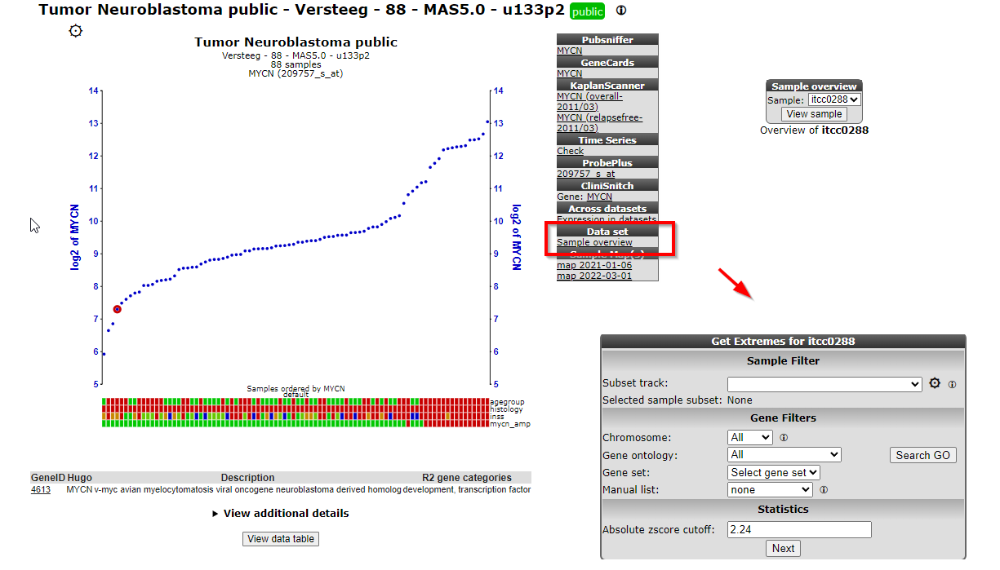

    [**Figure 18: Select your sample to find extremes**](_static/images/Onegeneview/OneGene_selectsampleextreme1a.png)

2. A table shows the negative z-score (left column) and positive z-score (right column) extremes. In Figure 22, genes which are a part of the Nor-Adrenalin pathway are in the top of the negative z-score list. This suggests that wild-type Phox2b is involved in the up-regulation of the Nor-Adrenalin pathway.  
   You can click on any of the genes listed in the table (here we clicked on "TH") to obtain the One Gene View of that gene, with your sample marked in the graph. 

    

    [**Figure 19: Sample extremes in one sample**](_static/images/Onegeneview/OneGene_sampleextremePhox2b.png)

---------------
Step 11: Reporter / Probeset verification
---------------

Datasets are always linked to a so called platform, in this case the **u133p2**  platform of Affymetrix (Thermofisher). R2 hosts for many platforms the reporters on the genome so the location and orientation can be inspected as described for the Affymetrix probesets. In R2 a platform contains specific information for the genes of a selected dateset.
If the ProbesetVerification table doesn't appear R2 has no information of the  reporter genome location of a given dataset. The table displayed in Figure 20 lists whether the various reporters of MYCN are in agreement with the genome position of MYCN reference sequence (RefSeq).
If all are stating “YES” then everything appears alright (from the
perspective of an automated assessment). The MYCN reporters with a “NO”
indicate there may be an issue with it. Scroll down the page
and click on the “Tview” link in the reporter table.

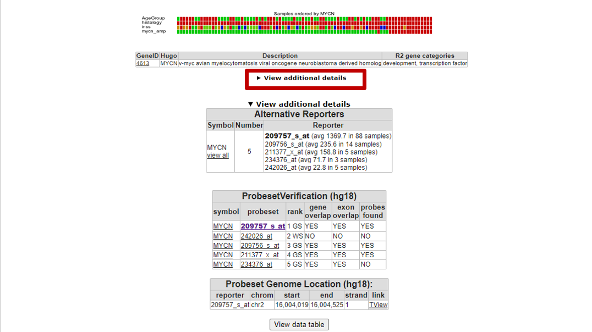

[**Figure 20: Probeset verification table**](_static/images/Onegeneview/OneGene_Probesettable.png)

2. A new screen (or tab in the browser) appears with TranscriptView.
    The TranscriptView application depicts the alignment of expressed
    sequence tags (EST) and mRNA sequences to the human reference genome
    sequence (Fig 25). The strand orientation of these sequences are
    indicated by a color (green = positive strand, red = negative
    strand, blue = strand information is missing). The structure of the
    reference sequence has also been indicated. Furthermore, the browser shows the alignment of the sequences that were used to generate the reporters on the array (in the case of Affymetrix microarrays).  
    This view can be used to inspect the quality of a reporter. Note, for instance, that the reporter
    “242026\_at” is aligned with the genomic region of the MYCN reference
    sequence, but that its color is different from the rest (colored
    in red). In addition, in this particular case the reporter is
    located in the intronic (light shaded color) region which is another
    reason not to pick a certain probeset. Indeed, if we compare the
    gene expression values of this reporter, then its expression is 60
    fold lower than R2's standard pick (22 vs 1369). Below the ESTs the
    average gene expression of the individual probesets is illustrating
    that for this example the correct probeset is selected for analysis.

   

[**Figure 21: Coloring represents type of transcript**](_static/images/Onegeneview/OneGene_Colorlegend.png)

[**Figure 25: MYCN reporters in Transcript view**](_static/images/Onegeneview/OneGene_Tview.png)

3. The same approach can also be follewed in this dataset: Mixed Colon Adenocarcinoma (2022-v32) - tcga - 512 - tpm - **gencode36** you see in bold that this dataset is linked to gencode version 36 (https://www.gencodegenes.org/)) .  

1. Clicking on "View Additional Details" unfolds a table with TView link. Here you can inspect in the genome browser the location a certain reporter is assinged to.

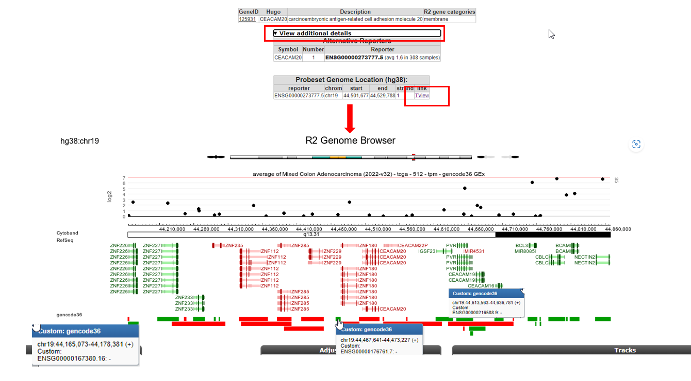

[**Figure 21: Probeset verification table**](_static/images/Onegeneview/OneGene_genecodereporters.png)

---------------
**Did you know that you can browse the gene expression values along the genome?**

> *Once you have entered the genome browser with an attached dataset (like above), you can also navigate to / zoom out any other region in the genome. This allows you to look at the neighboring genes in a single go.
>   It can be informative to separate the expression on the basis of a track. This can be achieved by selecting 'dataset\_track' from the sample dropdown in the middle panel. Finally, within the genome browser, the contents for a panel on the left side can be hidden from a view by setting the height to 0.*

---------------

Final remarks / future directions
---------------------------------

Some of these functionalities have been developed recently. If you run
into any quirks or annoyances, do not hesitate to contact r2 support
(r2-support@amsterdamumc.nl).

We hope that this tutorial has been helpful, the R2 support team.
