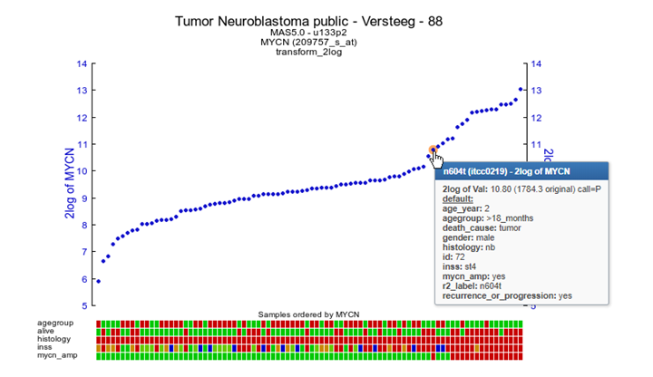
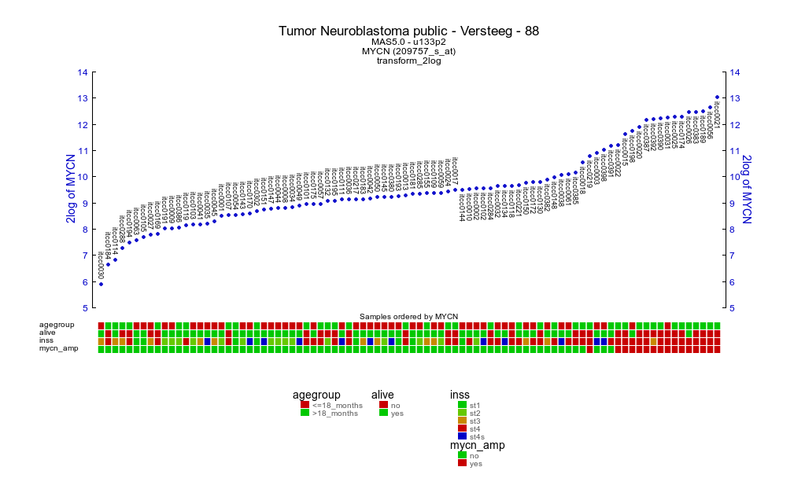

One Gene View
=============

*Analyze the expression levels of a single gene within a dataset*

Scope
-----

-   Use R2 to investigate the expression levels of all samples from a
    specific dataset.
-   In this example the expression levels of the MYCN gene will be used.
-   Adjust several parameters in the advanced settings panel to get a
    better insight in the expressions levels or adapt your
    graphic layout.
-   In R2, the samples are annotated with e.g clinical data, each group
    of annotated data is called a “Track” in R2. These tracks can be
    used to filter data in all types of analyses R2 is offering.
-   A separated info panel in the one-gene expression level screen
    provides different types of analyses based on the expression level
    of the chosen gene.
-   Most of the mRNA expression datasets are generated with Affymetrix
    profiling arrays. In general these arrays use more than one so
    called probeset to measure the expression level of one single gene.
    With a separated module “Transcript view”, the details of the
    probesets can be studied.

Tutorial step 1
---------------

1.  Use “Single Dataset” in field 1 and make sure that the “Tumor
    Neuroblastoma public - Versteeg - 88 - MAS5.0 - u133p2” dataset is
    selected in field 2.
2.  Choose “View a gene” in field 3.
3.  Type MYCN and click ‘next’.

   **Figure 1: Single geneselection**

  ---------------------------------------------------------------------------------------------------------------------------------------------------------------------------------------------------------------
  **Click on "all news" to see previous R2 updates**
  
  ---------------------------------------------------------------------------------------------------------------------------------------------------------------------------------------------------------------

Tutorial step 2
---------------

1.  In many cases more than one probeset is reported for each gene. In
    this example, there are 5 probesets annotated for the MYCN gene. By
    default, the probeset with the highest average present signal (APS)
    is selected. This APS signal is simply the average of all samples
    that are considered to express a selected gene (have a
    present call). Occasionally other probesets assigned to the same
    gene could be of interest depending on the structure of the gene
    (for example a potential splice variant). Also realize that the most
    informative probeset is re-determined in every dataset, sometimes
    resulting in a different probeset as the choice of R2. The
    expression levels are by default converted to log2 values.     
  
   **Figure 2: By default the probeset with the highest expression level is selected**  
2.  It could be that for a specific graphical representation not all
    the (default) tracks need to be represented in a graph. To add or
    skip tracks, click on the Track Display section and select the
    appropriate tracks.
3.  In the adjustable settings screen use the pre-defined default
    settings and click ‘next’.

  ---------------------------------------------------------------------------------------------------------------------------------------------------------------------------------------------------------------
 **Did you know that a reporter with an exclamation marks is an indication there may be something wrong with the reporter (e.g. bad design)**      

                   

 Hovering over the exclamation mark will inform you on what may be the    
 issue with a specific reporter (probeset).Reportes with an issue will    
 not be used to represent a gene in searches where hugoonce is used.\     
 Hovering over the name of a gene will display concise gene information,  
 such as alternative names for the current gene. In case you are not      
 searching with an official NCBI genesymbol, R2 will also search the      
 alternative names to find your gene of interest.                         
  
  ---------------------------------------------------------------------------------------------------------------------------------------------------------------------------------------------------------------

Tutorial step 3
---------------

1.  R2 generates a YY-graph Figure 3 from the MYCN expression levels of
    all samples with expression levels ordered from left (low) to
    right (high). Hovering over the dots reveals additional annotation
    that R2 has stored for the focused sample.
2.  Underneath the X-axis, colored boxes are depicted, representing
    clinical information of the samples in so called "tracks". Again,
    hovering over them will reveal underlying data. For MYCN there is a
    clear relation between the expression levels and the tracks for
    “MYCN amplification” and “INSS-stage“. So these tracks underneath
    the image give a quick glance at some of the clinical parameters,
    defined for the dataset. It is also possible to define your own
    custom made tracks, or disable/adapt the settings for default tracks
    (further explained in “Adapting R2 to your needs")
    

**Figure 3: YY plot MYCN expression**

3.  Sometimes you get more insight by reviewing the expression levels
    with other transformations. Scroll down and transform the data
    (Figure 4), choosing “none”, in the ‘transformation’ pulldown menu
    and click adjust settings. In the “adjustable settings” panel, there
    are several other settings to adapt the graph R2 generates (like
    changing font sizes, or adding labels to the datapoints). 
   ----------------------------------------------------------------------------------------------------------------------------------------------------------------------------------------------------------
  **Did you know that the Adjustable Settings panel is also available in the previous screen**
  
  Just scroll down the page
  
  ----------------------------------------------------------------------------------------------------------------------------------------------------------------------------------------------------------
    
  	To mark specific samples in the graph you can enter the sample ID’s in the
    ‘adjustable settings’ field, several marking options can be selected
    (e.g: ‘epicenter’ and ‘arrow’). To generate a graph of a subgroup of
    samples use the subset Select pulldown to select a specific group.
    Click ‘**confirm’** and the redraw button.

**Figure 4: Adjusting the graph settings**

--------------------------------------------------------------------------
 **Did you know that converting expression levels using the “transform” option can help you to gain additional insight.**                              

 There are several data transformations available                         
 -   “none”: Raw untransformed expression values, as they are represented 
     in the R2 database.                                                  
 -   “2log”: logarithmic values with base of 2. Every increment           
     constitutes twice the amount.                                        
 -   “rank”: Data transformation in which numerical or ordinal values are 
     replaced by their rank when the data are sorted by expression. This  
     transformation is useful for non-parametric statistical tests.       
 -   “zscore”: 2log transformed data, centered around the average and     
     expressed as the number of standard deviations from the average.     
 -   “zscore\_nonlog”: raw intensity values, centered around the average  
     and expressed as the number of standard deviations from the average. 
     This transformation is useful when the intensities in R2 are not     
     raw, but for example logfolds as is often the case for aCGH data.    
 -   “mad/mad2log”: Median absolute deviation (on raw values, or log2     
     transformed values).                                                 
 -   “center/log2center”: Expression values centered around 0 (on raw     
     values, or log2 transformed values).                                 
 -   “zcore\_group”: Coverts the expression levels from the zscore within 
     a group (track). Applicable when e.g technical variation in          
     expression levels is expected. A possible reason could be when       
     samples from the same dataset originate from different centers.      
     
--------------------------------------------------------------------------

Tutorial step 4
---------------

Figure 5 lists for the various reporters of MYCN whether they are in
agreement with the genome position of MYCN reference sequence (RefSeq).
If all are stating “YES” then everything appears alright (from the
perspective of an automated assessment). For the MYCN reporters “NO”
indications indicate there may be an issue with it. Scroll down the page
and click on the “Tview” link in the reporter table.

**Figure 5: Probeset verification table**

1.  A new screen (or TAB in the browser) appears with TranscriptView.
    The Transcript view application depicts the alignment of expressed
    sequence tags (EST) and mRNA sequences to the human reference genome
    sequence (Fig 5). The strand orientation of these sequences are
    indicated by a color (green = positive strand, red = negative
    strand, blue = strand information is missing). The structure of the
    reference sequence has also been indicated. Furtermore, it has also
    aligned the sequences used to generate the reporters on the array
    (in the case of Affymetrix microarrays). This view can be used to
    inspect the quality of a reporter. Note that the reporter
    “242046\_at” is aligned to the genomic region of the MYCN reference
    sequence, but that it’s color is different from the rest (colored
    in red). In addition in this particular case the reporter is also
    located in the intronic (light shaded color) region which is also a
    reason not to pick a certain probeset. Indeed, if we compare the
    gene expression values of this reporter, then its expression is 60
    fold lower than R2's standard pick (22 vs 1,369). Below the ESTs the
    average gene expression of the individual probesets is illustrating
    that for this example the correct probeset is selected for analysis.
    NB: Currently probeset verification is only provided for various
    human Affymetrix array types.

**Figure 6: Color legend**

  [**Figure 7: MYCN reporters in Transcript view**](_static/images/OneGene_Tview.png)

  --------------------------------------------------------------------------------------------------------------------------------------------------------------------------------------------------------------------------------------------------------------------------------------------------------------------------------------
  ***Did you know that you can browse the gene expression values along the genome***

  Once you have entered the genome browser with an attached dataset (like above), you can also navigate to / zoom out any other region in the genome. This allows you to look at the neighboring genes in a single go.\
  What can also be informative is the ability to separate the expression on the basis of a track. This can be achieved by selecting 'dataset\_track' from the sample dropdown in the middle panel. Finally, within the genome browser, the contents for a panel on the left side can be hidden from a view by setting the height to 0.
  --------------------------------------------------------------------------------------------------------------------------------------------------------------------------------------------------------------------------------------------------------------------------------------------------------------------------------------

Tutorial step 5.
----------------

1.  Close the TranscriptView TAB or go back to the MYCN 1-gene-view
    expression screen.

[**Figure
8:Left menu panel providing additional info (including link-out) and
analyses options**](_static/images/OneGene_menupanel.png)

In the left upper menu-panel several options are available to provide
you with additional information sources of the MYCN gene and additional
analyses. KaplanScan and Time Series analyses will be discussed in
separate tutorials. GeneCards will redirect you to an overview on your
gene of interest composed of many different resources. ProbePlus, will
provide the sequences probed by the U133 Affymetrix platforms (Will not
be shown in other platforms).\
Across datasets will generate an overview showing the average expression
of the gene of interest within all datasets of the same
platform/normalization scheme (provided that the normalization supports
dataset additions).

  ----------------------------------------------------------------------------------------------------------------------------------------------------------------------------------------------------------
  ***Did you know that the CliniSnitch reveals possible clinical relevance with a chosen gene***

  The CliniSnitch module assesses whether your gene of interest displays differential expression in any of the annotated parameters provided for a dataset.\
  To determine the best association, brute force T-testing is employed between every possible subset which can be defined in a track. Ps. When you add tracks of your own, then these are also tested.
  ----------------------------------------------------------------------------------------------------------------------------------------------------------------------------------------------------------

Clicking on pubsniffer opens a new screen showing a list of how times
your gene of interest is found within the NCBI Pubmed database in
combination with dataset keywords. Clicking on “outlink” redirects you
**to Pubmed Pub-reminer** which is a tool for PubMed query building and
literature mining.

  --------------------------------------------------------------------------------------------------------------------------------------------------------------------------------------------------------------------------------------------------------------------------------------------------------------------------------------------------------------------------------------
  ***Did you know that the [Pub-reminer](http://hgserver2.amc.nl/cgi-bin/miner/miner2.cgi) is a helpful tool for literature mining***

  In the large amounts of medical literature, finding information tailored to your needs and interest is becoming more and more complex. Using the right keywords is essential for effective searches, but which ones should you use?\
  Pub re-miner is a web-based tool that allows simple text-based query building and information gathering (mining) of the NCBI literature search engine PubMed.\
  Pub re-miner presents its results, gathered from abstracts, in frequency tables of journals, authors and words, which can be included / excluded in an iterative fashion.\
  Next to building efficient queries, Pub re-miner can also be helpful in other areas: selecting a journal for your current work (by scanning the most often used journals of similar research) Finding experts in a research area (by viewing the authors associated with your query) Determine the research interest of an author (by viewing the keywords associated with an author
  --------------------------------------------------------------------------------------------------------------------------------------------------------------------------------------------------------------------------------------------------------------------------------------------------------------------------------------------------------------------------------------

Tutorial step 6
---------------

To investigate the values R2 uses for graph generation click on
“Datatable” to unfold a table with the expression levels for all
samples.

[**Figure
9: Unfold the
datatable**](_static/images/OneGene_Datatable.png)

The “track display selection” section can be opened by clicking on it.
In here, you are able to toggle which tracks to display and/or hide
within the YY-plots. Do note that these selections are non-persistent
and will be forgotten as soon as you leave the xgeneview. Persistent,
changes to the tracks can be made via the ‘my settings’ menu item, which
is present in the main screen. Note that the adjustable settings panel
including the customize track parameters are available throughout R2.

[**Figure
10: Tick and drag
tracks**](_static/images/OneGene_trackdisplay.png)

Other convenient options are revealed by clicking the “more settings”
section. An extra panel unfolds which allows you to adapt your graph to
meet for example the requirements of a journal. The appearance of this
section will change depending on the kind of graph that you are
selecting.

[**Figure
11: the extra settings
Panel**](_static/images/OneGene_Adapting.png)[**Figure
12: Adapting a
graph**](_static/images/OneGene_Extrasettings.png)

In Figure 12 sample annotation (“Annot Graph”) and legend (“Draw
Legend”) were added. The “Annot Graph” option, adds the information of a
selected track to the YY-plot. This can be helpful for the addition of
Sample labels, or cell line names etc. Annotations can be shown in 3
ways; just below/on top of the expression value, as a series below the
annotation tracks or at the values for those samples that haven been
marked. The size of the annotation scales with the setting of the
dotsize.The adjustable settings menu is available in most of the R2
modules where a one-or two gene view is generated.

[**Figure 13: Legend added**](_static/images/OneGene_Adapting.png)[**Figure
14: Adapting annotation
size**](_static/images/OneGene_Adapting2.png)

Final remarks / future directions
---------------------------------

Some of these functionalities have been developed recently. If you run
into any quirks or annoyances don't hesitate to contact r2 support
(r2-support@amc.uva.nl).

We hope that this tutorial has been helpful,The R2 support team.

