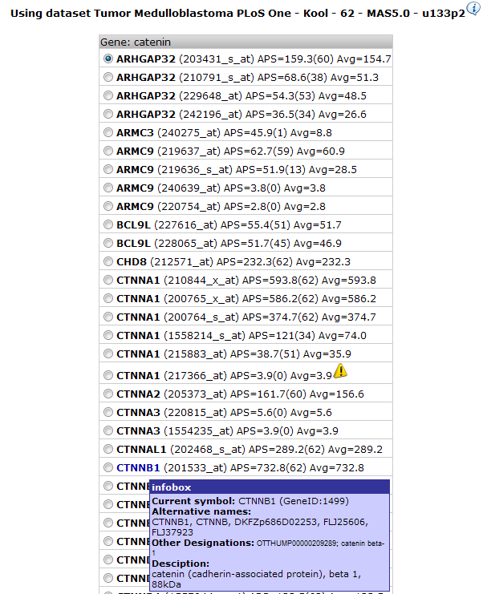
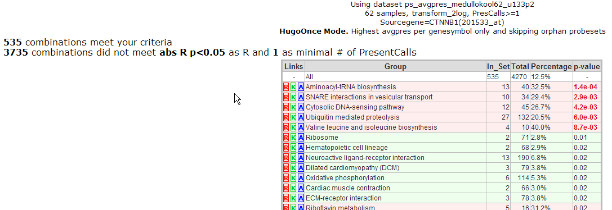
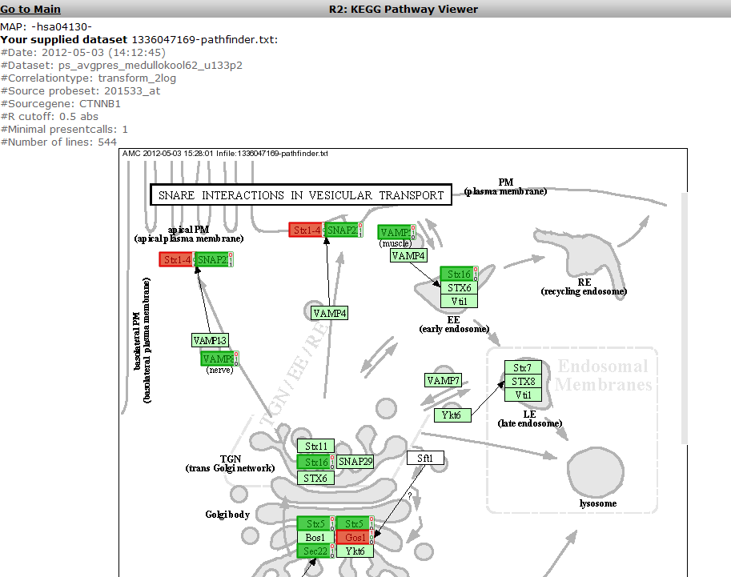
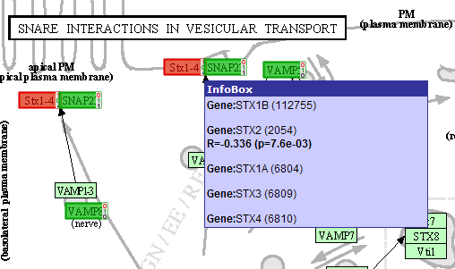
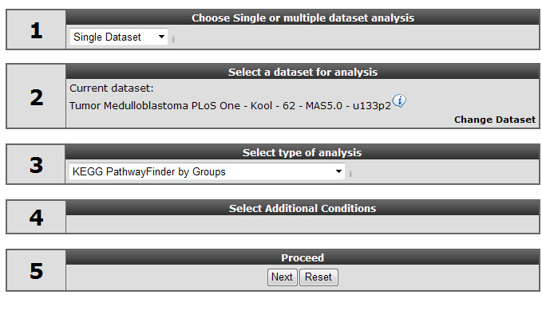
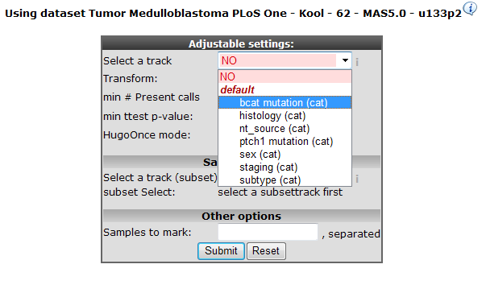
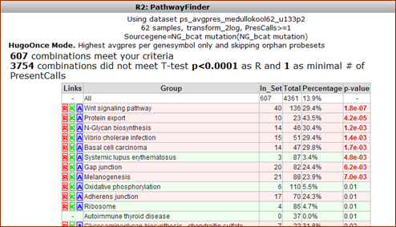
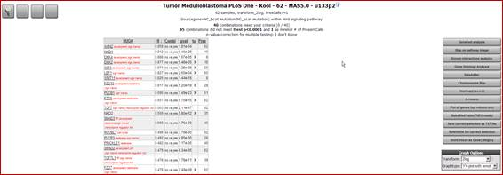
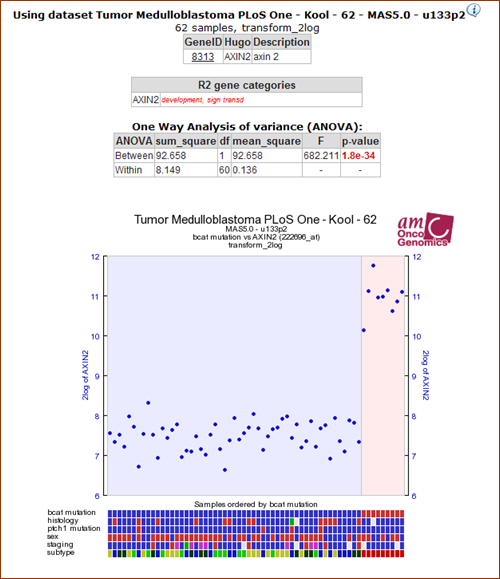

Pathway Finder
==============

*Which known pathways play a role in your data?*

Scope
-----

-   In molecular biology the concept of pathways is important; small
    molecules, proteins, genes, etc. interact, resulting in specific
    phenotypic outcomes at all levels in biology.
-   Quite a lot of this knowledge is stored as pathways in databases. An
    extensive resource can be found here
    <http://www.pathguide.org/> .
    To name a few:
    -   KEGG Pathway database
        (<http://www.genome.jp/kegg/pathway.html>)
    -   WikiPathways
        (<http://wikipathways.org>)
    -   PantherDB
        (<http://www.pantherdb.org>)
-   R2 allows you to see whether biological pathways might play a role
    in your dataset of choice.
-   In this tutorial we'll use array data of a set of 62
    Medulloblastoma tumors. In some Medulloblastoma tumors the gene
    beta-catenin is mutated. This specific dataset has clinical
    annotation for beta catenin mutations. We're going to investigate
    this in a pathway context.

Tutorial step 1
---------------

1.  Make sure that the Single Dataset option is selected in field 1 of
    the step by step guide.
2.  In field 2 locate and select the 'Tumor Medulloblastoma PLoS One-
    Kool - 62 MAS5.0 -u133p2' dataset by clicking 'Change Dataset'
3.  In field 3 select 'KEGG PathwayFinder by Gene correlation'
4.  You might not know the exact gene symbol for beta catenin. R2 can
    find the gene symbol by alternative name also, we'll try 'catenin';
    Figure 1.
5.  Click 'Next'

	
	
	[**Figure1: Selecting KEGG pathwayfinder by gene correlation forcatenin**](_static/images/Pathway_menu.png)
	

Tutorial step 2
---------------

1.  R2 has found several suggestions with the word catenin, hovering
    over the gene symbols gives additional information. Based on that
    information choose CTNNB1, take the probeset with the highest
    average expression, this is most likely the probeset that best
    represents mRNA concentration.
    
	
	
	[**Figure    2: Options for alternative name catenin: choose    CTNNB1**](_static/images/Pathway_list.png)
	
2.  Scroll down, leave the other options as they are, and
    click 'Submit'.

Tutorial step 3
---------------

1.  R2 calculates for all genes in the KEGG pathways whether their
    expression correlates with that of CTNNB1. Next it calculates for
    all pathways whether they contain a significant number of
    correlating genes; if the genes correlating with CTNNB1 are
    overrepresented in that pathway (For an in depth discussion see R2
    Tutorial; Find genes correlating with your gene of interest. The
    result is returned as a list of pathways; Figure 3.
    
	
	
	[**Figure    3: KEGG pathways that have an overrepresentation of genes that    correlate with CTNNB1 in this    dataset**](_static/images/Pathway_Kegg.png)
	
2.  An overall explanation is printed above the list; of all genes
    present in all KEGG pathways, \~ 540 correlate with CTNNB1 with a p
    value < 0.05. In the table the KEGG pathways are listed ranked by
    their p-value for overrepresentation (background in red) or
    under-representation (in green) of these genes. The brightly colored
    letters in front of the pathway-name are hyperlinked. **R** links to
    a list of the genes, **K** leads to the original KEGG pathway on the
    Japanese servers, **A** links to an image of the KEGG pathway that
    is provided with hover-over information for all genes in
    the pathway. We'll discuss the first two later, now click on the A
    in front of the 'SNARE interactions in vesicular transport'-pathway.
    
	
	
	[**Figure    4: The SNARE pathway; darker green and red are genes correlating    with CTNNB1**](_static/images/Pathway_SNARE.png)
	
3.  R2 opens a new window in your browser (Figure 4). In darker green
    the genes that have a positive correlation with CTNNB1 and in red
    those having a negative correlation. Hovering over the genes with
    the mouse pointer presents additional information; some of the
    gene-boxes represent multiple genes: Figure 5 Although not in this
    example, it may happen that multiple genes within a box show both
    positive, as well a s negative correlations. In such case the box is
    proportionally filled with red and green.
4.  The result however, is not quite convincing, apparently CTNNB1
    expression does not correlate with pathways. We're going to try it
    the other way around; which pathways correlate with a catenin
    mutation
5.  Return to list view (still open in another tab of your browser) and
    go to the R2 main page by clicking the link in the upper left corner
    of the screen.

	
	
	[**Figure5: : Hovering over the Stx1-4 box shows that this actually represents 5genes; only one of them is correlating withCTNBB1.**](_static/images/Pathway_Zoom.png)
	

Tutorial step 4
---------------

1.  In field 3 on the R2 start page select 'KEGG PathwayFinder by
    Groups';
    
	
	
	[**Figure    6: Selecting PathwayFinder by    Groups**](_static/images/Pathway_Finder.png)
	
2.  Click "Next"

Tutorial step 5
---------------

1.  This set of tumors is annotated with several clinical and molecular
    biology parameters in so called tracks. One of them is the presence
    of a beta catenin mutation; bcat mutation. Select this; Figure 7.
    Pathway\_Select
    
	
	
	[**'Figure    7: Selecting the bcat    mutation track.**](_static/images/Pathway_Select.png)
	
2.  Click "Submit"

Tutorial step 6
---------------

1.  R2 calculates for all genes in the KEGG pathways whether they are
    differentially expressed between the groups of tumors having a
    mutation and those that do not have one. In a subsequent calculation
    the overrepresentation of these genes in the individual pathways
    is determined. From the resulting list it is obvious that the Wnt
    pathway has a strong overrepresentation of genes that are
    differentially expressed between the two groups. \[\[Image:\]\]
2.  Click on the R link to let R2 create a list of these genes.

[**Figure
8:The Wnt pathway has a strong overrepresentation of genes that are
differentially expressed between the groups of tumors that have and
don't have a beta catenin
mutation.**](_static/images/Pathway_Wnt.png)

Tutorial step 7
---------------

1.  A list of hyperlinked genes is returned, sort them by descending
    R-value by clicking on the R-column-header twice;
    
	
	
	[**Figure    9: Wnt pathway genes correlating with Beta Catenin mutation as    a list.**](_static/images/Pathway_correlate.png)
	
2.  Each gene-symbol is hyperlinked to a graph representing the specific
    results; click the top gene in the list: AXIN2.

Tutorial step 8
---------------

1.  The graph shows an excellent correlation of the expression of the
    Wnt pathway gene AXIN2 with tumors having a Beta Catenin mutation.
    The same goes for a significantly overrepresented set of genes in
    this pathway. This specific group of tumors is also known as the
    Wnt-subtype in the Medulloblastoma field.

	
	
	[**Figure10:AXIN2 expression correlates with Beta Cateninmutations**](_static/images/Pathway_Axin.png)
	

Final remarks / future directions
---------------------------------

We hope that this tutorial has been helpful,The R2 support team.

