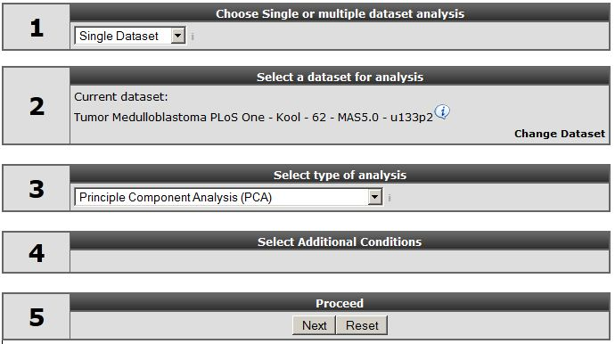
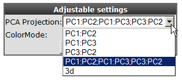
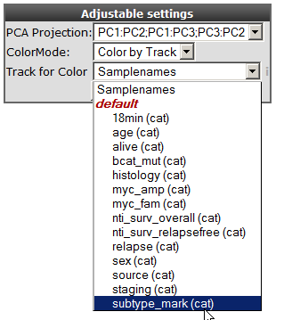
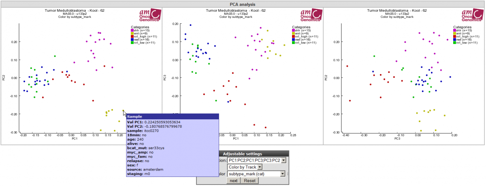
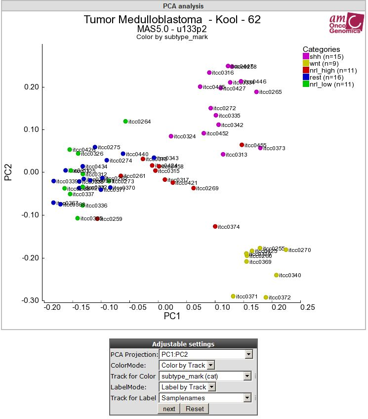
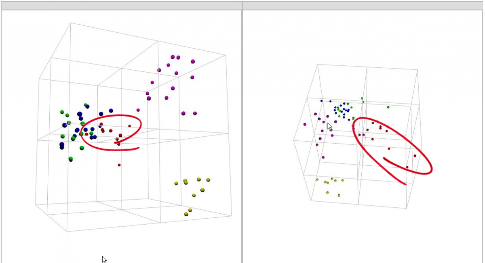

Principle Components Analysis in R2
==================================

*How to identify patterns or groups in your dataset using Principle
Component Analysis.*

Scope
-----

-   In this tutorial expression data of a set of Medulloblastoma tumors
    will be investigated for the existence of subgroups.
-   Principle Component Analysis (PCA) will be used to analyze the
    tumor samples.

Tutorial step 1
---------------

1.  Make sure that the Single Dataset option is selected in field 1 of
    the step by step guide.
2.  In field 2 locate and select the 'Tumor Medulloblastoma PLoS One-
    Kool - 62 MAS5.0 -u133p2' dataset by clicking 'Change Dataset'
3.  In field 3 choose the 'Principle Component Option' option (Error:
    Reference source not found)
    
	
	
	[**Figure    1: Selecting Principe Component    Analysis**](_static/images/PrincipleComponent_Select.png)
	
4.  Click "next"

Tutorial step 2
---------------

1.  The next window presents a set of fields where specific settings of
    the clustering algorithm used can be set. Leave all the settings at
    their default and click "next".
2.  Click to plot the PCA result.
3.  You now see a plot of the of the first 2 principle components. In
    the adjustable settings box, al the combinations principle
    components can be selected. R2 enables visualization of the first
    three principle components (PC1,2,3) in 2D or 3D graphs.
4.  In the adjustable setting box select the all PCA-components option
    to the several principle components combinations to investigate
    whether you can distinguish subgroups in your dataset.
    
	
	
	[**Figure    2: Adjusting PCA    settings**](_static/images/PrincipleComponent_Adjust.png)
	
    
	
	
	[**'Figure    3: Selecting    tracks**](_static/images/PrincipleComponent_SelectTracks.png)
	
    
	
	
	[**Figure    4: All 3 PCA-component combinations plotted in    2-dimensional space.**](_static/images/PrincipleComponent_Combinations.png)
	
    In this example the samples are colored by known groups and fitted
    with the PCA result. In Figure 4 a clear subgroup, the yellow wnt
    subgroup is revealed. Hovering over the data points provides the
    principle component vector \#:values which are depicted, as well as
    additional sample information. This example illustrated that PCA is
    powerful tool aiding to find possible subgroups in your dataset
    of interest.
5.  Select in the adjustable settings box "Label by Track" at LabelMode.
    A "Track for Label" pulldown menu unfolds, here select your option
    of interest e.g "Samplenames" and click next.

	
	
	[**'Figure5: Samples are in annotated by track by usingLabelMode.**](_static/images/PrincipleComponent_Label.png)
	
  -------------------------------------------------------------------------------------------------------------------------------------
  ***Did you know that PCA clustering is a method that reduces data dimensionality?**
>*\[Principle Component Analysis is a method that reduces data dimensionality by performing co-variance analysis between factors. PCA is especially suitable for datasets with many dimensions, such as a microarray experiment where the measurement of every single gene in a dataset can be considered a dimension. It is impossible to make a visual representation of the relation between genes and their conditions in multi-dimensional matrix. One way to make sense of data is to reduce dimensionality. Several techniques can be used for this purpose and PCA is one of them. The reduction of dimensions is archived by plotting points in a multidimensional space onto a space with fewer dimensions. The reduction is accomplished by identifying directions, so called *principle components*, that describe maximal variation in the data. These principle components can then be used as surrogates to represent each sample, making it possible to visually assess similarities and differences between samples and determine whether samples can be grouped. As the principle components are uncorrelated, they may represent different aspects of the samples and is therefore a powerful tool to identify subgroups in you dataset.
  -------------------------------------------------------------------------------------------------------------------------------------

\
Each datapoint in the graph is now provided with a label annotation.

Tutorial step 3:
----------------

A very nice feature of the R2 PCA module is the possibility to
investigate your data in an interactive 3D-plotted graph. Most recent
internet browsers support the 3D visualization.

----------
                                             
                                                                        
With Firefox in some cases it"s not possible to rotate the 3D graph in  
that case adjusts the following setting in firefox. : type about        
"about:config" in the URL box, search for webgl and Enable              
"webgl.force-enabled": TRUE. The 3-D module is also working with Chrome 
but not with Internet Explorer.                                         
                                                                        
                                                                  
----------

1.  In the adjustable settings menu select the "3d" option and
    click "next".
2.  Click the cube and hold the left mouse button and rotate the picture
    in order to investigate whether there are any (more)
    subgroups visible.
    
	
	
	[**'Figure    6: Showing a 3D PCA graph from    different angles.**](_static/images/PrincipleComponent_3D.png)
	
3.  By rotating the graph more subgroups could be revealed as clearly
    shown in Figure 6.

Final remarks / future directions
---------------------------------

The identification of medulloblastoma subtypes has been published here:
Kool M, Koster J, Bunt J, Hasselt NE, Lakeman A, van Sluis P, Troost D,
Meeteren NS, Caron HN, Cloos J, Mrsic A, Ylstra B, Grajkowska W,
Hartmann W, Pietsch T, Ellison D, Clifford SC, Versteeg R.; Integrated
genomics identifies five medulloblastoma subtypes with distinct genetic
profiles, pathway signatures and clinicopathological features. PLoS One.
2008 Aug 28;3(8):e3088.

We hope that this tutorial has been helpful,The R2 support team.

