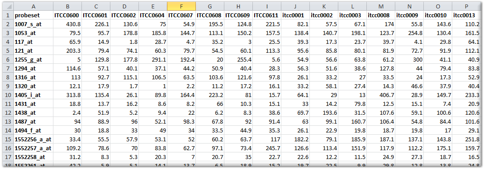
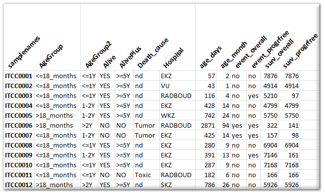
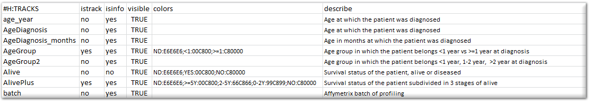
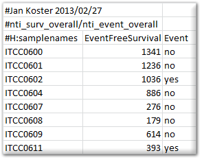
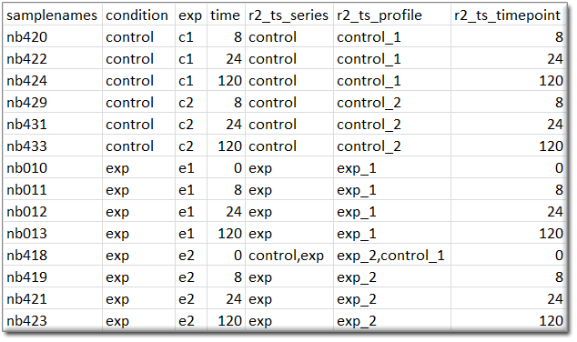

R2 Dataset Addition
===================

*How to add your own or publicly available datasets for analysis in R2*

Scope
-----

-   Learn how to add your own datasets to R2
-   Have datasets added that are published in literature.

What to prepare when you would like to have a dataset added
-----------------------------------------------------------

R2 allows users / groups to have their own (private) human / mouse
datasets added to the platform, which enable them to analyze their own
data from anywhere in the world, as long as they have access to the
internet. Such datasets can be added with various access policies,
ranging from public to restricted to a single user. The current document
describes all that you need to know about the addition of datasets in
R2, and will also show you how files should be prepared.

Who can add datasets to R2
--------------------------

Most often, users would like to analyze their data, in combination with
datasets already present in the R2 database. For example, one would like
to compare the extend of expression, compared to other tissues (the so
called MegaSampler). One can imagine that such analyses require
identical processing for all datasets of the same platform (provided
that the normalization scheme supports this). For that reason, we have
decided that only administrators of the R2 platform can add new
datasets, since they understand the R2 platform architecture and can
supervise / guide the upload procedure.

Addition of a public dataset from the GEO database
--------------------------------------------------

Having a public dataset added to R2 from the NCBI GEO database is by far
the easiest. Depending a bit on whether the array platform is already
used within R2, such datasets can be added fairly quickly. In most cases
you only have to send an email to <r2-support@amc.uva.nl> stating the
GEO series identifier GSE\*\*\*\*\* and one of the administrators will
take care of the rest. One note for your consideration though. Since the
R2 platform has initially been designed to work with Affymetrix
microarrays, it works best with single channel platforms. We do also
incorporate dual channel datasets, but always warn for potentially
unwanted behavior. For the addition of Affymetrix datasets, we
preferably would like to be able to work with the raw data (CEL files),
so please make sure that those are attached in the GEO series.

The GEO database can be browsed from
<http://www.ncbi.nlm.nih.gov/geo/browse/?view=series>

Addition of personal datasets
-----------------------------

Within R2, we also house datasets that are provided by authors which are
not (yet) available in the public domain. In some cases these are made
publicly available, but most often, some form of restricted access in
enforced on them.

Access levels
-------------

R2 can provide access to datasets on a number of levels. The default
access model provides public access to a dataset to anybody using R2.
Within R2, datasets can also be made accessible to a group of users.
Such a construction is ideal for departments where more people want to
make use of the information. Also consortia can make use of this access
model. Finally, datasets can also be made accessible to single users. In
all of the cases where restricted access is involved, users should
create a (free) personal account for R2, and be granted access by an R2
administrator. Requests for access to a group should be send by the
owner of a group, or such an owner should at least be cc-ed in the email
correspondence. Additional owners of a group or transfer of the
ownership to another person can be done achieved by email to
<r2-support@amc.uva.nl> from the current owner. If your research group
already has data in R2, then you should already know the name of your
user-group.

Preparing the expression data
-----------------------------

When the data to be uploaded originates from Affymetrix gene expression
platforms, and you would like to have the data added in the standard
way, then we prefer to have the original CEL files send to us by
[www.wetransfer.com](http://www.wetransfer.com) or a
similar service. We can then add the dataset in such a way that it can
be used in conjunction with the publicly available datasets from the
same platform and normalization scheme. If normalization schemes, other
than the mainstream MAS5.0, RMA, gcRMA, or RMA-sketch are preferred,
then you should perform the normalization yourself and send us the
normalized data as a matrix (like a tab delimited export from an Excel
sheet). A data matrix should be constructed in the following manner: the
first row is considered to be the header and should preferably start
with the following sign \#H: for the 1^st^ column. The 1^st^ column
should contain the reporter IDs of the platform (such as probe sets, in
the case of Affymetrix). If you are not sure which column represents the
reporters that can be used in R2, then please ask by email (Especially
Illumina arrays contain a number of fields that look usable). The signal
values (preferably non-transformed) of the samples can then be added in
subsequent columns, where the 1^st^ row should contain the sample
identifier (that needs to be identical to the sample identifier in the
annotation file). R2 can perform a range of transformations (such as
log2) on the data itself, thereby allowing the most flexible use of your
expression data, if provided in a non-transformed fashion. The figure
below shows an example for an Affymetrix array.

	
[**Figure1: Example**](_static/images/DataSetAddition_table.png)
	
A number of platforms and/or normalizations not only provide a signal
intensity, but can also express the likelihood that a reporter is
considered expressed (like present calls or detection p-values for
Affymetrix U\*\* platforms). Such information may be provided in the
matrix file by addition of an additional column (then named
sample\_pval). Alternatively, every sample may be provided in a separate
tab delimited text document, where multiple columns can then be provided
for a sample.

Preparing the gene annotation
-----------------------------

If a platform has already been added to the R2 database, then there is
no need to supply gene annotation again. If a new platform has to be
added, then we require at the very least a list of all the reporters,
together with their mapping to the genome (for human preferably
HG18/NCBI36; for mouse preferably mm9). Furthermore, the relation
between reporters and genesymbols as well as gene ids (NCBI Gene) would
speed up the process of adding a new platform. In many cases, vendors of
the arrays make annotation files available for download. Usually a link
to such an annotation will also be sufficient. In case of doubt, please
contact us by email.

Preparing the sample annotation
-------------------------------

Expression data is not very useful without proper annotation. Annotation
is provided in a separate tab delimited text file. Here the 1^st^ column
contains the sample names and any subsequent column is treated as an
annotation field (termed tracks within R2). Please refrain from using
special characters within the annotation. Also, spaces in track naming
should be avoided (use \_ instead). An example of an annotation file can
be seen in the image below. You can add as many tracks as you like /
find useful. There are a number of special tracks, which you can make
use of, which will now be described.

	
[**Figure2: Example2**](_static/images/DataSetAddition_sampleanno.png)
	
Besides providing the annotation for usage in R2, you can also specify
how R2 makes use of these annotations, specifically in graphical
representations. To make this known, you can prepare a "relate" file for
R2. This document comprises of a number of columns that can be provided
for the different tracks. Below, you can see a section of such a relate
file.

	
[**Figure3: Example2**](_static/images/DataSetAddition_relatefile.png)
	
Please make sure that the header of the relate file is identical to the
example, and that the tracknames match to the ones that have been
defined in the sample annotation. The "istrack" column tells R2 whether
the annotation needs to be drawn as color coded information below
YY-plots, and headers of heatmaps. The "isinfo" column defines whether
the information is displayed in the table once you hover over a sample
in graphs within R2. "visible" can enable/disable the use of a track.
The "color" column can preset a specific color to groups which are
defined within a track. These can be indicated by groupname:hexcolor.
The different groups are then separated by the ";" sign. It is not
required to supply this information. R2 will color groupnames
automatically if such information information is not encountered.
Finally, you may describe the contents of a track.

### Special sample annotation

Within R2, some well-defined sample annotation labels and/or additional
files, enable additional functionalities. Below, an example is described
for both.

**Survival information:** When the dataset contains survival
information, then R2 can make use of this to draw Kaplan Meier plots. To
do so, R2 requires a separate tab delimited text document with a
strictly defined header and some rules. Any line starting with \# is
considered comments, and will be excluded. There is 1 exception to this
rule, which if formed by the \#H: combination, which will be interpreted
as a header row. A survival file should contain a header line that is
identical to the example given below, as R2 will then recognize it as
such. How an event is defined, may differ (overall / relapsefree etc).
This can be expressed in the name of the file that is being provided.
For example, the file below would be named "overall.txt". Subsequent
Kaplan curves would get the name "overall survival" on the y-axis.

	
[**Figure3: Example3**](_static/images/DataSetAddition_survival.png)

**Time series graphs:** When the samples are annotated with the
appropriate tracks, then R2 can also present datasets as time series.
When R2 encounters a column named "r2\_ts\_timepoint", combined with
either "r2\_ts\_profile" and/or "r2\_ts\_series", then this will enable
the option to represent the dataset as a time series (where
samples/groups are connected by a line following the time variable).
Profiles are intended to connect a single experiment or the following of
a single subject in time. Series are intended as the grouping of
profiles (for example biological replicates of an experiment), which
will also create error bars on the measurements. The "r2\_ts\_timepoint"
annotation should only contain numerical information (the time, in
whatever scale you prefer (minutes / hours / days)). The other 1 or 2
annotations should provide a grouping label (which would be useful for
you). In case of doubt on the usage of these annotations, do not
hesitate to get in contact with us via r2-support.

	
[**Figure4: Example4**](_static/images/DataSetAddition_timeserie.png)
	

Describing your dataset
-----------------------

Within R2, your dataset will get a name, so that you can find it back
for analyses. For dataset naming the program makes use of a small number
of parts (some of which can be influenced by you). For example, the
department of oncogenomics has made its Neuroblastoma dataset available
in R2 with the following name "Tumor Neuroblastoma public - Versteeg -
88 - MAS5.0 - u133p2". The naming is achieved by the following parts:

1\. **Dataset Class**. For Human datasets, one can choose from the
classes defined in the table below.

| **Class** | **Description** |                     
------------|-----------------|                                                                         
| **Cellline** | Usually used for cell line panels, where no intervention was applied |                         
| **Disease**  | Datasets, where a specific disease has been investigated, other than cancer |                             
| **Exp**      | Experiment datasets. Usually cell line models in which interventions have been applied (Gene transfection, rna interference etc) | 
| **Mixed**    | If a dataset makes used of multiple items, then it becomes a mixed set | 
| **Normal**   | The profiling of healthy normal material |                            
| **Tumor**    | Datasets which are composed of a specific tumor type belong in this category |                            

2\. **Tissue**. Depending a little on the choice of class, usually a
description of the tissue / tumor is given in the second part. In the
example, this was "Neuroblastoma", but this could also be "Breast" or
"Colon" if such a dataset was described. For experiments, the tissue or
tumor type is also often described, to make sure that datasets with the
same theme are close together. If we would describe the shRNA knockdown
of the MYCN gene in the neuroblastoma cell line IMR32 for example, then
this would become "Exp Neuroblastoma IMR32 MYCN shRNA".

3\. **Author**. Finally, you can supply the author / consortium in naming
your dataset. This should be self-explanatory.

R2 will add the number of samples within the dataset, a normalization
scheme and finally also a code representing the platform which has been
used. If you are supplying a dataset other than Affymetrix gene
expression arrays (Exon or U\*\*\*), then you should provide us with the
normalization, and platform used as well. The platform, doesn"t have to
be the code that R2 uses, but can also be described by the manufacturer
and the array ID.

Optionally, you can also describe your dataset in more detail in the
following fields (which are also shown if you click on the "i" image
next to a dataset). **Title**: 1 line description of your dataset.
**Summary**: free text option to describe your dataset in as much detail
as you wish (See also GEO for examples). **Design**: free text
describing the design of your dataset (See also GEO for examples).

We hope that this document has been helpful in preparing your dataset
for inclusion in R2,

R2 support (<r2-support@amc.uva.nl>).

