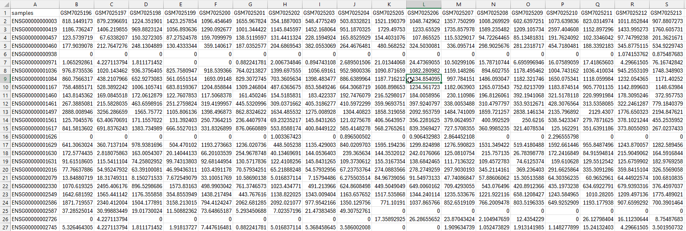
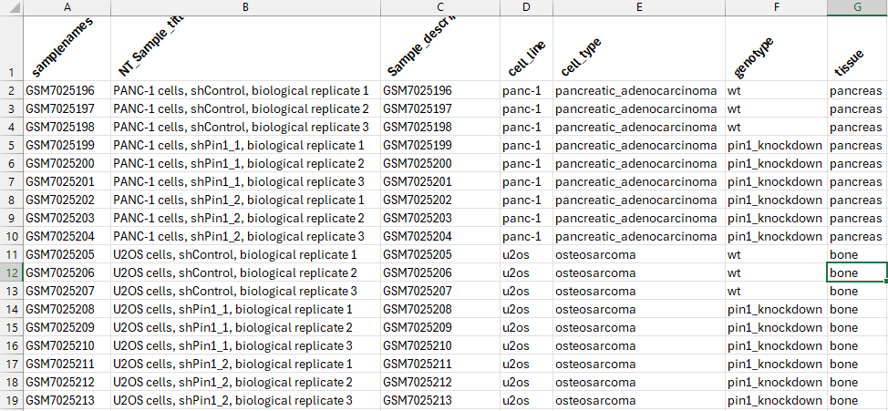
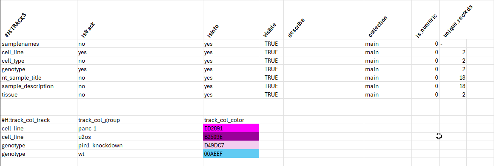
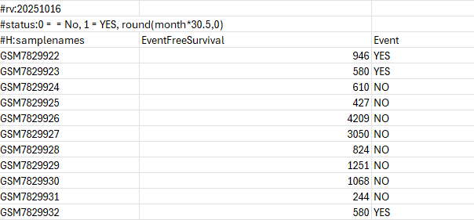
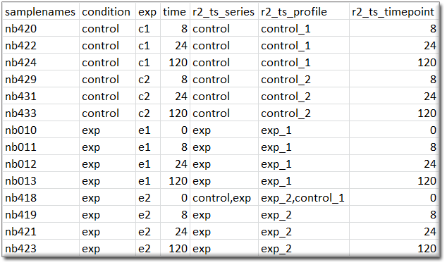

<a id="r2_dataset_addition"></a>

# R2 Dataset Addition

*How to have your own (private) or publicly available datasets added for analysis in R2*

---

## Scope

- Learn how to add your own datasets to R2
- Understand which file formats are required per genomics data type
- Have datasets added that are published in the literature

---

## Quick reference: supported data types

R2 started out as a genomics platform but has grown into a more generic multi-omics platform. Any data type that can be represented as a matrix — with feature identifiers (genes, probes, CpG sites, variants, peaks, or similar) in rows and samples in columns — can in principle be hosted in R2. Genomics data types such as somatic variants, copy number profiles, and structural variants require specific file formats and are described in the sections below.

The table below gives an overview of the data types covered in this chapter, together with their required file formats. Use it to navigate directly to the relevant preparation section. If your data type is not listed here or elsewhere in the tutorials, please contact us at <r2-support@amsterdamumc.nl> and we will be happy to guide you through the options.

| Data type | Omics layer | File format(s) | Paired design supported | Section |
|---|---|---|---|---|
| RNA-seq expression | Transcriptomics | Count matrix, TPM/RPKM matrix | No | [RNA-seq](#preparing-rna-sequencing-expression-data) |
| Microarray expression | Transcriptomics | CEL (Affymetrix), matrix (Illumina) | No | [Microarray](#preparing-affymetrix-microarray-expression-data) |
| DNA methylation | Epigenomics | IDAT or beta/M-value matrix | No | [Methylation](#preparing-dna-methylation-data) |
| Somatic SNV/Indel | Genomics | VCF | Yes (tumor-normal) | [SNV/Indel](#preparing-somatic-snv-and-indel-data-vcf) |
| Copy number variation | Genomics | SEG | Yes (tumor-normal) | [CNV](#preparing-copy-number-variation-data-seg) |
| Structural variants | Genomics | SV-VCF or BEDPE | Yes (tumor-normal) | [SV](#preparing-structural-variant-data) |
| ChIP-seq / ATAC-seq | Epigenomics / Chromatin | BED/narrowPeak + BigWig | No | [ChIP-seq/ATAC-seq](#preparing-chip-seq-and-atac-seq-data) |
| Sample annotation | — | Tab-delimited text | — | [Annotation](#preparing-the-sample-annotation) |
| Survival data | — | Tab-delimited text | — | [Survival](#survival-data) |

---

## What to prepare when you would like to have a dataset added

R2 allows users and groups to have their own (private) primarily human or mouse datasets added to the platform, enabling them to analyze their own data from anywhere in the world with internet access. Datasets can be added with various access policies, ranging from fully public to restricted to a single user. This document describes everything you need to know about dataset addition in R2, and shows you how files should be prepared for each data type.

---

## Who can add datasets to R2

Most often, users would like to analyze their data in combination with datasets already present in the R2 database — for example, to compare expression levels across tissues using the MegaSampler. Such analyses require identical processing for all datasets of the same platform. For that reason, only administrators of the R2 platform can add new datasets, as they understand the R2 platform architecture and can supervise and guide the upload procedure.

---

## Addition of a public dataset from GEO and other databases

Adding a public dataset from the NCBI GEO database is by far the easiest route. Depending on whether the annotation platform is already present in R2, such datasets can be added fairly quickly. In most cases you only need to send an email to <r2-support@amsterdamumc.nl> stating the GEO series identifier (GSE\*\*\*\*\*) and an administrator will take care of the rest, or get in contact with you.

Other public sources that provide access to genomics data can also be accommodated, as long as you can provide the full path to where the primary data can be retrieved.

Browse the GEO database at: <http://www.ncbi.nlm.nih.gov/geo/browse/?view=series>

---

## Addition of personal datasets

R2 also houses datasets provided by researchers that are not (yet) available in the public domain. In some cases these are made publicly available, but most often some form of restricted access is enforced. Please contact <r2-support@amsterdamumc.nl> and we can guide you through the process.

---

## Access levels

R2 provides access to datasets on several levels:

- **Public** — accessible to all R2 users (default)
- **Group** — accessible to a defined group of users; ideal for departments or consortia
- **Single user** — restricted to one individual

In all cases where restricted access is involved, users must create a (free) personal R2 account and be granted access by an administrator. Requests for group access should be sent by the group owner, or that owner should at minimum be cc-ed in the correspondence. Additional owners or transfer of ownership can be arranged by email to <r2-support@amsterdamumc.nl> from the current owner.

A number of platforms and normalizations not only provide signal intensity but can also express the likelihood that a reporter is considered expressed (such as present calls or detection p-values for Affymetrix U\*\* platforms). Such information may be provided in the matrix file by addition of an extra column named `sample_pval`. Alternatively, each sample may be provided in a separate tab-delimited text file with multiple columns per sample.

---

## Preparing RNA sequencing expression data

The most frequently added gene expression datasets come from RNA-seq technology. R2 can handle raw counts directly; normalized values can also be provided.

When possible, we prefer to receive **raw counts per gene per sample** as a matrix, where the first column contains reporter or gene identifiers and the subsequent columns contain counts per sample. Please also provide the annotation source used to obtain the counts (e.g. Ensembl, Gencode, or gene symbols). When counts are provided, the R2 team will process them using the **DESeq2** algorithm to obtain normalized values suitable for visualization:

- Datasets with fewer than ~50 samples receive **deseq2_rlog** normalization
- Larger datasets receive **deseq2_vst** normalization
- All count sets also receive **normalized_counts** (counts corrected for DESeq2 scaling factors)

If count data is not available, or you prefer to supply pre-normalized values, these can be provided in the same matrix format. Common measures include TPM(+1), RPKM, or FPKM — simply indicate what the values represent.



[**Figure 1: Matrix with expression data**](_static/images/Dataset_addition/DataSetAddition_table1a.png)

### Preparing Affymetrix microarray expression data

For Affymetrix gene expression platforms, we prefer to receive the original CEL files, transferred via [www.wetransfer.com](http://www.wetransfer.com) or a similar service. This ensures the dataset can be used together with existing publicly available datasets on the same platform and normalization scheme.

If a normalization scheme other than the mainstream MAS5.0, RMA, gcRMA, or RMA-sketch is preferred, perform the normalization yourself and send us the normalized data as a matrix (tab-delimited, analogous to the RNA-seq matrix above, with Affymetrix reporter IDs in the first column).

Note that Illumina expression arrays are also supported across multiple versions. If your data is already normalized, a matrix is sufficient.

### Preparing the gene annotation

If the platform is already present in the R2 database, no gene annotation needs to be supplied. For new platforms, we require at minimum:

- A list of all reporters with their genome mapping (for human: GRCh38 or GRCh37/hg19; for mouse: mm10)
- The mapping of reporters to gene symbols and NCBI Gene IDs

Vendor annotation files (with a download link) are usually sufficient. When in doubt, contact us by email.

---

## Preparing DNA methylation data

R2 supports DNA methylation data from **Illumina array platforms** (450k and EPIC/850k). Two submission routes are available:

### Option A: IDAT files (preferred)

Provide the raw IDAT files (one Red and one Green file per sample). The R2 team will handle background correction, normalization, and probe filtering. Please also supply the array type (450k or EPIC) and the genome build used.

### Option B: Pre-processed matrix

If you have already processed your methylation data, provide a tab-delimited matrix where:

- The first column contains Illumina probe IDs (e.g. `cg00000029`)
- Subsequent columns contain per-sample values, one column per sample
- Values should be **beta values** (0–1 range) or **M-values** (log2 ratio); indicate which

Please specify the genome build (GRCh38 or GRCh37/hg19), the array type, and the preprocessing pipeline used (e.g. minfi, ChAMP, or SeSAMe).

### Sample annotation for methylation data

Supply a sample annotation file (see [Preparing the sample annotation](#preparing-the-sample-annotation)) matching the sample names in the matrix. For tumor samples, include relevant clinical and pathological variables as annotation tracks.

> **Note for tumor-normal paired datasets:** If your dataset contains matched tumor and normal pairs (e.g. for differential methylation analysis), indicate the pairing in the annotation file using a dedicated track (e.g. `pair_id`).

---

## Preparing somatic SNV and Indel data (VCF)

R2 supports somatic small variant data (single nucleotide variants and small insertions/deletions) in **VCF format**. This data type is displayed in the Personalized Genomics (WGS/WES) module, accessible from the left side menu in R2 (see also Chapter 21: Integrative Analysis — WGS/NGS data).

### Genome build

Always specify the genome build. R2 supports **GRCh38** and **GRCh37/hg19**. Mixing builds within a dataset is not supported.

### VCF requirements

Provide one VCF file per sample (or per tumor-normal pair). The VCF must:

- Be coordinate-sorted and indexed (`.vcf.gz` + `.tbi` is preferred)
- Contain the standard mandatory VCF columns: `CHROM`, `POS`, `ID`, `REF`, `ALT`, `QUAL`, `FILTER`, `INFO`
- Have a `FILTER` column that reflects variant filtering status — only variants with `FILTER = PASS` (or `.`) will be loaded by default
- Contain a `FORMAT` column with at minimum `GT` (genotype) and ideally `DP` (total depth) and `AF` (allele frequency) or `AD` (allele depth)

Recommended INFO fields to include: `AF` or `VAF` (variant allele frequency), `DP` (depth), functional annotation fields from VEP or ANNOVAR (e.g. `CSQ` or `ANN`).

### Tumor-normal paired data (somatic calls)

For somatic variant calling from paired tumor-normal WES/WGS data, provide:

- A VCF file representing **somatic calls** (germline variants filtered out)
- The sample naming convention used: in R2, paired samples are typically named as `<SampleID>T` (tumor) and `<SampleID>N` (normal), e.g. `P001T` / `P001N`
- The variant caller used (e.g. Mutect2, Strelka2, VarScan2) — this helps the R2 team apply appropriate quality filters

### Variant annotation

Pre-annotating your VCF with functional consequences using **VEP** (Ensembl Variant Effect Predictor) or **ANNOVAR** is recommended but not required. If annotation is included, please indicate the field name and format used (e.g. `CSQ` for VEP).

### Submitting VCF data

Transfer VCF files to us via [www.wetransfer.com](http://www.wetransfer.com) or a secure institutional file transfer, and email <r2-support@amsterdamumc.nl> with:

1. Genome build
2. Variant caller used and any post-processing filters applied
3. Whether the data represents somatic or germline variants
4. Whether tumor-normal pairs are present, and the naming convention used
5. Number of samples

---

## Preparing copy number variation data (SEG)

Copy number variation (CNV) data is displayed in R2 as CGH-like scatter plots in the genome browser and Circos views. R2 accepts segmented copy number data in **SEG format**.

### SEG format specification

The SEG (segmentation) file is a tab-delimited text file with the following columns:

| Column | Description |
|---|---|
| `ID` | Sample identifier (must match your sample annotation file) |
| `chrom` | Chromosome (use `chr1`, `chr2`, … `chrX`, `chrY`) |
| `loc.start` | Segment start position (1-based) |
| `loc.end` | Segment end position (1-based) |
| `num.mark` | Number of probes or bins in the segment |
| `seg.mean` | Segmented value (log2 ratio tumor/normal, or log2 copy number ratio) |

Example:

```
ID          chrom   loc.start   loc.end     num.mark    seg.mean
Sample01    chr1    3218610     38589144    1247        0.0312
Sample01    chr1    38590145    48596063    394         -0.9841
```

### Requirements and recommendations

- Provide **log2 ratios** (tumor vs. normal or vs. reference) as the `seg.mean` value; indicate clearly if you provide absolute copy number instead
- Specify the genome build (GRCh38 or GRCh37/hg19)
- Indicate the segmentation algorithm used (e.g. GATK CNV, CNVkit, PURPLE, CBS/DNAcopy)
- For tumor-normal paired data, indicate whether the log2 ratios are already corrected against the matched normal

### Tumor purity and ploidy

If available, include tumor purity and/or ploidy estimates as tracks in the sample annotation file (e.g. tracks named `purity` and `ploidy`). This information is valuable for interpreting the copy number plots.

### Submitting CNV data

Transfer the SEG file alongside the sample annotation to <r2-support@amsterdamumc.nl>, specifying the genome build, tool used, and whether data is paired.

---

## Preparing structural variant data

Structural variant (SV) data is visualized in R2 as Circos plots, showing interchromosomal and intrachromosomal rearrangements, as well as in genome browser views (see Chapter 21). Two file formats are accepted.

### Option A: SV-VCF (preferred)

VCF files encoding structural variants follow the VCF 4.2+ specification for SVs. Required fields:

- `SVTYPE` in the INFO column — one of `DEL`, `DUP`, `INV`, `BND` (translocation breakend), or `INS`
- `MATEID` for breakend pairs (`BND`)
- `FILTER = PASS` for high-confidence calls
- Recommended: `SVLEN`, `PE` (paired-end support), `SR` (split-read support)

Provide one VCF per sample (or per tumor-normal pair for somatic SVs).

### Option B: BEDPE

BEDPE format encodes SVs as paired genomic coordinates. The file must be tab-delimited with at minimum these columns:

| Column | Description |
|---|---|
| `chrom1` | Chromosome of breakpoint 1 |
| `start1` | Start of breakpoint 1 interval |
| `end1` | End of breakpoint 1 interval |
| `chrom2` | Chromosome of breakpoint 2 |
| `start2` | Start of breakpoint 2 interval |
| `end2` | End of breakpoint 2 interval |
| `name` | Variant name or ID |
| `score` | Quality score or read support |
| `strand1` | Strand at breakpoint 1 |
| `strand2` | Strand at breakpoint 2 |

Additional columns for SV type, sample ID, and supporting reads are recommended.

### Requirements

- Specify the genome build
- Specify the SV caller used (e.g. DELLY, Manta, GRIDSS, LUMPY)
- For somatic SVs, indicate whether germline events have been filtered out and how
- Use the same sample naming convention as for your SNV/CNV files

---

## Preparing ChIP-seq and ATAC-seq data

ChIP-seq and ATAC-seq data can be added to R2 for visualization in the genome browser alongside expression and variant data (see Chapter 19: Integrative Analysis — ChIP-seq data). R2 requires pre-processed output files; raw FASTQ files are not accepted for this data type.

### Required files per sample/condition

1. **Peak file** — BED or narrowPeak format (ENCODE narrowPeak is preferred):
   - For ChIP-seq: peaks called against an input/IgG control
   - For ATAC-seq: peaks called with e.g. MACS2 or HMMRATAC
   - Recommended minimum columns: `chrom`, `chromStart`, `chromEnd`, `name`, `score`, `strand`, `signalValue`, `pValue`, `qValue`, `peak`

2. **Signal track** — BigWig format (`.bw`):
   - Normalized read coverage (e.g. RPKM, CPM, or fold-enrichment over input)
   - Must be coordinate-sorted and indexed

### Requirements

- Specify the genome build (GRCh38 or GRCh37/hg19)
- Specify the alignment tool used (e.g. Bowtie2, BWA) and the peak caller (e.g. MACS2)
- For ChIP-seq, specify the target (histone mark, transcription factor, or chromatin state)
- For ATAC-seq, indicate whether data is from bulk or single-cell experiments

### Submitting ChIP-seq / ATAC-seq data

Transfer BigWig and peak files to us via [www.wetransfer.com](http://www.wetransfer.com) or a secure institutional transfer, and email <r2-support@amsterdamumc.nl> with the details listed above. For large cohorts, contact us first to discuss the most efficient transfer method.

---

## Preparing the sample annotation

Omics data is not useful without proper annotation. Annotation is provided as a separate tab-delimited text file where:

- The **first column** contains the sample names (must match the data matrix or VCF/SEG sample IDs exactly)
- Every subsequent column is treated as an annotation field, called a **track** in R2

Please avoid special characters in annotation values, and use underscores instead of spaces in track names.



[**Figure 2: Supporting annotation file**](_static/images/Dataset_addition/DataSetAddition_annot1a.png)

You can add as many tracks as you find useful. To specify how R2 should use and display each track, you can provide a separate **relate file**:



[**Figure 3: Annotation specs (relate file)**](_static/images/Dataset_addition/DataSetAddition_annotation_specs.png)

The relate file controls:

- `istrack` — whether the annotation is drawn as color-coded information below plots and heatmap headers
- `isinfo` — whether the information is displayed when hovering over a sample in R2 graphs
- `visible` — whether a track is enabled or hidden by default
- `track_col*` — custom colors for groups within a track, specified as `groupname:hexcolor`
- Description fields for each track

Make sure the header of the relate file is identical to the example, and that track names match those in the annotation file. The relate file is optional but recommended for multi-data-type datasets.

#### Download a template for the annotation

<a href="https://github.com/antronerds/r2-tutorials/raw/master/fillin_template_example.xlsx" download>> Excel template</a>

### Survival data

When the dataset contains survival information, R2 can use it to draw Kaplan-Meier plots. This requires a separate tab-delimited text file with a strictly defined format:

- Lines starting with `#` are treated as comments and excluded
- The exception is `#H:`, which is interpreted as a header row
- The header must match the example exactly so R2 can recognize the file

The event type is expressed in the filename — for example, `overall.txt` produces an "overall survival" label on the y-axis.



[**Figure 4: Survival file example**](_static/images/Dataset_addition/DataSetAddition_survival.png)

---

## Describing your dataset

Within R2, your dataset will receive a name that allows it to be found for analyses. Dataset names follow this structure:

`[Class] [Tissue/Tumor] [Author/Consortium] - [N samples] - [Normalization] - [Platform code]`

For example: `Tumor Neuroblastoma public - Versteeg - 88 - MAS5.0 - u133p2`

### 1. Dataset class

For human datasets, choose from the following classes:

- *Cellline* — cell line panels without intervention
- *Disease* — datasets investigating a specific non-cancer disease
- *Exp* — experiment datasets: cell line models with interventions (transfection, knockdown, etc.)
- *Mixed* — datasets combining multiple types of material
- *Normal* — profiling of healthy normal material
- *Tumor* — datasets from a specific tumor type

### 2. Tissue

A description of the tissue or tumor type — for example `Neuroblastoma`, `Breast`, or `Glioblastoma`. For experiment sets, the tumor or tissue context is also included to group related datasets (e.g. `Exp Neuroblastoma IMR32 MYCN shRNA`).

### 3. Author or consortium

Provide the last name of the principal investigator or the name of the consortium (e.g. `GLASS-NL`, `TCGA`).

R2 will automatically append the number of samples, the normalization scheme, and a platform code.

### Optional dataset description fields

You can describe your dataset further in the following fields, which are shown when clicking the "i" icon next to a dataset in R2:

- **Title** — a single-line description
- **Summary** — free text; describe your dataset in as much detail as you wish (see GEO for examples)
- **Design** — free text describing the experimental or cohort design

These fields are included in the Excel annotation template linked above.

---

## Timeseries annotation

When samples are annotated with appropriate tracks, R2 can present datasets as time series. R2 activates this mode when it encounters a column named `r2_ts_timepoint` in combination with `r2_ts_profile` and/or `r2_ts_series`:

- `r2_ts_timepoint` — must contain only numerical values (time in any scale: minutes, hours, days)
- `r2_ts_profile` — connects a single experiment or individual subject across timepoints
- `r2_ts_series` — groups profiles (e.g. biological replicates), and adds error bars to measurements



[**Figure 5: Timeseries**](_static/images/Dataset_addition/DataSetAddition_timeserie.png)

---

We hope that this document has been helpful in preparing your dataset for inclusion in R2.

R2 support (<r2-support@amsterdamumc.nl>)
