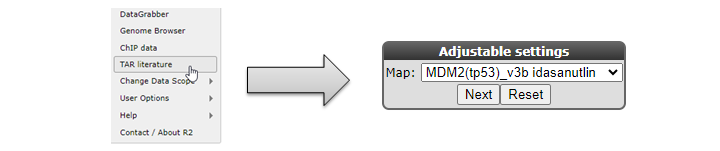
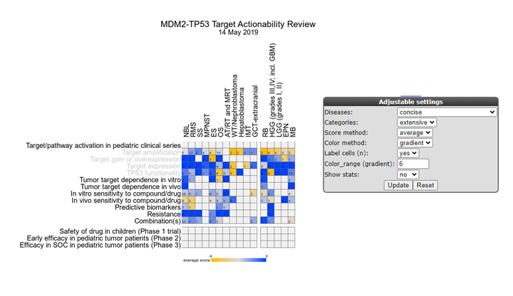
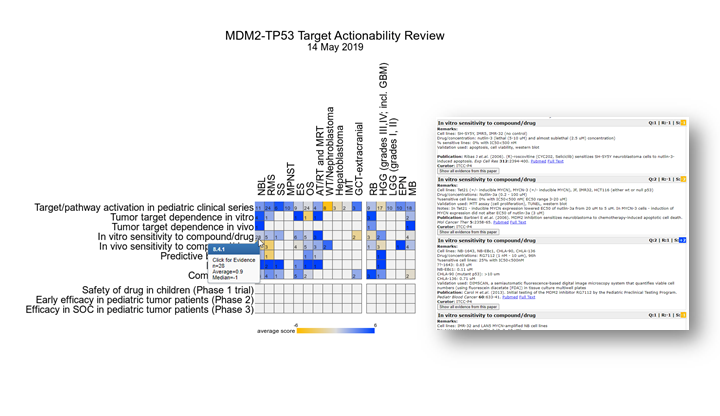
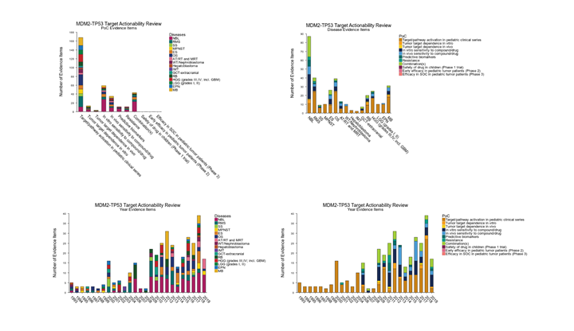

Target Actionability Literature Reviews : TAR
===========================================

*Datatypes: Literature review results*

Scope
-----
- In this part R2 is used to provide an overview of manually curated literature data, to support the targeted drug development process for pediatric cancers.
  This is a specialized topic. Published TARs can be explored by anyone. Many more TARs require specific access or membership in consortia. Next to the presentation of TARS, R2 is also equipped with a TAR creation module, where literature reviews can be created, including an evidence collection tool. 

## Step 1: View a TAR.

1. To view a target actionability review in R2, select *TAR literature* from the menu (Fig 1).

  

  [**Figure 1: Navigating to the TAR section**](_static/images/tar/tar_menu.png)

2. A TAR typically is a structured stepwise literature review to comprehensively assess proof of concept (PoC) preclinical data. Such a review of published literature is assessed on a particular target gene or pathway and corresponding compounds  or drugs, assessed within a collection of pediatric cancers. Such a review then highlights the strength and potential gaps in the current knowledge in the drug target and associated drugs in an informative overview across the assessed malignancies, and may encourage additional preclinical testing in an efficient manner. The TARs can also provide guidance for well-informed decision-making on and prioritization of subsequent further preclinical and clinical evaluation.     
  - Depending on your account and memberships, you will be able to 'select' a review from the dropdown menu.
  - Select the *MDM2* TAR from the selection and click 'next'.

  

  [**Figure 2: TAR result for MDM2 and Idasanutlin in Pediatric cancer**](_static/images/tar/tar_heatmap_1.png)

3. A TAR is populated by 'evidence items', which are extracted knowledge from publications that are 'scored' for experimental quality (method/sample size) and experimental outcome (support). These scores are then averaged per PoC category and tumor entity and displayed as color intensities in an interactive heatmap.
  - Using the adjustable settings, the TAR can be 'folded' and 'unfolded' to assess finer sub-groups (if assessed), or focus on a particular tumor entity.

  

  [**Figure 3: Evidence Item exploration from the TAR**](_static/images/tar/tar_heatmap_2.png)

4. All PoC category / tumor entity combinations can be 'clicked' to obtain the evidence items that make up the score. These evidence items are little stories explaining the given score. These items also link out to the publication from where the evidence has been extracted. 

   

   [**Figure 4: Stats plots for a given TAR**](_static/images/tar/tar_stats.png)

5. You can also visualize some stats for a TAR in comprehensive plots, by switching on 'show stats'.

6. Depending on your assess and memberships, there can also be the option(s) to perform tasks as a reviewer or TAR administrator. For more information on those funtionalities, please get in contact with r2-support@amsterdamumc.nl 

Final remarks / future directions
---------------------------------

Some of these functionalities have been developed recently. If you run into any quirks or annoyances do not hesitate to contact R2 support
(r2-support@amsterdamumc.nl).  

We hope that this tutorial has been helpful, 
the R2 support team.
