

Using and Creating genesets in R2
===============================

*Or how you can achieve clear, presentation ready heatmaps of your
dataset*

Scope
-----

-   In this tutorial the visualization of a set of genes will be
    explored
-   R2 provides a conventional heatmap view""
-   This heatmap view can be adapted to your needs by sorting the data
    along the axes according to your wishes.
-   Generating your own genelists to analyze using the
    Toplister function.

Step 1: Selecting data and modules; creating a Heatmap
---------------

1.  On the main page of R2 select View Geneset (Heatmap) (Figure 1).
    Click 'Next'.
    
	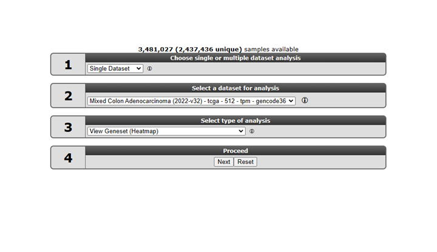
	
	[**Figure    1: Select View a    Geneset**](_static/images/UsingGenesets/UsingGenesets_Select.png)
	
2.  In the subsequent window three choices are available to customize
    the way the GeneSet data will be presented (Figure 2). The first
    field asks for a collection of genesets (Figure 3); R2 harbors
    hundreds of publicly available genesets, KEGG pathways being one
    of them. The second field is a filter for selecting the samples. The
    third field is the order by which the resulting heatmap will be
    drawn (Figure 4). By default R2 presents the data in a heatmap where
    a hierarchical clustering is performed on the genes, making use of
    the information present in all samples to order the data. We'll show
    first what this ordering by clustering looks like. Keep all settings
    as they are and click next. The search fields below the Adjustable
    Settings dialog provide a shortcut for finding a GeneSet of choice,
    we're going to use this now. Suppose we want to find a geneset
    containing Wnt Signaling genes genes. Type Wnt in the 'Search a
    geneset' box and click 'Search'.

	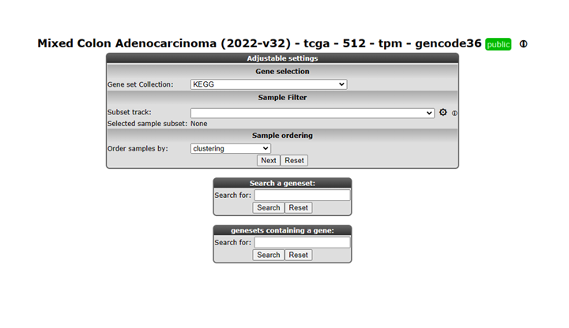
	
	[**Figure  2: Selecting a geneset**](_static/images/UsinggenesetsUsingGenesets_Settingsv1.png)

	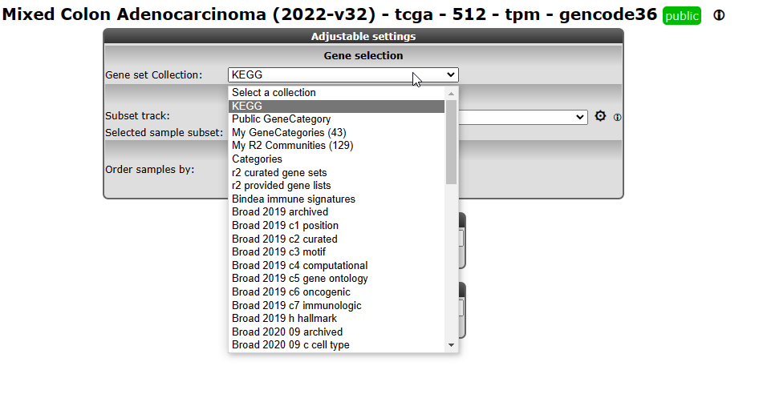
	Here you can select one of the ordering options

	[**Figure    3: Available collections of Genesets in    R2**](_static/images/Usinggenesets/UsingGenesets_Collectionsv1.png)
	
	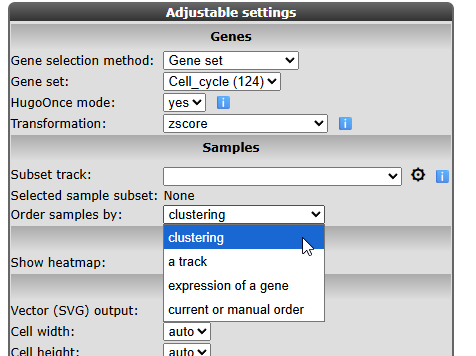
	
	[**Figure    4: Available ordering domains for    samples**](_static/images/Usinggenesets/UsingGenesets_Ordering.png)
	
3.  In the next window all genesets containing the words Wnt  in
    their description are shown. Choose the KEGG Wnt in the list we will use the n=150 genes in this example by clicking the 'View' hyperlink.
    
	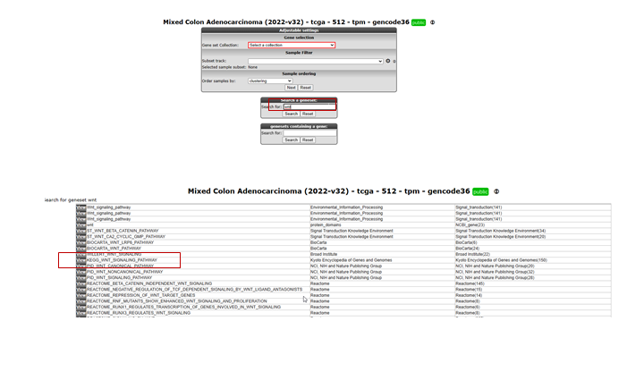
	
	[**Figure    5: Selecting a geneset.**](_static/images/Usinggenesets/UsingGenesets_Selecting.png)
   
Out of the large collection of available sets one of the Wnt pathways is selected, **Wnt**  was used as a search term.
	
4.  The RNAseq data of Adeno Carcinoma (COAD) parto of  the The Genome Atlas program (TGCA)  is shown for
    the genes in the selected Wnt as a clustered heatmap. Hovering over
    the heatmap rectangles reveals the sample information stored in the
    R2 database. Keep in mind that the hovering option is limited to
    10000 cells otherwise the graph generation consumes too much time.
    This limitation can be adapted in the 'User Options' menu item.

    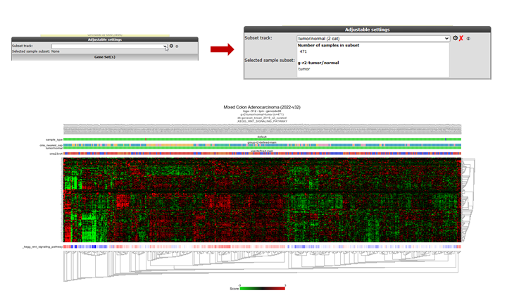
	
    [**Figure 6: Heatmapview of the Kegg Cell Cycle geneset for the Neuroblastoma 88 dataset;genes and samples are sorted according to theclustering.**](_static/images//Usinggenesets/UsingGenesets_Heatmapv1.png)
	

Genes and samples are ordered to their clustering values.

Step 2: Using multiple GeneSets
---------------

1.  R2 also allows for multiple genesets to be shown at once; return to
    the main page; select View Geneset (Figure 1: Select View
    a Geneset). We're not going to search for a geneset but look for
    multiple sets at once in the KEGG collection. In the next window
    (Figure 2) leave the default collection to KEGG. Click "next" in the
    'Adjustable Settings' box.
2.  In the next screen a subcollection within the current collection of
    genesets has to be defined; Select 'Cellular Processes' and click
    "next" (Figure 7).
    
	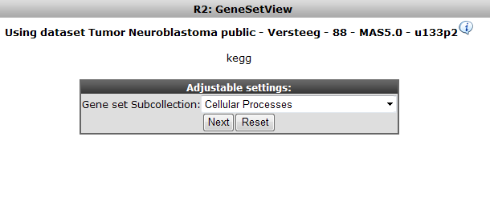
	
	[**Figure    7: Selection a subcollection from the large collection of Kegg    pathways**](_static/images/UsingGenesets_Subcollection.png)
	
3.  R2 allows selection of multiple genesets at the same time; CTRL+
    select Cell Cycle and Apoptosis and click 'Next'.
    
	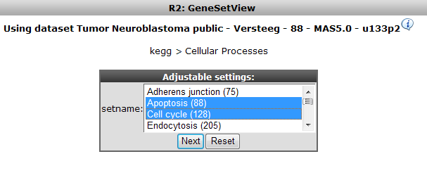
	
	[**'Figure    8: Selecting multiple    genesets**](_static/images/UsingGenesets_Doubleselect.png)
	
4.  The resulting heatmap (Figure 9) has the samples ordered by the
    result of the clustering of the dataset. On the y-axis the genes are
    annotated with their membership to both pathways; the upper bar is
    the Cell Cycle. It is obvious that part of the Cell Cycle member
    genes are clustering together.

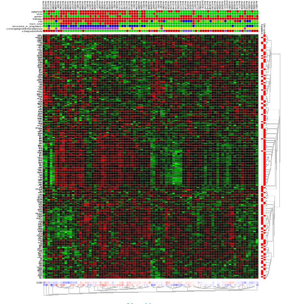
	
[**Figure9: Heatmap view of the Cell Cycle and Apoptosis genesets for theNeuroblastoma 88dataset.**](_static/images/UsingGenesets_Heatmap2.png)
	

Step 3: Relating genesets with data annotation
---------------

1.  We're going to explore that in further detail by sorting the dataset
    according to the staging. Return to the former choice page
    (Figure 2) by clicking the back button in your browser. Choose
    'Order samples by a track' and click "next" (Figure 10). In the next
    subcollection selection window choose Cellular Processes again
    (Figure 7) and click "next".
    
	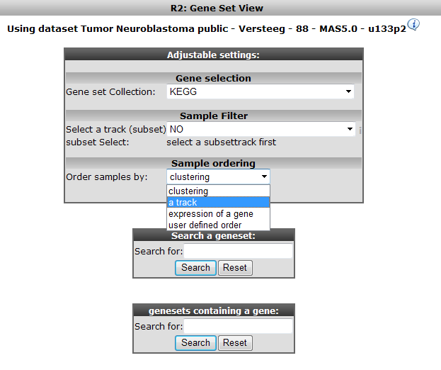
	
	[**Figure    10: Selecting the domain to order samples by: Order by a    track**](_static/images/UsingGenesets_SelectDomain.png)
	
2.  Now select only the Cell cycle subset as GeneSet. Choose the
    Neuroblastoma staging INSS as track to order samples by and click
    "next" (Figure 11)
    
	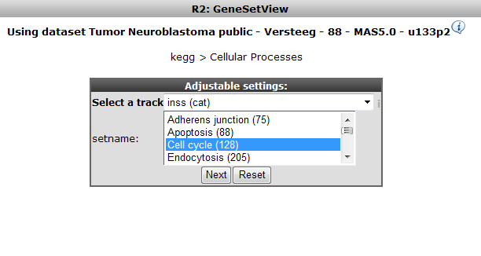
	
	[**Figure    11: Selecting Cell Cycle only, order samples by Neuroblastoma    staging    track**](_static/images/UsingGenesets_CellCycle.png)
	
3.  In the resulting heatmap it is clear that there is a segment of
    genes in the Cell Cycle pathway cluster that is consistently
    upregulated in the stage 4 Neuroblastoma samples (in red in the
    INSS track).
    [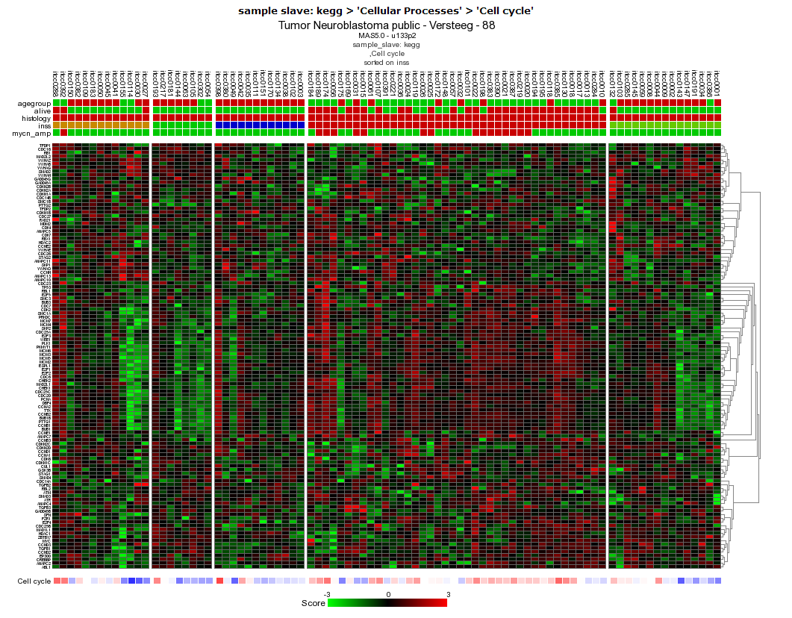**Figure
    12: Heatmap sorted by INSS stage, there is a clear relation between
    the stage 4 tumors (in red in the INSS track) and up-regulation of a
    subset of genes \#:of the Cell
    Cycle**](_static/images/UsingGenesets%20HeatmapSorted.png)
4.  In the previous example R2 offers the possibility to set a fixed
    ordering of samples by track. It"s also possible to perform a
    clustering and set a fixed ordering of genes. In the "adjustable
    settings" panel, select user defined order in the geneselection
    pulldown menu and click next two times. Here you can paste a list of
    genes sorted according to your needs.
5.  Ifyou want to perform hierarchical clustering with a fixed
    sample order. From the main menu select View a Geneset (Heatmap) ,
    in the sample order section, select user defined order and click
    next, select a geneset sub collection and click next. Copy and paste
    your sample order and click next. The export track function see
    chapter Error: Reference source not found can be handy for
    this issue.

Step 4: Unsupervised hierarchical clusterin with a geneset
---------------

It could be that for a given dataset there is no annotation to apply the
analysis tools R2 is offering or your"re lacking a starting point to
further investigated a dataset. A good starting point could be to do is
to do a simple hierarchical clustering

1.  In chapter "Differential expression" is explained how to
    generate genesets describing the difference between tracks (groups)
    from an annotated dataset. Researchers often want to investigate the
    presence of subgroups without using annotation information in their
    dataset or just find a list of genes with the highest variation in
    gene expression. In case your dataset of interest lack annotation
    you are still able via the Toplister tool to investigate datasets
    for biological relevance.
2.  For this purpose R2 is hosting a convenient tool to generated lists
    of genes using a filter. By using this filter you can select groups
    of genes with the highest, lowest or most variable genes etc etc.
3.  To use the Toplister tool, either select 'Toplister' from the dropdwn menu 
    in box 3 of the main page or go to the menu on the left and select
    tools> small tools > Toplister. Make sure Data Type is set to
    Expression data and select Tumor Medulloblastoma PLoS One - Kool -
    62 - MAS5.0 - u133p2 and click next. In the adjustable settings
    screen all kinds of settings and filtering options can be adapted.
    We want to know which 100 genes have the highest variation in this
    case leave " which set" at standard deviation (SD) which is the
    default settings. Click next.
4.  R2 has generated a list of 100 genes showing the highest variation
    in gene expression.
5.  Scrolling down to the bottom of the page shows possibilities to save
    or export the genelist to use for other analyses and/or usage in
    other datasets. Clicking on the Heatmap (Zscore) will perform an
    unsupervised hierarchical clustering and plots a heatmap . In this
    heatmap the subgroups are clearly clustered together as shown by
    Kool e.a. (2008).

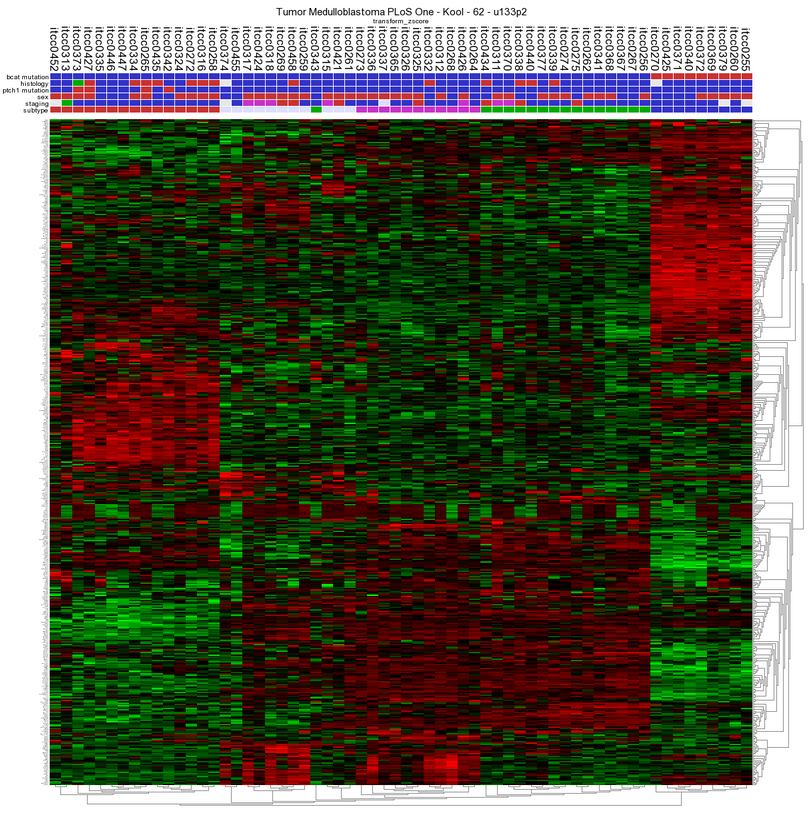
	
[**Figure13: Unsupervised hierarchical clustering revealing subgroups in a Medulloblastoma dataset.**](_static/images/UsingGenesets_Unsupervised.png)
	

Final remarks / future directions
---------------------------------

Everything described in ths chapter can be performed in the R2: genomics analysis and visualization platform (http://r2platform.com / http://r2.amc.nl) 

We hope that this tutorial has been helpful, the R2 support team.

