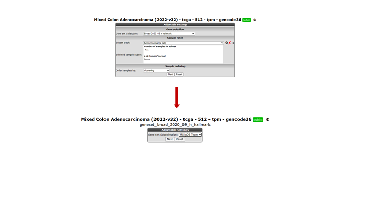

Using and Creating genesets in R2
===============================

*Or how you can achieve clear, presentation ready heatmaps of your
dataset.*

Scope
-----

-   In this tutorial the visualization of a set of genes will be
    explored.
-   R2 provides a conventional heatmap view.
-   This heatmap view can be adapted to your needs by sorting the data
    along the axes according to your wishes.
-   Generating your own genelists to analyze using the
    TopLister function.

Step 1: Selecting data and modules; creating a Heatmap
---------------

1.  On the main page of R2, select the "Mixed Colon Adenocarcinoma (20220-v32)" select View Geneset (Heatmap) (Figure 1).
    Click 'Next'.
    
	
	
	[**Figure    1: Select View a    Geneset.**](_static/images/UsingGenesets/UsingGenesets_Select.png)
	
2.  In the subsequent window, three choices are available to customize
    the way the GeneSet data will be presented (Figure 2). The first
    field asks for a collection of genesets (Figure 3); R2 harbors
    hundreds of publicly available genesets such as the KEGG and Broad institute sets.  The second field is a filter for selecting the samples. The
    third field is the order by which the resulting heatmap will be
    drawn (Figure 4). By default, R2 presents the data in a heatmap where
    a hierarchical clustering is performed on the genes, making use of
    the information present in all samples to order the data. First, we will show
    what this ordering by clustering looks like. Keep all settings
    as they are and click 'Next'. The search fields below the Adjustable
    settings dialog provide a shortcut for finding a GeneSet of choice,
    we are going to use this now. Suppose we want to find a geneset
    containing Wnt Signaling genes. Type 'Wnt' in the 'Search a
    geneset' box and click 'Search'.

	
	
	[**Figure  2: Selecting a geneset.**](_static/images/UsinggenesetsUsingGenesets_Settingsv1.png)

	

	[**Figure    3: Available collections of Genesets in    R2.**](_static/images/Usinggenesets/UsingGenesets_Collectionsv1.png)

    Here you can select one of the ordering options.

	
	
	[**Figure    4: Available ordering domains for    samples.**](_static/images/Usinggenesets/UsingGenesets_Ordering.png)
	
3.  In the next window all genesets containing the word 'Wnt' in
    their description are shown. Choose the KEGG Wnt in the list. We will use the n=150 genes in this example by clicking the 'View' hyperlink.
    
	
	
	[**Figure    5: Selecting a geneset.**](_static/images/Usinggenesets/UsingGenesets_Selecting.png)
   
Out of the large collection of available sets one of the Wnt pathways is selected, **Wnt** was used as a search term.
	
4.  The RNAseq data of Adeno Carcinoma (COAD) part of the The Genome Atlas program (TGCA)  is shown for
    the genes in the selected Wnt as a clustered heatmap. Hovering over
    the heatmap rectangles reveals the sample information stored in the
    R2 database. Keep in mind that the hovering option is limited to
    10000 cells otherwise the graph generation consumes too much time.
    This limitation can be adapted in the 'User Options' menu item.

    
	
    [**Figure 6: Heatmap view of the Kegg  Wnt signaling pathway  for the Mixed Colon Carcinoma.**](_static/images//Usinggenesets/UsingGenesets_Heatmapv1.png)
	

Genes and samples are ordered to their clustering values.

Step 2: Using multiple GeneSets
---------------

1.  R2 also allows for multiple genesets to be shown at once; return to
    the main page; select View Geneset (Figure 1: Select View
    a Geneset) and click 'Next'. We are not going to search for a geneset, but look for
    multiple sets at once in the 'Broad 2020 09 h hallmark' collection. In the next window
    (Figure 2) select this as the 'Gene set Collection'. We have also used the 
    sample filter to select tumor samples only in the R2 defined track section (Figure 7). 
    Click 'Next' in the 'Adjustable Settings' box. 
2.  In the next screen, a sub-collection within the current collection of
    genesets has to be defined; Select 'MsigDB team' and click
    'Next' (Figure 7).
    
	

	[**Figure    7: Select a subcollection.**](_static/images//Usinggenesets/UsingGenesets_Subcollection.png)
	
3.  R2 allows selection of multiple genesets at the same time; CTRL+
    select **DNA repair** and **Epithelial and Mesenchymal transition** and click 
    'Next' (Figure 8).

	
	
	[**Figure    8: Selecting multiple    genesets.**](_static/images//Usinggenesets/UsingGenesets_Doubleselect.png)
	
4.  The resulting heatmap (Figure 9) has the samples ordered by the
    result of the clustering of the dataset. On the y-axis the genes are
    annotated with their membership to both pathways; the bar on the rightmost side is
    the EMT signature. It is obvious that genes in the EMT process do cluster together, 
    and looking closely at the sample annotation also suggests a strong association 
    with the CMS4 classification.

	
[**Figure 9: Heatmap view of the DNA repair and EMT genesets for the Mixed Colon Adenocarcinoma dataset.**](_static/images/UsingGenesets_Heatmap2.png)
	

Step 3: Relating genesets with data annotation
---------------

1.  We are going to explore that in further detail by sorting the dataset
    according to the staging. Return to the page of Figure 2, choose
    'Order samples by a track' and click 'Next' (Figure 10). In the next
    subcollection selection window choose 'MsigDB team' again and click 'Next'.
    
	
	
	[**Figure    10: Selecting the type to order samples by: Order by a    track.**](_static/images/Usinggenesets/UsingGenesets_SelectDomainv1.png)
	
2.  Now select only the EMT (Hallmark_Epithelial_Mesenchymal_transition) subset as 
    Gene set. Choose the cms_nearest_ssp as track to order samples. Make sure you 
    still only have tumor samples selected and click 'Next' (Figure 11).
    
	
	
	[**Figure    11: Broad EMT signature order samples by CMS classification track.**](_static/images/Usinggenesets/UsingGenesets_CellCycle.png)
	
3.  In the resulting heatmap (Figure 12) it is clear that there is a segment of
    genes of the EMT signature cluster that is consistently
    upregulated in the CMS classification type 4. 
    [**Figure
    12: Heatmap sorted by CMS classification.**](_static/images/UsingGenesets/UsingGenesets_HeatmapSortedv2.png)
4.  In the previous example, R2 offers the possibility to set a fixed
    ordering of samples by track. It is also possible to perform a
    clustering and set a fixed ordering of genes. In the 'Adjustable
    settings' panel (Figure 10), select 'user defined order' in the 'Order samples by'
    pulldown menu and click 'Next' twice. Here, you can paste a list of
    genes sorted according to your needs.
5.  If you want to perform hierarchical clustering with a fixed
    sample order. From the main menu select View a Geneset (Heatmap) and click 'Next'.
    In the 'Order samples by' section, select 'user defined order', click
    'Next', select a geneset sub collection and click 'Next'. Copy and paste
    your sample order and click 'Next'. The export track function, see
    chapter Error: Reference source not found, can be handy for
    this issue.

Step 4: Unsupervised hierarchical clustering with a geneset
---------------

It could be that for a given dataset there is no annotation to apply the
analysis tools R2 is offering to or that you are lacking a starting point to
further investigate a dataset. A good starting point could be to perform a 
simple hierarchical clustering.

1.  The chapter "Differential expression" explains how to
    generate genesets describing the difference between tracks (groups)
    from an annotated dataset. Researchers often want to investigate the
    presence of subgroups without using annotation information in their
    dataset, or just find a list of genes with the highest variation in
    gene expression. In case your dataset of interest lacks annotation,
    you are still able to investigate datasets for biological relevance
    through the TopLister tool.
2.  For this purpose, R2 is hosting a convenient tool to generate lists
    of genes using a filter. By using this filter, you can select groups
    of genes with the highest, lowest or most variable genes etc.
3.  To use the TopLister tool, either select 'TopLister' from the dropdown menu 
    in box 3 of the main page or go to the menu on the left and select
    small tools > TopLister. Make sure Data Type is set to
    Expression data and select the dataset 'Tumor Medulloblastoma PLoS One - Kool -
    62 - MAS5.0 - u133p2' and click 'Next' (or 'Select' in case TopLister was 
    reached through the small tools menu). In the Adjustable settings
    screen, all kinds of settings and filtering options can be adapted.
    We want to know which 100 genes have the highest variation in this
    case, so we keep 'Which set' on 'Standard Deviation (SD)', which is the
    default setting and click 'Next'.
4.  R2 has generated a list of 100 genes showing the highest variation
    in gene expression.
5.  Scrolling down to the bottom of the page shows possibilities to save
    or export the genelist to use for other analyses and/or usage in
    other datasets. By clicking the 'Heatmap (zscore)' button, R2 will perform an
    unsupervised hierarchical clustering and plots a heatmap. In this
    heatmap, the subgroups are clearly clustered together as shown by
    Kool e.a. (2008).

	
[**Figure 13: Unsupervised hierarchical clustering revealing subgroups in a Medulloblastoma dataset.**](_static/images/UsingGenesets_Unsupervised.png)
	

Final remarks / future directions
---------------------------------

Everything described in ths chapter can be performed in the R2: genomics analysis and visualization platform (http://r2platform.com / http://r2.amc.nl) 

We hope that this tutorial has been helpful, the R2 support team.

