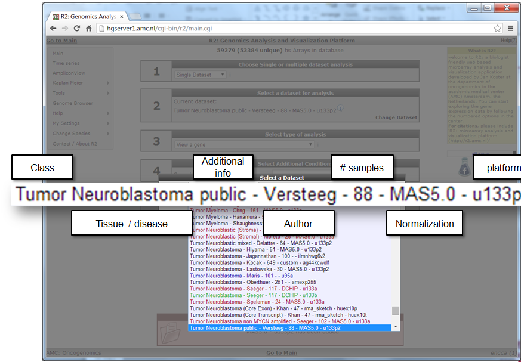
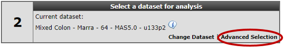
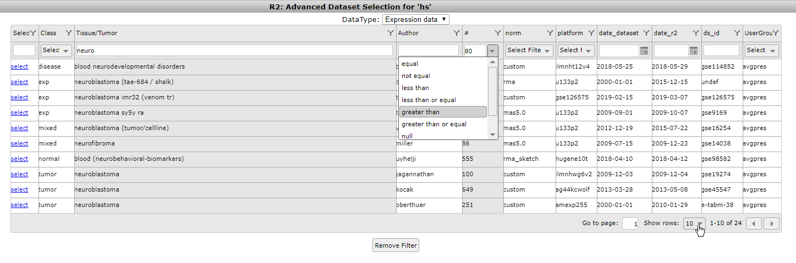
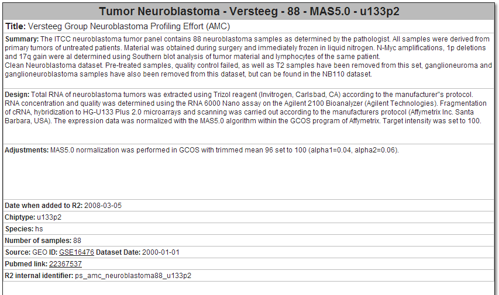
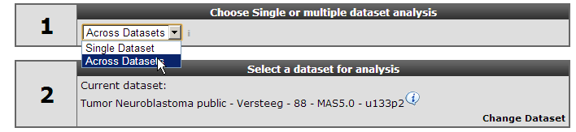
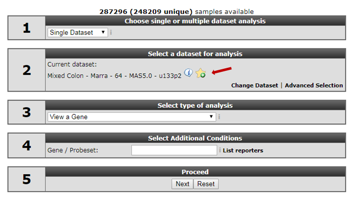

Using Datasets
==============

*Selecting or searching for datasets in R2*

Scope
-----

-   Working with datasets.
-   R2 allows you to perform all kinds of analyses based on a well
    annotated single dataset or a selection of datasets at the
    same time. Different analyses are available based on the selection
    of one of these options in field 1.
-   R2 contains mRNA gene expression profiles for more than 70.000
    individual human samples. The samples are grouped in so
    called datasets. Each dataset has its own characteristics such
    tissue type, tumor type or from cell-line experiments.
-   The *Tumor Neuroblastoma public - Versteeg - 88 - MAS5.0 -
    u133p2* dataset will be used as an example dataset to guide you
    through most of the tutorial. Later on working with multiple
    datasets will be discussed.

Step 1: Selecting a dataset
---------------

1.  In R2 a large amount of datasets are available for analysis
    and visualization. The numbered items in the main window will guide
    you through all the steps necessary to perform a task. In field
    **1** select “single dataset”, in field **2** choose "change"
	
	
	
	[**Figure 1: In the main screen: Change dataset**](_static/images/UsingtDatasets_select.png)
	
2.  A pull-down menu appears containing a large collection of datasets
    available for all types of analyses R2 is offering
3.  Click on the desired dataset.

[**Figure 2: Selecting datasets from the pull down menu on the main screen**](_static/images/UsingDatasets_SelectSpecificDatasetFromPullDownInR2.png)

----------
 **Did you know that datasets have an informative naming?**      

> *Datasets have a structured naming in R2, using the following rules: **type_of_dataset - author  number_of_samples - normalization - chiptype**. Datasets are listed alphabetically*

----------

Step 2: Advanced selection of datasets
---------------

1.  Next to the pull down menu you can also choose for the “advanced
    dataset selection” tool. The advanced dataset selection facilitates
    searching through datasets using keywords and other filter options
    such as the minimal size of a dataset , the date a certain dataset
    was published etc. An example search would be finding all colon
    samples which are part of a mixed dataset consisting of normal
    tissue and tumor samples.
	
	
	
	[**Figure 3: Advanced selection of datasets**](_static/images/UsingDatasets_AdvancedSelectionLink.png)
	
2.  Click on the “Advanced” link. A new screen shows a table where the
    headers can be filled with search entries to fine tune your search
    for a dataset meeting your search criteria. Enter ‘Neuro’ in the
    class column and’ 50’ in the ‘\#’ column and select ‘ greater than’
    from the pull down menu. This returns all the datasets containing
    the search term ‘Neuro’ and having more than 50 samples.
	
	
	
	[**Figure 4: Advanced selection panel**](_static/images/UsingDatasets_AdvancedSelectionPanelInR2.png)
	
3.  Clicking on ‘Neuroblastoma’ in the class 3 column containing 88
    samples reveals a detailed info box containing additional dataset
    information from the R2 database. When the dataset is publicly
    available clicking on the GEO ID link redirects to the GEO
    repository database where RAW data files are available. A Pubmed
    link is listed in case the dataset is linked to a publication listed
    in PubMed.
    Note: Clicking on an exclamation mark also shows detailed
    dataset information.
	
	
	
	[**Figure 5: Additional Dataset Info**](_static/images/UsingDatasets_AdditinalDatasetInfoInR2.png)
	
4.  Select “Across Datasets” in field **1**. Note that in field 2
    different options become available compared to the “single
    dataset” option.
    
    	
	
	
	[**Figure 6: Selecting across datasets**](_static/images/UsingDatasets_SelectAcrossDatasetsInR2.png)
	

Analysis methods following selecting the “Across Datasets” option in
field **1** will be discussed in tutorial “Working with multiple
datasets”.

-------------
 **Did you know that clicking on an exclamation balloon provides additional info?**      

> *Clicking on the GEO ID link redirects to the GEO repository database  
where RAW data files are available. A Pubmed link is listed in case the
dataset is linked to a publication listed in PubMed.*

-------------

Step 3: Using Dataset favorites
---------------

Since R2 is hosting hundreds of datasets it could be handy to store in a quick way the datasets you often use. Clicking on the starred+ symbol will add the dataset you currently selected to a subset of favorite datasets.

	
[**Figure 6: Adding datasets to favorites**](_static/images/UsingDatasets_favorites.png)

	
You can delete datasets from you favorite lists by clicking the delete symbol.  Clicking the "select from favorites" link gives a pop-up where you can select a dataset from your list of favorites.

	
[**Figure 8: Delete and select from favorites**](_static/images/UsingDataset_selectfav.png)

	
Step 4: Data Scopes
---------------

1.  R2 can also be forced to only display a sub selection of all the datasets that are available. These are called data scopes and can be selected from within R2 by the left hand menu items 'change data scope'. From here you can use one of the preset scopes. This is also the place where you can remove a scope that has been set. One obvious reason why scopes can be handy, is the focussed view on the available data.

2. Data scopes can be used directly from the internet address line, which can be handy when a referral needs to be made to R2 from a manuscript. For now, you do need to provide a link directly to the server (usually hgserver1.amc.nl/cgi-bin/r2/main.cgi?&dscope=NRBL).

----------
 **Did you know that the R2-support team is scanning public repositories for interesting datasets to expand the R2-database on a regular basis**      

> *In case you want to see a dataset added to R2 please send an email to r2-support@amc.nl
Such an email should contain a link to the publicly accessible files, such as a Gene Expression Omnibus number (GSE\*\*\*\*\*). Your own private datasets can also be added to R2 with user/group restricted access. Please send us an email at* ***<r2-support@amc.nl>*** and inquire on the procedure to get your data available in R2 (see also chapter 22).

---------------

Final remarks / future directions
---------------------------------

Everything described in ths chapter can be performed in the R2: genomics analysis and visualization platform (http://r2platform.com / http://r2.amc.nl) 

If you run into any quirks or annoyances don't hesitate to contact r2 support
(r2-support@amc.uva.nl).

We hope that this tutorial has been helpful,The R2 support team.

