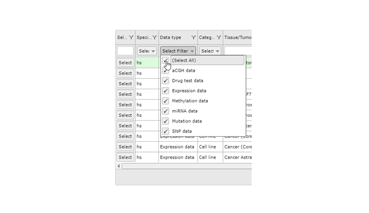
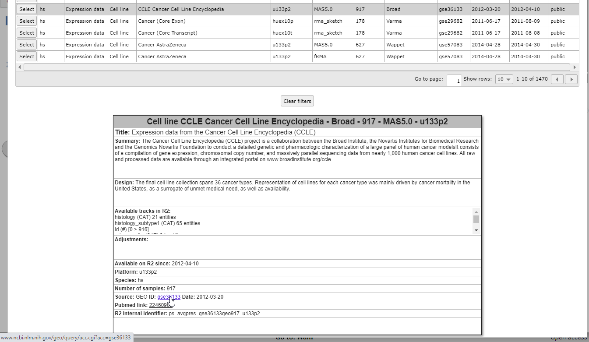
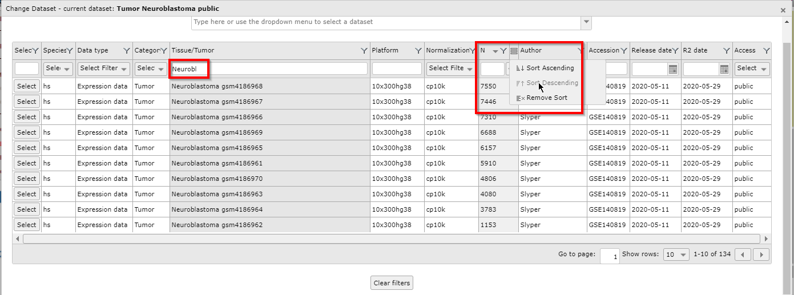
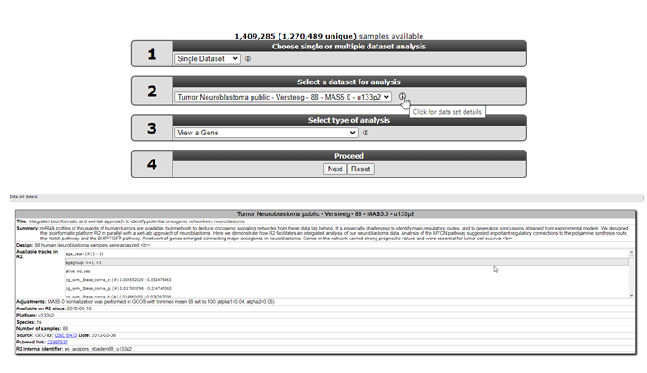
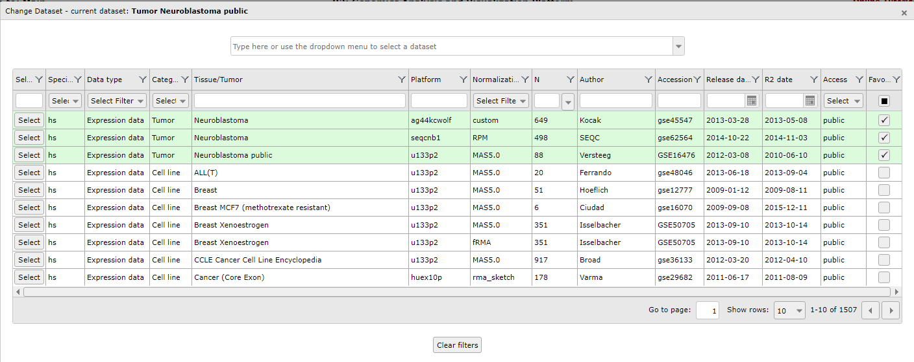

Using Datasets
==============

*Selecting or searching datasets in R2.*

Scope
-----

- Working with datasets.
- R2 allows you to perform all kinds of analyses based on a well
    annotated, single dataset, or a selection of datasets at the
    same time. Different analyses are available through the selection
    of one of these options in field 1.
- R2 contains omics profiles such as expression and methylation profiles of over 1.200.000 unique
    individual samples. The samples are grouped in so-called datasets. Each dataset has its own characteristics, 
    such as tissue type, tumor/disease type, or from cell-line experiments. Frequently, new datasets are added to the platform.
- The *Mixed Colon Adenocarcinoma (20220-v32)* dataset will be used as an example dataset to guide you
    through most of the tutorial. Later on, working with multiple
    datasets will be discussed.

   

   [**Figure 1: Select types of datasets.**](_static/images/Usingdatasets_type.png)

Step 1: Selecting a dataset
---------------

1. R2 offers a large number of readily available datasets for analysis and visualization.
    The numbered boxes on the main page will guide you through all the steps necessary to perform a task, starting
    with the selection of a dataset. In field 1 select **Single Dataset**, in field 2 click on the name of the dataset (Figure 2).
	
    
	
    [**Figure 2: Change Dataset on the main page.**](_static/images/UsingDataset_selectv1a.png)

	
2. A popup window appears that shows all the available datasets in a grid. Each row represents one dataset, with its 
   main descriptive details split up in the columns. To use a dataset for further analysis, you click on the **Select** button in the first column. 
   If you prefer to first read extra information about the dataset of your interest, click on any other part of the specific row (Figure 3A, dashed area).
   

   [**Figure 3A: Select a dataset with the select button or read more in-depth information (click in the dashed area).**](_static/images/Usingdatasets/UsingDataset_select_selectbutton.png)  

 When you click on any of the information cells of the dataset row (dashed area), an information panel below the grid 
 shows background information of the data (Figure 3). Possible adjustments of the original data by the R2 team, such as 
 data transformations or annotation changes, can be found in the "Adjustments" box of the information panel. At the bottom 
 you will see links to the original data source and Pubmed resources, if available. 

	
[**Figure 3B:  Read in-depth information about a dataset.**](_static/images/Usingdatasets/UsingDataset_click_information.png) 

3. A search bar is located at the top of the page. It allows you to search a dataset by (a part of) a keyword, such as a tissue type, 
   a disease, or an author's name. When you start typing in the search bar, a list appears with datasets that 
   correspond to your keyword (Figure 4). Also, the grid is adjusted to only show the datasets that satisfy your search requirements.

   

   [**Figure 4: Use the search bar to textually filter the list of datasets with a keyword.**](_static/images/Usingdatasets/UsingDataset_select_dropdown_text.png)  
   
4. You can simply scroll through the list and obtain additional information about a dataset by clicking on a dataset in this list.
   This way you can quickly filter for a tissue type, a disease or an author name. In the search bar of Figure 4 we type the letters "colo" to look for all Colon datasets. 
   
5. You can use the buttons in the bottom right corner to scroll through the pages of the grid, to jump ahead to a specific page, and to adapt the number of dataset rows that are shown per page. 

    
	
    [**Figure 5: Adapt or scroll through the grid.**](_static/images/Usingdatastes/UsingDataset_scroll_through_grid.png) 
    
6. Click on the 'Select' button in the grid to see the dataset of your choice appear on the main page in field 2 for further analysis.

----------

  **Did you know that datasets have an informative naming?**   Datasets have a structured naming in R2, using the following rules: type_of_dataset - author - number_of_samples - normalization - chiptype. The dataset selection grid consists of these informative parts as columns, each with filter options to perform an advanced search through the dataset.

  
	
  [**Figure 6: The informative parts of a dataset name correspond to the columns of the dataset selection grid.**](_static/images/Usingdatasets/UsingDataset_understanding_dataset_names.png) 

----------

Step 2: Advanced selection of datasets
---------------

1. The grid itself enables the user to search through datasets using keywords and other filter options. 
   The column dropdown functions and textboxes can filter the datasets for specific characteristics, e.g. datasets 
   with a minimal number of samples, specific author, platform, or publication date. You can easily combine the 
   search functions of the different columns.  
  
   As an example, we want to see which large neuroblastoma sets are available. First, we write part of the word 
   neuroblastoma in the search box of the Tissue/Tumor column. Next, we use the pull down of the N (sample number) column 
   to order the datasets in descending order. 
	
    
	
    [**Figure 7: Combine search filters in the grid.**](_static/images/Usingdatasets/UsingDataset_combine_grid_filters.png)
	
2. Again, we use the **Select** button if we want to continue our analysis with a specific dataset of the grid. 
	
3. Now, select “Across Datasets” in field **1**. Note that in field 2
    different options become available compared to the “single
    dataset” option.
   
    
	
    [**Figure 8: Selecting across datasets.**](_static/images/Usingdatasets/UsingDatasets_SelectAcrossDatasetsInR2v1.png)
	
    Analysis methods following selecting the “Across Datasets” option in field **1** will be discussed in tutorial “Working with multiple datasets”.  

-------------
 **Did you know that clicking on an exclamation balloon provides additional info?**      

 

-------------

Step 3: Using Dataset favorites
---------------

Since R2 is hosting hundreds of datasets, it could be convenient to store the datasets you often use in a preselection that 
is easily accessible. In order to maintain favorites, you need to be a registered user. If you did not yet register; 
accounts can easily be created via 'Login/Register' and are absolutely free. Clicking on 'Change Dataset' will open the 
datasets page, where resources can be searched and selected.

	
[**Figure 9: Change Dataset to access favorites.**](_static/images/Usingdatasets/UsingDataset_selectv1a.png)

Within the dataset selection table, you can select and deselect cohorts to add or remove them from your selection of 
preferred sets. This is done by using the "Favourite" selection boxes in the last column on the right side. Favorite 
datasets will always be represented at the top of your selection table and will be marked with a green background 
color. This makes it very convenient to quickly have access to those. 

	
[**Figure 10: Managing favorites.**](_static/images/Usingdatasets/UsingDataset_selectfav.png)

Step 4: Data Scopes
---------------

1. R2 can be forced to only display a sub-selection of all the datasets that are available (e.g. only neuroblastoma datasets). 
    These are called data scopes and can be selected from within R2 by the left-hand menu item 'Change Data Scope'. 
    From here you can use one of the preset scopes. 
    This is also the section where you can remove a scope that has been set. 
    An obvious reason why scopes can be convenient, is the focussed view on the available data: 
    to restrict data to a particular subject or as a landing page for a specific publication/subject.
    Datascopes as dedicated landing pages can also be configured to expose additional functionalities and quick jumps to sections in the platform. 
    Just have a look at which ones are accessible given your access rights.  
2. Data scopes can be used directly from the internet address line, which can be handy when a referral needs to be made to R2 from a manuscript. For now, you do need to provide a link directly to the server (usually hgserver1.amc.nl/cgi-bin/r2/main.cgi?&dscope=NRBL).  

Further details on the use of Datascopes can be found in the tutorial Datascopes.   

----------
 **Did you know that the R2-support team is scanning public repositories for interesting datasets to expand the R2-database on a regular basis**      

> *In case you want to see a dataset added to R2 please send an email to r2-support@amsterdamumc.nl  
> Such an email should contain a link to the publicly accessible files, such as a Gene Expression Omnibus number (GSE\*\*\*\*\*).* 
>
> *Your own private datasets can also be added to R2 with user/group restricted access. Please send us an email at* ***<r2-support@amsterdamumc.nl>*** *and inquire on the procedure to get your data available in R2 (see also Chapter 22).*

---------------

Final remarks / future directions
---------------------------------

All the procedures described in this chapter can be executed using the R2: genomics analysis and visualization platform (http://r2platform.com / http://r2.amc.nl).

If you encounter any quirks or issues, please do not hesitate to contact R2 support at r2-support@amsterdamumc.nl.

We hope that this tutorial has been useful.

Best regards,
The R2 support team.

