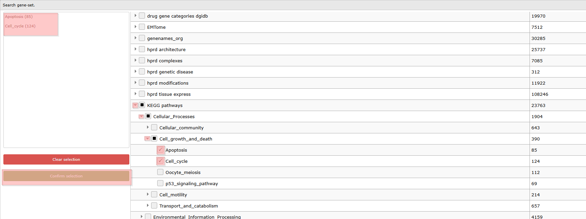
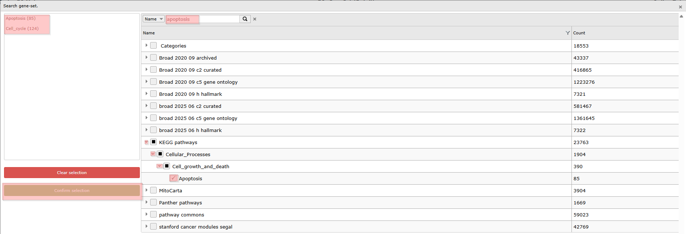
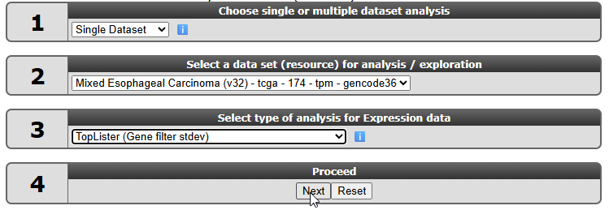

Using genesets and creating heatmaps in R2
===============================

*Or how you can generate clear, presentation ready heatmaps of your
dataset*

Scope
-----

-   In this tutorial the visualization of a set of genes will be
    explored
-   R2 provides a conventional heatmap view""
-   This heatmap view can be adapted to your needs by sorting the data
    along the axes according to your wishes.
-   Generating your own genelists to analyze using the
    Toplister function.

    
    
Step 1: Selecting data and modules; creating a Heatmap
---------------

1.  On the main page of R2 select **View Geneset (Heatmap)** (Figure 1).
    Click 'Next'.
    
	
	
	[**Figure    1: Select: View a Geneset**](_static/images/Usinggenesets/UsingGenesets_Select1a.png)
	
2.  In the Adjustable settings many choices are available to customize
    the way the Gene set data will be presented (Figure 2). With the default _Gene selection method_ value set to **Gene set** (also shown in the right-hand menu overview in the figure below), you can choose from the hundreds of gene sets available in R2, including both public and user-defined gene sets. If you change the setting to the value **Manual ordered list**, it also allows you to control the ordering of genes in the heatmap (left-hand menu overview).  
    
    In the adjustable settings, many parameters can be modified, including sample filtering, sample ordering, and a wide range of graphical customizations.

    

    [**Figure    2: A set can be selected, filtered for subsets and the clustering results will be ordered according to the selection**](_static/images/Usinggenesets/UsingGenesets_Settings1a.png)

3.  By default, R2 presents the data in a heatmap where hierarchical clustering is applied to the genes, using information from all samples to determine the gene order. We will first demonstrate what this clustering-based ordering looks like.  
Suppose we want to find a geneset containing Cell Cycle genes. Click **Select a geneset** to open the gene set selection grid. Type **cell_cycle** into the white text box at the top of the grid and hit **Enter**. Many genesets contain an underscore in their name, such as genesets from the KEGG database. You can also check available genesets for "cell cycle" with a space in between instead of an underscore, and different gene sets will be shown. 

    

    [**Figure 3: Finding and selecting a geneset in R2**](_static/images/Usinggenesets/UsingGenesets_Collections1a.png)

	
4. In the grid box all gene sets containing the keywords **cell_cycle** (with underscore) in
    their description are shown. You can click on the arrows in front of the main Gene set list names to go deeper in the tree of gene sets and their subsets. In our case we click on the arrows in front of **KEGG pathways** > **Cellular_Processes** > **Cell_growth_and_death** and check the box in front of **cell_cycle**. You can select multiple gene sets as well, as explained in the next section. Verify that your selection appears in the overview box on the left. When you are satisfied with the selection, click the green **Confirm selection button**.  
    The KEGG cell cycle gene set (124) is now selected. And you can continue to adapt other settings, such as for instance te ordering of the samples in the heatmap. Hit **Submit** to create the heatmap with your chosen settings. 

   

   [**Figure    4: Available ordering domains for    samples**](_static/images/Usinggenesets/UsingGenesets_Ordering.png)

5.  The Affymetrix data for the Neuroblastoma 88 dataset is shown for
    the genes in the KEGG Cell Cycle pathway gene set as a clustered heatmap. Hovering over
    the heatmap rectangles reveals the sample information stored in the
    R2 database. Keep in mind that the hovering option is limited to
    10000 cells otherwise the graph generation consumes too much time.
    This limitation can be adapted in the 'User Options' menu item. Above the heatmap, dataset annotations are displayed, allowing you to relate patterns in the heatmap to known sample annotations.

    
	
    [**Figure 5: Heatmap of the Kegg Cell Cycle geneset for the Neuroblastoma 88 dataset;genes and samples are sorted according to the hierarchical clustering.**](_static/images/Usinggenesets/UsingGenesets_Heatmap.png)

Step 2: Using multiple GeneSets
---------------

1.  R2 also allows for multiple genesets to be selected and to be shown in one heatmap. Let's get the gene selection grid up:  
    * If you are on the result page of the previous section where the heatmap is shown for the KEGG Cell_cycle geneset, you can simply *scroll down* to the **Adjustable Settings menu**;  
    * If you come from another place, go to the main page and select **View Geneset (Heatmap)** (Figure 1: Select View a Geneset) and click **Next**.  
2.  Behind the setting *Gene set*, click on the dropdown field. You can check the boxes of multiple gene sets. If you come from the above section, the KEGG Cell_cycle geneset is still selected, and you can add other genesets to your selection. If you haven't selected any genesets yet, you can go back to step 1.3 and part of 1.4 of the previous section to select the Cell_cycle geneset. Before hitting the Confirmation button, we now  add another geneset. Click on the triangle in front of **KEGG pathways**, followed by the triangles of **Cellular_Processes** and **Cell_growth_and_death** in the KEGG pathway collection, to check the box in front of **Apoptosis** (Figure 6A). Of course, you can also look via the keyword **apoptosis** for collections that contain an apoptosis geneset (Figure 6B). You can also select sub-genesets from multiple larger collections. And search consequetively for different keywords to find multiple gene sets that you are interested int. Once you checked the boxes of the correct gene sets, they will appear together in the selectionoverview on the left, and you can click the green **Confirm selection** button underneath. And hit the **Submit** button of teh menu.
    
	
	
	[**Figure    6 A: Selection multiple sub gene sets from large collections**](_static/images/Usinggenesets/UsingGenesets_multiplegenesets_browsesubcats.png)

    

    [**Figure    6 A: Selection multiple sub gene sets from large collections**](_static/images/Usinggenesets/UsingGenesets_multiplegenesets_searchbykeyword.png)
	

3. The resulting heatmap (Figure 7) has both the samples and the genes ordered by the
    result of the clustering of the dataset. On the y-axis the genes are
    annotated with their membership to both pathways by the red/ grey bars on the right hand side;  Using both genesets shows clearly some blocks in the heatmap which could be linked to the annotation plotted above the heatmap.

	
[**Figure 7: Heatmap view of the Cell Cycle and Apoptosis genesets for the Neuroblastoma 88 dataset.**](_static/images/Usinggenesets/UsingGenesets_Heatmap_multiple1a.png)
	
    
   Underneath the heatmap, you can find the signature score visualization per sample. The geneset signature score is calculated as the average z-score from a z-score–transformed dataset. This results in one score per sample (or two scores when upregulated and downregulated gene subsets are found), summarizing how the genes in the selected gene set behave collectively in each sample. In the chapter *Using signatures* you can read more about signature scores and how to incorporate them in your analysis. 

Step 3: Relating genesets with data annotation
---------------

1.  We're going to explore in further detail how to relate genesets to dataset annotation. We will do so by sorting the dataset according to the staging. Scroll down to the Adjustable settings menu. You can adapt the genesets of choice but we leave them as set in the previous section. Cell_cycle and apoptosis. In stead we now focus on the settings *Order samples by* and choose the value **a track** from the dropdown. An extra setting is shown underneath to choose the track by which you want to order the samples in the heatmap. In the _Track_ dropdown, choose the **inss (5 cat)** annotation. 
    'Order samples by a track' and click **Submit** (Figure 8). 
    
	
	
	[**Figure 8: Selecting the track to order samples by subgroups: Order by a  track**](_static/images/Usinggenesets/UsingGenesets_sortedbytrack.png)
	

2. In the resulting heatmap clusters of genes of the selected pathways are clearly 
    upregulated in the stage 4 Neuroblastoma samples (colored red in the
    inss track above the heatmap). Other clusters of genes are upregulated in other stages. 

     and up-regulation of a
   subset of genes")

    [**Figure
   9: Heatmap sorted by INSS stage. there is a clear relation between
   the stage 4 tumors (in red in the INSS track) and up-regulation of a
   subset of genes**](_static/images/Usinggenesets/UsingGenesets_HeatmapSorted1a.png)

3. In the previous example R2 offers the possibility to set a fixed
    ordering of _samples_ by track. It's also possible to perform a
    clustering and set a fixed ordering of _genes_. In the "Adjustable
    settings" panel, select for the setting *Gene selection method* **Manual ordered list**. Here you can paste a list of genes and define their order according to your needs. As always with the Adjustable settings menu, click **Submit** to apply your changes.
4. If you want to have a fixed sample order, you can set the settings _Order samples by_ to **current or manual order** and click **Submit**.

Step 4: Unsupervised hierarchical clustering with a geneset
---------------

Heatmaps are often used to discover new subgroups in your dataset.
In the chapter "Differential expression of genes in your dataset", we explain how to
generate genesets describing the difference between known subgroups (by tracks)
from an annotated dataset. A heatmap visualization of such a geneset will show often the clustering of the samples corresponding with the used annotation for the geneset generation. A researcher might discover clusters of genes that are upregulated with particular  annotation groups. Or the researcher might find subgroups within annotation groups.  
  
If you need to find subgroups without the use of annotation as a starting point, you could look for genes that show the highest variation within your dataset with the R2 tool **Toplister**. The resulting gene list can then be visualized with hierarchical clustering to result in sample clusters (subgroups) in a heatmap.

1. For this example we make use of a different dataset. On the main page, select in box 2 the dataset
   **Expression data and select Mixed Esophageal Carcinoma - tcga - 174 - tpm - gencode36**  and find the tool **Toplister** from the dropdown menu in _box 3_. Click **Next**

   

   [**Figure    10: Select the tool Toplister to look for the genes with the highest variance in your datase**](_static/images/Usinggenesets/UsingGenesets_SelectToplister.png)

2. In the Adjustable settings menu, all kinds of settings and filtering options can be adapted.
    We want to know which 100 genes have the highest variation. In this
    case, leave the setting _Which set_ at the default **Standard Deviation (SD)**.

    

    [**Figure    11: Toplister settings**](_static/images/Usinggenesets/UsingGenesets_Toplister.png)

   The selected TCGA dataset gene annotation has been assigned to gencode reporters and R2 also has stored gene set information which can be used as a filter. Note that this doesn't hold for all the platforms linked to a dataset. We leave it as is for now and click **Next**.

4.  R2 has generated a list of 100 genes showing the highest variation
    in gene expression. Beneath the list the settings can be adapted again. With the buttons on the right hand side of the page, the gene list can be exported or stored in R2 as a geneset.

    

    [**Figure 12: Result of the toplister module.**](_static/images/Usinggenesets/UsingGenesets_toplisteroptions.png)
  
  
  Clicking on the Heatmap (Zscore) button on the right will perform an unsupervised hierarchical clustering and plot a heatmap. 

	
[**Figure 13: Unsupervised hierarchical clustering revealing subgroups in a Esophagal Carcinoma dataset.**](_static/images/Usinggenesets/UsingGenesets_Unsupervised1b.png)

  If you click on **the triangle in front of Sort Order Listing** underneath the Heatmap, you can find the sample and gene ordering, and you can find the lists of clusters of samples or of genes that can be found in the heatmap. 

[**Figure 14: Lists of the sample and gene ordering after the unsupervised clustering in the heatmap.**](_static/images/Usinggenesets/UsingGenesets_HeatmapToplister_sorting.png)

Final remarks / future directions
---------------------------------

Everything described in ths chapter can be performed in the R2: genomics analysis and visualization platform (http://r2platform.com / http://r2.amc.nl) 

We hope that this tutorial has been helpful, the R2 support team.

