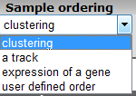
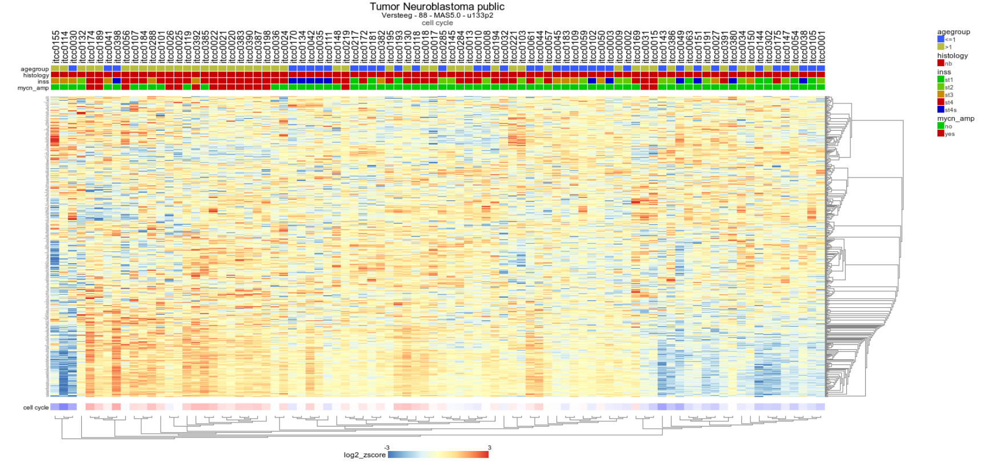

Using genesets and creating heatmaps in R2
===============================

*Or how you can generate clear, presentation ready heatmaps of your
dataset*

Scope
-----

-   In this tutorial the visualization of a set of genes will be
    explored
-   R2 provides a conventional heatmap view""
-   This heatmap view can be adapted to your needs by sorting the data
    along the axes according to your wishes.
-   Generating your own genelists to analyze using the
    Toplister function.

    
    
Step 1: Selecting data and modules; creating a Heatmap
---------------

1.  On the main page of R2 select **View Geneset (Heatmap)** (Figure 1).
    Click 'Next'.
    
	
	
	[**Figure    1: Select: View a Geneset**](_static/images/Usinggenesets/UsingGenesets_Select1a.png)
	
2.  In the Adjustable settings many choices are available to customize
    the way the Gene set data will be presented (Figure 2). With the default _Gene selection method_ value set to **Gene set** (also shown in the right-hand menu overview in the figure below), you can choose from the hundreds of gene sets available in R2, including both public and user-defined gene sets. If you change the setting to the value **Manual ordered list**, it also allows you to control the ordering of genes in the heatmap (left-hand menu overview).  
    
    In the adjustable settings, many parameters can be modified, including sample filtering, sample ordering, and a wide range of graphical customizations.

    

    [**Figure    2: A set can be selected, filtered for subsets and the clustering results will be ordered according to the selection**](_static/images/Usinggenesets/UsingGenesets_Settings1a.png)

3.  By default, R2 presents the data in a heatmap where hierarchical clustering is applied to the genes, using information from all samples to determine the gene order. We will first demonstrate what this clustering-based ordering looks like.  
Suppose we want to find a geneset containing Cell Cycle genes. Click **Select a geneset** to open the gene set selection grid. Type **cell cycle** into the white text box at the top of the grid and hit **Enter**.

    

    [**Figure 3: Finding and selecting a geneset in R2**](_static/images/Usinggenesets/UsingGenesets_Collections1a.png)

	
4. In the grid box all gene sets containing the words Cell Cycle (**Cell_cycle**) in
    their description are shown. You can click on the arrows in front of the main Gene set list names to go deeper in the tree of gene sets and their subsets. In our case we click on the arrow in front of **Categories** and check the box in front of **cell cycle** (a list that originated from the GO pathway database). You can select multiple gene sets as well, they will be listed on the left side in the overview box. When you are satisfied with your selection, you can hit the green **Confirm selection button**.  
    The cell cycle gene set (537) is now selected. And you can continue to adapt other settings, such as for instance te ordering of the samples in the heatmap. Hit **Submit** to create the heatmap with your chosen settings. 

   

   [**Figure    4: Available ordering domains for    samples**](_static/images/Usinggenesets/UsingGenesets_Ordering.png)

5.  The Affymetrix data for the Neuroblastoma 88 dataset is shown for
    the genes in the Cell Cycle as a clustered heatmap. Hovering over
    the heatmap rectangles reveals the sample information stored in the
    R2 database. Keep in mind that the hovering option is limited to
    10000 cells otherwise the graph generation consumes too much time.
    This limitation can be adapted in the 'User Options' menu item.

    
	
    [**Figure 5: Heatmap view of the Kegg Cell Cycle geneset for the Neuroblastoma 88 dataset;genes and samples are sorted according to the clustering.**](_static/images/Usinggenesets/UsingGenesets_Heatmap.png)

Step 2: Using multiple GeneSets
---------------

1.  R2 also allows for multiple genesets to be shown at once; return to
    the main page; select View Geneset (Figure 1: Select View
    a Geneset). We're not going to search for a geneset but look for
    multiple sets at once. 
2.  In the next screen click "select geneset",  Select 'Cellular Processes' in the KEGG pathway collection of look via keywords or going through al the sub-collections, select the apoptosis path way and click  the "Confirm Collection" button.
    
	
	
	[**Figure    6: Selection a subcollection from the large collection of pathways**](_static/images/Usinggenesets/UsingGenesets_multiplegenesets.png)
	

3. The resulting heatmap (Figure 7) has the samples ordered by the
    result of the clustering of the dataset. On the y-axis the genes are
    annotated with their membership to both pathways;  Using both genesets shows clearly some blocks in the heatmap which could be linked to the annotation plotted above the heatmap

	
[**Figure 7: Heatmap view of the Cell Cycle and Apoptosis genesets for the Neuroblastoma 88 dataset.**](_static/images/Usinggenesets/UsingGenesets_Heatmap_multiple1a.png)
	

Step 3: Relating genesets with data annotation
---------------

1.  We're going to explore that in further detail by sorting the dataset
    according to the staging. Return to the former choice page
    (Figure 2) by clicking the back button in your browser. Choose some genesets of interest and choose order samples by track and choose the INSS category. 
    'Order samples by a track' and click "next" (Figure 10). I
    
	
	
	[**Figure 8: Selecting the track (subgroup) to order samples by: Order by a  track**](_static/images/Usinggenesets/UsingGenesets_sortedbytrack.png)
	

2. In the resulting heatmap it is clear that there is a segment of
    genes pathways cluster that is consistently
    upregulated in the stage 4 Neuroblastoma samples (in red in the
    INSS track).
3. 

[**Figure
    9: Heatmap sorted by INSS stage, there is a clear relation between
    the stage 4 tumors (in red in the INSS track) and up-regulation of a
    subset of genes**](_static/images/Usinggenesets/UsingGenesets_HeatmapSorted1a.png)

3. In the previous example R2 offers the possibility to set a fixed
    ordering of samples by track. It's also possible to perform a
    clustering and set a fixed ordering of genes. In the "adjustable
    settings" panel, select manual orderd list in the gene selection
    method and click submit. Here you can paste a list of
    genes sorted according to your needs.
4. If you want to perform hierarchical clustering with a fixed
    sample order. Select current of manual order and click
    submit.

Step 4: Unsupervised hierarchical clustering with a geneset
---------------

It could be that for a given dataset there is no annotation to apply the
analysis tools R2 is offering or your"re lacking a starting point to
further investigated a dataset. A good starting point could be to do is
to do a simple hierarchical clustering

1.  In chapter "Differential expression" is explained how to
    generate genesets describing the difference between tracks (groups)
    from an annotated dataset. Researchers often want to investigate the
    presence of subgroups without using annotation information in their
    dataset or just find a list of genes with the highest variation in
    gene expression. In case your dataset of interest lack annotation
    you are still able via the Toplister tool to investigate datasets
    for biological relevance.
2.  For this purpose R2 is hosting a convenient tool to generated lists
    of genes using a filter. By using this filter you can select groups
    of genes with the highest, lowest or most variable genes etc etc.
3.  To use the Toplister tool, either select 'Toplister' from the dropdown menu 
    in box 3 of the main page or go to the menu on the left and select
    tools> small tools > Toplister. Make sure Data Type is set to
    Expression data and select Mixed Esophageal Carcinoma - tcga - 174 - tpm - gencode36  and click next. In the adjustable settings
    screen all kinds of settings and filtering options can be adapted.
    We want to know which 100 genes have the highest variation in this
    case leave " which set" at standard deviation (SD) which is the
    default settings.

    

    [**Figure    10: Using toplister**](_static/images/Usinggenesets/UsingGenesets_Toplister.png)

In this case the selected TCGA dataset gene annotation has been assigned to gencode reporters and in this example R2 also has stored gene category information which can be used as a filter. Note that this doesn't hold for all the platforms linked to a dataset.

4.  R2 has generated a list of 100 genes showing the highest variation
    in gene expression. Beneath the list als kinds  of settings can be adapeted and in the right menu the genelist can be exported of stored in r2 as a geneset.

[**Figure 11: Result of the toplister module.**](_static/images/Usinggenesets/UsingGenesets_toplisteroptions.png)

Clicking on the Heatmap (Zscore)  in the right menu will perform an  unsupervised hierarchical clustering and plots a heatmap. 

	
[**Figure 12: Unsupervised hierarchical clustering revealing subgroups in a Esophagal Carcinoma dataset.**](_static/images/Usinggenesets/UsingGenesets_Unsupervised1b.png)

Final remarks / future directions
---------------------------------

Everything described in ths chapter can be performed in the R2: genomics analysis and visualization platform (http://r2platform.com / http://r2.amc.nl) 

We hope that this tutorial has been helpful, the R2 support team.

