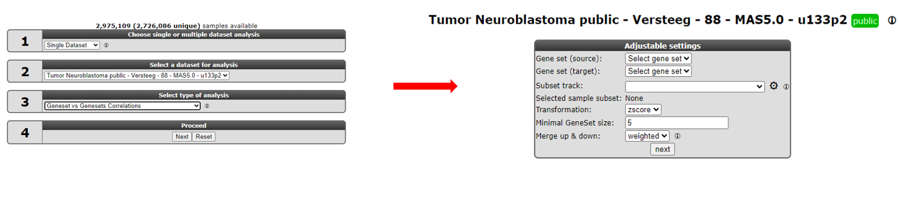
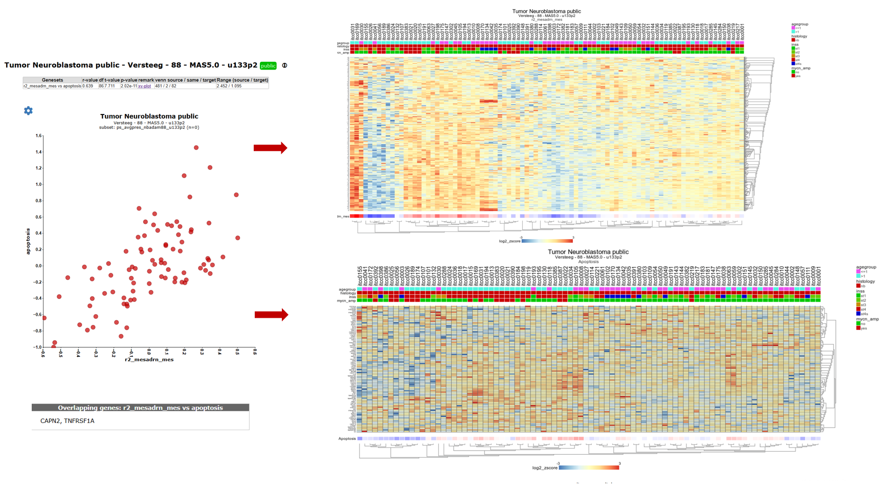
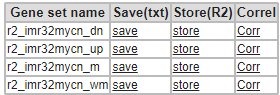

Using signatures
================

*Find related gene signatures with a specified genelist or novel
correlating gene signatures*

Scope
-----

Within the current context, we define a signature as a collection of
genes that are defined on a particular basis. This can be the presence
within a gene-ontology class, the genomic location of a gene, or perhaps
something potentially more meaningful like a functional pathway
signature. Functional pathway signatures are mRNA proxies for a
particular perturbation, such as the response to the downregulation of a
gene, or the consequence of a targeted compound (drug). Especially in
this context, the collection of genes may have predictive power for the
activity of a process. Of course it becomes cumbersome to assess the
activity on a gene-by-gene basis. It would be very handy if we could
express the behavior of all the genes in a single value. Within R2, we
can convert the behavior of a list of genes into a signature score that
can be calculated for all samples within a particular dataset. This
signature score is simply defined as the average zscore of a zscore
transformed dataset (the standard way of visualizing a heatmap) (Figure
1). In R2, such scores are automatically generated when one generates
heatmaps via the "view a geneset" function or in case the dataset is very large a gene signature can be created directly using "Create Gene set signature". With the exception of some
exceptional cases, most functional signatures will be composed of both
upregulated genes as well as downregulated ones. Using both as a single
list may then become problematic, as downregulated genes may counteract
the effects of upregulated genes, effectively leveling each other out.
To circumvent this problem, we can create 2 separate gene categories,
one containing only the upregulated genes, and one containing only the
downregulated genes. R2 will recognize couples of gene categories if
they follow a specific convention (fixed prefix, followed by \_up and
\_down; e.g. mycn\_up and mycn\_down).

[**Figure 1: Signature score: one category vs up/downcategory**](_static/images/Genesetsignatures/Genesetcorrelation_sig_score_explained_v0.png)

-   What is a genesignature
-   Create a track using the weight scores of a genesignature
-   Relate a weighed genesignature track to a single gene
-   Find correlating genesignatures with a track

------------------------
  **Did you know that you can create gene category couples**
>*R2 can treat particular gene categories in a special way if you follow a simple naming convention. Especially helpful for signature scores are up/down regulated gene couples. Within the "view a geneset" function, you can select multiple gene categories to be used in for the heatmap. If you select 2 categories that contain a fixed prefix, coupled to \_up and \_down (or \_dn), then R2 will treat them as a couple, and will subtract the downregulated signals from the upregulated ones (effectively creating a signature score). We can weigh the 2 separate lists of genes either equally, or weighted as a percentage of the number of genes (the weighted\_match / \_wm signatures).*

------------------

Step 1: Creating a geneset signature, a Track within R2
---------------

As a start, let"s create the signature scores for a pair of gene
categories. In this tutorial, we will make use of a published functional
MYCN pathway activity signature that was created on the Neuroblastoma 88
dataset (Valentijn et al 2012). This signature is provided within R2.

1.  We start at "Main". Make sure that the "Single dataset" option is
    selected in "box 1".
2.  In "box 2" verify that the current dataset is "Neuroblastoma
    public - Versteeg - 88 - MAS5.0 - u133p2".
3.  In "box 3" we select "View geneset (Heatmap)". We can choose from two options, "View geneset (Heatmap)" or "Create geneset signature score". With the Heatmap option you can first inspect the Hierarchical Heatmap clustering and then create a signature score based track. Via the "Create geneset signature score", you can directy create signature scores without plotting a heatmap which is recommandable for large (single cell) datasets.

    

    [**Figure 2 : Generating Geneset signatures**](_static/images/Genesetsignatures/genesetcorrelation_select_create.png)

4.  In the following screen  we select by clicking on "Select Gene set" the r2 provided genelists category.
5.  Genelists>oncogenomics_valentijn>functional genesignatures the mycn_dn and _up genesets
    
       

       [**Figure 3 : Generating Geneset signatures**](_static/images/Genesetsignatures/genesetcorrelation_selectsignatures1a.png)
	     
6.  Confirm the selection with the Green Button. 
7.  Depending on your choice R2 will produce a hierarchical clustered heatmap image of the
    selected gene categories. Note that at the right side of
    the heatmap the red markings indicate in which category a particular gene
    was represented (Figure 4). In the bottom part of the heatmap a blue-white-red
    colorscale is depicted for both gene categories. We can clearly see the opposing effects of the 2 signatures. 
    The fourth colorscale row depicts a weighted score, based on the contributions of both signatures (see point 8). 
      
8.  Scrolling down on this page or on the top left in case you have choose to create a signature score without a generating a heatmap you find  a small table. The links within this table
    point to the numerical values of the geneset scores.  For the 2 gene
    categories, R2 will create the scores of the 2 separate categories,
    a matched score (where up and down regulated genes are treated
    equally (50/50)), and a weighted\_matched score (where up and
    downregulated genes are treated on their contribution (percentage
    for number of genes)). Click on "store" for the "weighted\_matched"
    signature, so that we can perform additional analyses on it.    
        
    

    [**Figure 4:Genesets and save signature options**](_static/images/Genesetsignatures/genesetcorrelation_selectsignaturessave.png)
      
9.  R2 has now assembled the information into a prescription to generate
    a track. By default R2 will store the track for 24 hours, which is
    fine for the current tutorial. Click on "Store" to store the new
    track (Figure 4).

    
	
	[**Figure 5: Generating a Track from a gene set Signature Score**](_static/images/Genesetsignatures/genesetcorrelation_createscorec.png)
	

In the small table you can also inspect the r-values for the selected genesets sorted on their values and direction. In the table below the R-value plot you can analyse for the indivual genes heir correlation with the signature scores.

	
[**Figure 6: R-value plot**](_static/images/Genesetsignatures/genesignature_rplot.png)

Step 2: Determine the activity of a signature
---------------

Now that we have created a signature from our 2 lists of genes, we can
start using it as if it was a gene itself. For example we can inspect
how the MYCN pathway activity signature correlates to the MYCN gene at
the mRNA level.
1.  Go back to the "main" page and select "correlate with track"
    from "box 3". In "box 4" we provide "MYCN" and click "Next".
2.  On the following page, we select our newly created track in the
    "select a track" dropdown box and click "Submit" (Figure 5).
    
    
    	
    [**Figure 7: Gene MYCN vs signature score**](_static/images/Genesetsignatures/Genesetcorrelation_mycn_signature_group_vb.png)
    	
3.  R2 will now produce a YY-plot plot where the signature score for every
    patient is related to the MYCN mRNA expression value (Figure 8). The YY-plot is nog very informative so we will switch to the XY-plot.  In the gear box switch to XY-plot. 
4.  We can make this look a bit prettier by adapting the color for
    patients on the basis of e.g. MYCN amplification status. To achieve
    this, we go to the "adjustable settings" at the bottom of the page
    and select "Color by Track" from the "ColorMode" and select
    "mycn\_amp" from the "Track for color" option. 
    Also check out other settings, such as the dot size, that become available when you click on "More Settings".
    Click "Adjust Settings" to redraw.
5.  We can now clearly see that MYCN amplified patients have a higher
    MYCN gene set activity score. The possibilities for numerical tracks are
    endless with some smart questions (Figure 8).

    
	
    [**Figure 8: Add group colouring**](_static/images/Genesetsignatures/Genesetcorrelation_mycn_signature_group_vd.png)

Step 3: Using signature scores
---------------

Now that we have related the signature to a particular gene, it is easy
to envision that this can be done as an analysis as well, where the
signature is correlated to all genes in the genome ("correlate with a
track " in "box3"). A lot of signature gene lists have been designed and published
in literature over the past years. We can convert all of these into
signature scores and start searching for relations of these meta-genes
with our signature of interest.

1.  Go back to the "main" page and select "Geneset vs Geneset correlation" from "box 3" and click "Next" (Figure 7, left). 
2.  On the next page, select at the input Geneset -> Gene set
    Collection (source): "geneset\_\_r2provided\_genelists". In the
    Genesets to Scan (target): select 'geneset\_broad\_2015\_oncogenic'
    (Figure 7, right). Then click "next".
    
    
    	
    [**Figure 7: Geneset vs Geneset correlation**](_static/images/Genesetsignatures/Genesetcorrelation_mycn_signature_vs_sign_vb.png)
    
3.  In the next screen, click the **Select geneset** at Geneset(source). In the pop-up selection grid select at r2 provided genelists > functional_genesignature > oncogenomics_groningen_Natgen_2017 > 'both genesets mes and adrn', Click the green "Confirm selection button".
   
4.  Follow the same procedure for Gene set (target) and select some genesets of interest like Cellular processes in the KEGG pathway section, again Click the green "Confirm selection button". 
     
    
    	
    [**Figure 8: Choose the genesets**](_static/images/Genesetsignatures/Genesetcorrelation_mycn_signature_vs_sign_vb2.png)
    
5.  R2 has now generated all the possible correlations for the selected
    MYCN signature geneset against all the gene lists within the selected KEGG patway categoriess. This results in a table of geneset versus geneset
    correlations sorted by the p-value. The "venn source/ same / target"
    column provides insight in overlapping number of genes (same) between two gene lists (source and target).
    Another informative parameter in the table is the range parameter in
    the last column. This value indicates the range of geneset scores in
    gene target signature.
    
    
        	
    [**Figure 9: Correlations and overlap between genesets**](_static/images/Genesetsignatures/Genesetcorrelation_mycn_signature_vs_sign_vbc.png)
    
6.  To inspect the correlation in more detail, we can click on the
    "XY-plot" link.
7.  Now R2 has generated an XY-plot of all samples in the dataset. The
    XY values represent the signature scores for the 2 signatures for
    every sample. Below the image the overlapping genes in the 2
    signatures are listed (see Figure 10, left side).
8.  We can also inspect the target signature as a heatmap by clicking on
    the "View heatmap of ", providing gene-by-gene information (see
    Figure 10, right side). 

    
	
    [**Figure 10: XY signature score plot and heatmap of correlated gene sets**](_static/images/Genesetsignatures/Genesetcorrelation_mycn_signature_vs_sign_c.png)

Step 4:  Plot signature scores using the relate 2-tracks module.
---------------

In the previous steps we have plotted the genesignature scores directly from a list of geneset vs
geneset correlations. We can also select and use genesignature scores to plot a XY-plot in the relate 2 track
module from R2. In this example we will use MES and ADRN (mesenchymal, adrenergic) genesignature scores generated on a combined dataset
of neuroblastoma cell lines and 5 neural crest derived cell lines published by (Groningen , Koster  et al 2017).

1.  Go back to the "main" page and select the dataset Mixed Neuroblastoma (MES-ADRN-Crest-Exp) - Versteeg - 52 - MAS5.0 - u133p2
    in box 2.
2.  In Box 3, select the "Relate two tracks" module and click next.
3.  In the next screen select in the pull down menu at X-track , adrn_score (#) and at Y-track
    the mes_score (#) and click next. In case a YY-plot has been generated , adapt tge plot to a XY-plot in the gear box. The XY-plot is representing the correlation of the
    two signature scores. However, a clear significant correlation between the two signatures is shown. The
    biological relevance is less prominent so far.
    
    
    
    [**Figure 11: Relate 2 tracks using genesignatures**](_static/images/Genesetsignatures/genesignature_mixed52_v1.png)

4.  In order to visualise the biological relevance of this correlation plot. Select at ColorMode , "color by track" and at track for color the "mes_adrn_time" track in the pulldown menu, click adjust settings.

    
    
    [**Figure 12: Color by a biologically meaningful track**](_static/images/Genesetsignatures/genesignature_mixed52_trackcolor.png)

5.  In this new plot, mes defined cell lines cluster together with the neural crest derived lines in the left upper part of the plot
    (orange and green respectively) and the ADRN lines in blue in the right lower part of the plot. The purple dots
    represent a time-series experiment where PRRX1 overexpession induces in time a transition towards MES defined cell lines.
    This is clearly shown by the dark purple colored dots where the light purple colored dots are controls or early time points.

Step 5:  Drawing lines between samples in a XY plot
---------------

Sometimes it can be useful to indicate a relation between different samples within a dataset. In this case
it could  be informative to add a line between samples connecting the shifting samples in time.
Let's give this a try by defining the time series samples within this dataset.

1.  Path properties: The appearance of the line can be influenced by providing a color (hex number)
    and a linewidth. Click and hold the Ctr button and sample path appears by holding the Ctrl button and clicking the sample the dots, the will be connected after releasing the Ctr buttonb
The recipe for these adaptations makes use of ':' and works as follows.
    sample1,sample2:colorcode:width.
    In the Sample paths box; Add 'gsm2413257, gsm2413247, gsm2413248, gsm2413249, gsm2413250, gsm2413251, gsm2413252, gsm2413253,
    gsm2413254, gsm2413255, gsm2413256:#222222' and click "Adjust Settings"
    
    
    
    [**Figure 13: Connecting samples**](_static/images/Genesetsignatures/Genesignatures_time.gif)
    
2. In figure 13 now the samples of the time series are connected and follow the transition from ADRN defined cells to MES defined cell lines in this dataset.

------------------------

**Did you know box**

>*R2 uses a couple of markup options for points in a graph, you can enable these in the advanced prescriptions:* 
> - *'dot': places a thick border around the sample*
> - *'circle': Places a ring around the sample (diameter 9)*
> - *'circle_2': Places a ring around the sample (diameter 4)*
> - *'circle_3': Places a ring around the sample (diameter 1), effectively a thin border*
> - *'epicenter': Places a set of 3 rings descending in width around a sample*
> - *'arrow': Places a block arrow pointing to the sample*
> - *'triangle': Places a filled triangle under the sample*  
>
>*Note: The dotsize does not scale with 'arrow' and 'triangle'*

------------------------

Step 6:  Signature Gene correlations
---------------

You can use the gene signature correlation option in order to identify genes which correlate best with the gene signature you are investigating. 
 
1.  In the 'Gene set values' table below the Heatmap of Step 1, where you stored the genesignature score previously, 
    this time click the link 'Corr' (Figure 3, box C). 

    
    
    [**Figure 14: Select Gene Correlations**](_static/images/Genesetsignatures/genesignature_selectCorrva.png)

2.  This option generates a graph were the R-value is ranked from the highest to the lowest correlation 
    for each member of the gene set that you used to generate the signature score. 
    Clicking on a row in the table will generate a XY-plot. The scatter plot shows the gene expression (Y-axis)
     against the signature score value (X-axis) for each sample.

    
    
    [**Figure 15: Ordered R-values + XY-plot**](_static/images/Genesetsignatures/genesignature_graphtableva.png)

You can also select multiple categories to investigate the individual contribution of genes to a signature score. R2 will automatically keep the coloring for the separate gene categories.  

Final remarks / future directions
---------------------------------

Everything described in ths chapter can be performed in the R2: genomics analysis and visualization platform (http://r2platform.com / http://r2.amc.nl) 

We hope that this tutorial has been helpful, the R2 support team.

