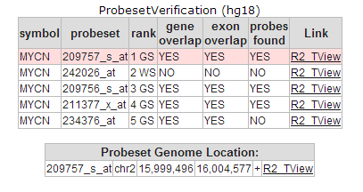
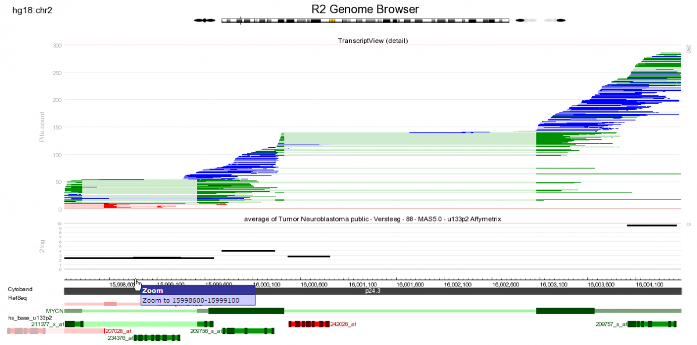
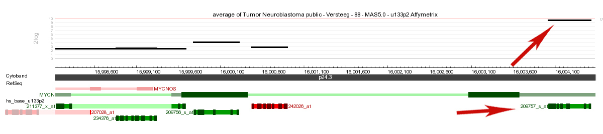
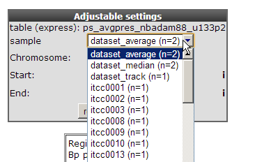
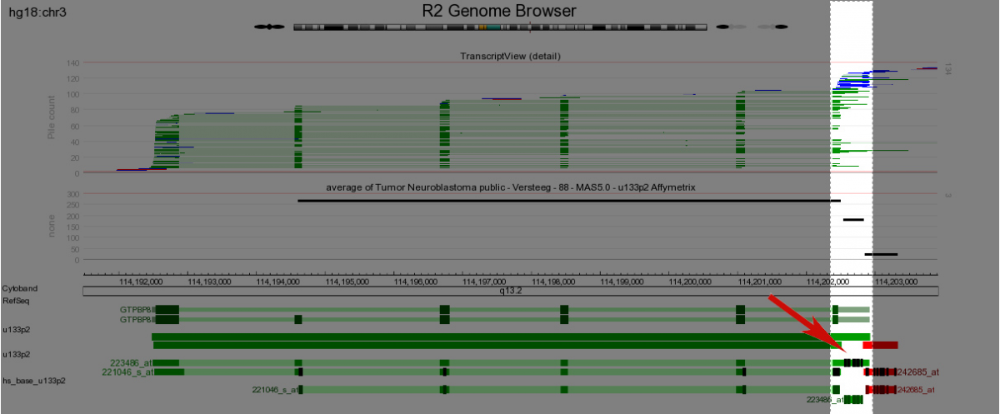
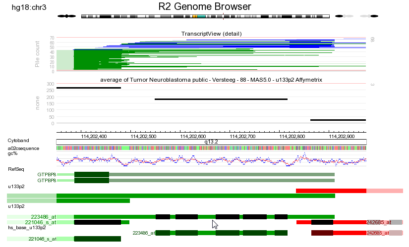
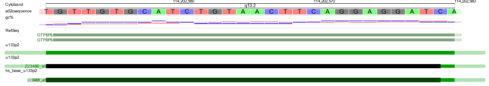
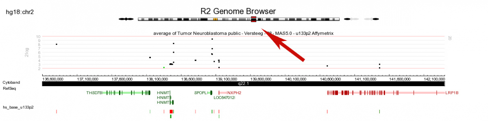

Using the R2-Genome browser
===========================

*Use the embedded R2 Genome browser to verify reporters*

Scope
-----

-   In this tutorial we will investigate gene reporters and reveal information R2 (<http://r2platform.com> / <http://r2.amc.nl>) is
    providing based on the genome location.
-   Explore gene expression reporters in the genome browser in combination with gene expression profiles (from the one-gene-view).

Tutorial step 1
---------------

1.  In the main menu select in field 2 the default dataset “Tumor
    Neuroblastoma public - Versteeg - 88 - MAS5.0 - u133p2”. In Field 3
    choose “View a gene” at “type of analysis”. In field 4: type “MYCN”
    and click ‘next’.
2.  Leave all the settings at their default and click ‘next’. You have
    now arrived at the “One Gene View”. In this tutorial the main focus
    is the evaluation of the reporters designed by manufactures such as
    Affymetrix represented in the R2 Genome browser and to a lesser
    extent the gene expression. When you slide down on the “One gene
    view” page of the MYCN expression, you encounter the “Probeset
    verification” table. The Probeset verification table, displays an
    automated analysis for U133 based Affymetrix platforms, where the
    reporter-gene relation validity has been verified by their genomic
    location (also described in more detail in the
    tutorial one-gene-view). Click on the “R2 Tview” link of the upper
    probeset and The embedded R2 genomebrowser will open in a
    new screen. The genome browser shows the Genomic span where the MYCN
    gene is located together with the 5 MYCN probesets mapped to their
    genomic position.
    
	
	
	[**Figure    1: Genome browser and Transcript    view**](_static/images/UsingR2genome_probesettable.png)
	
    
	
	
	[**Figure    2: The probeset verification    table**](_static/images/UsingR2genome_Genomebrowser.png)
	
    When we access the genome browser via the one-gene-view, then by
    default it has enabled a number of annotations (Tracks). At the top
    of the image,R2 is depicting all known EST and mRNA sequences
    aligned to the genome ( \#: synchronized with the USCS
    database regularly). These mappings serve as evidence for the
    existence of a gene, and are individually hyperlinked to the
    Genbank database. The EST and mRNA sequences are colored by the
    orientation \#: of alignments, as determined by exon-intron
    junctions and poly-A signals to the genome. Here, green alignments
    indicate a 5\`-> 3\` mapping on the positive strand of the
    genome, while a red mapping represents a \#: 5\`->3\`mapping on
    the negative strand of the genome (reverse complement orientation).
    In sequences where no information on the orientation is encountered,
    the alignment becomes blue. In this MYCN example, the gene, as \#:
    represented by the refseq \#: track, is green. This tells us that
    the MYCN gene maps to the positive strand of the genome, and should
    be read 5\`->3\`from left to right. The shadings in green, for
    the separate EST and mRNA \#: mappings, indicate exon (darker) and
    intronic (lighter) regions (Figure 3 shows a legend to all the
    different color shades). If we look at the reporters underneath the
    refseq track, then we see that most of them are green \#: as well
    (thus mapping to the same strand as the MYCN gene). However, the
    242026\_at reporter appears in red (thus mapping to the negative
    strand), and thus cannot measure MYCN expression. Furthermore, this
    reporter also maps \#: at the intronic region, another reason why
    you should not use this reporter to represent MYCN. Still, this
    reporter is annotated to measure MYCN by the Affymetrix company.
    Below the EST and mRNA mappings, you can see the average gene
    expression for the reporters in the neuroblastoma dataset, which we
    are investigating. This panel can be handy, to see which reporter
    shows the highest
    expression (and often is the preferred reporter to use). Since the
    U133 platforms of Affymetrix are 3\`based, you can nicely see that
    the reporter signals are higher as the 3\`end of the gene. The
    209757\_at reporter is the
    most informative here, and was also picked by the hugoonce
    algorithm, embedded in R2.
    For Affymetrix arrays a probeset by itself is a collection of
    separate 25-bp reporters. For Affymetrix arrays other then the
    Hu133-2 and Hu133-a platforms the reporters may vary in the number
    of basepairs. These measured
    regions are indicated in the reporter track by very dark shades.
    ****
    
	
	
	[**Figure    3: Legend of the color    usage**](_static/images/UsingR2genome_legend1.png)
	
    
	
	
	[**Figure    4: Second half of the genome browser with    default tracks.**](_static/images/UsingR2genome_tracks.png)
	
    With the default settings the genome browser shows the average
    expression signal per probeset for a chosen dataset with their
    genomic location.
3.  The properties and adjustable settings panel allows users to
    configure the graph display in various ways.. In the left properties
    panel set in the transcriptview section “draw mode to count and in
    the expression section “draw mode” to bars. The expression level can
    also be investigated per sample. The one-gene-view plot shows that
    ITCC0030 has no MYCN amplification resulting in low MYCN expression
    levels to illustrate this in the genome browser select in the
    “Adjustable Settings panel’, ITCC0030. Click redraw.
4.  The picture now shows for one sample the expression levels for all
    MYCN probe sets in a more simplified fashion with barplots. Note the
    extra annotation tracks which were selected and hover over the
    tracks to reveal extra information.

[**Figure5: Adjustable settingspanel.**](_static/images/UsingR2genome_settingspanel.png)
**Figure
6: Annotation tracks
added.**](_static/images/UsingR2genome_tracksadded.png)

Tutorial step 2
---------------

1.  The R2 Genome browser is a highly interactive application offering
    several ways to zoom and scroll the genome display. In the right
    upper corner of the screen search for the GTPBP8 gene click go and
    in the next screen choose “GTP-binding protein 8 isoform 1” by
    clicking on “VIEW”.
2.  At some time it could be usefull to zoom into a location such as an
    aligned probeset. To quickly zoom into a specific region of interest
    user the browsers “drag and zoom” feature. At a desired position
    click and hold the left mouse button and drag the highlighted window
    to a second position and release the mouse button. The selected
    ‘white’ region, can be repositioned (cross mouse indicator). A
    selection can be cancelled by clicking in the dark regions (Do note
    however that the positions of the selection were already adapted
    though ). Also in the track panel set “sequence and GC” windows
    to on. Click redraw in the middle panel.
    
	
	
	[**Figure    7: Zoom    controls**](_static/images/UsingR2genome_zoomcontrols.png)
	
3.  At a larger magnification certain features such basepair pair
    coloring at the sequence annotation track may become visible. Note
    the black rectangles in the dark green exon region a collection of
    the probes which form together a probeset . Repeat the same drag and
    zoom procedure for one probe and click redraw.
    
	
	
	[**Figure    8: Zoom-in    graph**](_static/images/UsingR2genome_zoomgraph.png)
	
    
	
	
	[**Figure    9: Zoom revealing basepair    sequence**](_static/images/UsingR2genome_basepair.png)
	
    Now the actual sequence is revealed a single affymetrix probe
    is matching. Clicking on the refseq bar will automatically zoom out
    to the genome browser representing the complete gene.
4.  Click on the “GET DNA” button to retrieve the DNA sequence directly
    from the UCSC database (keep in mind this option is available until
    the region of interest reaches a certain size)

----------
***Did                                
you know that the additional settings can be changed in “Tracks         
Panel".***                                                              
----------
[{width="150"}](_static/images/U
singR2genome_toolicon.png)                             
                                             
                                                                        
. Clicking on the tool icon unfolds extra options to configure your     
graph                                                                   
                                                                        
                                                                  
----------

Tutorial step 3
---------------

The Genome browser offers various options to zoom into a certain region.
In case there is an interest in gene expression levels of a certain
region on the chromosome. This can be quickly done by clicking on the
chromosome at a certain location.

1.  Click at a certain region on the chromosome and a new graph will be
    generated with average gene expression levels for the selected
    dataset in that region.
    
	
	
	[**Figure    10: Chromosomal    clicking**](_static/images/UsingR2genome_Clicking.png)
	
2.  Furthermore it’s worth mentioning that in order to use the genome
    browser it’s not necessary to do so via first selecting a dataset.
    The genome browser can directly be accessed from the main menu
    including many basic functionalities.

Final remarks / future directions
---------------------------------

We hope that this tutorial has been helpful,The R2 support team.

