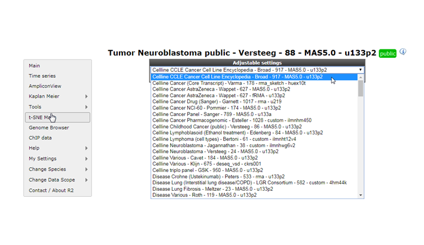
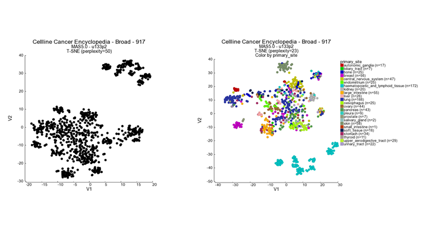
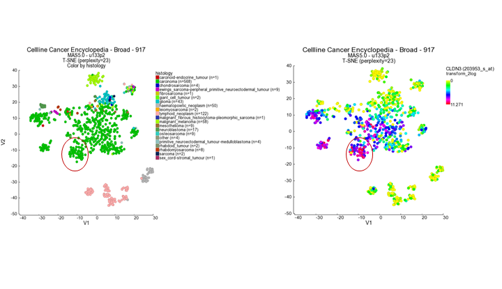
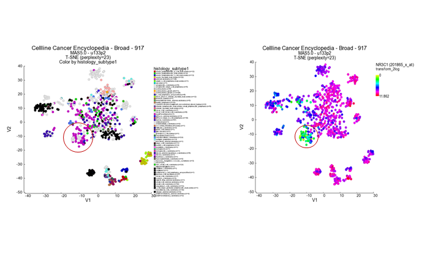
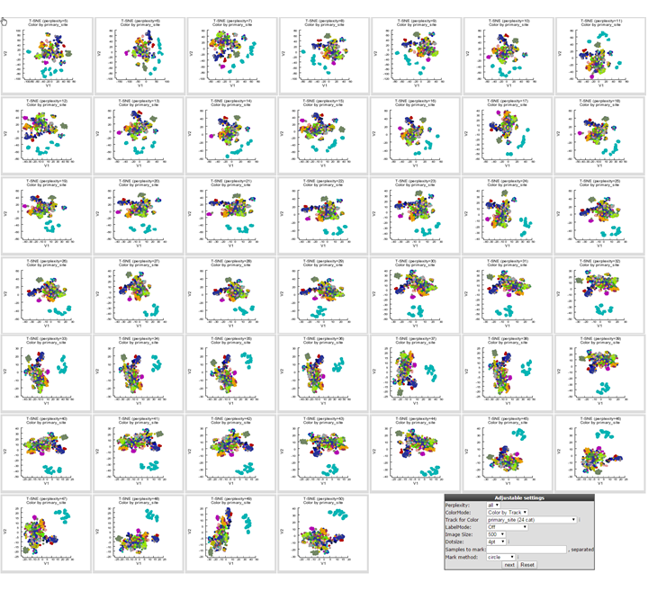
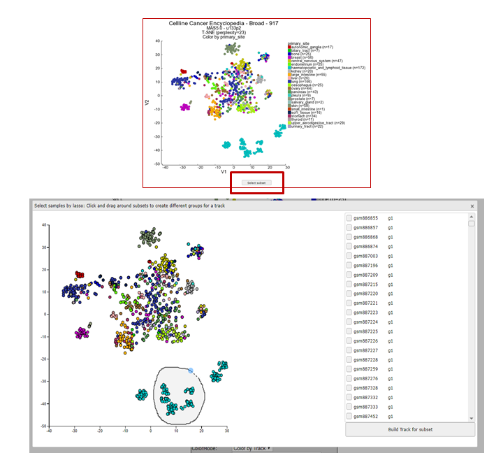
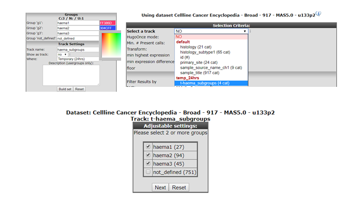

t-SNE: high dimensionality reduction in R2
========================================

*How to find groups in your dataset using t-SNE.*

Scope
-----

-  In this tutorial several expression datasets will be used.
-  t-SNE will be used to find sub groups in datasets.
-  t-SNE maps will be annotated with tracks and gene expression.

A clustering method that is gaining more and more popularity in biomedical research, the so called t-SNE algorithm.  t-SNE stands for t-Distributed Stochastic Neighbor EMbedding and is a machine learning dimensionality reduction algorithm that is well suited for the reduction of high dimensional datasets to just 2 or 3 dimensions. 

Most researchers are already familiar with another dimensionality reduction algorithm, Principle Components Analysis (PCA) also available in R2 and explained  in more detail in the Principle Components Analysis tutorial. Both PCA and t-SNE reduce the dimension while maintaining the structure of high dimensional data, however, PCA can only capture linear structures. t-SNE on the other hand  captures both linear and non-linear relations and preserves local distances in high dimensions while reducing the information to 2 dimensions (an XY plot).

A important parameter within t-SNE is the vairable known as perplexity. This tunable parameter is in a sense an estimation how many neighbors each point has. The robustness of the visible clusters identified by the t-SNE algorithm can be validated by studying the clusters in a range of perplexities. Recommended values for perplexity range between 5-50. Once you have selected a dataset and applied the t-SNE algorithm, R2 will calculate all t-SNE clusters for 5 to 50 perplexities,  in case of smaller dataset the number of perplicxitues will be less. Which perplexity is the best depends on the structure of the dataset, and is also a matter of what you woukld like to display (how the samples are placed). Before you start analyzing and interpreting the results, it is highly recommended to read about the power and pitfalls of t-SNE in [this blog-post](http://distill.pub/2016/misread-tsne/). Two important recommendations in this blog are that both *size of*, and *distance between* clusters do not have a well defined meaning. The fact that there *are* clusters has meaning.

Since running the t-SNE algorithm is a time consuming task and can take up to hours of processing time for large datasets, R2 stores the results for every dataset where the t-SNE has been completed. All users of R2 can explore generated t-SNE maps by coloring for tracks or expression values of a particular gene. Furthermore, the perplexity sweeps can be visualized. These options can be accessed via the left menu structure in R2. Users with collaborator, or higher access level are also able to initiate the generation of maps for datasets or subsets within a dataset. These additional options will be available via ‘box 3’ on the main page of R2.

Step 1: Selecting t-SNE maps
----------------------------

Let’s have a look at a t-SNE result to see what we can learn from this dimensionality reduction algorithm. The analysis is most informative with large datasets, and actually requires more than 16 samples as an absolute minimum (in R2). We will first have a look at the CCLE (cancer cell line encyclopedia) dataset which is comprised of more than 900 cell lines from various cancers.

1.  In the left menu click on t-SNE maps and select in the pull down menu , ‘Cellline Cancer Encyclopedia - Broad - 917 - MAS5.0 - u133p2
2. R2 will assess the result and provide a button to start exploring the result. 

	
  
	[**Figure    1: t-SNE preprocessed t-SNE maps**](_static/images/Tsne_select_preprocessed)
	
3.  Click "next"

Step 2: Annotating t-SNE maps
----------------------------

In this screen the t-SNE result is plotted with the highest perplexity, or a preset value that has been selected upon manual curation. There is no strict rule to select the ‘best’ perplexity. In most cases the highest perplexity is not the best choice to investigate the cluster further.  If the perplexity result is something other than 23, then select this perplexity value. We can see structure in the location of the various cell lines. Now we would like to look at the annotations that are available for the cell lines. 

1. In the 'adjustable settins box' set "perplexity' to the value of 23.

2. Select ‘color by track’ from the ‘colormode’ and choose ‘primary site’. Press 'next' to redraw the image.

	
  
	[**Figure 2: t-SNE preprocessed t-SNE maps**](_static/images/Tsne_cellbroad_primsite.png)

Another feature that may be informative in the context of a t-SNE map is to ‘overlay’ the expression of a particular gene on the map by coloring the cell lines by the expression values of a dataset, in this case mRNA gene expression. We can have a look at this by changing the ‘colormode’ to ‘color by expression’.

1. In the 'adjustable settings box'  select 'Color by Gene' under Color mode and subsequently type 'CLDN3' under Gene for color. The  corresponding reporter will automatically pop-up (Figure 3 ). The gene selection box autocompletes selection the proper reporter probeset, but this can take a little bit of time before the gene selection box appears. 

	

	[**Figure 3: t-SNE select probeset**](_static/images/Tsne_select_probeset.png)

	
2. Again click ‘next’ to refresh the view.  In this view the samples are not colored by a group annotation (track) but by applying a color gradient which reflects the gene expression level according to a log2 scale.  In this sample you can observe  a subgroup of the carcinoma samples which have higher level in contrast to the (other) samples. 

	

	[**Figure 4: t-SNE_Color by Gene**](_static/images/Tsne_cellbroad_colorbygeneCLDN3.png)

3. Use  the track histology_subtype1 to generate a new t-SNE plot in the 'Adjustable settings' menu. It appears that the subgroup which stood out by the color gradient consists mostly of adenocarcinomas. Another gene which emphasizes the observation in the previous example is the NRC1 gene showing an inverse gradient pattern for this subgroup.

	
	
	[**Figure 5: t-SNE_Color by Gene**](_static/images/Tsne_cellbroad_colorbygeneNR3C1.png)

Step 3: Perplexity sweeps for t-SNE maps
----------------------------

What perplexity value is the best option for your dataset of interest? This depends on the embedded structure (the subgroups), and even what you personally would like to visualize (the way the samples are layed out). To assess the robustness of the layout as well as the effect that the perplexity parameter has, the R2 platform performs a perplexity sweep. The analysis will be run repeatedly, starting with a value of 5, and stopping at a perplexity value of 50 if the size of the dataset permits (n/3-1). 

1. In order to generate an overview of all possible perplexities you have to set the number of perplexities to "ALL" and color by track modus to eg: histology in the "Adjustable Settings".

	
	
	[**Figure 6: t-SNE: all perplexities**](_static/images/Tnse_cellbroad_allperplexity.png)
	

	
By choosing the perplexity values 'All', miniature tiles will be generated for all perplexities (5-50), where it is still possible to use the color by track mode.

Step 4: Creating t-SNE maps
----------------------------

Depending on your access level in R2, you can create t-SNE maps from any dataset that is represented in R2 (with at least 16 or more samples). The t-SNE module will be located in 'box 3' at the main page of R2. You can either run the algorithm on the complete dataset, or focus on a particular sub-section of the samples using the 'subset' function. 

Let's take a look at some other nice example of a R2 generated t-SNE maps: the large dataset of normal tissue expression profiles

1. In main menu select  Normal tissues - GTEX - 2921 - RPKM - ensgtexv4 en box2 and select t-SNE. If the 'default' map has already been calculated, a shortcut button will also appear as shown by the dashed box in figure 7. Under he 'Adjustable settings' you can adjust severall settings such as sample filtering, specific gene categories and expression level restrictions.  

	
	
	[**Figure 7: t-SNE: Menu**](_static/images/Tnse_shortcutPlot.png)

Keep in mind that after adjusting input settings the t-SNE algorithm will  re-run again although a t-SNE map already has been generated with the default settings. A note on the execution times of t-SNE: the generation of the maps will take a substantial amount of time to generate, especially for larger datasets (up to a number of hours for datasets >600 samples). Once initiated (showing the message that t-SNE is being calculated), you can close the window and return to the analysis at a later time. The process will keep on running in the background. 

2. click Next

3. In the Adjusting settings set the color by track on 'Tissue'  and 'click' next.

	

	[**Figure 8: t-SNE: Colored by track**](_static/images/Tsne_normaltissuetrackcolored.png)

Step 4: Creating groups with the t-SNE lasso tool
----------------------------

After applying the t-SNE algorithm to a dataset of interest some novel clusters are revealed  and could be worthwhile to investigate in more depth. In order to do so you want to use the clusters to continue with your analysis to gain more insight in the genetic background of the clusters.

1. In the left menu click on t-SNE maps and select in the pull down menu , ‘Cellline Cancer Encyclopedia - Broad - 917 - MAS5.0 - u133p2.  Plot the corresponding T-SNE map using perplexity 23  and color the maps by selecting  "primary site" with the track for color option. The  haematopoietic group can clearly be subdivided in sub groups which can be used to investigate these found separation in more detail.

[**Figure 9: t-SNE: Colored by track**](_static/images/Tsne_lassoselection.png)

2. Click on select subset below the t-SNE map.  In the interactive pop-up t-SNE map you use the lasso tool by clicking on the map and hold the mouse button to draw a shape arround the samples you want to cluster. After releasing the mouse button the samples are listed left to the t-SNE map annotated subsqeuently with a group id for eacht lasso selection action. You can select groups up to a number of 10. After you finisched the selection click below the groups "build tracks for subset". 

3. In the new opened window first all the samples are listed which where are omitted and at the bottom in the "Adustable settings menu" you can remame the groups , select a color and store in them in your personlized tracks or as a temporay track. Now you can continue with further analysis for example  by using the module "Find diffential expression between groups"  where you can find your new created tracks in the selection criteria menu. 

[**Figure 10: t-SNE: Using the lasso selection **](_static/images/Tsne_subgroups.png)

For now the lasso selection is tool is only available in for t-SNE maps implementation for usage with other modules such as PCA clustering will be released soon.

Final remarks
----------------------------

Everything described in ths chapter can be performed in the R2: genomics analysis and visaulization platform (http://r2platform.com / http://r2.amc.nl) 

We hope that this tutorial has been helpful,The R2 support team.

