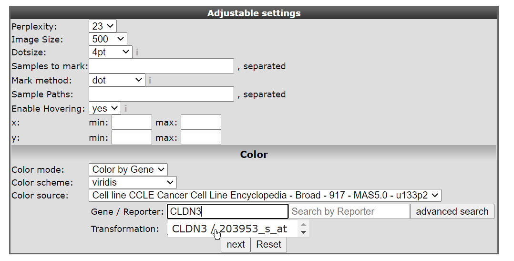
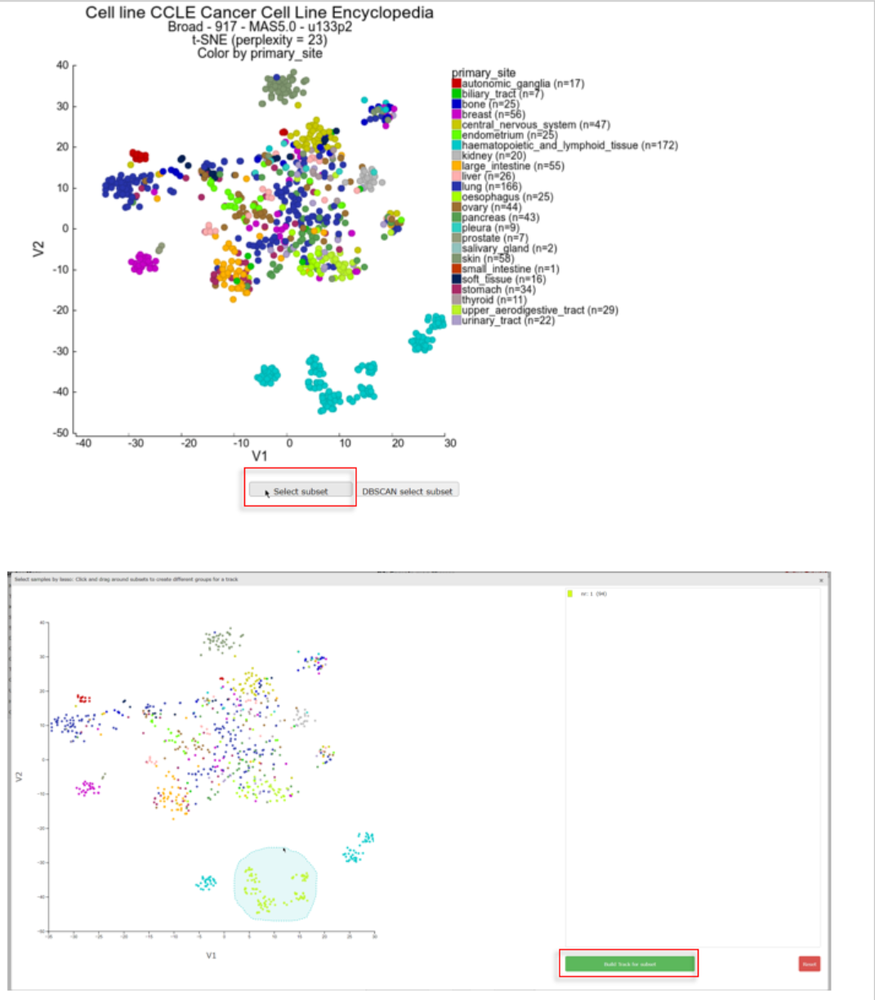

t-SNE / UMAP: high dimensionality reduction in R2
========================================

*How to find groups in your dataset using t-SNE or UMAP dimensionality reduction algorithms.*

Scope
-----

-  In this tutorial several expression datasets will be used.
-  t-SNE will be used to find sub groups in datasets.
-  t-SNE maps will be annotated with tracks and gene expression.

R2 offers several machine learning dimensionality reduction algorithms that are well suited for the reduction of high dimensional datasets to just 2 or 3 dimensions. Samples that have similar expression profiles in a dataset are located closely together on the 2D or 3D map, which enables the user to find clusters of similar samples.  
 One such clustering method that is popular in biomedical research is the so called t-SNE algorithm. t-SNE stands for t-Distributed Stochastic Neighbor Embedding. Another algorithm with similar properties that is gaining more and more popularity is UMAP (Uniform Manifold Approximation and Projection).  

Most researchers are already familiar with another dimensionality reduction algorithm, Principle Components Analysis (PCA), which is also available in R2 and is explained in more detail in the Principle Components Analysis tutorial. PCA, t-SNE and UMAP each reduce the dimension while maintaining the structure of high dimensional data, however, PCA can only capture linear structures. t-SNE and UMAP on the other hand, capture both linear and non-linear relations and preserve local similarities and distances in high dimensions while reducing the information to 2 dimensions (an XY plot). While t-SNE is able to preserve local relations, UMAP allows for a better preservation of dissimilarity of smaples. Therefore, the distance between clusters of samples in a UMAP plot is more meaningful than in a t-SNE plot. 

In the current section, we primarily focus on the t-SNE method, but in the R2 platform you will also encounter maps that have been created by UMAP.
An important parameter within t-SNE is the variable known as *perplexity*. This tunable parameter is in a sense an estimation of how many neighbors each point has. The robustness of the visible clusters identified by the t-SNE algorithm can be validated by studying the clusters in a range of perplexities. Recommended values for perplexity range between 5-50. Once you have selected a dataset and applied the t-SNE algorithm, R2 will calculate all t-SNE clusters for 5 to 50 perplexities. In case of smaller datasets the number of perplexities will be less, in case of datasets with more than 1000 samples, only perplexity 50 is calculated. Which perplexity is the best, depends on the structure of the dataset, and is also depended on which display (how the samples are placed) allows for a better interpretation of your biological question. Before you start analyzing and interpreting the results, it is highly recommended to read about the power and pitfalls of t-SNE in [this blog-post](http://distill.pub/2016/misread-tsne/). Two important recommendations in this blog are that both *size of*, and *distance between* clusters do not have a well defined meaning. The fact that there *are* clusters has meaning.

Since running the t-SNE algorithm is a time consuming task and can take up to hours of processing time for large datasets, R2 stores the results for every dataset of which the t-SNE has been completed. All users of R2 can explore generated t-SNE maps by coloring with tracks or expression values of a particular gene. Furthermore, the perplexity sweeps can be visualized. Via the 'Sample maps' option in the left menu, preprocessed t-SNE and UMAP maps can be viewed and analyzed with different perplexity and coloring settings. Users with collaborator access or higher access level are also able to initiate the generation of maps for datasets or subsets within a dataset. These additional options will be available via ‘box 3’ on the main page of R2.

Step 1: Selecting t-SNE maps
----------------------------

Let’s have a look at a t-SNE result to see what we can learn from this dimensionality reduction algorithm. The analysis is most informative with large datasets, and actually requires more than 16 samples as an absolute minimum (in R2). We will first have a look at the CCLE (cancer cell line encyclopedia) dataset which is comprised of more than 900 cell lines from various cancers.

1. In the left menu click on Sample maps. 
  You can see that a grid opens that displays the datasets available to you for which sample maps have been created. The headers of the grid show filtering options to search for the dataset that you are interested in. Here we want to search for the dataset 'Cellline CCLE Cancer Cell Line Encyclopedia - Broad - 917 - MAS5.0 - u133p2 '. 
2. Type 'CCLE' in the textfield *Dataset Class*. Multiple sample maps have been generated from this same dataset. Choose the sample map that shows the date '2017-03-28' in the column *Created* by a click on the **Select** button in front of the row.

 from the grid")

  [**Figure 1A: Select a preprocessed sample map (e.g. t-SNE map) from the grid**](_static/images/Samplemaps/Tsne_select_dataset_from_grid.png)
  
  
 You can also search for a sample map of datasets by keywords in the textfield above the grid or by the downwards arrow on the right side of the textfield. The grid will adjust to your keywords and/or dataset selection. 

  

  [**Figure 1B: Select a dataset with a sample map from the dropdown**](_static/images/Samplemaps/Tsne_select_preprocessed.png)

Step 2: Annotating t-SNE maps
----------------------------

In this screen the t-SNE result is plotted with the highest perplexity, or a preset value that has been selected upon manual curation. There is no strict rule to select the ‘best’ perplexity. In most cases the highest perplexity is not the best choice to investigate the cluster further.  If the perplexity result is something other than 23, then select this perplexity value. We can see structure in the location of the various cell lines. Now we would like to look at the annotations that are available for the cell lines. 

1. In the 'adjustable settings box' set "perplexity' to the value of 23.

2. Select ‘color by track’ from the ‘colormode’ and choose ‘primary site’. Press 'next' to redraw the image.

  

  [**Figure 2: t-SNE preprocessed t-SNE maps**](_static/images/Samplemaps/Tsne_cellbroad_primsite.png)

Another feature that may be informative in the context of a t-SNE map is to ‘overlay’ the expression of a particular gene on the map by coloring the cell lines by the expression values of a dataset, in this case mRNA gene expression. We can have a look at this by changing the *Color mode* to ‘color by gene’.

1. In the 'Adjustable settings' box  select 'Color by Gene' under *Color mode* 
    and subsequently type 'CLDN3' in the textfield of *Gene / Reporter*. 
    The  corresponding reporter will automatically pop-up (Figure 3 ), click on it to confirm your choice. 
    The gene selection box autocompletes the proper reporter 
    probeset, but this can take a little bit of time before the gene selection
     box appears.  

  

  [**Figure 3: t-SNE select probeset**](_static/images/Samplemaps/Tsne_select_probeset.png)

2. Again click ‘next’ to refresh the view.  In this view the samples are not colored by a group annotation (track) but by applying a color gradient which reflects the gene expression level according to a log2 scale.  In this sample you can observe  a subgroup of the carcinoma samples which have higher level in contrast to the (other) samples. 

  

  [**Figure 4: t-SNE_Color by Gene**](_static/images/Samplemaps/Tsne_cellbroad_colorbygeneCLDN3.png)

3. Use  the track histology_subtype1 to generate a new t-SNE plot in the 'Adjustable settings' menu. It appears that the subgroup which stood out by the color gradient consists mostly of adenocarcinomas. Another gene which emphasizes the observation in the previous example is the NR3C1 gene showing an inverse gradient pattern for this subgroup. 
In this picture below, we also adapted the setting *Color scheme* to 'rainbow_1' in the 'Adjustable settings' box.

  

  [**Figure 5: t-SNE_Color by Gene**](_static/images/Samplemaps/Tsne_cellbroad_colorbygeneNR3C1.png)

Step 3: Perplexity sweeps for t-SNE maps
----------------------------

What perplexity value is the best option for your dataset of interest? This depends on the embedded structure (the subgroups), and even what you personally would like to visualize (the way the samples are layed out). To assess the robustness of the layout as well as the effect that the perplexity parameter has, the R2 platform performs a perplexity sweep. The analysis will be run repeatedly, starting with a value of 5, and stopping at a perplexity value of 50, if the size of the dataset permits. 

1. In order to generate an overview of all possible perplexities you have to set the number of *Perplexity* to 'all' and *Color by Track* modus to eg. 'primary_site' in the 'Adjustable Settings' box.

  

  [**Figure 6: t-SNE: all perplexities**](_static/images/Samplemaps/Tnse_cellbroad_allperplexity.png)

  

By choosing the perplexity value 'all', miniature tiles will be generated for all perplexities (5-50), where it is still possible to use the color by track mode. Also, you can simply click any of the tiles to generate the map of that particular perplexity in normal large format.  

You might have noticed the "Direct link to the t-SNE result: " above the Adjustable settings box underneath the maps. This link can be used to indeed obtain the default view of the same sample map.

Step 4: Creating t-SNE maps
----------------------------

Depending on your access level in R2, you can create t-SNE maps from any dataset that is represented in R2 (with at least 16 or more samples). The t-SNE module is located in 'box 3' at the main page of R2. You can either run the algorithm on the complete dataset, or focus on a particular sub-section of the samples using the 'subset' function. 

Let's take a look at another nice example of an R2 generated t-SNE map: the large dataset of normal tissue expression profiles.

1. In main menu *Change Dataset* to the Normal Tissues GTeX v4 - GTeX - 2921 - RPKM - ensgtexv4 in box 2 (in the Change Dataset grid fill in the number '2921' in the textfield under the *N* column and click *Select*). Then select t-SNE in box 3. Click Next. If the 'default' map has already been calculated, a shortcut button will also appear as shown by the dashed box in figure 7. In the 'Adjustable settings' panel you can adjust several settings, such as sample filtering, specific gene sets and expression level restrictions.  
  
    
  
    [**Figure 7: t-SNE: Menu**](_static/images/Samplemaps/Tnse_shortcutPlot.png)
  
  Keep in mind that after adjusting input settings the t-SNE algorithm will  re-run again,  even though a t-SNE map already has been generated with the default settings. A note on the execution times of t-SNE: the generation of the maps will take a substantial amount of time to generate, especially for larger datasets (up to a number of hours for datasets >6000 samples). Once initiated (showing the message that t-SNE is being calculated), you can close the window. The process will keep on running on the servers and you can view the results later by revisting the analysis: when you return to the mainpage of R2, select the same dataset, again choose t-SNE in box 3, and click next. In the following window, a shortcut button to plot the requested t-SNE result will appear for your chosen dataset.    

2. In our case we just click *next*.

3. In the Adjustable settings box set the *Color by Track* on 'Tissue'  and click *next*.

  

  [**Figure 8: t-SNE: Colored by track**](_static/images/Samplemaps/Tsne_normaltissuetrackcolored.png)

Step 5: Creating groups with the t-SNE lasso tool 
----------------------------

Suppose the t-SNE algorithm produced some interesting sample clusters that you want to explore further. R2 allows you to specifically select any subset of samples from the t-SNE map by using the lasso tool. The subset can be used as track in the other R2 analysis tools. This will be illustrated in the following example.

1. In the left menu click on *Sample maps* and select 'Cellline CCLE Cancer Cell Line Encyclopedia - Broad - 917 - MAS5.0 - u133p2' with the date '2017-03-28' in the *Created* column.  Plot the corresponding t-SNE map using perplexity 23  and color the maps by selecting  'primary_site' with *Color track* option. The haematopoietic group can clearly be subdivided in several groups which can be used to investigate these sub clusters in more detail.

    

    [**Figure 9: t-SNE: Colored by track**](_static/images/Samplemaps/Tsne_lassoselection.png)

2. Click on "select subset" below the t-SNE map.  In the interactive pop-up t-SNE map you use the lasso tool by clicking on the map and hold the mouse button to draw a shape around the samples you want to cluster. After releasing the mouse button the samples are listed left to the t-SNE map annotated subsequently with a group id for each lasso selection action. You can select groups up to a number of 10. After you finished the selection click below the groups "build tracks for subset". 

3. In a new tab all the samples are listed with the designated and adjustable group label. The samples that were not included in any of the lasso selected subgroups are labeled 'not_defined'. At the bottom in the "Adjustable Settings" menu you can rename the groups, select a color and store them in your personalized tracks or as a temporary track. Now you can continue with further analysis, for example  by using the module "Find differential expression between groups"  where you can find your newly created tracks in the selection criteria menu.

  

  [**Figure 10: t-SNE: Using the lasso selection**](_static/images/Samplemaps/Tsne_subgroups.png)

The lasso selection tool is also available for the PCA module;

Step 6: Creating groups with the t-SNE DBSCAN tool
----------------------------

Next to the manual lasso tool for sample grouping on the t-SNE map, R2 provides an automated tool as well: the DBSCAN (Density-based spatial clustering of applications with noise). The DBSCAN allows for automatic detection of points that are closely packed together in a plot. A fun and more detailed blogpost about the DBSCAN can be found <a href="https://www.naftaliharris.com/blog/visualizing-dbscan-clustering/" taget="\_blank">here</a>. 

Starting with an arbitrary point in the plot, the algorithm recursively groups together all the points that are located close to that point and the points within that group. If no more points can be found close to the group, another point on the plot will randomly be chosen and the process repeats itself.  
With two parameters you can influence the definition of groups: *Epsilon* and *Min pts*. Epsilon sets the maximal distance allowed between points to be considered close. Min pts determines the minimal amount of points that are needed in order to be called a group. It is recommended to set the minimal amount of points to 3 or higher. 
If a point is not within the epsilon distance of any cluster, it's considered a "noise point". 

Let's have a look at the DBSCAN and the parameters Epsilon and Min Ptstool in R2. 

1. Go back to the tab with the t-SNE scan map which was generated in step 1 before applying the lasso functionality. 

2. Click on "DBSCAN select subset" below the t-SNE map. The interactive t-SNE map pops-up. This time you can find slides for the two DBSCAN parameters, Epsilon and Min pts, on the right side. The parameters are set to a default value, which by no means are the best settings for the given dataset. 

  

  [**Figure 11: t-SNE: Using the DBSCAN selection**](_static/images/Samplemaps/Tsne_dbscan_default.png)

3.  In this example the DB scan tool identifies two clusters which were also quite clear by just observing the t-SNE map. However, adapting the parameters Epsilon and Min pst described above can also aid you to identify less clear subgroups. Play around with these two slides till you find a satisfactory grouping of the samples on the t-SNE map. Don't forget to click on the button 'Refresh cluster graph' after you have changed the values. On the right side an overview is provided that shows the amount of samples in each group. 

    

    [**Figure 12: t-SNE: Using the DBSCAN selection**](_static/images/Samplemaps/Tsne_dbscan_param.png)
 
4. Click 'Build Track for subset' to create tracks of these groups, in the same way as described in step 3 of the lasso tool above. The created tracks are stored and can be used as group parameters for further usage. Just as the lasso tool, the DB-scan tool is available for both t-SNE maps and PCA plots.

Final remarks
----------------------------

Everything described in this chapter can be performed in R2: the genomics analysis and visualization platform (http://r2platform.com / http://r2.amc.nl) 

We hope that this tutorial has been helpful, the R2 support team.
